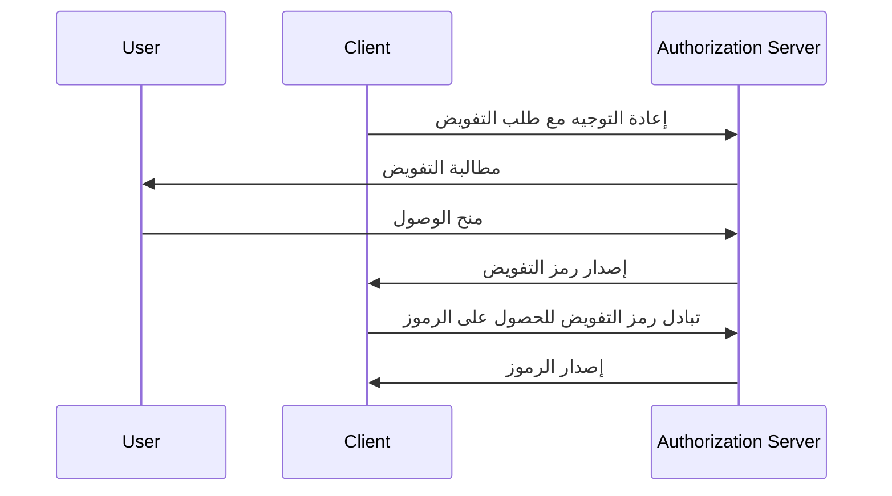

## ما هو مفتاح إثبات تبادل الكود (PKCE)؟

يعمل مفتاح إثبات تبادل الكود (PKCE) كامتداد أمني لـ <Ref slug="authorization-code-flow" /> في <Ref slug="oauth-2.0" />. يهدف إلى حماية رموز التفويض من الاعتراض وسوء الاستخدام، خاصة في العملاء العموميين حيث لا تكون كلمة سر العميل آمنة.

اعتباراً من <Ref slug="oauth-2.1" />، يتم تطبيق PKCE لجميع أنواع العملاء، بما في ذلك <Ref slug="client" headingId="public-clients" /> و <Ref slug="client" headingId="confidential-clients">العملاء السريين (الخاصين)</Ref>.

## كيف يعمل PKCE؟

يقدم PKCE بعض الخطوات الإضافية لتدفق رمز التفويض لضمان أن <Ref slug="client" /> الذي يقوم بتبادل رمز التفويض هو نفس العميل الذي بدأ التدفق.

> [!Note]
> ينطبق PKCE أيضا على تدفقات <Ref slug="openid-connect" /> التي تعتمد على تدفق رمز التفويض. ولتبسيط الأمور، سنركز على تنفيذ OAuth 2.0.

لنراجع بسرعة تدفق رمز التفويض القياسي قبل التعمق في PKCE:



الآن، دعونا نرى كيف يعزز PKCE تدفق رمز التفويض.

### 1. إعداد طلب التفويض

#### 1.1. يقوم العميل بإنشاء محقق الكود

قبل بدء <Ref slug="authorization-request" />، يجب على العميل توليد سلسلة عشوائية تسمى **محقق الكود**. يجب أن تكون السلسلة سلسلة عشوائية مشفرة عالية الكثافة وآمنة بواسطة URL بطول لا يقل عن 43 حرفًا ولا يزيد عن 128 حرفًا.

إليك مثال على توليد محقق الكود في JavaScript:

```javascript
// `js-base64` هي مكتبة عالمية يمكن استخدامها في كل من Node.js والمتصفحات
import { fromUint8Array } from 'js-base64';

// تشير الحجة الثانية `true` إلى أن المخرج يجب أن يكون آمنًا لـ URL
const codeVerifier = fromUint8Array(crypto.getRandomValues(new Uint8Array(64)), true);
```

#### 1.2. يقوم العميل بإنشاء تحدي الكود

يجب على العميل تجزئة **محقق الكود** باستخدام دالة تجزئة مشفرة، مثل SHA-256، وترميز التجزئة في سلسلة Base64 آمنة بواسطة URL. تسمى السلسلة الناتجة **تحدي الكود**.

إليك مثال على إنشاء تحدي الكود في JavaScript:

```javascript
// `js-base64` هي مكتبة عالمية يمكن استخدامها في كل من Node.js والمتصفحات
import { fromUint8Array } from 'js-base64';

const encodedCodeVerifier = new TextEncoder().encode(codeVerifier);
const codeChallenge = new Uint8Array(await crypto.subtle.digest('SHA-256', encodedCodeVerifier));

// تشير الحجة الثانية `true` إلى أن المخرج يجب أن يكون آمنًا لـ URL
return fromUint8Array(codeChallenge, true);
```

#### 1.3. يشمل العميل تحدي الكود في طلب التفويض

عندما يبدأ العميل طلب التفويض، يجب أن يشمل المعلمات `code_challenge` و `code_challenge_method` في الطلب. تحتوي معلمة `code_challenge` على **تحدي الكود** الناتج في الخطوة السابقة، وتحدد معلمة `code_challenge_method` خوارزمية التجزئة المستخدمة لإنشاء **تحدي الكود** (مثل `S256 لـ SHA-256).

القيم المدعومة لـ `code_challenge_method` هي `plain` و `S256`، حيث يشير `plain` إلى أن **تحدي الكود** يتم إرساله كما هو بدون أي تجزئة. وعادةً، يُوصى بـ `S256` لأمان أفضل.

إليك مثال غير معياري لـ طلب تفويض مع PKCE:

```http
GET /authorize?response_type=code
  &client_id=YOUR_CLIENT_ID
  &redirect_uri=https%3A%2F%2Fclient.example.com%2Fcallback
  &scope=openid%20profile
  &code_challenge=YOUR_CODE_CHALLENGE
  &code_challenge_method=S256
  &state=abc123
  &nonce=123456 HTTP/1.1
```

### 2. تبادل رمز التفويض للحصول على الرموز

يجب على العميل حفظ **محقق الكود** لاستخدامه في وقت لاحق ومتابعة تدفق التفويض كالمعتاد. بمجرد أن يتلقى العميل رمز التفويض، يجب عليه إرسال <Ref slug="token-request" /> مع **محقق الكود** إلى خادم التفويض.

إليك مثال غير معياري لـ طلب رمز باستخدام PKCE:

```http
POST /token HTTP/1.1
Host: your-authorization-server.com
Content-Type: application/x-www-form-urlencoded

grant_type=authorization_code
  &code=YOUR_AUTHORIZATION_CODE
  &redirect_uri=https%3A%2F%2Fclient.example.com%2Fcallback
  &client_id=YOUR_CLIENT_ID
  &code_verifier=YOUR_CODE_VERIFIER
```

سيقوم خادم التفويض بالتحقق من **تحدي الكود** مقابل **محقق الكود** لضمان أن العميل هو نفس الكيان الذي بدأ التدفق. إذا فشل التحقق، سيرفض خادم التفويض طلب الرمز.

## كيف يعزز PKCE الأمان

الفائدة الأمنية الرئيسية لـ PKCE هي أنه يمنع هجمات اعتراض رمز التفويض، التي يمكن أن تحدث في العملاء العموميين. على سبيل المثال، إذا قام مهاجم باعتراض رمز التفويض، فلن يتمكن من تبادله بالرموز بدون **محقق الكود**. يضمن PKCE أن العميل الذي بدأ التدفق فقط هو الذي يمكنه إكمال تبادل الرمز.

<SeeAlso slugs={['oauth-2.1', 'authorization-code-flow']} />

<Resources
  urls={[
    "https://blog.logto.io/how-pkce-protects-the-authorization-code-flow-for-native-apps",
    "https://datatracker.ietf.org/doc/html/rfc7636",
  ]}
/>
