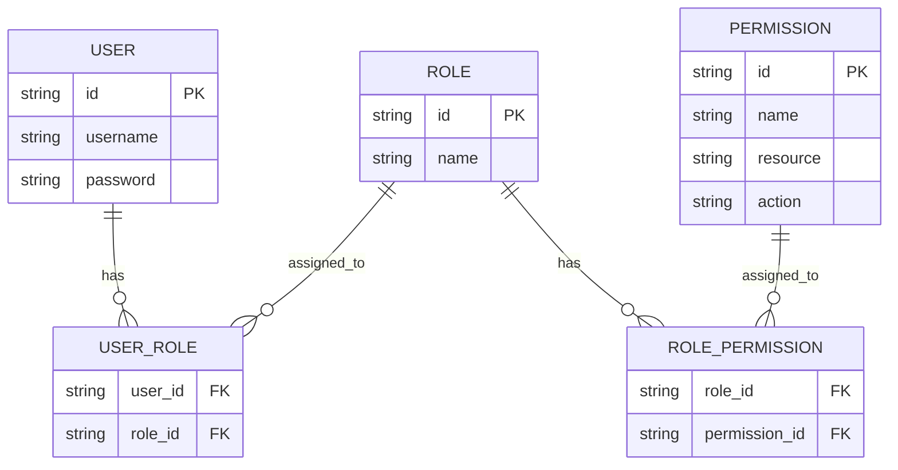
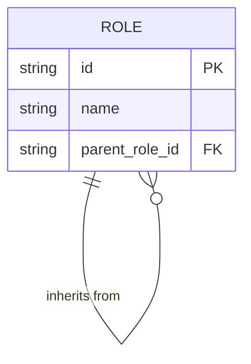
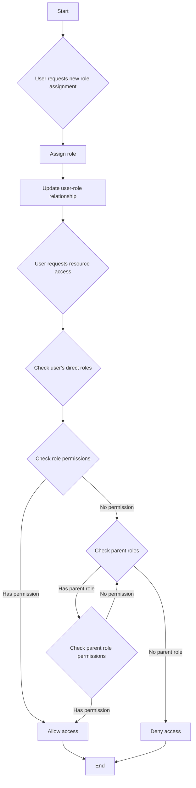
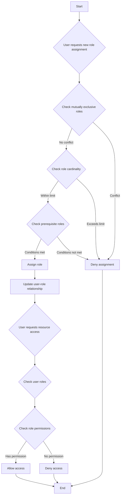

## ما هو التحكم في الوصول بناءً على الأدوار (RBAC)؟

التحكم في الوصول بناءً على الأدوار (RBAC) هو نموذج لتحكم في الوصول واسع الانتشار يقدم مفهوم "الأدوار" لفصل المستخدمين عن الأذونات، مما ينتج نظام إدارة أذونات مرن وفعال.

الفكرة الأساسية وراء RBAC بسيطة لكنها قوية: بدلاً من تخصيص الأذونات مباشرة للمستخدمين، تُخصص الأذونات للأدوار التي تُخصص بعد ذلك للمستخدمين. تسهل هذه الطريقة غير المباشرة في تخصيص الأذونات عملية إدارة حقوق الوصول بشكل كبير.

### المفاهيم الأساسية في RBAC

يدور نموذج RBAC حول أربعة عناصر رئيسية:

1. المستخدمون: الأفراد داخل النظام، وعادةً ما يكونون أشخاصًا حقيقيين.
2. الأدوار: تمثيلات للوظائف أو المهام داخل المؤسسة.
3. الأذونات: التراخيص لأداء عمليات محددة على موارد معينة.
4. الجلسات: البيئات الديناميكية حيث يقوم المستخدمون بتفعيل أدوار معينة.

يمكن تلخيص سير العمل الأساسي لـ RBAC كما يلي:
1. تحديد الأدوار بناءً على الهيكل التنظيمي أو احتياجات العمل.
2. تخصيص الأذونات المناسبة لكل دور.
3. تخصيص دور أو أكثر للمستخدمين بناءً على مهامهم.
4. عندما يحاول المستخدم الوصول إلى مورد، يتحقق النظام مما إذا كانت الأدوار المخصصة له تحتوي على الأذونات اللازمة.

### أنواع RBAC

#### RBAC0: الأساس

RBAC0 هو النموذج الأساسي الذي يحدد المفاهيم الأساسية للمستخدمين، الأدوار، الأذونات، والجلسات. ويعد أساسًا لجميع نماذج RBAC الأخرى.

الميزات الرئيسية:
- ارتباط المستخدم بالدور: علاقة متعددة لمتعددة
- ارتباط الدور بالإذن: علاقة متعددة لمتعددة



توضح هذه الرسم التخطيطي الهيكل الأساسي لـ RBAC0، مع توضيح العلاقات بين المستخدمين والأدوار والأذونات.

العمليات الأساسية:
1. تخصيص الأدوار للمستخدمين
2. تخصيص الأذونات للأدوار
3. التحقق مما إذا كان لدى المستخدم إذن معين

بينما يوفر RBAC0 نقطة انطلاق قوية، إلا أن له بعض القيود:
1. انفجار الأدوار: مع زيادة تعقيد النظام، يمكن أن يزيد عدد الأدوار بسرعة.
2. التكرار في الأذونات: قد تتطلب الأدوار المختلفة مجموعات مماثلة من الأذونات، مما يؤدي إلى التكرار.
3. عدم وجود تسلسل هرمي: لا يمكنه تمثيل علاقات الوراثة بين الأدوار.

#### RBAC1: تقديم التسلسلات الهرمية للأدوار

يبني RBAC1 على RBAC0 بإضافة مفهوم وراثة الأدوار.

```plaintext
RBAC1 = RBAC0 + Role Inheritance
```

الميزات الرئيسية:
- تسلسل هرمي للأدوار: يمكن أن تحتوي الأدوار على أدوار أصلية
- وراثة الأذونات: ترث الأدوار الابنة جميع الأذونات من الأدوار الأصلية



تظهر هذه الرسم كيف يمكن للأدوار أن ترث من أدوار أخرى في RBAC1.

العمليات الرئيسية:



يوضح هذا المخطط التدفق عملية تخصيص الأدوار والتحقق من الأذونات في RBAC1، بما في ذلك جانب وراثة الأدوار.

يقدم RBAC1 عدة مزايا:
1. تقليل عدد الأدوار: يمكن إنشاء عدد أقل من الأدوار الأساسية من خلال الوراثة
2. تبسيط إدارة الأذونات: أسهل في عكس الهياكل التنظيمية

ومع ذلك، لا يزال RBAC1 لديه بعض القيود:
1. عدم وجود آليات القيد: غير قادر على تقييد المستخدمين من الاحتفاظ في وقت واحد بالأدوار التي قد تكون متضاربة
2. اعتبارات الأداء: قد تتطلب التحقق من الأذونات عبور التسلسل الهرمي الكامل للأدوار

#### RBAC2: تنفيذ القيود

يستند RBAC2 أيضًا إلى RBAC0 ولكنه يقدم مفهوم القيود.

```plaintext
RBAC2 = RBAC0 + Constraints
```

الميزات الرئيسية:
1. الأدوار المتبادلة الحصرية: لا يمكن تخصيص هذه الأدوار للمستخدمين بشكل متزامن
2. التعددية في الأدوار: يحد من عدد المستخدمين الذين يمكن تخصيصهم لدور معين
3. الأدوار المتطلبة: يجب أن يكون لدى المستخدمين دور معين قبل التخصيص لدور آخر



يوضح هذا المخطط التدفق عملية تخصيص الأدوار والتحكم في الوصول في RBAC2، بما في ذلك دمج القيود المختلفة.

يعزز RBAC2 الأمن من خلال منع التركيز المفرط على الأذونات ويسمح بتحكم أدق في الوصول. ومع ذلك، فإنه يزيد من تعقيد النظام وقد يؤثر على الأداء بسبب الحاجة إلى التحقق من شروط القيد المتعددة لكل تخصيص دور.

### RBAC3: النموذج الشامل

يجمع RBAC3 بين ميزات RBAC1 و RBAC2، حيث يقدم كل من وراثة الأدوار وآليات القيد：

```plaintext
RBAC3 = RBAC0 + Role Inheritance + Constraints
```

يوفر هذا النموذج الشامل أقصى مرونة ولكنه يقدم أيضًا تحديات في التنفيذ وتحسين الأداء.

## ما هي مزايا التحكم في الوصول بناءً على الأدوار (RBAC)؟

1. تبسيط إدارة الأذونات: تقليل التعقيد من خلال الترخيص بالجملة عبر الأدوار بدلاً من المستخدمين الفرديين.
2. تعزيز الأمان: من خلال السيطرة الأكثر دقة على أذونات المستخدمين وتقليل المخاطر الأمنية.
3. تقليل تكاليف الإدارة: تعديل أذونات الأدوار يؤثر تلقائيًا على جميع المستخدمين المرتبطين.
4. التوافق مع منطق الأعمال: عادة ما تتوافق الأدوار مع الهياكل التنظيمية أو عمليات العمل، مما يجعلها أسهل في الفهم والإدارة.
5. دعم لفصل المهام: يمكن فصل المسؤوليات الحرجة من خلال قيود مثل الأدوار المتبادلة الحصرية.

## ما هي اعتبارات التنفيذ العملي؟

عند تنفيذ RBAC في سيناريوهات العالم الحقيقي، يجب على المطورين مراعاة هذه الجوانب الرئيسية:

1. تصميم قاعدة البيانات: استخدام قواعد بيانات علائقية لتخزين واستعلام بنى RBAC بفعالية.
2. تحسين الأداء: تنفيذ استراتيجيات التخزين المؤقت وتحسين عمليات فحص الأذونات، لا سيما في نماذج RBAC3 المعقدة.
3. تكامل API وواجهة المستخدم: تصميم واجهات برمجة تطبيقات واضحة لإدارة المستخدمين والأدوار والأذونات، واعتبر كيف يمكن استخدام RBAC في تطبيقات الواجهة الأمامية.
4. الأمان والتدقيق: ضمان أمان نظام RBAC نفسه وتنفيذ وظائف تسجيل وتدقيق مفصلة.
5. القابلية للتوسع: تصميم مع وضع التوسعات المستقبلية في الاعتبار، مثل دعم قواعد الأذونات الأكثر تعقيدًا أو التكامل مع أنظمة أخرى.
6. تجربة المستخدم: تصميم واجهات مستخدم بديهية لمسؤولي النظام لتكوين وصيانة بنية RBAC بسهولة.

<SeeAlso slugs={['abac', 'access-control']} />

<Resources
  urls={[
    "https://blog.logto.io/rbac-and-abac",
    "https://blog.logto.io/mastering-rbac",
    "https://blog.logto.io/organization-and-role-based-access-control",
    "https://docs.logto.io/docs/recipes/rbac/",
    "https://en.wikipedia.org/wiki/Role-based_access_control"
  ]}
/>
