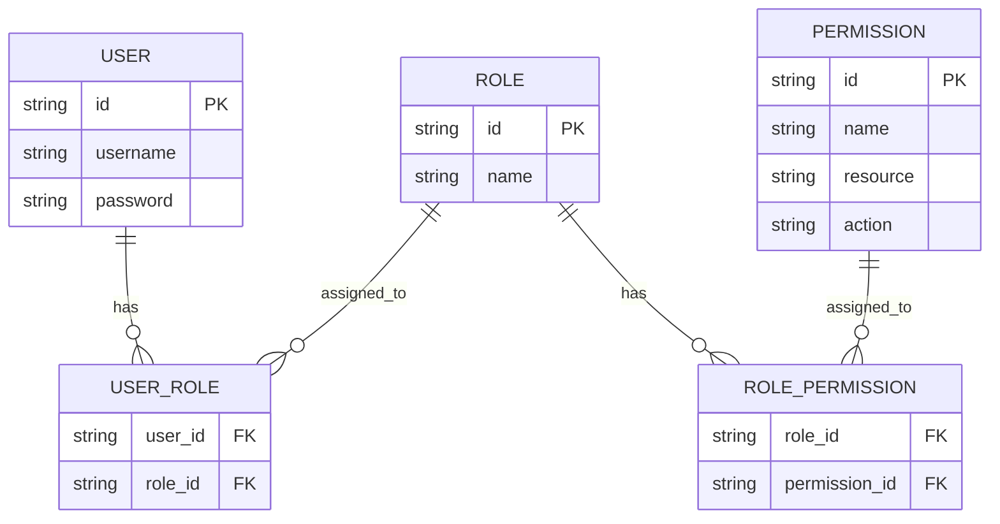
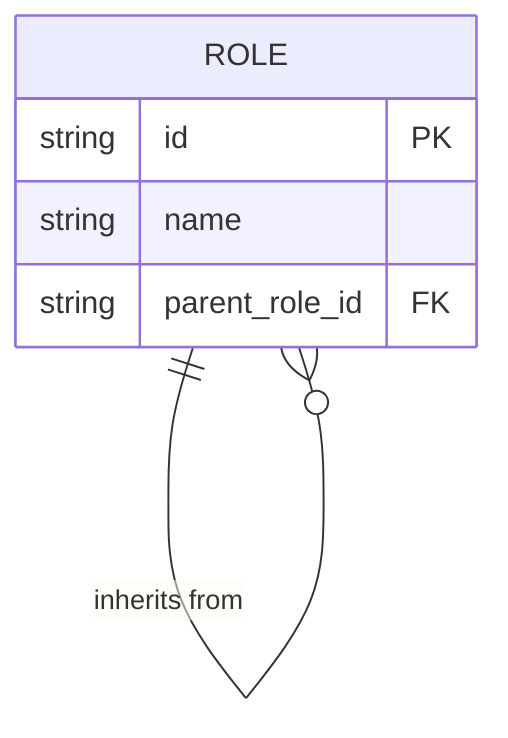
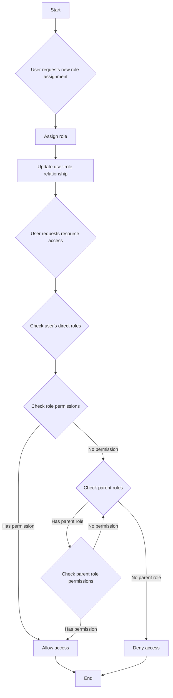
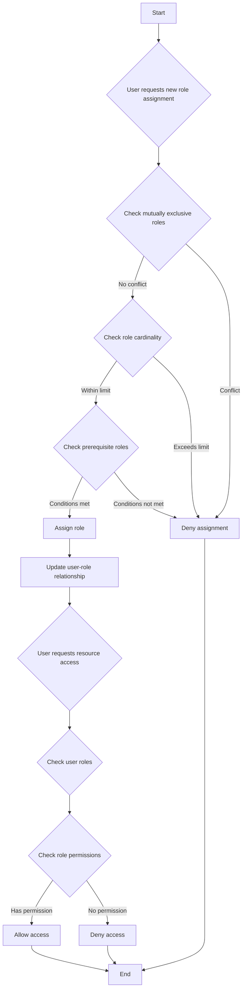

## ما هو التحكم في الوصول المستند إلى الأدوار (RBAC)؟

التحكم في الوصول المستند إلى الأدوار (RBAC) هو نموذج للتحكم في الوصول يتم اعتماده على نطاق واسع ويقدم مفهوم "الأدوار" لفصل المستخدمين عن الأذونات، مما ينتج عنه نظام إدارة أذونات مرن وفعال.

الفكرة الأساسية وراء RBAC بسيطة لكنها قوية: بدلاً من تعيين الأذونات مباشرة للمستخدمين، يتم تعيين الأذونات للأدوار، والتي يتم تعيينها بعد ذلك للمستخدمين. هذه الطريقة غير المباشرة لتخصيص الأذونات تبسط بشكل كبير عملية إدارة حقوق الوصول.

## ما هي المفاهيم الرئيسية في RBAC؟

يدور نموذج RBAC حول أربعة عناصر رئيسية:

1. المستخدمون: الأفراد داخل النظام، وعادة ما يكونون أشخاصًا حقيقيين.
2. الأدوار: تمثيلات لوظائف العمل أو المسؤوليات داخل المنظمة.
3. الأذونات: تفويضات لأداء عمليات محددة على موارد معينة.
4. الجلسات: بيئات ديناميكية حيث يقوم المستخدمون بتفعيل أدوار معينة.

يمكن تلخيص سير العمل الأساسي لـ RBAC كما يلي:
1. تحديد الأدوار بناءً على الهيكل التنظيمي أو متطلبات العمل.
2. تعيين الأذونات المناسبة لكل دور.
3. تعيين دور أو أكثر للمستخدمين بناءً على مسؤولياتهم.
4. عندما يحاول المستخدم الوصول إلى مورد، يتحقق النظام مما إذا كانت الأدوار المخصصة له تحتوي على الأذونات اللازمة.

## كيف يتم استخدام RBAC عادة في التطبيقات الواقعية؟

عند استخدام RBAC في تطبيق أعمال نموذجي، يمكنك البدء بالإجابة على الأسئلة الأساسية الثلاثة التالية:

1. ما هي الموارد التي تحتاج إلى الحماية في النظام؟
2. ما هي العمليات التي تحتاج إلى التحكم فيها على هذه الموارد؟
3. في السيناريوهات الواقعية، ما هي الأدوار المسؤولة عن تنفيذ هذه الموارد والعمليات؟

خذ نظام التجارة الإلكترونية كمثال.

يمكنك أولاً تحديد الموارد التي تحتاج إلى الحماية:

- المنتج
- الطلب

ثم، يمكنك تحديد العمليات التي تحتاج إلى التحكم فيها على هذه الموارد، أي تحديد الأذونات لهذه الموارد:

- المنتج
  - `read:product`
  - `create:product`
  - `delete:product`
- الطلب
  - `read:order`
  - `create:order`
  - `delete:order`

مع الأذونات المذكورة أعلاه، يمكنك الآن تحديد نموذج إدارة الأذونات التالي بناءً على الأدوار في السيناريوهات الواقعية:

- مدير المنتج
  - المنتج
    - `read:product`
    - `create:product`
    - `delete:product`
- مدير الطلبات
  - الطلب
    - `read:order`
    - `create:order`
    - `delete:order`

أخيرًا، قم بتعيين الأدوار للمستخدمين بناءً على مسؤولياتهم:

- أليس: مدير المنتج
- بوب: مدير الطلبات

عندما يصل المستخدم إلى مورد، سيتحقق النظام مما إذا كانت الأدوار المخصصة للمستخدم تحتوي على الأذونات اللازمة.

على سبيل المثال، عندما تحاول أليس قراءة معلومات المنتج، يسترجع النظام أولاً معلومات دورها ويكتشف أنها تمتلك دور مدير المنتج.

ثم، يستعلم النظام عن الأذونات المرتبطة بهذا الدور، والتي تشمل `read:product`، `create:product`، و `delete:product`.

ثم يتحقق النظام مما إذا كان الإذن المطلوب `read:product` موجودًا في قائمة أذوناتها.

نظرًا لوجود هذا الإذن، يسمح النظام لأليس بالوصول إلى قائمة المنتجات. إذا لم يكن الإذن المطلوب في القائمة، يرفض النظام طلب الوصول.

## لماذا لا ينبغي استخدام الأدوار مباشرة للتحكم في الوصول

خطأ شائع في تنفيذ RBAC هو استخدام الأدوار مباشرة للتحكم في الوصول:

```typescript
// ❌ نهج إشكالي
if (user.hasRole('product_admin')) {
  await deleteProduct(productId);
}
```

على الرغم من أن هذا النهج يبدو بسيطًا، إلا أنه يخلق مشاكل مع نمو نظامك. على سبيل المثال:
- عندما يحتاج فريق التسويق إلى تحديث أوصاف المنتجات، ستحتاج إلى تعديل الكود للتحقق من أدوار التسويق.
- عندما تريد أن يتمكن بعض مديري المنتجات من النشر فقط وليس حذف المنتجات، ستحتاج إلى إنشاء فحوصات أدوار جديدة للعمليات ذات الصلة.
- عندما يحتاج فريق محتوى جديد إلى الوصول الجزئي للمنتجات، ستحتاج مرة أخرى إلى تحديث الكود الخاص بك.

بدلاً من ذلك، يجب عليك دائمًا التحقق من الأذونات المحددة:

```typescript
// ✅ النهج الموصى به
if (user.hasPermission('delete:product')) {
  await deleteProduct(productId);
}
```

يوفر هذا النهج المستند إلى الأذونات عدة مزايا:

1. التحكم الدقيق في الأذونات: يمكن أن تتطابق الأذونات بدقة مع عمليات الموارد المحددة:

- إنشاء منتج: `create:product`
- تحديث منتج: `update:product`
- حذف منتج: `delete:product`
- نشر منتج: `publish:product`

2. تكوين الأدوار المرن: يمكن دمج الأذونات بحرية في الأدوار دون تغييرات في الكود:

```typescript
const roles = {
  product_admin: ['create:product', 'update:product', 'delete:product', 'publish:product'],
  content_editor: ['update:product'],
  publisher: ['publish:product']  // يمكن إضافة أدوار جديدة بسهولة
};
```

يجعل هذا التصميم نظامك قابلاً للتكيف مع نمو الأعمال:
- إضافة أدوار جديدة يتطلب فقط تكوين الأذونات
- تعديل أذونات الأدوار يتم من خلال التكوين
- الميزات الجديدة تحتاج فقط إلى إدخالات أذونات جديدة

تذكر: يجب أن تكون الأدوار مجرد حاويات للأذونات، وليس الأساس لاتخاذ قرارات التحكم في الوصول. يسمح هذا التصميم لـ RBAC بتقديم أقصى قيمة.

## نماذج RBAC وتطورها

### RBAC0: الأساس

RBAC0 هو النموذج الأساسي الذي يحدد المفاهيم الأساسية للمستخدمين، الأدوار، الأذونات، والجلسات. يعمل كأساس لجميع نماذج RBAC الأخرى.

الميزات الرئيسية:
- ارتباط المستخدم بالدور: علاقة متعددة إلى متعددة
- ارتباط الدور بالإذن: علاقة متعددة إلى متعددة



يوضح هذا الرسم البياني الهيكل الأساسي لـ RBAC0، ويظهر العلاقات بين المستخدمين، الأدوار، والأذونات.

العمليات الرئيسية:
1. تعيين الأدوار للمستخدمين
2. تعيين الأذونات للأدوار
3. التحقق مما إذا كان لدى المستخدم إذن محدد

بينما يوفر RBAC0 نقطة انطلاق قوية، إلا أنه يحتوي على بعض القيود:
1. انفجار الأدوار: مع زيادة تعقيد النظام، يمكن أن ينمو عدد الأدوار بسرعة.
2. تكرار الأذونات: قد تتطلب الأدوار المختلفة مجموعات متشابهة من الأذونات، مما يؤدي إلى التكرار.
3. عدم وجود التسلسل الهرمي: لا يمكنه تمثيل علاقات الوراثة بين الأدوار.

### RBAC1: تقديم التسلسل الهرمي للأدوار

RBAC1 يبني على RBAC0 من خلال إضافة مفهوم وراثة الأدوار.

```plaintext
RBAC1 = RBAC0 + Role Inheritance
```

الميزات الرئيسية:
- التسلسل الهرمي للأدوار: يمكن أن تحتوي الأدوار على أدوار رئيسية
- وراثة الأذونات: ترث الأدوار الفرعية جميع الأذونات من أدوارها الرئيسية



يوضح هذا الرسم البياني كيف يمكن للأدوار أن ترث من أدوار أخرى في RBAC1.

العمليات الرئيسية:



يوضح هذا المخطط الانسيابي عملية تعيين الأدوار والتحقق من الأذونات في RBAC1، بما في ذلك جانب وراثة الأدوار.

يوفر RBAC1 عدة مزايا:
1. تقليل عدد الأدوار: يمكن إنشاء عدد أقل من الأدوار الأساسية من خلال الوراثة
2. تبسيط إدارة الأذونات: أسهل في عكس التسلسلات الهرمية التنظيمية

ومع ذلك، لا يزال لدى RBAC1 بعض القيود:
1. عدم وجود آليات القيد: غير قادر على تقييد المستخدمين من الاحتفاظ في نفس الوقت بأدوار قد تكون متضاربة
2. اعتبارات الأداء: قد تتطلب عمليات التحقق من الأذونات اجتياز التسلسل الهرمي الكامل للأدوار

### RBAC2: تنفيذ القيود

RBAC2 يعتمد أيضًا على RBAC0 ولكنه يقدم مفهوم القيود.

```plaintext
RBAC2 = RBAC0 + Constraints
```

الميزات الرئيسية:
1. الأدوار المتبادلة الحصرية: لا يمكن تعيين المستخدمين لهذه الأدوار في نفس الوقت
2. عدد الأدوار: يحد من عدد المستخدمين الذين يمكن تعيينهم لدور معين
3. الأدوار المتطلبة: يجب أن يكون لدى المستخدمين دور محدد قبل تعيينهم لدور آخر



يوضح هذا المخطط الانسيابي عملية تعيين الأدوار والتحكم في الوصول في RBAC2، مع دمج القيود المختلفة.

يعزز RBAC2 الأمان من خلال منع التركيز المفرط للأذونات ويسمح بتحكم أكثر دقة في الوصول. ومع ذلك، فإنه يزيد من تعقيد النظام وقد يؤثر على الأداء بسبب الحاجة إلى التحقق من شروط القيد المتعددة لكل تعيين دور.

### RBAC3: النموذج الشامل

RBAC3 يجمع بين ميزات RBAC1 و RBAC2، مما يوفر كل من وراثة الأدوار وآليات القيد:

```plaintext
RBAC3 = RBAC0 + Role Inheritance + Constraints
```

يوفر هذا النموذج الشامل أقصى قدر من المرونة ولكنه يقدم أيضًا تحديات في التنفيذ وتحسين الأداء.

## ما هي مزايا RBAC (التحكم في الوصول المستند إلى الأدوار)؟

1. تبسيط إدارة الأذونات: يقلل التفويض الجماعي من خلال الأدوار من تعقيد إدارة أذونات المستخدم الفردية.
2. تعزيز الأمان: التحكم الأكثر دقة في أذونات المستخدم يقلل من مخاطر الأمان.
3. تقليل التكاليف الإدارية: تعديل أذونات الدور يؤثر تلقائيًا على جميع المستخدمين المرتبطين.
4. التوافق مع منطق الأعمال: غالبًا ما تتوافق الأدوار مع الهياكل التنظيمية أو العمليات التجارية، مما يجعلها أسهل في الفهم والإدارة.
5. دعم فصل الواجبات: يمكن فصل المسؤوليات الحرجة من خلال قيود مثل الأدوار المتبادلة الحصرية.

## ما هي اعتبارات التنفيذ العملية؟

عند تنفيذ RBAC في السيناريوهات الواقعية، يجب على المطورين مراعاة هذه الجوانب الرئيسية:

1. تصميم قاعدة البيانات: استخدام قواعد البيانات العلائقية لتخزين واستعلام هياكل RBAC بشكل فعال.
2. تحسين الأداء: تنفيذ استراتيجيات التخزين المؤقت وتحسين عمليات التحقق من الأذونات، خاصة لنماذج RBAC3 المعقدة.
3. تكامل API والواجهة الأمامية: تصميم واجهات برمجة تطبيقات واضحة لإدارة المستخدمين، الأدوار، والأذونات، والنظر في كيفية استخدام RBAC في التطبيقات الأمامية.
4. الأمان والتدقيق: ضمان أمان نظام RBAC نفسه وتنفيذ وظائف تسجيل وتدقيق مفصلة.
5. القابلية للتوسع: التصميم مع مراعاة التوسعات المستقبلية، مثل دعم قواعد الأذونات الأكثر تعقيدًا أو التكامل مع الأنظمة الأخرى.
6. تجربة المستخدم: تصميم واجهات بديهية لمسؤولي النظام لتكوين وصيانة هيكل RBAC بسهولة.

<SeeAlso slugs={['abac', 'access-control']} />

<Resources
  urls={[
    "https://blog.logto.io/rbac-and-abac",
    "https://blog.logto.io/mastering-rbac",
    "https://blog.logto.io/organization-and-role-based-access-control",
    "https://docs.logto.io/docs/recipes/rbac/",
    "https://en.wikipedia.org/wiki/Role-based_access_control"
  ]}
/>