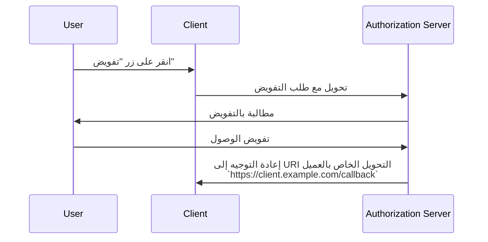

## ما هو عنوان URI للتحويل (Redirect URI)؟

عنوان URI للتحويل، المعروف أيضًا بعنوان URL للاستدعاء أو URL للتحويل، هو URI للإشارة إلى المكان الذي يجب أن يوجه فيه <Ref slug="authorization-server" /> وكيل المستخدم (user-agent) بعد اكتمال <Ref slug="authorization-request" />.

> غالبًا ما يختلط معرف المورد العالمي (URI) مع محدد موقع الموارد الموحد (URL). لمزيد من المعلومات، تحقق من [الكشف عن URI, URL, و URN](https://blog.logto.io/unveiling-uri-url-and-urn).

دعونا نلقي نظرة على مثال لطلب تفويض يحتوي على عنوان URI للتحويل:

```http
GET /authorize?response_type=code
  &client_id=YOUR_CLIENT_ID
  &redirect_uri=https%3A%2F%2Fclient.example.com%2Fcallback
  &scope=openid%20profile%20email
  &state=abc123
  &nonce=123456 HTTP/1.1
```

في هذا المثال، القيمة الخام لمعلمة `redirect_uri` هي `https%3A%2F%2Fclient.example.com%2Fcallback`، وهي مشفرة بعنوان URL. القيمة الفعلية هي `https://client.example.com/callback`.

## كيف يعمل عنوان URI للتحويل (Redirect URI)؟

> في سياق <Ref slug="openid-connect" />، ينطبق سير العمل لـ OAuth 2.0's <Ref slug="authorization-request" /> و <Ref slug="authorization-server" /> بشكل مماثل. يعمل عنوان URI للتحويل بنفس الطريقة التي يعمل بها في OAuth 2.0، لكل من <Ref slug="authentication-request" /> و <Ref slug="openid-connect" headingId="openid-provider-op" />.

لنقل إن <Ref slug="client" /> يبدأ طلب التفويض من URL `https://client.example.com`. بعد أن يكمل المستخدم عملية التفويض، سيعيد خادم التفويض توجيه وكيل المستخدم (المتصفح) إلى `https://client.example.com/callback`.



من الواضح أن URI التحويل ضروري لخادم التفويض ليوجه وكيل المستخدم مرة أخرى عند اكتمال عملية التفويض. بالإضافة إلى ذلك، يتم استخدام URI التحويل أيضًا لاستقبال رمز التفويض أو الرموز، اعتمادًا على التدفق.

إليك مثال غير معياري على ما يمكن أن يبدو عليه التحويل الفعلي في <Ref slug="authorization-code-flow" />:

```http
HTTP/1.1 302 Found
Location: https://client.example.com/callback?code=AUTHORIZATION_CODE&state=abc123
```

لاحظ أن معلمات URL `code` و `state` التي يتم إضافتها بواسطة خادم التفويض مُضمنة في URI التحويل. يحتاج العميل لاستخراج معلمات `code` و `state` من URL لمتابعة عملية التفويض.

## لماذا نحتاج إلى عنوان URI للتحويل (Redirect URI)؟

كما نرى في المثال أعلاه، يحتاج خادم التفويض إلى معرفة المكان الذي يجب أن يوجه إليه بعد طلب تفويض ناجح. يكون ذلك مفيدًا بشكل خاص عندما يكون هناك عملاء متعددون (أي <Ref slug="single-sign-on" />)، ولكل عميل URI تحويل مختلف.

مع <Ref slug="authorization-code-flow" />، يتم استخدام URI التحويل أيضًا لتمرير رمز التفويض مرة أخرى إلى العميل، بدلاً من استخدام القناة الأمامية (المتصفح) لمنع كشف الرموز للهجمات المحتملة.

كان من الممكن استخدام [إعتماد كلمة مرور المالك المورد (ROPC) grant](https://datatracker.ietf.org/doc/html/rfc6749#section-4.3) للحصول على الرموز للمستخدم بدون URI التحويل. ومع ذلك، فقد تم إلغاءه في <Ref slug="oauth-2.1" /> بسبب مخاوف أمان.

## اعتبارات الأمان

عنوان URI للتحويل هو معلمة حاسمة وهو هدف شائع للمهاجمين. إليك بعض اعتبارات الأمان التي يجب أخذها في الاعتبار:

- **إدراج قائمة بيضاء لعنوان URI للتحويل**: يجب على العميل قبول عناوين URI للتحويل المسجلة فقط مع خادم التفويض. هذا يمنع المهاجمين من توجيه المستخدمين إلى مواقع ضارة.
- **استخدام HTTPS**: دائمًا استخدم HTTPS لعنوان URI للتحويل لتأمين الاتصال بين العميل وخادم التفويض.
- **مطابقة دقيقة**: يجب أن يتطابق URI للتحويل بدقة مع URI المسجل. قد تفرض خوادم التفويض قواعد مطابقة صارمة تحظر أنماط المطابقة العامة.
- **معلمة الحالة (State)**: استخدم معلمة `state` لمنع هجمات <Ref slug="csrf" />. يجب على العميل التحقق من صحة معلمة `state` للتأكد من أنها تطابق القيمة المرسلة في طلب التفويض.

<SeeAlso slugs={["csrf", "oauth-2.1", "authorization-code-flow"]} />

<Resources
  urls={[
    "https://blog.logto.io/oauth-2-1",
    "https://blog.logto.io/csrf",
    "https://blog.logto.io/redirect-uri-in-authorization-code-flow",
  ]}
/>