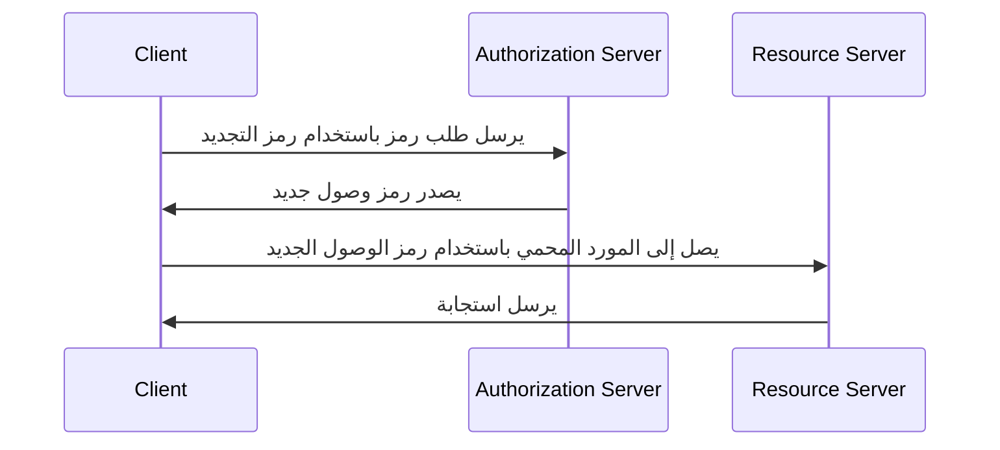

## ما هو رمز التجديد (Refresh token)؟

رمز التجديد (refresh token) هو اعتماد طويل الأجل، عادة ما يكون سلسلة عشوائية، يُستخدم للحصول على رموز وصول جديدة دون الحاجة إلى إعادة مصادقة المستخدم. في سياق OAuth 2.0 و OpenID Connect (OIDC)، قد تصدر خوادم التفويض (authorization servers) رموز تجديد للعملاء (التطبيقات) عندما يطلب العميل <Ref slug="offline-access" />.

بينما يحدد [RFC OAuth 2.0](https://datatracker.ietf.org/doc/html/rfc6749#section-1.5) دورة حياة عامة لرمز التجديد، قد تختلف تفاصيل التنفيذ عبر خوادم التفويض والعملاء. سنستكشفها في الأقسام اللاحقة.

## كيف يعمل رمز التجديد (Refresh token)؟

عادةً ما يُصدر رمز التجديد مع رمز الوصول عندما يطلب العميل <Ref slug="offline-access" />. العرف المتبع في الصناعة لطلب الوصول دون اتصال هو تضمين المدى `offline_access` في <Ref slug="authorization-request" />، بينما يُعرّف <Ref slug="openid-connect" /> رسميًا المدى `offline_access` لهذا الغرض (المتوفر في <Ref slug="authentication-request" />).

إليك مثال غير معياري لطلب تفويض يتضمن نطاق `offline_access`:

```http
GET /authorize?response_type=code
  &client_id=YOUR_CLIENT_ID
  &redirect_uri=https%3A%2F%2Fclient.example.com%2Fcallback
  &scope=openid%20profile%20email%20offline_access
  &state=abc123
  &nonce=123456 HTTP/1.1
```

عندما يحصل العميل على رمز التجديد، يمكنه استخدامه لطلب رموز وصول جديدة عندما ينتهي صلاحية رمز الوصول الحالي. إليك مثال مبسط باستخدام رمز التجديد:



كما يوضح مخطط التسلسل، يحتاج استخدام رمز التجديد (refresh token) إلى دعم من كل من العميل وخادم التفويض:

- يجب على العميل تخزين رمز التجديد بشكل آمن واستخدامه في <Ref slug="token-request" /> للحصول على رمز وصول جديد.
- يجب على خادم التفويض التحقق من رمز التجديد وإصدار رمز وصول جديد عندما يقدم العميل رمز تجديد صالح.

لا ينبغي مشاركة رمز التجديد (refresh token) مع <Ref slug="resource-server" />. يجب أن تكون رموز الوصول هي الرموز الوحيدة التي يتحقق منها خادم الموارد لأغراض التفويض.

إليك مثال غير معياري لطلب رمز باستخدام رمز التجديد:

```http
POST /token HTTP/1.1
Host: your-authorization-server.com
Content-Type: application/x-www-form-urlencoded

grant_type=refresh_token
  &refresh_token=YOUR_REFRESH_TOKEN
  &client_id=YOUR_CLIENT_ID
  &client_secret=YOUR_CLIENT_SECRET
  &scope=openid%20profile%20email
```

## اعتبارات الأمان ||security-considerations||

نظرًا لأن رموز التجديد (refresh tokens) طويلة الأجل (مثل الأيام، الأسابيع) ويمكن استخدامها للحصول على رموز وصول جديدة دون تفاعل المستخدم، فإنها تشكل خطرًا أمنيًا أعلى من رموز الوصول (مثل الدقائق، الساعات). يجب النظر بعناية إلى استخدام رموز التجديد وتنفيذها لتخفيف التهديدات الأمنية المحتملة. إليك بعض أفضل الممارسات التي ينبغي مراعاتها:

### التخزين الآمن

قم بتخزين رموز التجديد (refresh tokens) بشكل آمن على جانب العميل لمنع الوصول غير المصرح به. تشمل آليات التخزين هذه:

- **ملفات تعريف الارتباط HTTP فقط**: تخزين الرموز في ملفات تعريف الارتباط HTTP فقط لمنع وصول جافا سكريبت من جانب العميل إليها.
- **التخزين المُشفر**: استخدم مخازن آمنة مثل Keychain (iOS) أو KeyStore (أندرويد) على الأجهزة المحمولة، أو قواعد البيانات المشفرة على تطبيقات الويب.

### دوران رمز التجديد ||refresh-token-rotation||

بينما يمكن أن تكون رموز التجديد (refresh tokens) طويلة الأجل، فإن التدوير الدوري لها أو استنادًا إلى شروط معينة (مثل بعد تبادل رموز ناجح) يمكن أن يقلل بشكل كبير من خطر الوصول غير المصرح به. قد تختلف استراتيجية التدوير الدقيقة بناءً على متطلبات أمان التطبيق وقدرات خادم التفويض.

إليك استراتيجيتين شائعتين لتدوير الرموز:

- **التدوير المستند إلى الوقت**: تدوير رموز التجديد بعد فترة معينة (مثل كل 7 أيام).
- **التدوير المستند إلى الحدث**: تدوير رموز التجديد بعد وقوع أحداث معينة (مثل تبادل الرموز الناجح، تغيير كلمة المرور).

عندما يتم تدوير رمز التجديد، يجب إبطال رمز التجديد السابق لمنع إعادة استخدامه. غالبًا ما تُدمج هذه الاستراتيجيات مع TTL الجلسة (الوقت حتى الانتهاء) لضمان أنه بعد فترة زمنية معينة، بغض النظر عن صلاحية رمز التجديد، يجب إعادة المصادقة على المستخدم.

### رموز التجديد المقيدة بالمرسل ||sender-constrained-refresh-tokens||

رموز التجديد المقيدة بالمرسل هي آلية أمان لربط رمز التجديد بالعميل الذي طلبه، في حالة عدم كون العميل <Ref slug="client" headingId="confidential-clients">عميل خاص</Ref>. تشمل الطرق الشائعة [DPoP](https://datatracker.ietf.org/doc/html/rfc9449) و [mTLS](https://datatracker.ietf.org/doc/html/rfc8705).

### نوع العميل

من الجيد الحد من استخدام رموز التجديد (refresh tokens) لعملاء <Ref slug="client" headingId="confidential-clients">خاصين (confidential)</Ref>.

- العملاء العامون (مثل التطبيقات ذات الصفحة الواحدة) يكشفون عن الكود المصدري إلى الجانب العميل، مما يسهل على المهاجمين استخراج واستغلال رموز التجديد. عادةً ما تُستخدم آليات أكثر أمانًا مثل <Ref slug="pkce" /> وتدوير رمز التجديد (refresh token) للعملاء العامين إذا كان من الضروري استخدام رموز التجديد.
- من ناحية أخرى، العملاء الخاصون يعملون في بيئة خادم آمنة حيث لا يتم كشف الكود المصدري والبيئة إلى الجانب العميل. يمكن استخدام رموز التجديد بشكل أكثر أمانًا في مثل هذه البيئات.

### إلغاء الرموز

نظرًا لأن رموز التجديد عادةً ما تكون <Ref slug="opaque-token">رموز مبهمة</Ref> (أي ليس لها معنى بالنسبة للعميل) ويجب التحقق منها بواسطة خادم التفويض، يمكن لخادم التفويض بسهولة تنفيذ آليات إلغاء الرموز لإبطال رموز التجديد عند الضرورة. يمكن أن يكون هذا مفيدًا في سيناريوهات مثل تسجيل خروج المستخدم، انتهاك حساب، أو سوء استخدام الرموز.

<SeeAlso slugs={["access-token", "id-token", "jwt", "opaque-token"]} />

<Resources urls={[
  "https://blog.logto.io/understanding-refresh-token-rotation",
  "https://blog.logto.io/understanding-tokens-in-oidc",
  {
    url: "https://openid.net/specs/openid-connect-core-1_0.html#OfflineAccess",
    result: {
      ogTitle: "Offline Access in OpenID Connect Core 1.0",
    }
  },
  {
    url: "https://datatracker.ietf.org/doc/html/rfc6749#section-1.5",
    result: {
      ogTitle: "Refresh Token in OAuth 2.0",
      ogDescription: "Refresh tokens are credentials used to obtain access tokens."
    },
  },
]} />
