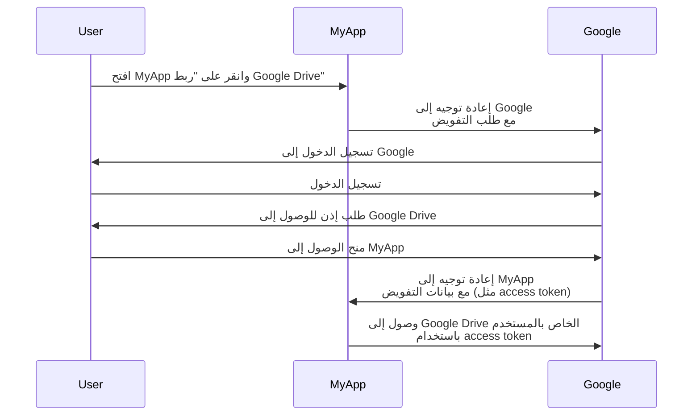

## ما هو مالك المورد (Resource owner)؟

في سياق <Ref slug="oauth-2.0" />، مالك المورد (Resource owner) هو هوية (عادة مستخدم) لديه القدرة على منح الوصول إلى مورد محمي (مثل البيانات أو الملفات أو الخدمات).

على سبيل المثال، لديك تطبيق ويب MyApp يريد الوصول إلى Google Drive الخاص بالمستخدم. إليك تدفق معتاد لـ OAuth 2.0:

في هذا التدفق، يكون **المستخدم** هو **مالك المورد (Resource owner)** الذي يتيح الوصول إلى Google Drive الخاص به إلى MyApp، بينما **MyApp** هو <Ref slug="client" /> الذي يريد الوصول إلى الموارد المحمية و**Google** هو أيضًا <Ref slug="authorization-server" /> و<Ref slug="resource-server" />.

كما يشير الاسم، يمتلك مالك المورد موارد في <Ref slug="resource-server" /> ويمكنه تفويض العملاء للوصول إليها نيابة عنه في سياق <Ref slug="oauth-2.0" />.

## لماذا مالك المورد (Resource owner) مهم؟

أثناء عملية <Ref slug="authorization" />، يعتبر مالك المورد (Resource owner) لا يمكن تجاهله لأنهم هم من يمنحون أو يرفضون الوصول إلى مواردهم بوضوح. موافقة مالك المورد ضرورية لأسباب فنية وتشريعية:

- **فنية**: تضمن موافقة مالك المورد أن العميل لديه الأذونات اللازمة للوصول إلى الموارد. بدلاً من الوصول الكامل أو لا شيء، يمكن لمالك المورد منح وصول جزئي وفقًا لطلب العميل. من ناحية أخرى، يمكن لمالك المورد أيضًا أن يلغي الوصول صراحة في أي وقت. يوفر هذا النهج وسيلة واضحة وقابلة للتدقيق لـ <Ref slug="access-control" />.
- **تشريعية**: تعتبر موافقة مالك المورد شرط قانوني في العديد من الولايات القضائية، خاصة عند التعامل مع البيانات الحساسة. على سبيل المثال، يتطلب اللائحة العامة لحماية البيانات (GDPR) أن يقوم موضوع البيانات (مالك المورد) بتقديم موافقة صريحة على أنشطة معالجة البيانات.

## مالك المورد (Resource owner) مقابل خادم المورد (Resource Server)

<Ref slug="resource-server">خوادم الموارد (Resource Servers)</Ref> هي المسؤولة عن استضافة وتقديم **الموارد المحمية**. هم حراس البوابة الذين يتحققون من رموز الوصول ويقدمون الموارد للعميلات.

من ناحية أخرى، يمكن لمالك المورد أن يكون لديه تحكم كامل أو جزئي على الموارد المحمية في خادم الموارد وفقًا لسياسات <Ref slug="access-control" />.

<SeeAlso slugs={["resource-server", "oauth-2.0", "resource-indicator", "access-control"]} />

<Resources
  urls={[
    "https://tools.ietf.org/html/rfc6749",
  ]}
/>
