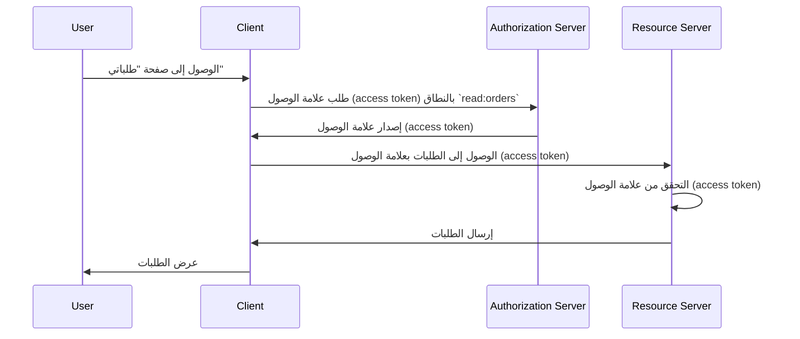

## ما هو خادم الموارد (Resource server)؟

في سياق <Ref slug="oauth-2.0" />، يشير **خادم الموارد (resource server)** إلى الخادم الذي يستضيف **الموارد المحمية** التي يرغب <Ref slug="client" /> في الوصول إليها. يتولى خادم الموارد أيضًا مسؤولية التحقق من <Ref slug="access-token" /> وتقديم الموارد المحمية للعميل وفقًا لسياسات <Ref slug="access-control" />.

على سبيل المثال، فكر في تطبيق الويب MyApp الذي يرغب في الوصول إلى Google Drive الخاص بالمستخدم. في هذا السيناريو:

- **MyApp** هو العميل الذي يرغب في الوصول إلى الموارد المحمية.
- **Google** هو خادم الموارد الذي يستضيف Google Drive الخاص بالمستخدم.
- **Google** هو أيضًا <Ref slug="authorization-server" /> الذي يصدر علامة الوصول (access token) لـ MyApp.

لنفكر في مثال آخر حيث يريد موقع التجارة الإلكترونية الوصول إلى سجل الطلبات الخاص بالمستخدم من خدمة الطلبات الداخلية. في هذه الحالة:

- **موقع التجارة الإلكترونية** هو العميل الذي يريد الوصول إلى الموارد المحمية.
- **خدمة الطلبات** هي خادم الموارد الذي يستضيف سجل الطلبات الخاص بالمستخدم.
- إذا تكامل موقع التجارة الإلكترونية مع خدمة OAuth 2.0 أو مقدم OpenID، فإن هذه الخدمة (المقدم) تعمل كخادم الإذن (authorization server).

## كيف يعمل خادم الموارد (Resource server)؟

يحدد OAuth 2.0 أدوار خادم الموارد وخادم الإذن بشكل منفصل لتوفير فصل واضح بينهما. ومع ذلك، لا يحدد تمثيلًا محددًا لخادم الموارد في الإطار، ويشير إليه كفكرة افتراضية تستضيف الموارد المحمية؛ يحتاج <Ref slug="client" /> إلى تحديد <Ref slug="scope">نطاقات</Ref> للموارد المحمية التي يرغب في الوصول إليها.

لنفترض أن العميل يريد الوصول إلى سجل الطلبات الخاص بالمستخدم من خدمة الطلبات. قد يبدو مثال غير معياري لإرسال <Ref slug="token-request" /> للوصول إلى الطلبات كما يلي:



في مخطط التسلسل أعلاه، يطلب العميل علامة الوصول (access token) بالنطاق `read:orders` من خادم الإذن (authorization server). نفترض أن جميع الأطراف قد توصلت إلى معنى نطاق `read:orders`: فهو يشير إلى أن العميل يرغب في أداء عمليات `قراءة` على `الطلبات` المقدمة من خادم الموارد. يستخدم العميل بعد ذلك علامة الوصول للوصول إلى الطلبات من خادم الموارد.

> [!Note]
> لا يحدد OAuth 2.0 معنى وبنية النطاقات ويجب أن يتم الاتفاق عليها من قبل العميل وخادم الإذن وخادم الموارد.

يتحمل خادم الموارد مسؤولية التحقق من علامة الوصول وتحديد ما إذا كان العميل لديه الأذونات اللازمة للوصول إلى الموارد المطلوبة وفقًا لسياسات <Ref slug="access-control" />. وفقًا للتنفيذ، قد تكون علامة الوصول <Ref slug="opaque-token" /> أو <Ref slug="jwt" />.

## تسميات التسمية

من المرونة تسمية خادم الموارد وفقًا لسياق التطبيق. بما أن OAuth 2.0 لا يحدد تمثيلًا محددًا لخادم الموارد في معلمة <Ref slug="scope" />، يمكنك رؤية عدة تسميات في الصناعة:

- حذف اسم خادم الموارد واستخدام الفعل فقط: على سبيل المثال، `read` و `write`.
- `[الفعل]:[المورد]`: أحد التقاليد الشائعة هو استخدام مزيج من `الفعل` و `المورد` لتحديد الإجراءات التي يمكن للعميل القيام بها على المورد. على سبيل المثال، `read:orders` و `write:profile`. أحيانًا يتم عكسها لتصبح `orders:read` و `profile:write`.
- `[uri]:[الإجراء]`: تقليد آخر هو استخدام URI للمورد والإجراء الذي يمكن للعميل القيام به. على سبيل المثال، `https://api.example.com/orders:read` و `https://api.example.com/profile:write`.

## مؤشرات الموارد (Resource indicators)

لنتفحص مثالاً لمتغير النطاق في <Ref slug="authentication-request" /> (مفكك):

```plaintext
openid profile email https://api.example.com/orders:read
```

في هذا المثال، يتضمن المتغير `scope` النطاقات `openid` و `profile` و `email`، وهي نطاقات قياسية في <Ref slug="openid-connect" />، إلى جانب النطاق `https://api.example.com/orders:read` الذي يحدد موقع خادم الموارد والإذن لقراءة الموارد.

يبدو الأمر جيدًا في هذه الحالة المعينة، لكن مع زيادة عدد الموارد والنطاقات، قد يصبح من الصعب إدارة النطاقات وفهمها. لمعالجة هذه المسألة، قدمت OAuth 2.0 امتدادًا يسمى <Ref slug="resource-indicator">مؤشرات الموارد (resource indicators)</Ref> (RFC 8707) التي تسمح للعملاء باستخدام URIs لتحديد الموارد التي يريدون الوصول إليها، مما يجعل خوادم الموارد أكثر وضوحًا في العملية.

بعد إضافة متغير مؤشر المورد إلى طلب المصادقة (`resource=https://api.example.com/orders`)، يمكن تبسيط متغير النطاق ليصبح:

```plaintext
openid profile email read
```

والذي يبدو أنظف وأسهل في الإدارة.

> [!Note]
> لا تدعم جميع خوادم الإذن (مقدمي OpenID) امتداد مؤشر المورد (resource indicator). يرجى التحقق من وثائق خادم الإذن الخاص بك قبل استخدامه.

<SeeAlso slugs={["access-control", "resource-indicator", "resource-owner", "client"]} />

<Resources
  urls={[
    "https://datatracker.ietf.org/doc/html/rfc8707",
  ]}
/>