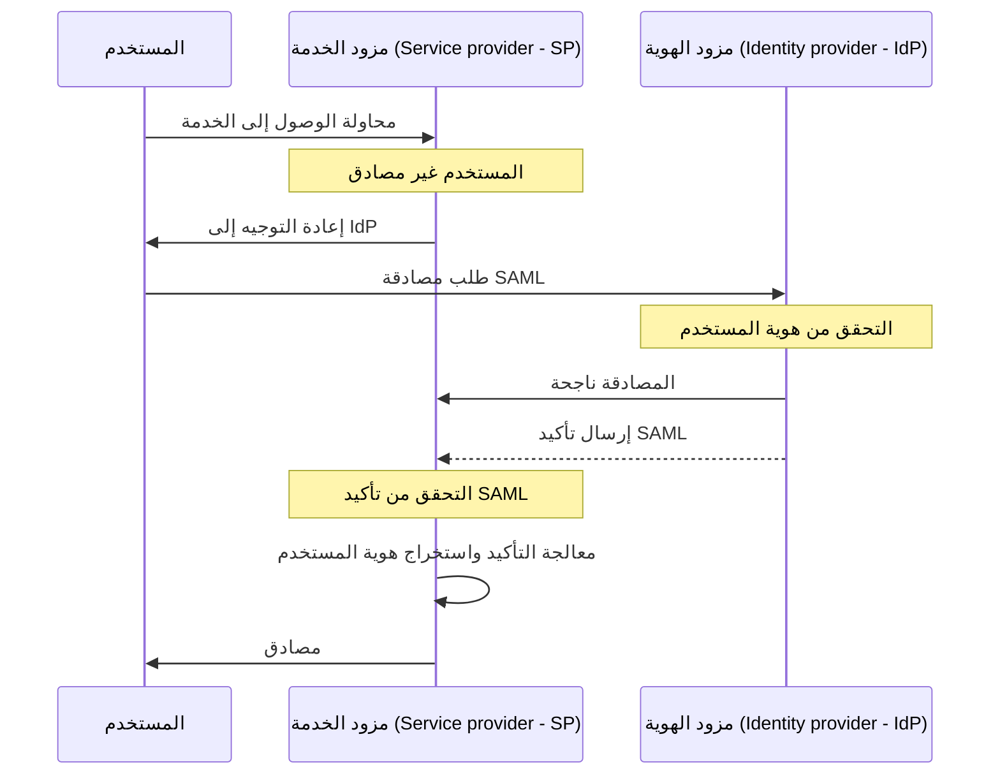

## ما هي SAML؟

SAML (عادة ما يتم الإشارة إليها باسم SAML 2.0) هي معيار يعتمد على XML لتبادل بيانات المصادقة (authentication) والتفويض (authorization) بين طرفين: <Ref slug="identity-provider" /> و <Ref slug="service-provider" />. تُستخدم على نطاق واسع في الاتحاد الهوياتي وحلول <Ref slug="enterprise-sso" />.

كما يشير الاسم، تنقل SAML التأكيدات حول هوية المستخدم وسماته. تكون هذه التأكيدات موقعة رقميًا ويُمكن تشفيرها اختياريًا لضمان سلامتها وسريتها.

## كيف تعمل SAML؟

قبل التعمق في تدفق مصادقة SAML، نحتاج إلى فهم كيف يمكن لمزودي الهوية ومزودي الخدمة التعرف والثقة ببعضهم البعض. يتم إنشاء هذه الثقة من خلال تبادل البيانات الوصفية، حيث يشارك كلا الطرفين المعلومات حول:

- **معرف الكيان**: معرف فريد لمزود الهوية أو مزود الخدمة.
- **المفتاح العام**: يُستخدم للتحقق من التوقيعات الرقمية في تأكيدات SAML.
- **النقاط النهائية**: عناوين URL للعمليات المختلفة في SAML، مثل طلبات واستجابات المصادقة (authentication requests).

بمجرد إنشاء الثقة، يمكن أن يبدأ تدفق مصادقة SAML:

### RelayState

في تدفق SAML، يتم استخدام معامل `RelayState` للاحتفاظ بحالة المستخدم عبر عملية المصادقة. يعمل كمرجع للطلب الأصلي الذي قام به المستخدم قبل إعادة توجيهه إلى مزود الهوية. يمكن لمزود الخدمة استخدام هذا المعامل لإعادة توجيه المستخدم إلى الصفحة أو المورد الأصلي بعد نجاح المصادقة.

يُستخدم RelayState أيضًا لمنع هجمات <Ref slug="csrf" /> عن طريق ضمان إعادة توجيه المستخدم إلى الصفحة الصحيحة بعد المصادقة.

### تأكيدات SAML

تأكيدات SAML هي المكون الرئيسي في بروتوكول SAML. تحتوي على معلومات حول هوية المستخدم وسماته وحالة المصادقة. هناك ثلاثة أنواع من تأكيدات SAML:

- **تأكيد المصادقة (Authentication assertion)**: يشير إلى أن المستخدم قد تمت مصادقته بواسطة مزود الهوية.
- **تأكيد السمة (Attribute assertion)**: يحتوي على معلومات إضافية حول المستخدم، مثل الأدوار والصلاحيات وبيانات الملف الشخصي.
- **تأكيد قرار التفويض (Authorization decision assertion)**: يحدد حقوق وصول المستخدم إلى موارد معينة.

## اعتبارات عند تبني SAML

تم تبني SAML على نطاق واسع في البيئات المؤسسية منذ بداية الألفية الثانية. إليك بعض الاعتبارات الرئيسية عند تبني SAML لتطبيقاتك:

- التعقيد: يمكن أن تكون تطبيقات SAML معقدة عند تكاملها مع تطبيقاتك، خاصةً بالمقارنة مع الأطر الحديثة مثل <Ref slug="oauth-2.0" /> و <Ref slug="openid-connect" />.
- كفاءة النقل: قد تكون رسائل SAML كبيرة نظرًا لتنسيق XML، مما قد يؤثر على أداء الشبكة.
- الأمان: يجب حماية تأكيدات SAML من التلاعب والتنصت. تأكد من أن تطبيق SAML الخاص بك يتبع أفضل الممارسات للتشفير والتوقيعات الرقمية.

على الرغم من هذه الاعتبارات، تظل SAML معيارًا قويًا وشائعًا لعمليات الاتحاد الهوياتي والحلول الموحدة لتسجيل الدخول في البيئات المؤسسية. ومع ذلك، بالنسبة للتطبيقات أو الخدمات الجديدة، قد ترغب في النظر في بدائل حديثة مثل OAuth 2.0 وOpenID Connect للحصول على نهج أخف وزنًا وأكثر ملاءمة للمطورين فيما يتعلق بالمصادقة والتفويض.

<SeeAlso slugs={["enterprise-sso", "oauth-2.0", "openid-connect"]} />

<Resources
  urls={[
    "https://blog.logto.io/saml-security-cheat-sheet",
    "https://blog.logto.io/picking-your-sso-method",
    "https://blog.logto.io/differences-between-saml-and-oidc",
  ]}
/>
