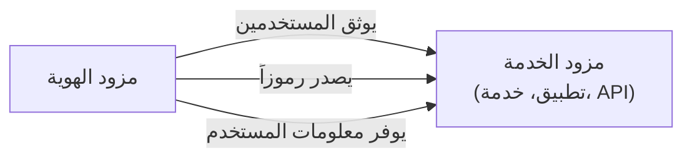

## ما هو مزود الخدمة (Service Provider, SP)؟

في مجال <Ref slug="iam" />، يُعتبر مزود الخدمة (SP) (أو **الطرف المعتمد** في سياق <Ref slug="openid-connect" />) تطبيقًا أو خدمة تعتمد على <Ref slug="identity-provider" /> من أجل المصادقة (authentication) والتفويض (authorization). يتولى مسؤولية توفير الخدمات للمستخدمين وتطبيق سياسات <Ref slug="access-control" /> بناءً على الرموز المميزة (tokens) التي يصدرها مزود الهوية.

## معايير مزود الخدمة

لا توجد معايير صارمة لمزودي الخدمة، حيث يمكن أن يكونوا أي نوع من التطبيقات أو الخدمات التي تتطلب إدارة الهوية. ومع ذلك، فإن مزودي الخدمة يتبعون غالبًا المعايير التي يضعها مزود الهوية الذي يعتمدون عليه. على سبيل المثال، إذا كان مزود الهوية يدعم <Ref slug="openid-connect" />، فإن مزود الخدمة سيستخدم عادةً OIDC للمصادقة (authentication) والتفويض (authorization).

## هيكلية مزود الخدمة

المصطلح "مزود الخدمة" لا يحدد بنية معينة أو تنفيذًا خاصًا. وعادةً ما يحتاج مزودو الخدمة إلى التسجيل لدى مزود الهوية لإقامة الثقة وتمكين الاتصال الآمن. عادةً ما تتضمن عملية التسجيل تبادل بيانات التعريف وبيانات اعتماد العميل.

على سبيل المثال، في سياق OpenID Connect، تتضمن بيانات مزود الخدمة عادةً:

- **معرف العميل**: معرف فريد لمزود الخدمة.
- **سر العميل**: سر مشترك يستخدم لمصادقة مزود الخدمة.
- **<Ref slug="redirect-uri">عناوين URI لإعادة التوجيه</Ref>**: العناوين التي سيعيد إليها مزود الهوية المستخدمين بعد المصادقة (authentication) والتفويض (authorization).

بمجرد التسجيل، يمكن لمزود الخدمة بدء عملية <Ref slug="authentication" /> عن طريق إعادة توجيه المستخدمين إلى نقطة النهاية المحددة لمزود الهوية.

عندما يتم بناء مزودي الخدمة لحالات استخدام غير تفاعلية، يتم الإشارة إليهم عادةً كـ <Ref slug="client">عملاء</Ref> يحتاجون إلى اتصال <Ref slug="machine-to-machine" />.

<SeeAlso slugs={["identity-provider", "openid-connect", "oauth-2.0"]} />

<Resources
  urls={[
    "https://blog.logto.io/secure-cloud-apps-with-oauth-and-openid-connect",
    "https://blog.logto.io/incorporate-identity-solution",
    "https://blog.logto.io/centralized-identity-system"
  ]}
/>
