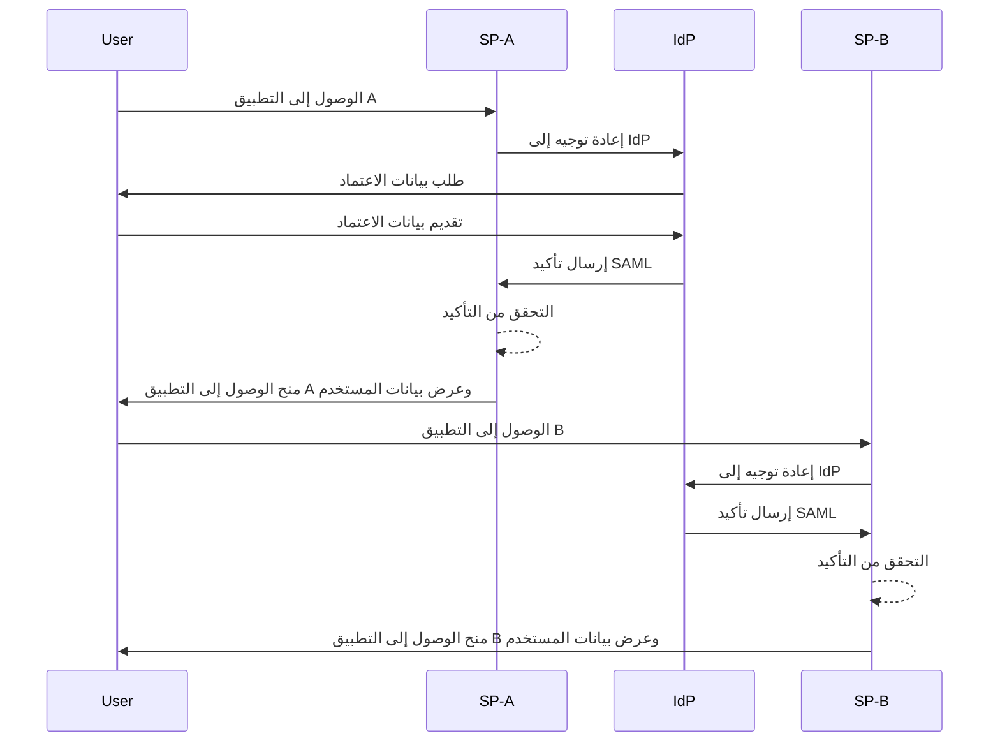
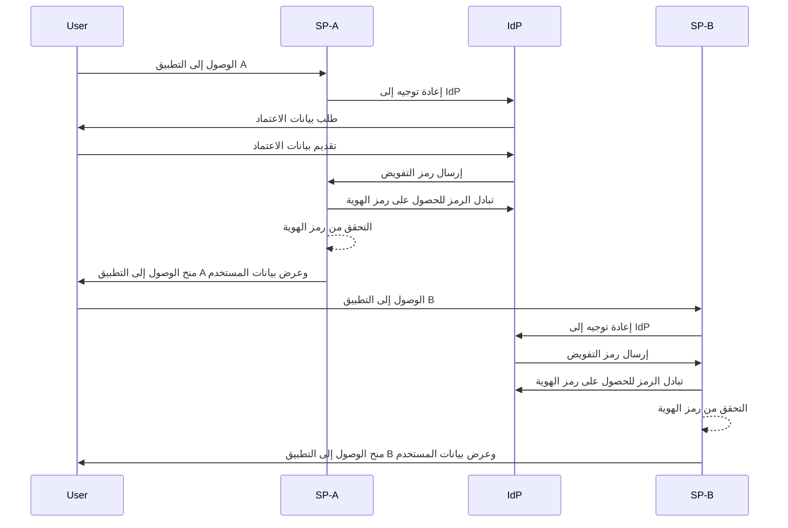

## ما هو تسجيل الدخول الموحد (SSO)؟

تسجيل الدخول الموحد (SSO) هو طريقة <Ref slug="authentication" /> تتيح للمستخدمين الوصول إلى تطبيقات أو خدمات متعددة باستخدام مجموعة واحدة من بيانات الاعتماد. بدلاً من إدارة تسجيلات دخول منفصلة لكل نظام، يقوم المستخدمون بالمصادقة مرة واحدة ويتم تسجيل دخولهم تلقائيًا إلى جميع المنصات المتصلة.

يُستخدم SSO بشكل شائع في البيئات الشخصية والعملية، خاصة في بيئات المؤسسات حيث يعتمد الموظفون أو العاملون عن بُعد على تطبيقات SaaS المختلفة لأداء وظائفهم. من خلال تنفيذ SSO، يمكن للمنظمات تعزيز الأمان وتبسيط إدارة الوصول وزيادة إنتاجية المستخدم.

مثال معروف على SSO هو مجموعة خدمات Google، مثل Gmail وGoogle Drive وGoogle Calendar. بعد تسجيل الدخول إلى حساب Google الخاص بهم، يمكن للمستخدمين الوصول بسهولة إلى جميع هذه الخدمات دون إعادة إدخال بيانات الاعتماد الخاصة بهم.

## كيف يعمل تسجيل الدخول الموحد؟

يعتمد SSO على علاقة ثقة بين تطبيق أو خدمة، يُعرف باسم <Ref slug="service-provider" />، و<Ref slug="identity-provider" />. يقوم IdP بمعالجة مصادقة المستخدم ومشاركة المعلومات الضرورية بأمان مع SP لمنح الوصول. يتم تأسيس هذه الثقة من خلال عملية تُسمى الفيدرالية، حيث يتفق SP وIdP على معايير وبروتوكولات محددة لتبادل بيانات المصادقة بأمان.

عندما يحاول المستخدم الوصول إلى تطبيق يدعم SSO، يقوم SP بإعادة توجيهه إلى IdP للمصادقة. يطلب IdP من المستخدم تقديم بيانات الاعتماد، ويقوم بالتحقق من هويته، ويؤسس جلسة مصادقة في نظامه. عادةً ما يتم الحفاظ على هذه الجلسة باستخدام ملف تعريف ارتباط الجلسة المخزن بأمان تحت نطاق IdP.

بمجرد مصادقة المستخدم، يقوم IdP بإنشاء رمز أمان أو تأكيد يحتوي على معلومات المستخدم التي تم الموافقة على مشاركتها مع SP. يتم نقل هذا الرمز أو التأكيد بأمان إلى SP، الذي يقوم بالتحقق منه ومنح المستخدم الوصول.

إذا قام المستخدم بالوصول إلى تطبيق آخر يدعم SSO، تتم العملية بسلاسة دون الحاجة إلى تسجيل دخول إضافي. يتم تحقيق هذه السهولة بفضل جلسة مصادقة المستخدم التي يحافظ عليها IdP، مما يسمح لـ IdP بالتحقق تلقائيًا من هوية المستخدم وإصدار رمز أمان جديد دون طلب بيانات الاعتماد مرة أخرى.

تُستخدم بروتوكولات مثل <Ref slug="saml" /> و<Ref slug="openid-connect" /> على نطاق واسع لتنفيذ SSO. تحدد هذه المعايير كيفية تبادل بيانات المصادقة بأمان بين IdP وSP، مما يضمن اتصالًا موثوقًا وآمنًا مع الحفاظ على تجربة سلسة للمستخدم عبر التطبيقات.

### SSO المستند إلى SAML

في SSO المستند إلى SAML، بمجرد مصادقة المستخدم بواسطة IdP، يتم إنشاء تأكيد SAML المستند إلى XML، وتوقيعه، وإرساله بأمان إلى SP. ثم يقوم SP بالتحقق من التأكيد ومنح الوصول بناءً على هوية المستخدم.

### SSO المستند إلى OIDC

بالمقابل، يتم بناء OIDC على <Ref slug="oauth-2.0" /> ويقدم نهجًا أكثر حداثة لـ SSO. يستخدم <Ref slug="jwt" /> لتبادل معلومات الهوية بين IdP وSP، مما يوفر أمانًا محسنًا ومرونة أكبر.

## فوائد تسجيل الدخول الموحد

1. **تعزيز الأمان**: يقلل SSO من خطر الانتهاكات الأمنية المتعلقة بكلمات المرور عن طريق تقليل عدد بيانات الاعتماد التي يحتاج المستخدمون لتذكرها. كما يسمح للمنظمات بفرض طرق مصادقة أقوى، مثل <Ref slug="mfa" />، لحماية حسابات المستخدمين.

2. **تحسين تجربة المستخدم**: يمكن للمستخدمين الوصول إلى تطبيقات متعددة بسلاسة دون الحاجة إلى تسجيل الدخول بشكل متكرر، مما يعزز الإنتاجية ويقلل من الإحباط. يبسط SSO عملية تسجيل الدخول ويوفر تجربة مستخدم متسقة عبر المنصات المختلفة.

3. **إدارة الوصول المركزية**: يمكن للمنظمات إدارة وصول المستخدمين والأذونات مركزيًا من خلال IdP، مما يضمن سياسات أمان متسقة وضوابط وصول عبر جميع التطبيقات المتصلة. يبسط هذا عمليات توفير المستخدمين وإلغاء توفيرهم وعمليات التدقيق.

## متى يجب استخدام تسجيل الدخول الموحد

1. **البيئات المؤسسية والتنظيمية**: يكون SSO مفيدًا بشكل خاص للشركات التي تعتمد على تطبيقات وخدمات متعددة لتبسيط سير العمل. يبسط وصول المستخدم ويقلل العبء على فرق تكنولوجيا المعلومات لإدارة حسابات المستخدمين الفردية. على سبيل المثال، الشركات التي تستخدم تطبيقات SaaS متعددة، مثل CRM، HR، وأدوات التعاون.
2. **التطبيقات الموجهة للعملاء**: يمكن أن يعزز SSO أيضًا تجربة المستخدم للعملاء الذين يصلون إلى الخدمات عبر الإنترنت أو منصات التجارة الإلكترونية. على سبيل المثال، السماح للمستخدمين بتسجيل الدخول باستخدام حسابات وسائل التواصل الاجتماعي الخاصة بهم أو عناوين البريد الإلكتروني بدلاً من إنشاء حسابات جديدة لكل خدمة.
3. **الخدمات متعددة المنتجات**: يمكن للشركات التي تقدم مجموعة من المنتجات أو الخدمات المترابطة الاستفادة من SSO لتوفير تجربة مستخدم سلسة عبر عروضها. يمكن للمستخدمين التنقل بين التطبيقات المختلفة دون عناء تسجيل الدخول المتكرر. على سبيل المثال، G Suite من Google. يمكن للمستخدمين تسجيل الدخول مرة واحدة على متصفح Chrome الخاص بهم والوصول إلى خدمات Google المتعددة دون إعادة إدخال بيانات الاعتماد الخاصة بهم.

لا يقتصر استخدام SSO على هذه السيناريوهات ويمكن تكييفه مع حالات استخدام مختلفة بناءً على الاحتياجات المحددة للمنظمة أو التطبيق. يُعتبر على نطاق واسع كأفضل ممارسة لتعزيز الأمان وتجربة المستخدم والكفاءة التشغيلية في البيئات الرقمية الحديثة.

<SeeAlso slugs={["enterprise-sso"]} />