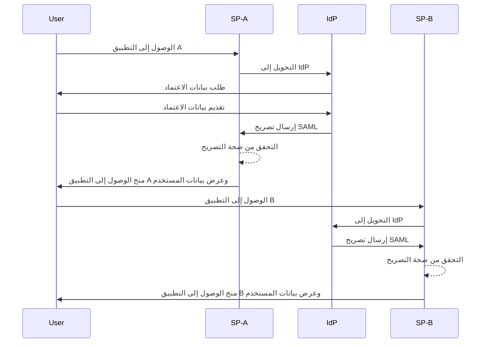

## ما هو تسجيل الدخول الموحد (SSO)؟

تسجيل الدخول الموحد (SSO) هو طريقة <Ref slug="authentication" /> تسمح للمستخدمين بالوصول إلى تطبيقات أو خدمات متعددة بمجموعة واحدة من بيانات الاعتماد. بدلاً من إدارة تسجيلات دخول منفصلة لكل نظام، يقوم المستخدمون بالمصادقة مرة واحدة ويتم تسجيلهم تلقائيًا في جميع الأنظمة المتصلة.

يستخدم SSO بشكل شائع في كل من البيئات الشخصية والأعمال، خاصة في بيئات المؤسسات حيث يعتمد الموظفون أو العاملون عن بعد على تطبيقات SaaS متنوعة لأداء وظائفهم. من خلال تطبيق SSO، يمكن للمنظمات تعزيز الأمان وتبسيط إدارة الوصول وزيادة إنتاجية المستخدم.

مثال معروف لـ SSO هو مجموعة خدمات Google، مثل Gmail و Google Drive و Google Calendar. بعد تسجيل الدخول إلى حسابهم في Google، يمكن للمستخدمين الوصول بسهولة إلى جميع هذه الخدمات دون إعادة إدخال بيانات اعتمادهم.

## كيف يعمل تسجيل الدخول الموحد؟

يعمل SSO على علاقة من الثقة بين التطبيق أو الخدمة، المعروف باسم <Ref slug="service-provider" /> و <Ref slug="identity-provider" />. يتولى IdP التعامل مع مصادقة المستخدم ومشاركة المعلومات الضرورية بأمان مع SP لمنح الوصول. يتم تأسيس هذه الثقة من خلال عملية تسمى الاتحاد، حيث يتفق كل من SP و IdP على معايير وبروتوكولات محددة لتبادل بيانات المصادقة بأمان.

عندما يحاول مستخدم الوصول إلى تطبيق ممكّن بـ SSO، يقوم SP بتحويله إلى IdP للمصادقة. يطلب IdP من المستخدم بيانات اعتماده، يتحقق من هويته، وينشئ رمز أمان أو تصريح يحتوي على معلومات المستخدم. يُرسل هذا الرمز إلى SP، الذي يستخدمه بعد ذلك لمنح الوصول.

إذا حاول المستخدم الوصول إلى تطبيق آخر ممكّن بـ SSO، فيتم تكرار العملية تلقائيًا دون الحاجة إلى تسجيل الدخول مرة أخرى. يرسل IdP بيانات المصادقة المطلوبة مباشرة إلى SP، مما يسمح للمستخدم بالوصول إلى التطبيق الجديد بسلاسة.

<Ref slug="saml" /> و <Ref slug="openid-connect" /> هما بروتوكولين مستخدمان على نطاق واسع لتنفيذ SSO. تحدد هذه المعايير كيفية تبادل بيانات المصادقة بين IsP و SP، مما يضمن الاتصالات الآمنة والموثوقة.

### SSO المعتمد على SAML

في SSO المعتمد على SAML، بمجرد أن يتم مصادقة المستخدم بواسطة IdP، يتم إنشاء تصريح SAML مستند إلى XML، وموقع، وإرساله بأمان إلى SP. يقوم SP بعد ذلك بالتحقق من صحة التصريح ومنح الوصول بناءً على هوية المستخدم.

### SSO المعتمد على OIDC

بالمقابل، تم بناء OIDC على <Ref slug="oauth-2.0" /> ويقدم نهجًا أكثر حداثة لـ SSO. يستخدم <Ref slug="jwt" /> لتبادل معلومات الهوية بين IdP و SP، مما يوفر أمانًا محسنًا ومرونة أكبر.

## فوائد تسجيل الدخول الموحد

1. **تعزيز الأمان**: يقلل SSO من مخاطر الخروقات الأمنية المتعلقة بكلمات المرور عن طريق تقليل عدد بيانات الاعتماد التي يحتاج المستخدمون لتذكرها. كما أنه يسمح للمنظمات بتطبيق طرق مصادقة أقوى، مثل <Ref slug="mfa" />، لحماية حسابات المستخدمين.

2. **تحسين تجربة المستخدم**: يمكن للمستخدمين الوصول إلى تطبيقات متعددة بسلاسة دون الحاجة لتكرار تسجيل الدخول، مما يعزز الإنتاجية ويقلل الإحباط. يبسط SSO عملية تسجيل الدخول ويوفر تجربة مستخدم متسقة عبر منصات مختلفة.

3. **إدارة الوصول المركزية**: يمكن للمنظمات إدارة وصول المستخدمين والأذونات مركزيًا عبر IdP، مما يضمن سياسات أمان متسقة وعناصر تحكم في الوصول عبر جميع التطبيقات المتصلة. يبسط ذلك عمليات إعداد المستخدمين، وإلغاء الإعداد، وعمليات التدقيق.

## متى يجب استخدام تسجيل الدخول الموحد

1. **بيئات المؤسسات والمنظمات**: يكون SSO مفيدًا بشكل خاص للأعمال التي تعتمد على تطبيقات وخدمات متعددة لتبسيط تدفقات العمل. يبسط الوصول للمستخدمين ويقلل العبء على فرق تكنولوجيا المعلومات لإدارة حسابات المستخدمين الفردية. على سبيل المثال، الشركات التي تستخدم تطبيقات SaaS متعددة، مثل CRM، والموارد البشرية، وأدوات التعاون.
2. **تطبيقات مواجهة للعملاء**: يمكن أن يعزز SSO أيضًا تجربة المستخدم للعملاء الذين يصلون إلى الخدمات عبر الإنترنت أو منصات التجارة الإلكترونية. على سبيل المثال، السماح للمستخدمين بتسجيل الدخول باستخدام حساباتهم على وسائل التواصل الاجتماعي أو عناوين بريدهم الإلكتروني بدلاً من إنشاء حسابات جديدة لكل خدمة.
3. **الخدمات متعددة المنتجات**: يمكن للشركات التي تقدم مجموعة من المنتجات أو الخدمات المترابطة الاستفادة من SSO لتوفير تجربة مستخدم سلسة عبر عروضها. يمكن للمستخدمين التنقل بين التطبيقات المختلفة دون الجهد المتكرر لتسجيل الدخول. على سبيل المثال، G Suite من Google. يمكن للمستخدمين تسجيل الدخول مرة واحدة على متصفح Chrome الخاص بهم والوصول إلى خدمات Google المتعددة دون إعادة إدخال بيانات الاعتماد الخاصة بهم.

لا يقتصر استخدام SSO على هذه السيناريوهات ويمكن تطبيقه على حالات استخدام متنوعة بناءً على الاحتياجات المحددة للمؤسسة أو التطبيق. يُعتبر على نطاق واسع كأفضل ممارسة لتعزيز الأمن، وتجربة المستخدم، والكفاءة التشغيلية في البيئات الرقمية الحديثة.

<SeeAlso slugs={["enterprise-sso"]} />