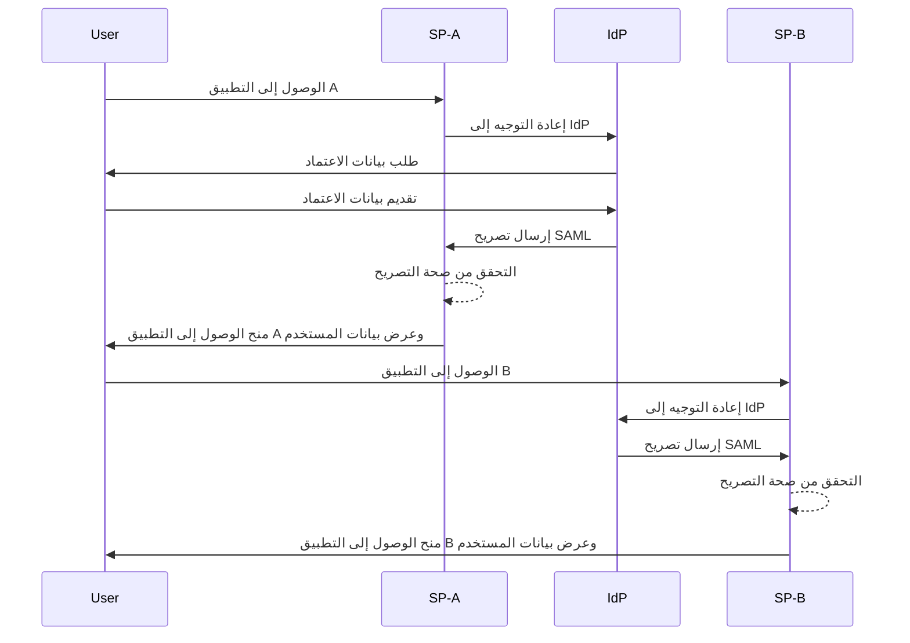
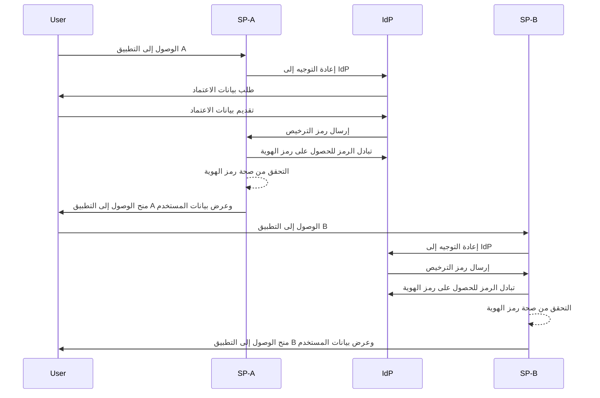

## ما هو تسجيل الدخول الأحادي (SSO)؟

تسجيل الدخول الأحادي (SSO) هو طريقة للتحقق من الهوية تتيح للمستخدمين الوصول إلى تطبيقات أو خدمات متعددة بمجموعة واحدة من بيانات الاعتماد. بدلاً من إدارة تسجيلات دخول منفصلة لكل نظام، يقوم المستخدمون بالتحقق مرة واحدة ويتم تسجيل دخولهم تلقائيًا إلى جميع المنصات المتصلة.

يُستخدم SSO بشكل شائع في الإعدادات الشخصية والتجارية، خاصة في بيئات المؤسسات حيث يعتمد الموظفون أو العاملون عن بُعد على تطبيقات SaaS متنوعة لأداء وظائفهم. من خلال تنفيذ SSO، يمكن للمنظمات تعزيز الأمان وتبسيط إدارة الوصول وزيادة إنتاجية المستخدم.

مثال معروف على SSO هو مجموعة خدمات Google، مثل Gmail وGoogle Drive وGoogle Calendar. بعد تسجيل الدخول إلى حساب Google الخاص بهم، يمكن للمستخدمين بسهولة الوصول إلى جميع هذه الخدمات دون إعادة إدخال بيانات اعتمادهم.

## كيف يعمل تسجيل الدخول الأحادي؟

عمل SSO يعتمد على علاقة ثقة بين التطبيق أو الخدمة، المعروفة باسم <Ref slug="service-provider" /> ومزود الهوية <Ref slug="identity-provider" />. يتولى IdP التحقق من هوية المستخدم ومشاركة المعلومات اللازمة بأمان مع SP لمنح الوصول. يتم تأسيس هذه الثقة من خلال عملية تسمى التحالف، حيث يتفق كل من SP وIdP على معايير وبروتوكولات محددة لتبادل بيانات التحقق من الهوية بشكل آمن.

عندما يحاول المستخدم الوصول إلى تطبيق مُمكّن من SSO، يقوم SP بإعادة توجيهه إلى IdP للتحقق من الهوية. يقوم IdP بتوجيه المستخدم لتقديم بيانات اعتماده، ويقوم بالتحقق من هويته، ويُنشئ رمز أمان أو تصريح يحتوي على معلومات المستخدم. يتم إرسال هذا الرمز مرة أخرى إلى SP، الذي يستخدمه بعد ذلك لمنح الوصول.

إذا حاول المستخدم الوصول إلى تطبيق آخر مُمكّن من SSO، يتم تكرار العملية تلقائيًا دون الحاجة إلى تسجيل الدخول مرة أخرى. يقوم IdP بإرسال بيانات التحقق المطلوبة مباشرة إلى SP، مما يسمح للمستخدم بالوصول السلس إلى التطبيق الجديد.

SAML (لغة تأكيد الأمان) وOIDC (اكتشاف اتصال OpenID) هما بروتوكولين شائعان لتطبيق SSO. تحدد هذه المعايير كيفية تبادل بيانات التحقق من الهوية بين IsP وSP، مما يضمن اتصالاً آمنًا وموثوقًا.

### تسجيل الدخول الأحادي المستند إلى SAML

في تسجيل الدخول الأحادي المستند إلى SAML، بمجرد التحقق من هوية المستخدم بواسطة IdP، يتم إنشاء تصريح SAML قائم على XML، وتوقيعه، وإرساله بأمان إلى SP. ثم يقوم SP بالتحقق من صحة التصريح ومنح الوصول استنادًا إلى هوية المستخدم.

### تسجيل الدخول الأحادي المستند إلى OIDC

بالمقارنة، OIDC مبني على بروتوكول OAuth 2.0 ويوفر نهجًا أكثر حداثة لـ SSO. يستخدم رموز الويب JSON (JWT) لتبادل معلومات الهوية بين IdP وSP، مما يوفر أمانًا محسنًا ومرونة أكبر.

## فوائد تسجيل الدخول الأحادي

1. **تعزيز الأمان**: يقلل SSO من مخاطر اختراقات الأمان المتعلقة بكلمات المرور من خلال تقليل عدد بيانات الاعتماد التي يحتاج المستخدمون إلى تذكرها. كما يتيح للمنظمات فرض طرق تحقق أقوى، مثل التحقق المتعدد العوامل (MFA)، لحماية حسابات المستخدمين.

2. **تحسين تجربة المستخدم**: يمكن للمستخدمين الوصول إلى تطبيقات متعددة بسلاسة دون الحاجة إلى تسجيل الدخول بشكل متكرر، مما يعزز الإنتاجية ويقلل الإحباط. يبسط SSO عملية تسجيل الدخول ويوفر تجربة مستخدم متسقة عبر منصات مختلفة.

3. **إدارة الوصول المركزية**: يمكن للمنظمات إدارة وصول المستخدمين وأذوناتهم بشكل مركزي من خلال IdP، مما يضمن سياسات أمان متسقة وتحكمات في الوصول عبر جميع التطبيقات المتصلة. هذا يبسط عمليات توفير المستخدم، وإلغاء توفيره، والتدقيق.

## متى يُستخدم تسجيل الدخول الأحادي 

1. **بيئات المؤسسات والمنظمات**: يكون SSO مفيدًا بشكل خاص للشركات التي تعتمد على تطبيقات وخدمات متعددة لتبسيط سير العمل. يبسط وصول المستخدم ويقلل من العبء على فرق تقنية المعلومات لإدارة حسابات المستخدم الفردية. على سبيل المثال، الشركات التي تستخدم تطبيقات SaaS متعددة، مثل CRM، وHR، وأدوات التعاون.
2. **التطبيقات الموجهة للعملاء**: يمكن أن يعزز SSO تجربة المستخدم للمتعاملين الذين يصلون إلى الخدمات عبر الإنترنت أو منصات التجارة الإلكترونية. على سبيل المثال، السماح للمستخدمين بتسجيل الدخول باستخدام حساباتهم في وسائل التواصل الاجتماعي أو عناوين البريد الإلكتروني بدلاً من إنشاء حسابات جديدة لكل خدمة.
3. **خدمات متعددة المنتجات**: الشركات التي تقدم مجموعة من المنتجات أو الخدمات المترابطة يمكنها الاستفادة من SSO لتوفير تجربة مستخدم سلسة عبر عروضها. يمكن للمستخدمين التنقل بين التطبيقات المختلفة دون عناء تسجيل الدخول المتكرر. على سبيل المثال، مجموعة G Suite بواسطة Google. يمكن للمستخدمين تسجيل الدخول مرة واحدة في متصفح Chrome الخاص بهم والوصول إلى خدمات Google المتعددة دون إعادة إدخال بيانات الاعتماد الخاصة بهم.

لا يقتصر استخدام SSO على هذه السيناريوهات ويمكن تكييفه مع حالات استخدام متنوعة بناءً على الاحتياجات المحددة لمنظمة أو تطبيق. يعتبر بشكل واسع أفضل ممارسة لتعزيز الأمان، وتجربة المستخدم، والكفاءة التشغيلية في البيئات الرقمية الحديثة.

<SeeAlso slugs={['enterprise-sso']} />
