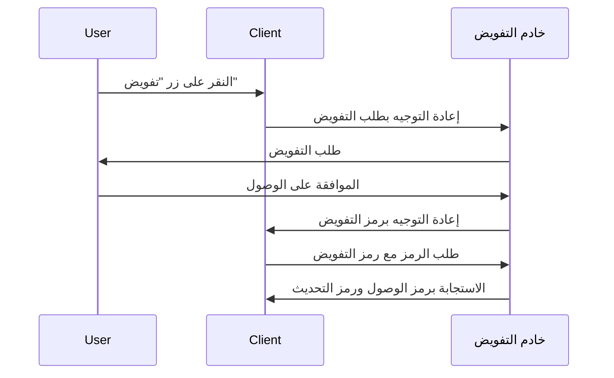
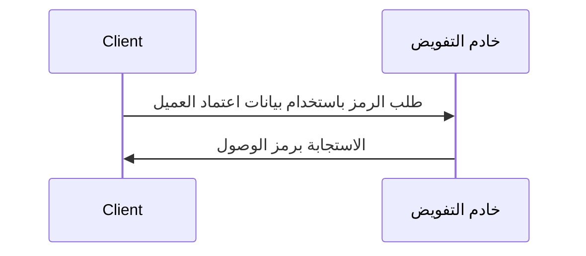

## ما هو طلب الرمز (Token request)؟

في <Ref slug="oauth-2.0" /> و<Ref slug="openid-connect" />، يعد طلب الرمز (Token request) طلبًا إلى <Ref slug="authorization-server" /> (أو <Ref slug="openid-connect" headingId="openid-provider-op" /> في OIDC) لتبادل بيانات الاعتماد (مثل رمز التفويض (authorization code)، رمز تحديث (refresh token)) لمجموعة من الرموز. تتضمن عادةً مجموعة الرموز واحدًا أو أكثر من ما يلي:

- <Ref slug="access-token" />: رمز يعطي حق الوصول إلى الموارد المحمية.
- <Ref slug="id-token" />: رمز يحتوي على معلومات المستخدم (خاص بـ OIDC).
- <Ref slug="refresh-token" />: رمز يمكن استخدامه للحصول على رمز وصول جديد دون تفاعل المستخدم.

اعتمادًا على نوع <Ref slug="oauth-2.0-grant">منح</Ref> (grant type) المستخدم، قد يتضمن الطلب معلمات مختلفة ويُعيد رموزًا مختلفة.

على سبيل المثال، في <Ref slug="client-credentials-flow" />، يطلب <Ref slug="client" /> مباشرة <Ref slug="access-token" /> باستخدام بيانات اعتماد العميل (client credentials). إليك مثال غير معياري لطلب الرمز (Token request):

```http
POST /token HTTP/1.1
Host: authorization-server.example.com
Content-Type: application/x-www-form-urlencoded

grant_type=client_credentials
  &client_id=client-id
  &client_secret=client-secret
  &scope=read
```

إذا كان الطلب ناجحًا، يستجيب خادم التفويض برمز وصول (access token):

```http
HTTP/1.1 200 OK
Content-Type: application/json

{
  "access_token": "eyJhbGci...zHg",
  "token_type": "Bearer",
  "expires_in": 3600,
  "scope": "read"
}
```

## كيف يعمل طلب الرمز (Token request)؟

كما يظهر المثال أعلاه، طلب الرمز (Token request) بحد ذاته بسيط. يرسل العميل طلب HTTP إلى النقطة النهائية للرمز في خادم التفويض مع المعلمات اللازمة. يقوم خادم التفويض بالتحقق من صحة الطلب ومعالجته وإرجاع الرموز في الاستجابة.

ومع ذلك، وفقًا لنوع المنحة (التدفق) المحدد المستخدم، قد يتطلب طلب الرمز مزيدًا من التحضير.

### تدفق رمز التفويض (Authorization code flow)

في <Ref slug="authorization-code-flow" />، يحصل العميل أولاً على رمز تفويض عن طريق بدء <Ref slug="authorization-request" /> (أو <Ref slug="authentication-request" /> في OIDC) مع خادم التفويض. بمجرد أن يمنح المستخدم الإذن، يبادل العميل رمز التفويض للحصول على رمز وصول، ويمكن أيضًا استخدام رمز تحديث عبر طلب الرمز.

فيما يلي مخطط تسلسل مبسط لتدفق رمز التفويض:



### تدفق بيانات اعتماد العميل (Client credentials flow)

كما يظهر المثال في القسم الأول، يعد <Ref slug="client-credentials-flow" /> أبسط بكثير. يطلب العميل مباشرةً رمز الوصول باستخدام بيانات اعتماد العميل الخاصة به. يقوم خادم التفويض بالتحقق من بيانات اعتماد العميل وإصدار رمز وصول إذا كان ناجحًا.

فيما يلي مخطط تسلسل غير معياري لتدفق بيانات اعتماد العميل (Client credentials flow):



### رمز التحديث (Refresh token)

في بعض أنواع المنح، يمكن للعميل أيضًا طلب <Ref slug="offline-access" /> بإدراج نطاق `offline_access` في طلب التفويض. إذا تم منحه، يقوم خادم التفويض بإصدار رمز تحديث بالإضافة إلى رمز الوصول. يمكن للعميل استخدام رمز التحديث للحصول على رمز وصول جديد عبر طلب الرمز دون تفاعل المستخدم.

فيما يلي مثال غير معياري لاستخدام رمز التحديث للحصول على رمز وصول جديد:

```http
POST /token HTTP/1.1
Host: authorization-server.example.com
Content-Type: application/x-www-form-urlencoded

grant_type=refresh_token
  &refresh_token=refresh-token
  &client_id=client-id
  &client_secret=client-secret
```

---

قد تتضمن أنواع المنح الأخرى أيضاً طلبات الرموز، لكن الفكرة الأساسية تبقى نفسها.

## المعلمات الرئيسية في طلب الرمز (Token request)

فيما يلي بعض المعلمات الرئيسية التي تُستخدم بشكل شائع في طلب الرمز:

- **`grant_type`**: نوع المنحة المطلوب. تشمل القيم الشائعة `authorization_code`، `client_credentials`، `refresh_token`، إلخ.
- **`client_id`**: معرف العميل الصادر عن خادم التفويض.
- **`client_secret`**: السر الخاص بالعميل الصادر عن خادم التفويض (للعملاء السريين).
- **`code`**: رمز التفويض الذي يتم الحصول عليه من خادم التفويض (لتدفق رمز التفويض).
- **`refresh_token`**: رمز التحديث الذي يتم الحصول عليه من خادم التفويض (لتحديث رموز الوصول).
- **`scope`**: النطاقات المطلوبة (الصلاحيات) لرمز الوصول.
- **`redirect_uri`**: URI حيث يرسل خادم التفويض الاستجابة (لتدفق رمز التفويض).
- **`code_verifier`**: محقق الرمز المستخدم في امتداد <Ref slug="pkce" /> (لتدفق رمز التفويض).

تعتمد المعلمات الفعلية وقيمها على نوع المنحة والمتطلبات الخاصة للتطبيق. قبل تقديم طلب رمز، ينبغي عليك الرجوع إلى القائمة الكاملة للمعلمات لنوع المنحة المحدد الذي تستخدمه.

<SeeAlso slugs={["oauth-2.0", "openid-connect", "authorization-request", "authentication-request"]} />