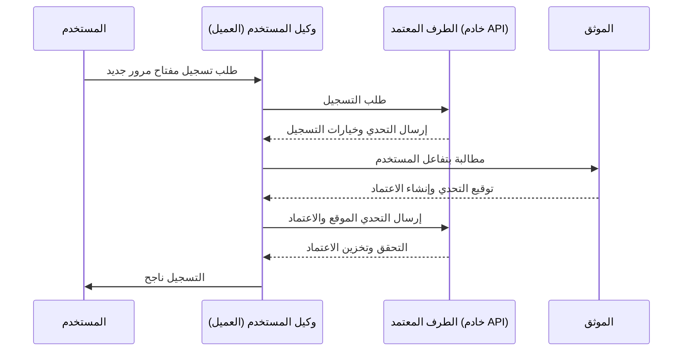
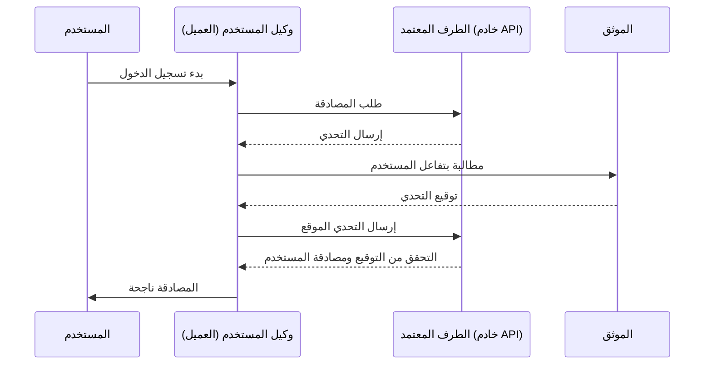

## ما هو WebAuthn؟

WebAuthn (واجهة برمجة تطبيقات المصادقة على الويب)، التي طورتها [W3C](https://www.w3.org/) و [FIDO Alliance](https://fidoalliance.org/)، هي مواصفة للمصادقة الآمنة على الويب باستخدام معايير FIDO2. توفر WebAuthn واجهة برمجة تطبيقات تتيح للمواقع تنفيذ <Ref slug="passkey" />، وهي بيانات اعتماد مقاومة للتصيد الاحتيالي مؤمنة بالتشفير المفتاحي العام. يمكن أن تحل مفاتيح المرور محل كلمات المرور عند الدخول بدون كلمة مرور أو في المصادقة متعددة العوامل (MFA).

## كيف تبدو عملية WebAuthn؟

لتوفير تفسير أكثر تفصيلاً، يمكننا تقسيم العملية إلى مرحلتين: التسجيل والمصادقة. أولاً، من الأساسي فهم الكيانات الأساسية الأربعة المعنية في عملية WebAuthn.

### 4 كيانات أساسية

1. **المستخدم:** الفرد الذي يحاول الوصول إلى تطبيق ويب.
2. **وكيل المستخدم:** متصفح الويب الذي يتعامل مع مكالمات WebAuthn API ويدير عملية المصادقة بين المستخدم والطرف المعتمد والموثق.
3. **الطرف المعتمد:** الخدمة أو التطبيق أو خادم API الذي يسعى المستخدم للوصول إليه.
4. **الموثق:** المكون المادي أو البرمجي المستخدم للتحقق من هوية المستخدم. يمكن أن يتخذ أشكالًا مختلفة بناءً على قدرة المنصة أو المتصفح، مثل مفاتيح الأمان (مثل Yubikeys)، الهواتف أو الألواح (المتصلة عبر البلوتوث أو NFC أو USB)، القياسات الحيوية المعتمدة على الجهاز أو أرقام التعريف الشخصية، إلخ.

### التسجيل في WebAuthn

تعد التشفير غير المتماثل باستخدام المفاتيح العامة عملية الأساسية.

1. **توليد زوج المفاتيح:**
يقوم وكيل المستخدم بتوليد زوج مفاتيح عام-خاص. 
    - **المفتاح العام:** يُشارك مع الطرف المعتمد.
    - **المفتاح الخاص:** يبقى مخزناً بشكل آمن في موثق المستخدم.
2. **تحدي التسجيل:**
عندما يحاول المستخدم تسجيل مفتاح مرور، يرسل الطرف المعتمد تحدي التسجيل إلى وكيل المستخدم.
3. **التحقق من المستخدم:**
يرسل وكيل المستخدم التحدي إلى الموثق، الذي يطالب المستخدم بالتحقق (مثل القياسات الحيوية أو مفتاح أمان مادي).
4. **التوقيع المشفّر:**
يستخدم الموثق مفتاحه الخاص لتوقيع التحدي، ويقوم بإنشاء توقيع مشفر.
5. **التحقق والوصول:**
يرسل وكيل المستخدم التحدي الموقع إلى الطرف المعتمد، الذي تحقق من التوقيع باستخدام المفتاح العام ويكمل عملية التسجيل.



### المصادقة باستخدام WebAuthn

1. **تحدي المصادقة:**
عندما يحاول المستخدم تسجيل الدخول، يرسل الطرف المعتمد تحدي المصادقة إلى وكيل المستخدم.
2. **التحقق من المستخدم:**
يرسل وكيل المستخدم التحدي إلى الموثق، الذي يطالب المستخدم بالتحقق (مثل القياسات الحيوية أو مفتاح أمان مادي).
3. **التوقيع المشفّر:**
يستخدم الموثق مفتاحه الخاص لتوقيع التحدي، ويقوم بإنشاء توقيع مشفر.
4. **التحقق والوصول:**
يتحقق وكيل المستخدم من التوقيع باستخدام المفتاح العام ويبلغ الطرف المعتمد بنجاح المصادقة. يتم منح الوصول إذا كان التحقق ناجحًا.



## كيفية استخدام WebAuthn؟

يمكن استخدام WebAuthn API لتنفيذ تسجيل الدخول بمفتاح المرور أو التحقق من خطوتين. يرجى الرجوع إلى تجربة مفتاح المرور لمعرفة المزيد من التفاصيل.

لاستخدام Web Authentication API (WebAuthn) للمصادقة الآمنة، تحتاج إلى التعامل مع عمليتين رئيسيتين: التسجيل والمصادقة. إليك أمثلة بسيطة على الكود الخاص بكيفية تنفيذ هذه العمليات باستخدام JavaScript.

**التسجيل**

يبادر الطرف المعتمد (تطبيق الويب الخاص بك) عملية التسجيل عن طريق استدعاء طريقة `navigator.credentials.create()`.

```jsx
// التسجيل
navigator.credentials.create({
  publicKey: {
    rp: {
      name: "اسم الطرف المعتمد",
      id: "معرف الطرف المعتمد الخاص بك"
    },
    user: {
      id: "معرف المستخدم",
      displayName: "اسم المستخدم",
      name: "اسم المستخدم"
    },
    challenge: "قيمة التحدي الخاصة بك",
    timeout: 60000 // 60 ثانية
  }
}).then(credential => {
  // تخزين معرف الاعتماد للمصادقة المستقبلية
  localStorage.setItem("credentialId", credential.id);
}).catch(error => {
  console.error("خطأ في التسجيل:", error);
});
```

يبادر الطرف المعتمد عملية المصادقة عن طريق استدعاء طريقة `navigator.credentials.get()`.

```jsx
// المصادقة
navigator.credentials.get({
  publicKey: {
    rp: {
      name: "اسم الطرف المعتمد",
      id: "معرف الطرف المعتمد الخاص بك"
    },
    challenge: "قيمة التحدي الخاصة بك",
    timeout: 60000 // 60 ثانية
  }
}).then(credential => {
  // التحقق من معرف الاعتماد وخصائص أخرى
  if (credential.id === localStorage.getItem("credentialId")) {
    // المصادقة ناجحة
    console.log("تمت مصادقة المستخدم بنجاح");
  } else {
    console.error("اعتماد غير صالح");
  }
}).catch(error => {
  console.error("خطأ في المصادقة:", error);
});
```

لمعرفة التفاصيل، اقرأ المواصفات: https://fidoalliance.org/specifications/download/.

ملحوظة: في إجراءات WebAuthn، سواءً في التسجيل أو المصادقة، يمثل "معرف الطرف المعتمد" (rp ID) حقلًا إلزاميًا. يمثل اسم نطاق الصفحة الحالية. إذا لم يتطابق مع النطاق الحالي، سيرفض المتصفح الطلب. هذا يعني أن مفاتيح المرور مقيدة بنطاق معين، ولا يوجد حاليًا طريقة لنقل مفاتيح المرور الموجودة لنطاق مختلف. بالإضافة إلى ذلك، لا يمكن استخدام مفاتيح المرور عبر نطاقات مختلفة. 

## ما الفرق بين WebAuthn و CTAP2؟

**WebAuthn** و **CTAP2** هما مكونان أساسيان لمعيار FIDO2، ولكنهما يخدمان أغراضًا مختلفة:

- **CTAP2 (بروتوكول العميل إلى الموثق 2):** يُعرِّف هذا البروتوكول كيفية تواصل الجهاز، مثل مفتاح أمان أو هاتف ذكي، مع تطبيق ويب. ينشئ قناة آمنة بين **الموثق** و**جهاز المستخدم**، لضمان حماية بيانات المصادقة الحساسة.
- **WebAuthn (واجهة برمجة تطبيقات المصادقة على الويب):** تُوَفِّر هذه الواجهة طريقة موحدة لتطبيقات الويب للتفاعل مع الموثقين المتوافقين مع CTAP2. وتتعامل مع عملية المصادقة، بما في ذلك تبادل بيانات المصادقة بين **جهاز المستخدم** و**الطرف المعتمد**.

## مصطلحات يجب معرفتها

- <Ref slug="passkey" />
- FIDO
- FIDO2
- CTAP2
- MFA
- الموثق

<Resources
  urls={[
    "https://fidoalliance.org/specs/fido-v2.0-id-20180227/fido-client-to-authenticator-protocol-v2.0-id-20180227.html",
    "https://blog.logto.io/webauthn-nextjs",
    "https://blog.logto.io/webauthn-base-knowledge"
  ]}
/>