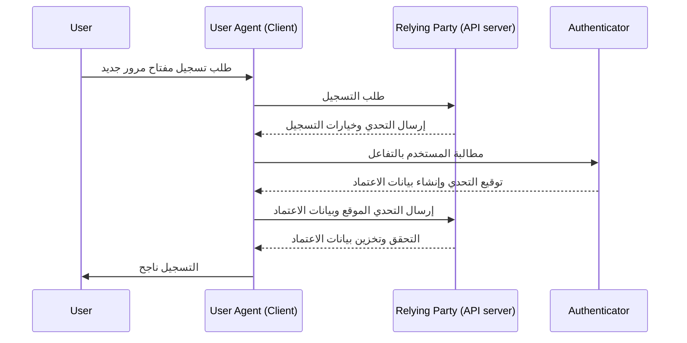
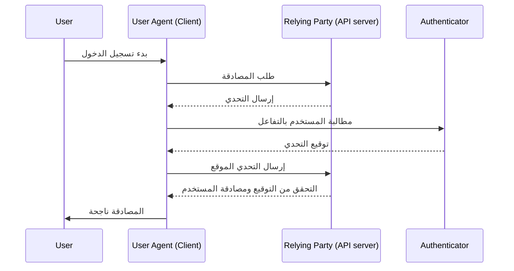

## ما هو WebAuthn؟

WebAuthn (واجهة برمجة تطبيقات الويب للمصادقة)، التي طورتها [W3C](https://www.w3.org/) و[FIDO Alliance](https://fidoalliance.org/)، هي مواصفة للمصادقة الآمنة على الويب باستخدام معايير FIDO2. يوفر WebAuthn واجهة برمجة تطبيقات للسماح للمواقع بتنفيذ <Ref slug="passkey" />، وهي بيانات اعتماد مقاومة للتصيد الاحتيالي ومؤمنة بالتشفير بالمفتاح العام. يمكن لمفاتيح المرور استبدال كلمات المرور لكل من تسجيل الدخول بدون كلمة مرور و<Ref slug="mfa" />.

## كيف يبدو سير عمل WebAuthn؟

إليك مثال من العالم الواقعي لفهم أفضل. لديك تطبيق ويب MyApp الذي يريد دمج واجهة برمجة تطبيقات WebAuthn لتنفيذ مفتاح المرور للمصادقة متعددة العوامل.

**مرحلة التسجيل:** بعد التسجيل باستخدام التحقق من البريد الإلكتروني وتعيين كلمة مرور جديدة، يُطلب من هذا المستخدم إنشاء مفتاح مرور. يختارون ربط جهازهم باستخدام بصمة الإصبع. يتم إنشاء مفتاح المرور بشكل آمن على جهازهم.

**مرحلة المصادقة:** أثناء تسجيل الدخول التالي، يُطلب من المستخدم التحقق من مفتاح المرور الخاص به بعد إدخال كلمة المرور. مع مجرد مسح سريع لبصمة الإصبع، يمكنهم بسهولة إكمال عملية المصادقة.


لتقديم تفسير أكثر تفصيلاً، يمكننا تقسيم العملية إلى مرحلتين: التسجيل والمصادقة. أولاً، من الضروري فهم الكيانات الأربعة الرئيسية المشاركة في تدفق WebAuthn.

### 4 كيانات رئيسية

1. **المستخدم:** الفرد الذي يحاول الوصول إلى تطبيق ويب.
2. **وكيل المستخدم:** المتصفح الذي يتعامل مع مكالمات واجهة برمجة تطبيقات WebAuthn، ويدير عملية المصادقة بين المستخدم والطرف المعتمد والمصادق.
3. **الطرف المعتمد:** الخدمة أو التطبيق أو خادم API الذي يسعى المستخدم للوصول إليه.
4. **المصادق:** المكون المادي أو البرمجي المستخدم للتحقق من هوية المستخدم. يمكن أن يتخذ أشكالًا مختلفة بناءً على قدرة المنصة أو المتصفح، مثل مفاتيح الأمان (مثل Yubikeys)، الهواتف أو الأجهزة اللوحية (المتصلة عبر Bluetooth أو NFC أو USB)، القياسات الحيوية المستندة إلى الجهاز أو PINs، إلخ.

### تسجيل WebAuthn

التشفير بالمفتاح العام غير المتماثل هو العملية الأساسية.

1. **توليد زوج المفاتيح:**
يقوم وكيل المستخدم بتوليد زوج مفاتيح عامة وخاصة.
   - **المفتاح العام:** يتم مشاركته مع الطرف المعتمد.
   - **المفتاح الخاص:** يبقى مخزنًا بشكل آمن في مصادق المستخدم.
2. **تحدي التسجيل:**
عندما يحاول المستخدم تسجيل مفتاح مرور، يرسل الطرف المعتمد تحدي التسجيل إلى وكيل المستخدم.
3. **التحقق من المستخدم:**
يقوم وكيل المستخدم بإرسال التحدي إلى المصادق، الذي يطلب من المستخدم التحقق (مثل المصادقة البيومترية أو مفتاح أمان مادي).
4. **التوقيع التشفيري:**
يستخدم المصادق مفتاحه الخاص لتوقيع التحدي، مما ينشئ توقيعًا تشفيريًا.
5. **التحقق والوصول:**
يرسل وكيل المستخدم التحدي الموقع إلى الطرف المعتمد، الذي يتحقق من التوقيع باستخدام المفتاح العام ويكمل عملية التسجيل.



### مصادقة WebAuthn

1. **تحدي المصادقة:**
عندما يحاول المستخدم تسجيل الدخول، يرسل الطرف المعتمد تحدي المصادقة إلى وكيل المستخدم.
2. **التحقق من المستخدم:**
يرسل وكيل المستخدم التحدي إلى المصادق، الذي يطلب من المستخدم التحقق (مثل المصادقة البيومترية أو مفتاح أمان مادي).
3. **التوقيع التشفيري:**
يستخدم المصادق مفتاحه الخاص لتوقيع التحدي، مما ينشئ توقيعًا تشفيريًا.
4. **التحقق والوصول:**
يتحقق وكيل المستخدم من التوقيع باستخدام المفتاح العام ويبلغ الطرف المعتمد بنجاح المصادقة. يتم منح الوصول إذا كان التحقق ناجحًا.



## كيفية استخدام WebAuthn؟

يمكن استخدام واجهة برمجة تطبيقات WebAuthn لتنفيذ تسجيل الدخول بمفتاح المرور أو التحقق بخطوتين. ارجع إلى تجربة مفتاح المرور لمعرفة المزيد من التفاصيل.

لاستخدام واجهة برمجة تطبيقات الويب للمصادقة (WebAuthn) للمصادقة الآمنة، تحتاج إلى التعامل مع عمليتين رئيسيتين: التسجيل والمصادقة. إليك أمثلة بسيطة على كيفية تنفيذ هذه العمليات باستخدام JavaScript.

**التسجيل**

يبدأ الطرف المعتمد (تطبيق الويب الخاص بك) عملية التسجيل عن طريق استدعاء طريقة `navigator.credentials.create()`.

```jsx
// Registration
navigator.credentials.create({
  publicKey: {
    rp: {
      name: "Your Relying Party Name",
      id: "your-relying-party-id"
    },
    user: {
      id: "user-id",
      displayName: "User Name",
      name: "User Name"
    },
    challenge: "your-challenge-value",
    timeout: 60000 // 60 seconds
  }
}).then(credential => {
  // Store the credential's id for future authentication
  localStorage.setItem("credentialId", credential.id);
}).catch(error => {
  console.error("Registration error:", error);
});
```

يبدأ الطرف المعتمد عملية المصادقة عن طريق استدعاء طريقة `navigator.credentials.get()`.

```jsx
// Authentication
navigator.credentials.get({
  publicKey: {
    rp: {
      name: "Your Relying Party Name",
      id: "your-relying-party-id"
    },
    challenge: "your-challenge-value",
    timeout: 60000 // 60 seconds
  }
}).then(credential => {
  // Verify the credential's id and other properties
  if (credential.id === localStorage.getItem("credentialId")) {
    // Authentication successful
    console.log("User authenticated successfully");
  } else {
    console.error("Invalid credential");
  }
}).catch(error => {
  console.error("Authentication error:", error);
});
```

لتعلم التفاصيل، اقرأ المواصفات: https://fidoalliance.org/specifications/download/.

ملاحظة: في إجراءات WebAuthn، سواء للتسجيل أو المصادقة، يكون "معرف الطرف المعتمد" (rp ID) حقلًا إلزاميًا. يمثل اسم نطاق الصفحة الحالية. إذا لم يتطابق مع النطاق الحالي، سيرفض المتصفح الطلب. هذا يعني أن مفاتيح المرور مرتبطة بنطاق معين، ولا يوجد حاليًا طريقة لنقل مفاتيح المرور الحالية إلى نطاق مختلف. بالإضافة إلى ذلك، لا يمكن استخدام مفاتيح المرور عبر نطاقات مختلفة.

## WebAuth و OpenID Connect (OIDC)

من خلال الجمع بين أمان WebAuthn القوي وبروتوكول الهوية الموحد لـ OIDC، يمكننا إنشاء تجربة مصادقة أكثر أمانًا وسهولة في الاستخدام.

تعرف على كيفية عملها:

- **مرحلة التسجيل:** يكمل المستخدمون عملية تسجيل <Ref slug="openid-connect" /> القياسية (مثل التحقق من البريد الإلكتروني وإنشاء كلمة مرور). يقوم WebAuthn بتوليد زوج مفاتيح عامة وخاصة، وتخزين المفتاح العام مع <Ref slug="identity-provider" /> الخاص بـ OIDC والحفاظ على المفتاح الخاص على جهاز المستخدم.
- **مرحلة المصادقة:** يصل المستخدمون إلى مورد محمي بـ OIDC ويتم إعادة توجيههم إلى صفحة تسجيل الدخول. بعد تقديم بيانات الاعتماد الأساسية (مثل البريد الإلكتروني وكلمة المرور)، يقوم النظام باستدعاء WebAuthn لمصادقة مفتاح المرور. بمجرد التحقق من مفتاح المرور، يصدر OIDC رمز وصول أو رمز تعريف للوصول إلى المستخدم.

## ما الفرق بين WebAuthn و CTAP2؟

**WebAuthn** و **CTAP2** هما مكونان أساسيان لمعيار FIDO2، لكنهما يخدمان أغراضًا مختلفة:

- **CTAP2 (بروتوكول العميل إلى المصادق 2):** يحدد هذا البروتوكول كيفية تواصل جهاز، مثل مفتاح أمان أو هاتف ذكي، مع تطبيق ويب. ينشئ قناة آمنة بين **المصادق** و**جهاز المستخدم**، مما يضمن حماية بيانات المصادقة الحساسة.
- **WebAuthn (واجهة برمجة تطبيقات الويب للمصادقة):** توفر هذه الواجهة طريقة موحدة لتطبيقات الويب للتفاعل مع المصادقين المتوافقين مع CTAP2. تتعامل مع عملية المصادقة، بما في ذلك تبادل بيانات المصادقة بين **جهاز المستخدم** و**الطرف المعتمد**.

<SeeAlso slugs={["passkey", "mfa", "openid-connect"]} />

<Resources
  urls={[
    "https://fidoalliance.org/specs/fido-v2.0-id-20180227/fido-client-to-authenticator-protocol-v2.0-id-20180227.html",
    "https://blog.logto.io/webauthn-nextjs",
    "https://blog.logto.io/webauthn-base-knowledge"
  ]}
/>