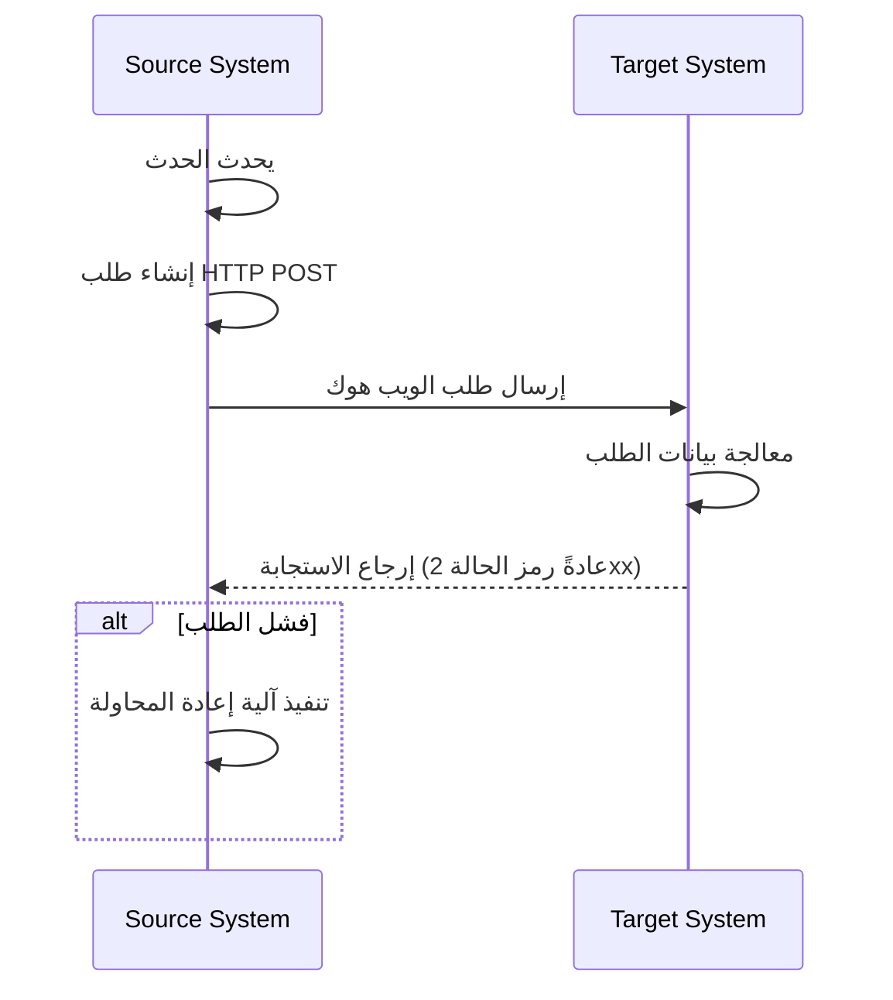
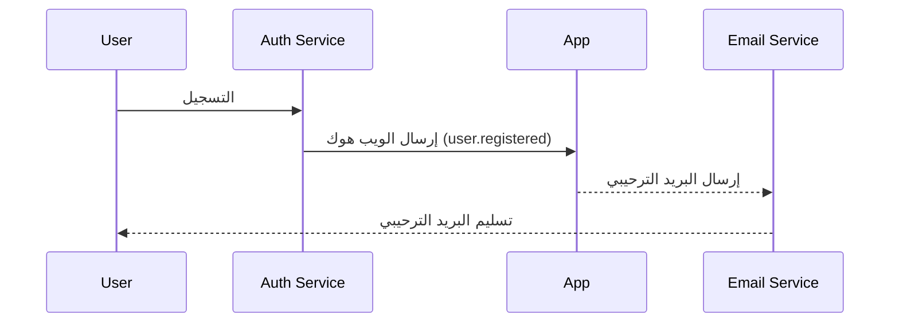

## ما هو الويب هوك (Webhook)؟

الويب هوك (Webhook) هو آلية استدعاء HTTP تتيح للتطبيقات إرسال إشعارات في الوقت الفعلي إلى عناوين URL محددة مسبقًا عند حدوث أحداث معينة. تُمكّن هذه الآلية من تبادل البيانات تلقائيًا والتواصل في الوقت الفعلي بين الأنظمة.

## كيف يعمل الويب هوك (Webhook)؟



1. يحدث حدث معين في نظام المصدر
2. يقوم نظام المصدر بإنشاء طلب HTTP POST يحتوي على بيانات الحدث
3. يرسل نظام المصدر الطلب إلى عنوان URL للنظام الهدف المُعد مسبقًا
4. يستقبل النظام الهدف الطلب ويعالج البيانات
5. يعيد النظام الهدف استجابة إلى نظام المصدر
6. إذا فشل الطلب، قد ينفذ نظام المصدر آلية إعادة المحاولة

## كيف يعمل الويب هوك (Webhook) في سيناريو واقعي؟

لنأخذ تطبيقًا متكاملًا مع خدمة auth كمثال. عندما يسجل مستخدم جديد، سيرسل التطبيق بريدًا ترحيبيًا إلى المستخدم.

عادةً ما توفر خدمة auth حدث ويب هوك `user.registered` يتم تفعيله عند إكمال مستخدم جديد للتسجيل.

يحتوي حمولة حدث الويب هوك على معلومات المستخدم مثل البريد الإلكتروني واسم المستخدم، والتي يمكن استخدامها لإرسال البريد الترحيبي:

```json
// ملاحظة: يعتمد هيكل الحمولة الفعلي على خدمة auth.
{
  "event": "user.registered",
  "timestamp": "2024-03-21T08:00:00Z",
  "data": {
    "user_id": "u_1234567890",
    "email": "john@example.com",    // عنوان البريد الإلكتروني لإرسال البريد الترحيبي
    "username": "johndoe",          // اسم المستخدم لتخصيص البريد
    "registered_at": "2024-03-21T08:00:00Z"
  }
}
```

إليك كيف يعمل تدفق الويب هوك:



## ما هي أفضل الممارسات لتنفيذ الويب هوك (Webhook)؟

عندما تكون المرسل (المنتج) للويب هوك، فكر في الجوانب التالية:

### تصميم الويب هوك

صمم هياكل ويب هوك واضحة ومتسقة:

- حدد أنواع الأحداث بوضوح: على سبيل المثال، `order.created`، `user.updated`، إلخ.
- استخدم تنسيق JSON القياسي: تأكد من أن هيكل البيانات واضح وسهل التحليل.
- التحكم في الإصدارات: قم بتضمين معلومات الإصدار في رؤوس الطلب أو الحمولة. على سبيل المثال:

  ```javascript
  // في رؤوس الطلب
  headers: {
    'Content-Type': 'application/json',
    'X-Webhook-Version': '1.0'
  }
  
  // أو في الحمولة
  {
    "version": "1.0",
    "event_type": "order.created",
    "data": {
      // تفاصيل الحدث
    }
  }
  ```

- توفير سياق كافٍ: قم بتضمين الطوابع الزمنية عند حدوث الأحداث، والمعرفات الفريدة للموارد ذات الصلة، إلخ.
- الحفاظ على التناسق: استخدم تسميات وهياكل بيانات متسقة عبر جميع أنواع الأحداث.

### آلية الإرسال

نفذ آلية إرسال ويب هوك موثوقة:

- استخدم قوائم انتظار المهام غير المتزامنة: تجنب حظر البرنامج الرئيسي وحسن استجابة النظام.
- نفذ آليات إعادة المحاولة: تعامل مع فشل الشبكة أو عدم توفر المستقبل مؤقتًا.

### استراتيجية إعادة المحاولة

صمم استراتيجية إعادة المحاولة المناسبة:

- نفذ التراجع الأسي: تجنب المحاولات المتكررة التي قد تجهد النظام والمستقبل.
- حدد عددًا أقصى من المحاولات: امنع المحاولات اللانهائية من استهلاك موارد النظام.
- توفير آليات إعادة المحاولة اليدوية: قدم واجهة لإعادة المحاولات يدويًا للويب هوك التي تفشل في النهاية.

### تنفيذ الأمان

نفذ آلية توقيع للسماح للمستقبلين بالتحقق من صحة الطلبات:

```javascript
const crypto = require('crypto');

function generateSignature(payload, secret) {
  return crypto.createHmac('sha256', secret)
    .update(JSON.stringify(payload))
    .digest('hex');
}

function sendWebhookWithSignature(url, payload, secret) {
  const signature = generateSignature(payload, secret);
  return axios.post(url, payload, {
    headers: { 'X-Webhook-Signature': signature }
  });
}
```

### تحسين الأداء

حسن أداء إرسال الويب هوك:

- استخدم مجموعات الاتصال: قلل من عبء إنشاء الاتصالات وحسن الأداء.
- نفذ معالجة الدفعات: أرسل الويب هوك في دفعات عند الاقتضاء لتقليل عدد التفاعلات الشبكية.

### أدوات التوثيق والاختبار

قدم الدعم لمستخدمي الويب هوك:

- وثائق API مفصلة: قم بتضمين جميع أنواع الأحداث الممكنة، وصيغ الطلبات، ووصف الحقول.
- توفير أدوات الاختبار: نفذ نقاط نهاية اختبار الويب هوك للسماح للمستخدمين بمحاكاة استقبال إشعارات الويب هوك.
- كود عينة: قدم أمثلة تكامل بلغات برمجة مختلفة.

## ما هي أفضل الممارسات لاستخدام الويب هوك (Webhook)؟

عند استخدام الويب هوك كمستقبل (مستهلك)، فكر في الجوانب التالية:

### الأمان

نظرًا لأن نقاط النهاية لاستقبال الويب هوك تكون عمومًا متاحة للجمهور، فإن الأمان هو الشاغل الرئيسي. انتبه إلى النقاط التالية:

- تحقق من صحة الطلب: نفذ آلية تحقق من التوقيع للتأكد من أن الطلبات تأتي من مرسلين متوقعين.
  
  ```javascript
  const crypto = require('crypto');

  function verifySignature(payload, signature, secret) {
    const expectedSignature = crypto
      .createHmac('sha256', secret)
      .update(JSON.stringify(payload))
      .digest('hex');
    
    return crypto.timingSafeEqual(
      Buffer.from(signature),
      Buffer.from(expectedSignature)
    );
  }
  ```

- استخدم HTTPS: تأكد من أن نقطة استقبال الويب هوك تستخدم HTTPS لمنع اعتراض البيانات أو العبث بها أثناء النقل.
- نفذ قائمة بيضاء لعناوين IP: اقبل فقط طلبات الويب هوك من عناوين IP موثوقة لتقليل خطر الهجمات.

### الموثوقية

لضمان معالجة موثوقة للويب هوك المستلم:

- نفذ معالجة متكررة: صمم نظامك للتعامل بشكل صحيح مع إشعارات الويب هوك المكررة، حيث قد يعيد المرسلون محاولة الطلبات الفاشلة.
- استجب بسرعة: أعد استجابة (عادةً رمز الحالة 2xx) فور تلقي طلب الويب هوك لمنع المرسل من اعتبار الطلب فاشلًا وتفعيل إعادة المحاولة.

### الأداء

حافظ على تشغيل النظام بكفاءة:

- معالجة غير متزامنة: بعد تلقي الويب هوك، قم بتنفيذ معالجة البيانات الفعلية في الخلفية دون حظر الاستجابة.
- حدد حدود المهلة: حدد فترات مهلة معقولة لمعالجة الويب هوك لمنع المهام الطويلة من التأثير على أداء النظام.

### معالجة الأخطاء

تعامل مع المواقف الخطأ المحتملة بشكل مناسب:

- تسجيل: احتفظ بسجلات مفصلة لطلبات الويب هوك المستلمة وإجراءات المعالجة لتسهيل التحقيق في المشاكل.
- التدهور السلس: امتلك آليات معالجة الأخطاء المناسبة عندما يتعذر معالجة الويب هوك لضمان عدم تأثر أجزاء أخرى من النظام.

### التوافق مع الإصدارات

نظرًا لأن صيغ الويب هوك قد تتغير مع مرور الوقت:

- تعامل مع معلومات الإصدار: كن مستعدًا للتعامل مع إصدارات مختلفة من صيغ الويب هوك. عادةً ما يتم توفير معلومات الإصدار في عنوان URL أو رؤوس الطلب.
- التوافق مع الإصدارات السابقة: عند تحديث منطق معالجة الويب هوك، تأكد من استمرار دعم الإصدارات القديمة من الصيغ.

### المراقبة

راقب باستمرار استقبال ومعالجة الويب هوك:

- إعداد التنبيهات: نفذ مراقبة وتنبيه في الوقت الفعلي للمواقف غير الطبيعية (مثل معدلات الفشل العالية أو حركة المرور غير العادية).
- مقاييس الأداء: تتبع مقاييس الأداء لمعالجة الويب هوك، مثل وقت الاستجابة ومعدل النجاح.

<Resources
  urls={[
    "https://docs.logto.io/docs/recipes/webhooks/",
    "https://docs.logto.io/docs/recipes/webhooks/securing-your-webhooks/",
    "https://en.wikipedia.org/wiki/Webhook"
  ]}
/>