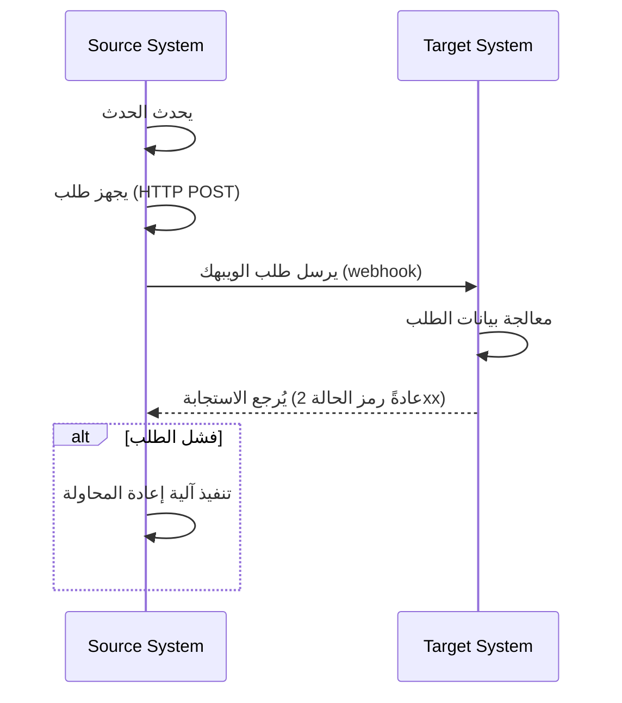
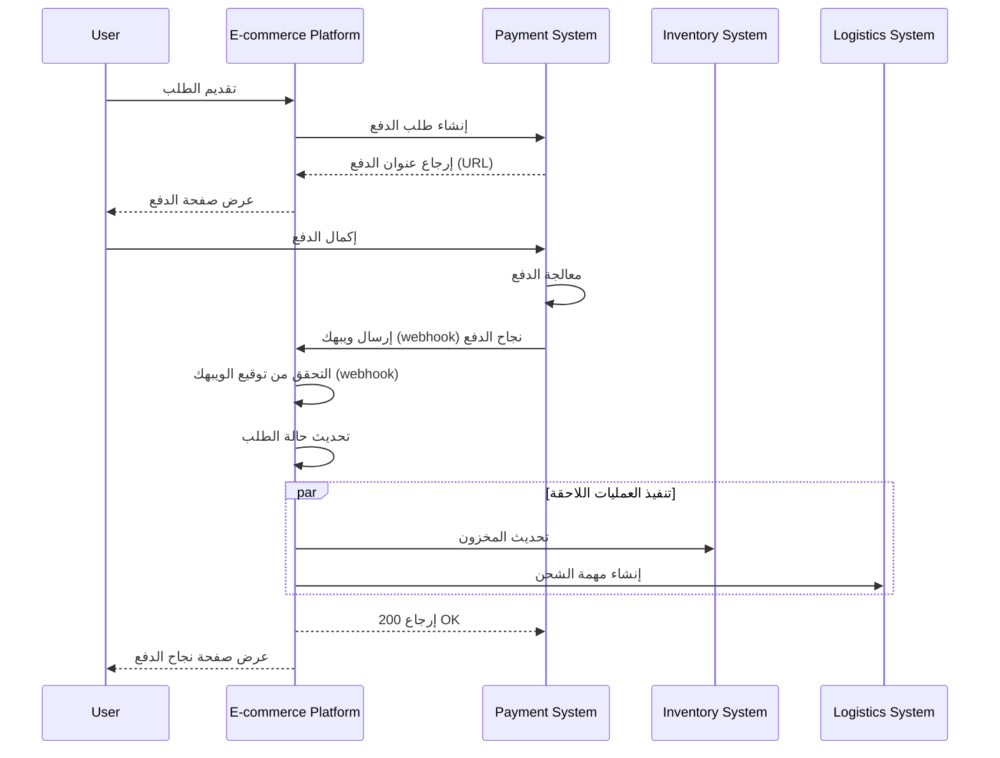

## ما هو الويبهك (Webhook)؟

الويبهك (Webhook) هو آلية استدعاء معاودة (HTTP) تتيح للتطبيقات إرسال إخطارات في الوقت الحقيقي إلى عناوين (URLs) محددة مسبقاً عند حدوث أحداث محددة. تُمَكِّن هذه الآلية تبادل البيانات الآلي والتواصل في الوقت الفعلي بين الأنظمة.

## كيف يعمل الويبهك (Webhook)؟



1. يحدث حدث محدد في نظام المصدر
2. يقوم نظام المصدر بإنشاء طلب (HTTP POST) يحتوي على بيانات الحدث
3. يرسل نظام المصدر الطلب إلى عنوان (URL) النظام الهدف الذي تم تكوينه مسبقاً
4. يستقبل النظام الهدف الطلب ويقوم بمعالجة البيانات
5. يقوم النظام الهدف بإرجاع استجابة إلى نظام المصدر
6. إذا فشل الطلب، يمكن أن ينفذ نظام المصدر آلية إعادة المحاولة

## ما هي الاستخدامات الشائعة للويبهك (Webhook)؟

1. أنظمة الدفع: إعلام بتغييرات حالة الطلب
2. أنظمة التحكم بالإصدار: إعلام بالالتزامات البرمجية، طلبات الدمج، وأحداث أخرى
3. أنظمة إدارة العلاقات مع العملاء (CRM): إعلام بتحديث معلومات العملاء
4. أجهزة إنترنت الأشياء (IoT): إعلام بتغييرات حالة الجهاز
5. منصات التواصل الاجتماعي: إعلام بالرسائل والتعليقات الجديدة

## كيف يعمل الويبهك (Webhook) في سيناريو واقعي؟

لنلقي نظرة على سيناريو يتضمن منصة للتجارة الإلكترونية تتكامل مع نظام دفع تابع لجهة خارجية:

### السيناريو

تستخدم منصة التجارة الإلكترونية نظام دفع تابع لجهة خارجية لمعالجة دفعات الطلبات. عندما يُكمل المستخدم الدفع، يحتاج نظام الدفع إلى إبلاغ منصة التجارة الإلكترونية في الوقت الحقيقي عن حالة الدفع عبر الويبهك (webhook)، مما يسمح للمنصة بتحديث حالة الطلب وبدء العمليات اللاحقة.

### تدفق تنفيذ الويبهك (Webhook)



1. إنشاء الطلب وطلب الدفع:
   - يُقدّم المستخدم طلبًا على منصة التجارة الإلكترونية.
   - تُرسل المنصة طلب دفع إلى نظام الدفع.
   - يُرجع نظام الدفع عنوان الدفع (URL)، الذي تعرضه المنصة للمستخدم.

2. دفع المستخدم:
   - يُكمل المستخدم الدفع على نظام الدفع.

3. تشغيل الويبهك (Webhook):
   - يكتشف نظام الدفع حدث "نجاح الدفع".
   - يُنشئ حمولة ويبهك (Webhook payload) تحتوي على تفاصيل الدفع.

4. إرسال الويبهك (Webhook):
   - يُرسل نظام الدفع طلب (POST) إلى عنوان (URL) منصة التجارة الإلكترونية الذي تم تكوينه مسبقاً.

5. معالجة المستلم:
   - تتلقى منصة التجارة الإلكترونية الويبهك (Webhook) وتتحقق أولاً من توقيع الطلب لضمان الأمان.
   - بعد التحقق، تُحدث المنصة حالة الطلب المعني إلى "مدفوع".
   - تُشغل المنصة العمليات اللاحقة، مثل تحديث المخزون وإنشاء مهام الشحن.

6. معالجة الاستجابة:
   - تُرجع منصة التجارة الإلكترونية على الفور استجابة 200 OK عند تلقي الويبهك (Webhook).
   - إذا حدثت أخطاء أثناء المعالجة، ستعيد المنصة المحاولة في الخلفية أو تضطلع بتدخل يدوي.

7. تجربة المستخدم:
   - تعرض منصة التجارة الإلكترونية صفحة نجاح الدفع للمستخدم.

يوضح هذا المثال كيف تُمَكِّن الويبهك (webhooks) التواصل في الوقت الفعلي بين نظام دفع تابع لجهة خارجية ومنصة التجارة الإلكترونية. من خلال الويبهك (webhooks)، يمكن لنظام الدفع إبلاغ المنصة على الفور عند اكتمال الدفع، مما يسمح بعمليات تحديث فورية لحالة الطلب وتفعيل سريع للعمليات التجارية اللاحقة. مما يحسن من استجابة النظام وكفاءته، مما يوفر بشكل نهائي تجربة تسوق أفضل للمستخدمين.

## ما هي أفضل الممارسات لتنفيذ الويبهك (Webhook)؟

عند كونك المرسل (المنتج) للويبهك (webhooks)، ينبغي مراعاة الجوانب التالية:

### تصميم الويبهك (Webhook)

صمم هياكل ويبهك واضحة ومتسقة:

- حدد أنواع أحداث واضحة: على سبيل المثال، `order.created`، `user.updated`، إلخ.
- استخدم تنسيق (JSON) القياسي: تأكد من أن هيكل البيانات واضح وسهل التحليل.
- تحكم في الإصدارات: قم بتضمين معلومات الإصدار في رؤوس الطلب أو الحمولة. على سبيل المثال:

  ```javascript
  // في رؤوس الطلب
  headers: {
    'Content-Type': 'application/json',
    'X-Webhook-Version': '1.0'
  }
  
  // أو في الحمولة
  {
    "version": "1.0",
    "event_type": "order.created",
    "data": {
      // تفاصيل الحدث
    }
  }
  ```

- قدم سياقاً كافياً: قم بتضمين الطوابع الزمنية لحدوث الأحداث، والمعرفات الفريدة للموارد ذات الصلة، إلخ.
- حافظ على التناسق: استخدم قواعد تسمية وهياكل بيانات متسقة عبر جميع أنواع الأحداث.

### آلية الإرسال

نفذ آلية موثوقة لإرسال الويبهك (webhook):

- استخدم قوائم الانتظار للمهام غير المتزامنة: تجنب حجب البرنامج الرئيسي وحسن من استجابة النظام.
- نفذ آليات إعادة المحاولة: تعامل مع فشل الشبكة أو عدم توفر المستلم بشكل مؤقت.

### استراتيجية الإعادة

صمم استراتيجية إعادة مناسبة:

- نفذ تراجع أسسياً (exponential backoff): تجنب المحاولات المتكررة التي يمكن أن تجهد النظام والمستلم.
- حدد حد أقصى لعدد المحاولات: امنع المحاولات اللانهائية من استهلاك موارد النظام.
- قدم آليات إعادة المحاولة اليدوية: قدم واجهة لإعادة المحاولات يدويًا للويبهك (webhooks) التي تفشل في النهاية.

### تنفيذ الأمان

نفذ آلية توقيع لتسمح للمستلمين بالتحقق من صحة الطلبات:

```javascript
const crypto = require('crypto');

function generateSignature(payload, secret) {
  return crypto.createHmac('sha256', secret)
    .update(JSON.stringify(payload))
    .digest('hex');
}

function sendWebhookWithSignature(url, payload, secret) {
  const signature = generateSignature(payload, secret);
  return axios.post(url, payload, {
    headers: { 'X-Webhook-Signature': signature }
  });
}
```

### تحسين الأداء

حسن من أداء إرسال الويبهك (webhook):

- استخدم تجمعات الاتصال: قلل من العبء الناتج عن إنشاء الاتصالات وحسن الأداء.
- نفذ المعالجة بالدُفعات: أرسل الويبهك (webhooks) في دُفعات عندما يكون مناسباً لتقليل عدد التفاعلات الشبكية.

### الأدوات الوثائقية والاختبارية

قدم الدعم لمستخدمي الويبهك (webhook):

- وثائق (API) مفصلة: قم بتضمين جميع أنواع الأحداث الممكنة، وصيغ الطلب، وأوصاف الحقول.
- قدم أدوات اختبارية: نفذ نقاط اختبار الويبهك (webhook) للسماح للمستخدمين بمحاكاة تلقي الإخطارات بالويبهك (webhook).
- كود عينة: قدم أمثلة للتكامل بلغات برمجة متنوعة.

## ما هي أفضل الممارسات لاستخدام الويبهك (Webhook)؟

عند استخدام الويبهك (webhook) كمستقبل (مستهلك)، ينبغي مراعاة الجوانب التالية:

### الأمان

نظراً لأن نقاط النهاية لاستقبال الويبهك (webhooks) متاحة عادةً بشكل عام، فإن الأمان يمثل مصدر قلق رئيسياً. انتبه إلى النقاط التالية:

- تحقق من صحة الطلب: نفذ آلية للتحقق من التوقيع لضمان أن الطلبات تأتي من مرسلين متوقعين.
  
  ```javascript
  const crypto = require('crypto');

  function verifySignature(payload, signature, secret) {
    const expectedSignature = crypto
      .createHmac('sha256', secret)
      .update(JSON.stringify(payload))
      .digest('hex');
    
    return crypto.timingSafeEqual(
      Buffer.from(signature),
      Buffer.from(expectedSignature)
    );
  }
  ```

- استخدم (HTTPS): تأكد من أن نقطة استقبال الويبهك (webhook) تستخدم (HTTPS) لمنع اعتراض أو تغيير البيانات أثناء النقل.
- نفذ القائمة البيضاء لعناوين (IP): اقبل فقط الطلبات بالويبهك (webhook) من عناوين (IP) موثوقة لتقليل خطر الهجمات.

### الموثوقية

لضمان معالجة موثوقة للويبهك (webhooks) المستلمة:

- نفذ معالجة تبادلية للنسخ المكررة: صمم نظامك لمعالجة الإشعارات بالويبهك بصورة صحيحة، إذ قد يعيد المرسل المحاولات عند فشل الطلبات.
- رد بسرعة: ارجع استجابةً (عادةً رمز 2xx) فور تلقي طلب الويبهك (webhook) لمنع اعتبار المرسل أن الطلب قد فشل وبدء إعادة المحاولة.

### الأداء

حافظ على عملية نظام فعالة:

- المعالجة غير المتزامنة: بعد تلقي الويبهك (webhook)، نفذ معالجة البيانات الفعلية في الخلفية دون حجب الاستجابة.
- حدد حدود الوقت المستغرق: حدد فترات زمنية معقولة لمعالجة الويبهك (webhook) لمنع المهام الطويلة من التأثير على أداء النظام.

### معالجة الأخطاء

تعامل بشكل مناسب مع المواقف المحتملة للأخطاء:

- السجلات: احتفظ بسجلات تفصيلية لطلبات الويبهك (webhook) المستلمة وإجراءات المعالجة لتسهيل التحقيق في المشاكل.
- التدهور السيء: اتخذ آليات مناسبة للتعامل مع الأخطاء عندما لا يتمكن من معالجة الويبهك (webhooks) لضمان عدم تأثر أجزاء أخرى من النظام.

### توافق الإصدار

حيث قد تتغير صيغ الويبهك (webhook) مع مرور الوقت:

- تعامل مع معلومات الإصدار: كن مستعدًا للتعامل مع إصدارات مختلفة لصيغ الويبهك (webhook). يتم عادةً توفير معلومات الإصدار في عنوان (URL) أو رؤوس الطلب.
- التوافق العكسي: عند تحديث منطق معالجة الويبهك (webhook)، تأكد من استمرار الدعم للإصدارات القديمة من الصيغ.

### المراقبة

راقب باستمرار استقبال ومعالجة الويبهك (webhooks):

- قم بإعداد التنبيهات: نفذ مراقبة وتحذير في الوقت الحقيقي للحالات غير الطبيعية (مثل ارتفاع معدلات الفشل أو حركة مرور غير عادية).
- مقاييس الأداء: تتبع مقاييس الأداء لمعالجة الويبهك (webhook)، مثل زمن الاستجابة ومعدل النجاح.

<Resources
  urls={[
    "https://docs.logto.io/docs/recipes/webhooks/",
    "https://docs.logto.io/docs/recipes/webhooks/securing-your-webhooks/",
    "https://en.wikipedia.org/wiki/Webhook"
  ]}
/>