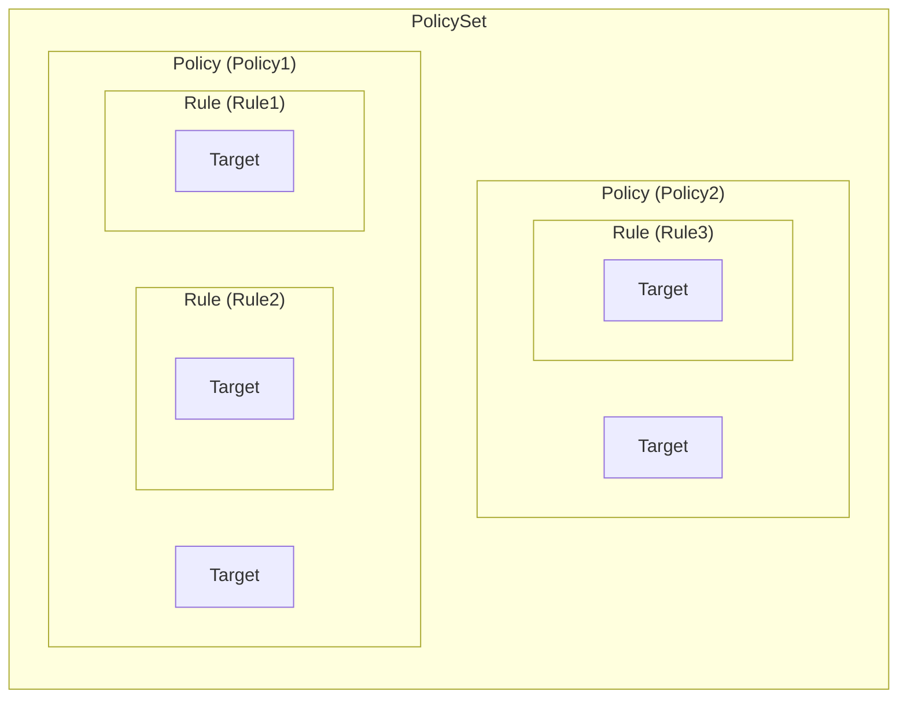
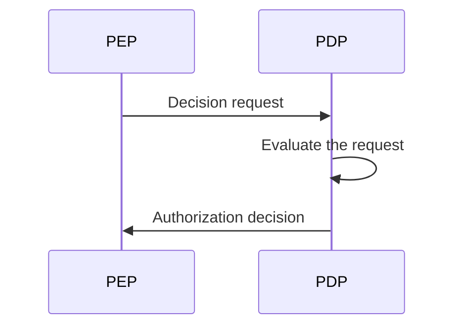
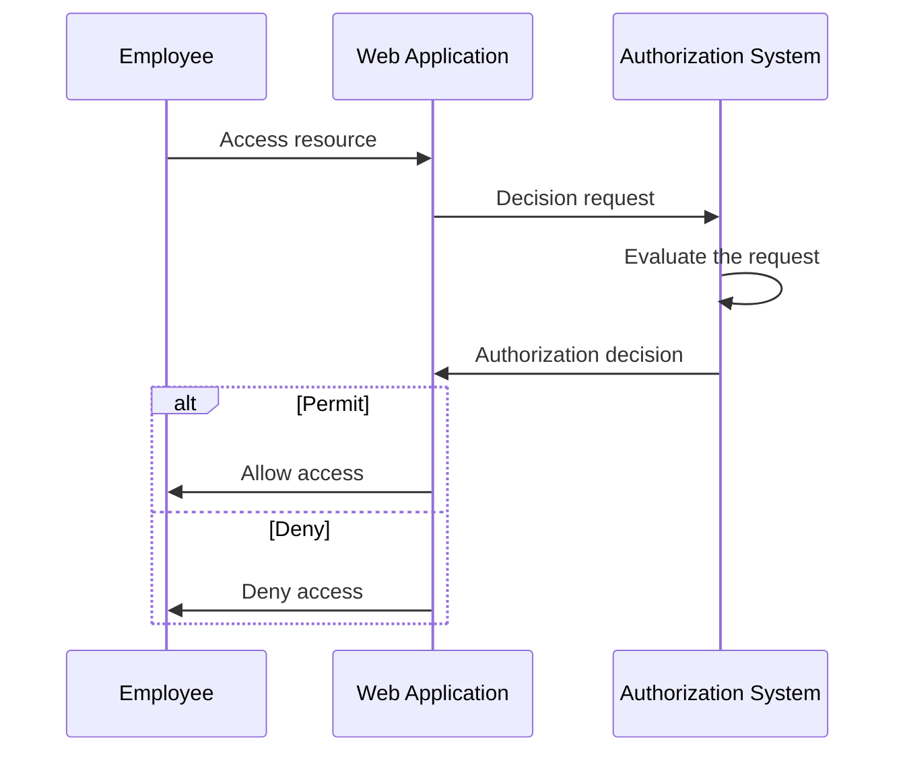
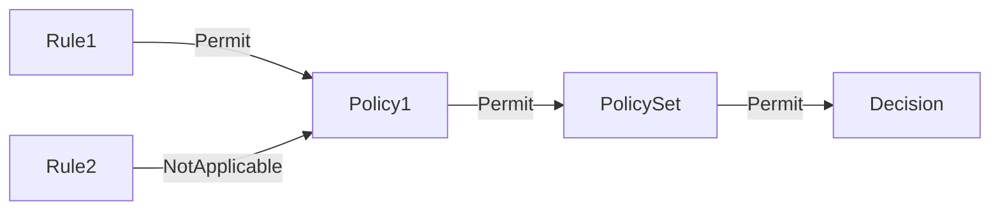
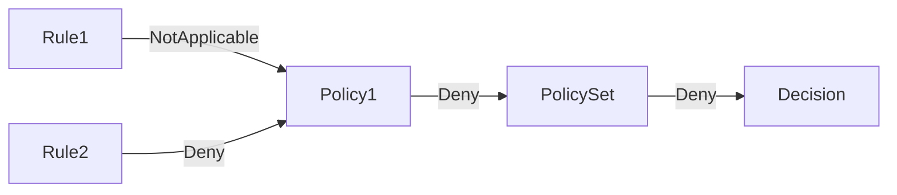
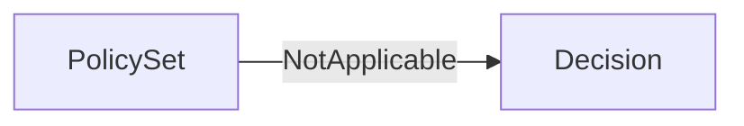

## ما هي XACML؟

كما يوحي الاسم، لغة الترميز القابلة للتمديد للتحكم في الوصول (XACML) هي لغة تعتمد على XML تُستخدم بشكل رئيسي في التحكم في الوصول. وهي معيار محدد من قبل منظمة تطوير معايير المعلومات المهيكلة (OASIS).

[XACML 3.0](https://docs.oasis-open.org/xacml/3.0/xacml-3.0-core-spec-os-en.html) هي أحدث إصدار من المعيار، والذي تم إصداره في عام 2013. بينما لا تحدد نموذجًا محددًا للتحكم في الوصول، غالبًا ما تُستخدم XACML لتنفيذ سياسات <Ref slug="abac" />. دعنا نرى مثالًا بسيطًا عن كيفية استخدام XACML لتمثيل سياسات ABAC:

```xml
<PolicySet PolicySetId="ABAC_Policies" PolicyCombiningAlgId="urn:oasis:names:tc:xacml:3.0:policy-combining-algorithm:deny-overrides">
  <Description>ABAC Policies</Description>
  <Policy PolicyId="Policy1" RuleCombiningAlgId="urn:oasis:names:tc:xacml:3.0:rule-combining-algorithm:deny-overrides">
    <Description>Employees can read data</Description>
    <Target>
      <AnyOf>
        <AllOf>
          <Match MatchId="urn:oasis:names:tc:xacml:1.0:function:string-equal">
            <AttributeValue DataType="http://www.w3.org/2001/XMLSchema#string">read</AttributeValue>
            <AttributeDesignator
              AttributeId="urn:oasis:names:tc:xacml:1.0:action:action-id"
              Category="urn:oasis:names:tc:xacml:3.0:attribute-category:action"
              DataType="http://www.w3.org/2001/XMLSchema#string"
              MustBePresent="true"
            />
          </Match>
        </AllOf>
      </AnyOf>
    </Target>
    <Rule RuleId="Rule1" Effect="Permit">
      <Target>
        <AnyOf>
          <AllOf>
            <Match MatchId="urn:oasis:names:tc:xacml:1.0:function:string-equal">
              <AttributeValue DataType="http://www.w3.org/2001/XMLSchema#string">employee</AttributeValue>
              <AttributeDesignator
                AttributeId="urn:oasis:names:tc:xacml:1.0:subject:subject-id"
                Category="urn:oasis:names:tc:xacml:1.0:subject-category:access-subject"
                DataType="http://www.w3.org/2001/XMLSchema#string"
                MustBePresent="true"
              />
            </Match>
          </AllOf>
        </AnyOf>
      </Target>
    </Rule>
    <Rule RuleId="Rule2" Effect="Deny">
      <Target>
        <AnyOf>
          <AllOf>
            <Match MatchId="urn:oasis:names:tc:xacml:1.0:function:string-equal">
              <AttributeValue DataType="http://www.w3.org/2001/XMLSchema#string">user</AttributeValue>
              <AttributeDesignator
                AttributeId="urn:oasis:names:tc:xacml:1.0:subject:subject-id"
                Category="urn:oasis:names:tc:xacml:1.0:subject-category:access-subject"
                DataType="http://www.w3.org/2001/XMLSchema#string"
                MustBePresent="true"
              />
            </Match>
          </AllOf>
        </AnyOf>
      </Target>
    </Rule>
  </Policy>
  <!-- ...other policies... -->
</PolicySet>
```

تقوم XACML بعمل جيد في تسمية الأقسام بطريقة تشرح نفسها بنفسها. تم تصميم اللغة لتكون قابلة للقراءة بواسطة الإنسان وسهلة الفهم.

باختصار، تنص هذه السياسة على أن الموظفين مسموح لهم بقراءة البيانات، في حين يتم رفض القراء للبيانات للمستخدمين. دعونا نقسم السياسة من خلال تحليل المكونات الرئيسية:

- `<PolicySet>`: هو العنصر الجذري لمجموعة السياسات. يمكن لـ `PolicySet` أن تحتوي على عناصر `Policy` و `PolicySet` متعددة، لتكوين تسلسل هرمي للسياسات.
- `<Policy>`: هي السياسة التي تحتوي على واحدة أو أكثر من القواعد. يمكن لكل سياسة أن تحتوي على:
  - عنصر `Target` الذي يحدد الشروط التي تنطبق تحتها السياسة.
  - عناصر `Rule` متعددة التي تحدد قواعد التحكم في الوصول.
  - السمة `RuleCombiningAlgId` التي تحدد كيفية دمج القواعد لاتخاذ قرار.
- `<Rule>`: هي القاعدة التي تحدد الشروط التي يتم تحتها السماح بالوصول أو منع الوصول. كل قاعدة تحتوي على:
  - عنصر `Target` الذي يحدد الشروط التي تنطبق تحتها القاعدة.
  - السمة `Effect` التي تحدد ما إذا كانت القاعدة تسمح أو تمنع الوصول.

> [!Note]
> العناصر والسمات المتوفرة في XACML لا تقتصر على تلك التي ذكرناها للتو. تحقق من [مواصفات XACML 3.0](https://docs.oasis-open.org/xacml/3.0/xacml-3.0-core-spec-os-en.html) للحصول على قائمة كاملة بالعناصر والسمات.

يظهر أدناه تمثيل بياني للعلاقة بين المكونات الرئيسية المختلفة:



سيتم تقديم شرح مفصل للعناصر والسمات الأخرى في المثال في الأقسام القادمة.

## كيف تعمل XACML

للتبسيط، لنفترض أنه توجد سياسة واحدة فقط معرفة في مجموعة السياسات أعلاه. لتفعيل عملية تقييم السياسة، يجب إرسال **طلب القرار** من **نقطة تنفيذ السياسة (PEP)** إلى **نقطة اتخاذ القرار بالسياسة (PDP)**. يقوم الـ PDP بتقييم الطلب مقابل السياسة ويُرجع **قرار التصريح** إلى الـ PEP.



- PEP: هو الجزء الذي يرسل طلب القرار إلى الـ PDP وينفذ قرار التصريح (أي القيام بـ <Ref slug="access-control" />).
- PDP: هو الجزء الذي يُقيّم طلب القرار مقابل السياسة ويُرجع قرار التصريح.

دعونا نستخدم مثالاً من العالم الواقعي ليحل محل اللغة الشكسبيرية. افترض أن هناك تطبيق ويب يسمح للموظفين بالوصول إلى موارد معينة، وأن التطبيق مدمج مع نظام تصريح يعتمد على XACML.

عندما يحاول موظف الوصول إلى مورد ما، يقوم تطبيق الويب (**PEP**) بإرسال **طلب القرار** إلى نظام التصريح (**PDP**). بمجرد أن يقوم نظام التصريح بتقييم الطلب مقابل سياسة XACML، فإنه يُرجع **قرار التصريح** إلى تطبيق الويب.



## طلب القرار

يتكون طلب القرار في XACML من المكونات الرئيسية التالية:

- **Subject**: الكيان الذي يطلب الوصول إلى مورد. يمكن أن يكون مستخدمًا، جهازًا، أو أي كيان آخر.
- **Resource**: المورد الذي يتم الوصول إليه. يمكن أن يكون ملفًا، قاعدة بيانات، نقطة نهاية API، أو أي مورد آخر.
- **Action**: الإجراء الذي يتم تنفيذه على المورد. يمكن أن يكون قراءة، كتابة، حذف، أو أي إجراء آخر.
- **Environment**: السياق الذي يتم فيه تقديم طلب الوصول. يمكن أن يشمل معلومات مثل وقت اليوم، الموقع، أو أي معلومات سياقية أخرى.

إليك مثال على طلب القرار في XACML:

```xml
<Request>
  <Attributes Category="urn:oasis:names:tc:xacml:3.0:attribute-category:resource">
    <Attribute AttributeId="urn:oasis:names:tc:xacml:1.0:resource:resource-id" DataType="http://www.w3.org/2001/XMLSchema#string">
      <AttributeValue>http://example.com/data</AttributeValue>
    </Attribute>
  </Attributes>
  <Attributes Category="urn:oasis:names:tc:xacml:3.0:attribute-category:action">
    <Attribute AttributeId="urn:oasis:names:tc:xacml:1.0:action:action-id" DataType="http://www.w3.org/2001/XMLSchema#string">
      <AttributeValue>read</AttributeValue>
    </Attribute>
  </Attributes>
  <Attributes Category="urn:oasis:names:tc:xacml:3.0:attribute-category:subject">
    <Attribute AttributeId="urn:oasis:names:tc:xacml:1.0:subject:subject-id" DataType="http://www.w3.org/2001/XMLSchema#string">
      <AttributeValue>employee</AttributeValue>
    </Attribute>
  </Attributes>
</Request>
```

## عملية التقييم

بمجرد أن يسترجع الـ PDP مجموعة السياسات، فإنه يقيّم طلب القرار على النحو التالي:

1. **مطابقة الأهداف**: لكل سياسة، يتحقق الـ PDP مما إذا كان الطلب يتطابق مع هدف السياسة. إذا كان الطلب يتطابق مع الهدف، يتقدم الـ PDP لتقييم القواعد.
2. **تقييم القواعد**: يقيم الـ PDP كل قاعدة في السياسة. إذا كان هدف القاعدة يتطابق مع الطلب، يقيم الـ PDP شرط القاعدة. إذا كان الشرط يقيم إلى `true`، يُرجع الـ PDP تأثير القاعدة (السماح أو الرفض). إذا كان الشرط يقيم إلى `false`، يستمر الـ PDP في تقييم القاعدة التالية.
3. **دمج القواعد**: يجمع الـ PDP تأثيرات جميع القواعد في السياسة بناءً على سمة `RuleCombiningAlgId` الخاصة بالسياسة. يُرجع التأثير المجمّع كقرار السياسة.
4. **دمج السياسات**: إذا كانت مجموعة السياسات تحتوي على سياسات متعددة، يجمع الـ PDP قرارات جميع السياسات بناءً على سمة `PolicyCombiningAlgId` الخاصة بمجموعة السياسات. يُرجع القرار المجمّع كقرار التصريح النهائي.

### مثال 1

على سبيل المثال، في مجموعة السياسات المعطاة، دعنا نفترض أن طلب القرار يكون كما هو أعلاه. سيقيم الـ PDP الطلب مقابل سياسة `Policy1` كما يلي:

#### مطابقة الأهداف

يحدد هدف السياسة أن أي موضوع لديه معرف إجراء `read` يجب أن يُقيّم بالسياسة. نظرًا لأن الإجراء في الطلب هو `read`، فإن الطلب يتطابق مع هدف السياسة.

#### تقييم القواعد

تحتوي السياسة على قاعدتين:

1. `Rule1`: نظرًا لأن معرف موضوع الطلب هو `employee`، يقيم شرط القاعدة إلى `true`، وتأثير القاعدة هو `Permit`.
2. `Rule2`: نظرًا لأن معرف موضوع الطلب ليس `user`، يقيم شرط القاعدة إلى `false`، وتأثير القاعدة هو `NotApplicable`.

#### دمج القواعد والسياسات

- بما أن `Policy1` يستخدم خوارزمية دمج القواعد `deny-overrides`، فإن قرار السياسة هو `Permit` لأن `Rule1` يسمح بالوصول وتأثيره يتجاوز تأثير `NotApplicable` لـ `Rule2`.
- تستخدم مجموعة السياسات أيضًا خوارزمية دمج السياسات `deny-overrides`، والقرار النهائي هو `Permit` لأن قرار السياسة هو `Permit`.

إليك تمثيلًا بيانيًا غير معياري لعملية التقييم:



### مثال 2

الآن، لنأخذ في الاعتبار طلب قرار مختلف حيث أن جميع السمات الأخرى هي نفسها، ولكن معرف الموضوع هو `user` بدلاً من `employee`.

#### مطابقة الأهداف

نظرًا لأن الإجراء لم يتغير، فإن الطلب لا يزال يتطابق مع هدف السياسة.

#### تقييم القواعد

- `Rule1`: معرف موضوع الطلب ليس `employee`، لذا يقيم شرط القاعدة إلى `false`، وتأثير القاعدة هو `NotApplicable`.
- `Rule2`: معرف موضوع الطلب هو `user`، لذا يقيم شرط القاعدة إلى `true`، وتأثير القاعدة هو `Deny`.

#### دمج القواعد والسياسات

- قرار السياسة هو `Deny` لأن `Rule2` يرفض الوصول وتأثيره يتجاوز تأثير `NotApplicable` لـ `Rule1`.
- القرار النهائي هو `Deny` لأن خوارزمية دمج السياسات `deny-overrides` لمجموعة السياسات تُرجع القرار الأكثر تقييدًا.

إليك تمثيلًا بيانيًا غير معياري لعملية التقييم:



### مثال 3

أخيرًا، لنأخذ في الاعتبار طلب قرار حيث الإجراء هو `write` بدلاً من `read`. جميع السمات الأخرى تظل كما هي في المثال 1.

#### مطابقة الأهداف

لم يعد الطلب يتطابق مع هدف السياسة لأن الإجراء هو `write` وليس `read`. ولذا، لم تُقيم السياسة.

#### دمج القواعد والسياسات

نظرًا لأن السياسة لم تُقيّم، فإن القرار النهائي هو `NotApplicable`.

إليك تمثيلًا بيانيًا غير معياري لعملية التقييم:



## خوارزميات الدمج

تعرف XACML عدة خوارزميات دمج قياسية تحدد كيف يتم دمج تأثيرات قواعد أو سياسات متعددة لاتخاذ قرار. في الأمثلة أعلاه، ذكرنا خوارزمية `deny-overrides` لكل من القواعد والسياسات.

كما يوحي الاسم، تُعطي خوارزمية `deny-overrides` الأولوية لقرارات `Deny` على قرارات `Permit`. إليك شرح مبسط لكيفية عمل خوارزمية `deny-overrides`:

- إذا كانت أي قاعدة أو سياسة ترفض الوصول، يكون القرار النهائي `Deny`.
- إذا لم تُرفَض الوصول من قبل أي قاعدة أو سياسة، وتم السماح بالوصول من قبل قاعدة أو سياسة واحدة على الأقل، يكون القرار النهائي `Permit`.
- إذا لم تُرفَض الوصول من قبل أي قاعدة أو سياسة، ولم يُسمَح الوصول بواسطة أي قاعدة أو سياسة، فإن القرار النهائي هو `NotApplicable`.

الخوارزمية الفعلية أكثر تعقيدًا وتأخذ بعين الاعتبار قرارات "غير محددة" أخرى مثل `Indeterminate{D}` و `Indeterminate{P}`.

> [!Note]
> لا توفر هذه الخوارزمية قرار "استرداد" في حالة عدم تطابق أي قاعدة أو سياسة مع الطلب. في مثل هذه الحالات، يكون القرار `NotApplicable`.

للحصول على قائمة كاملة بخوارزميات الدمج وسلوكها، راجع [مواصفات XACML 3.0](https://docs.oasis-open.org/xacml/3.0/xacml-3.0-core-spec-os-en.html#_Toc325047268).

## اعتبارات التنفيذ

XACML هي لغة قوية للتعبير عن سياسات التحكم في الوصول القائمة على السمات. قبل تنفيذ XACML في نظامك، ضع في اعتبارك النقاط التالية:

- تصميم التحكم في الوصول: XACML مرنة ومعبرة، لكنها تتطلب تصميمًا دقيقًا لأنها قد تتضمن مجموعات سياسات معقدة قد تؤدي إلى عواقب غير مقصودة.
- التعقيد: غالبًا ما تكون سياسات XACML معقدة ويمكن أن تكون إدارة التكوينات الشاملة تحديًا. بالنسبة لمعظم التطبيقات، قد تكون نماذج التحكم في الوصول الأبسط مثل <Ref slug="rbac" /> أكثر ملاءمة.
- الأداء: يمكن أن يكون تقييم سياسات XACML مكلفًا من الناحية الحسابية، خاصة عند التعامل مع مجموعات سياسات كبيرة. ضع في اعتبارك الآثار المحتملة للأداء عند استخدام XACML في نظامك.

<SeeAlso slugs={['abac', 'rbac', 'access-control', 'authorization']} />

<Resources
  urls={[
    'https://docs.oasis-open.org/xacml/3.0/xacml-3.0-core-spec-os-en.html',
  ]}
/>