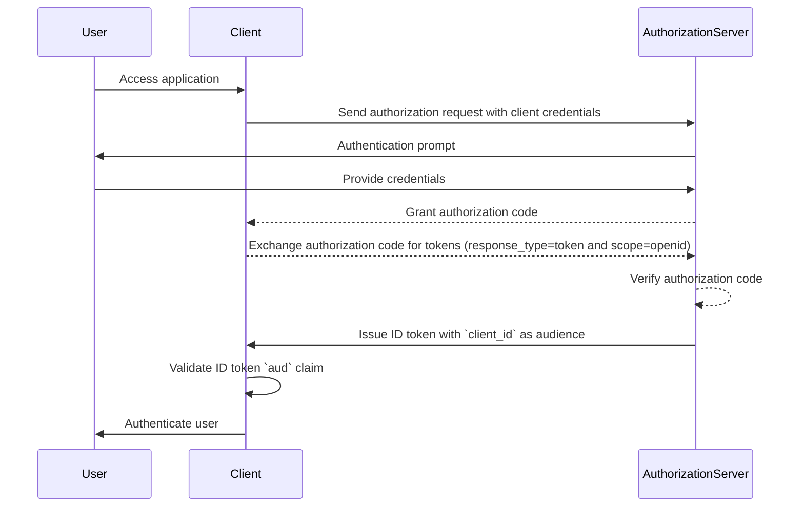
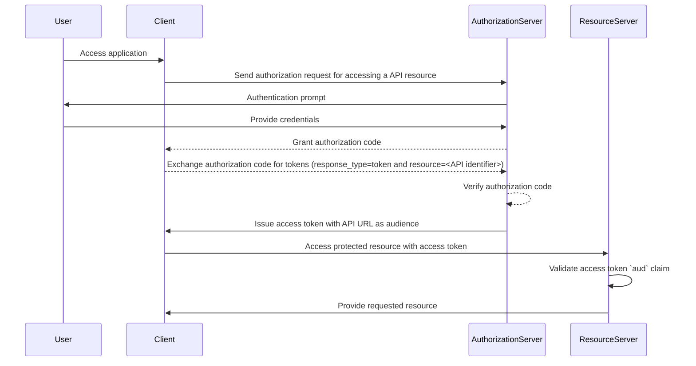

## What is audience?

In the context of authentication and authorization, audience is a key component that defines the intended recipients of an authorization token. Referred to as the [aud](https://datatracker.ietf.org/doc/html/rfc7519#section-4.1.3) claim in <Ref slug="jwt" />, this claim ensures that the token is only accepted by the designated service or application. Typically, the audience claim contains either the client_id of the application the token is meant for or a URL representing the API or resource the token is authorized to access. By specifying the audience, it serves as a security control to prevent misuse by unauthorized services or users.

## How does audience work?

When a client requests an access token from an authorization server, the audience claim is included in the token response. This audience value is then validated by the resource server when the token is presented. The resource server checks if the audience claim in the token matches its own identifier or the identifier of the service it is protecting. If it doesn’t, the token will be rejected, enhancing security in distributed systems, particularly in scenarios involving multiple microservices or APIs. By controlling the audience claim, developers can ensure that tokens are used in the right context, adding an additional layer of protection to their application’s authentication and authorization workflows.

- **Requester**: The client application specifies the audience value when requesting an token.
- **Issuer**: The authorization server includes the audience claim in the token response.
- **Verifier**: The recipient of the token checks the audience claim against its own identifier. If the audience claim matches the recipient's identifier, the token is considered valid. Otherwise, it is rejected.

## Example of audience in JWT

### Audience claim in a OpenID Connect (OIDC) ID token

```json
{
  "header": {
    "alg": "RS256",
    "typ": "JWT",
    "kid": "abc123"
  },
  "payload": {
    "iss": "https://auth.logto.io",
    "sub": "test_user",
    "aud": "client_id_foo",
    "exp": 1516239022,
    "iat": 1516239022,
    "nonce": "n-0S6_WzA2Mj",
    "primary_email": "foo@logto.io",
    "email_verified": true,
    "username": "foo"
  },
  "signature": "..."
}
```

An <Ref slug="id-token" /> in OpenID Connect (OIDC) is a security token that contains information about the authenticated user, delivered to the client application after a successful authentication. Unlike access tokens, which are used to grant permission to access resources, ID tokens are specifically designed to convey user identity information to the relying party (client). These tokens are typically encoded as JWTs (JSON Web Tokens) and include claims such as the user's identifier (sub claim), the issuer (iss claim), and the audience (aud claim) among others.

In this case, the `aud` claim specifies the intended audience for the ID token, which is the client application. The value of the `aud` claim usually corresponds to the `client_id` of the application that requested the token. When the client application receives the ID token, it can verify the audience claim to ensure that the token was issued for its consumption. This validation step helps prevent token misuse and unauthorized access to user information, enhancing the security of the authentication process.



### Audience claim in an access token

```json
{
  "header": {
    "alg": "RS256",
    "typ": "JWT",
    "kid": "abc123"
  },
  "payload": {
    "iss": "https://auth.logto.io",
    "sub": "test_user",
    "aud": "https://example.logto.app/api/users",
    "exp": 1516239022,
    "iat": 1516239022,
    "scope": "read write",
    "client_id": "client_id_foo"
  },
  "signature": "..."
}
```

Unlike ID tokens, access tokens are used to authorize access to protected resources, such as APIs or services. The `aud` claim in an access token specifies the intended recipient of the token, which is typically the API or service that the token is authorized to access. Typically, the resource server that hosts the API has a different domain from the client application that requested the token. In this case, instead of a `client_id`, the `aud` claim contains the URL of the API endpoint that the token is intended for. This URL often known as the resource indicator or API identifier that uniquely identifies the target resource.

When the resource server receives an access token, it validates the `aud` claim to ensure that the token is intended for its consumption. By checking the audience, the resource server can prevent unauthorized access to its resources and enforce access control policies based on the token's intended audience. This mechanism helps protect sensitive data and ensures that access tokens are used in the appropriate context, enhancing the security of the overall system.



## FAQs

### Why is the audience claim important in token validation?

The audience claim is crucial in token validation because it ensures that the token is only accepted by the intended recipient. By verifying the audience claim, the recipient can prevent token misuse and unauthorized access to resources. This security control is particularly important in distributed systems where multiple services interact with each other, as it helps enforce access control policies and protect sensitive data.

### Can a token have multiple audiences?

For security reasons, it is recommended that a token has a single audience to prevent ambiguity and ensure that the token is used in the right context. However, some scenarios may require tokens with multiple audiences, such as when a token is intended for multiple services or APIs within the same domain. In such cases, developers should carefully consider the implications of using multi-audience tokens and implement appropriate security measures to mitigate potential risks.

### What should I use as my API identifier in the audience claim?

When specifying the audience claim in an access token that represents an API or service, it is recommended to use a absolute URI that uniquely identifies the resource. This URI can be the base URL of the API endpoint or a specific resource path that the token is authorized to access. By using a URI as the API identifier, you can ensure that the audience claim is unambiguous and accurately represents the intended recipient of the token.
