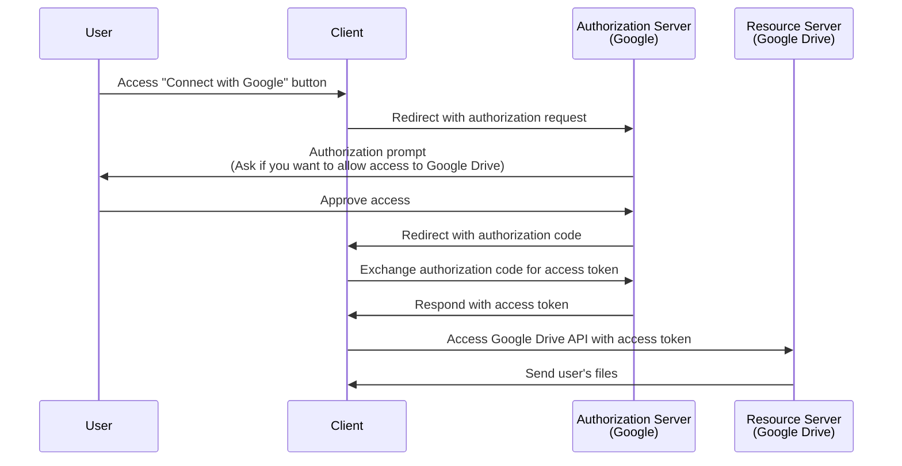

## What is an authorization request?

Depending on the context, the term "authorization request" can refer to different things. In this article, we will focus on the definition in the <Ref slug="oauth-2.0" /> specification.

In OAuth 2.0, there are several grant types (flows) that define how a <Ref slug="client" /> can obtain authorization from a user to access protected resources.

> ![Note]
> "Authorization requests" are often confused with "authentication requests" in the context of <Ref slug="openid-connect" />. See <Ref slug="authentication-request" /> for OIDC-specific details.

## How does an authorization request work?

When a client (application) wants to access protected resources on behalf of a user, it initiates an authorization request to the <Ref slug="authorization-server" />. The client should indicate the requested grant type along with necessary parameters in the request.

Here are some typical grant types (flows) for end-user authorization in OAuth 2.0:

- <Ref slug="authorization-code-flow" />: The most recommended flow for authorization end-users. It is usually used with <Ref slug="pkce" /> for better security and is suitable for most applications.
- <Ref slug="implicit-flow" />: A simplified flow that is deprecated in <Ref slug="oauth-2.1" /> due to security concerns.
- [Resource owner password credentials (ROPC) grant](https://datatracker.ietf.org/doc/html/rfc6749#section-4.3): A grant (flow) where the user's credentials are exchanged directly for an access token. This flow is not recommended due to security risks.

There are also other extensions, such as the <Ref slug="device-flow" /> for devices with limited input capabilities. Each flow has its own characteristics and use cases. For most web applications, the authorization code flow is the recommended choice.

> <Ref slug="machine-to-machine" /> authorization is typically done using the <Ref slug="client-credentials-flow" /> which doesn't involve user interaction.

For example, a client (application) may request authorization to access a user's Google Drive files. Here's a simplified sequence diagram of the authorization code flow:

Once the <Ref slug="access-token" /> is obtained, the client can use it to access the user's Google Drive files on behalf of the user.

### Key parameters in an authorization request

The OAuth 2.0 authorization request typically includes the following parameters:

- **`response_type`**: The type of response the client expects. Common values are `code` for the authorization code flow and `token` for the implicit flow.
- **`client_id`**: The client identifier issued by the authorization server.
- **`redirect_uri`**: The URI where the authorization server sends the user after the authorization process.
- **`scope`**: The requested <Ref slug="scope">scopes</Ref> (permissions) for the access token.
- **`resource`**: The optional parameter that specifies the <Ref slug="resource-indicator" /> for the requested resources. The authorization server needs to support [RFC 8707](https://datatracker.ietf.org/doc/html/rfc8707) to use this parameter.

The above parameters are non-exhaustive. The actual parameters and their values depend on the grant type and the specific requirements of the application.

<SeeAlso slugs={["oauth-2.0", "authentication-request", "authorization-code-flow", "implicit-flow", "device-flow"]} />

<Resources
  urls={[
    { url: "https://datatracker.ietf.org/doc/html/rfc6749#section-4", result: {
      ogTitle: "Obtaining Authorization in OAuth 2.0",
      ogDescription: " To request an access token, the client obtains authorization from the resource owner."
    } }
  ]}
/>
