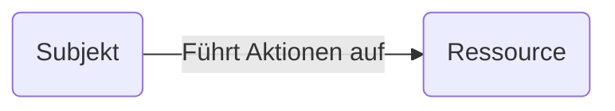
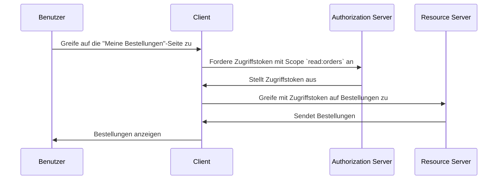

## Was ist Zugriffskontrolle (Access control)?

Zugriffskontrolle (Access control) umfasst drei Hauptkomponenten:

- **Subjekt**: Eine Entität, die Aktionen auf Ressourcen ausführt. Subjekte können Benutzer, Dienste oder Geräte sein.
- **Ressource**: Eine Entität, die durch Zugriffskontrolle geschützt ist. Ressourcen können Dateien, Datenbanken, APIs oder andere digitale Vermögenswerte sein.
- **Aktion**: Ein Vorgang, den ein Subjekt auf einer Ressource ausführen kann. Aktionen können Lesen, Schreiben, Ausführen oder andere Operationen sein.

> Zugriffskontrolle (Access control) definiert die selektive Beschränkung des Zugriffs auf **Ressourcen** basierend auf dem **Subjekt** und der **Aktion**.

Hier sind einige realweltliche Beispiele für Zugriffskontrolle (Access control):

- Ein Benutzer (Subjekt) **kann** seine Bestellungen (Ressource) in einem E-Commerce-System lesen (Aktion).
- Ein Benutzer (Subjekt) **kann nicht** das Profil eines anderen Benutzers (Ressource) in einem sozialen Netzwerk löschen (Aktion).
- Ein Dienst (Subjekt) **kann** Daten in eine Datenbank (Ressource) in einer Microservices-Architektur schreiben (Aktion).

Manchmal wird die Ressource in technischen Implementierungen ignoriert und Zugriffskontrolle wird definiert als die Beschränkung, wer (Subjekt) welche Aktionen ausführen kann. Zum Beispiel spezifiziert das grundlegende OAuth 2.0-Framework nur Aktionen durch die Verwendung von Scopes (Berechtigungen) und definiert keine Ressourcen.

Unterstützung für Zugriffskontrolle (Access control) kann je nach <Ref slug="authorization-server" /> oder <Ref slug="identity-provider" /> variieren. Einige Systeme können [Resource Indicators for OAuth 2.0](https://datatracker.ietf.org/doc/html/rfc8707) unterstützen, eine Erweiterung zu OAuth 2.0, die es Clients ermöglicht, die Ressourcen anzugeben, auf die sie zugreifen möchten.

## Zugriffskontrollmodelle (Access control) ||access-control-models||

Einschränkungen für wenige Subjekte und Ressourcen zu entscheiden ist einfach, aber nicht skalierbar. Daher hat die Industrie viele Zugriffskontrollmodelle entwickelt, um dies effektiv zu verwalten. Im Kontext von <Ref slug="iam" /> sind dies einige gängige Zugriffskontrollmodelle:

- <Ref slug="rbac" />: Ein Modell, das Berechtigungen Rollen zuweist und dann Rollen Subjekten zuweist. Beispielsweise könnte eine Administratorrolle Zugriff auf alle Ressourcen haben, während eine Benutzerrolle Zugriff auf begrenzte Ressourcen hat.
- <Ref slug="abac" />: Ein Modell, das Eigenschaften (Attribute) des Subjekts, der Ressource und der Umgebung verwendet, um Entscheidungen zur Zugriffskontrolle zu treffen. Zum Beispiel könnte ein Benutzer mit dem Attribut "Abteilung=Technik" Zugriff auf technische Ressourcen haben.

Es gibt auch andere Zugriffskontrollmodelle wie [Policy-based Access control (PBAC)](https://csrc.nist.gov/glossary/term/policy_based_access_control). Jedes Modell hat seine eigenen Stärken und Schwächen, und die Wahl des Modells hängt von Ihrem Anwendungsfall und den Anforderungen ab.

## Zugriffskontrolle (Access control) in OAuth 2.0

Im Kontext von OAuth 2.0 wird Zugriffskontrolle typischerweise mittels <Ref slug="scope">Scopes</Ref> implementiert. Normalerweise ist der Wert eines Scope ein String, der die Ressource und die Aktion kombiniert. Zum Beispiel `read:orders` oder `write:profile`.

> [!Hinweis]
> Der Begriff "Scopes" ist in den meisten Fällen austauschbar mit "Berechtigungen".

Es ist wichtig zu beachten, dass OAuth 2.0 die Struktur und Bedeutung von Scopes nicht definiert. Die Interpretation von Scopes bleibt dem <Ref slug="resource-server" /> überlassen, und die Ausgabe von Scopes dem <Ref slug="authorization-server" />.

Zum Beispiel benötigt ein Benutzer (Subjekt) Zugriff auf seine Bestellungen (Ressource) in einem E-Commerce-System. Durch die Nutzung von OAuth 2.0 können Sie einen Scope `read:orders` definieren, und eine Webanwendung (Client) wird diesen Scope vom Authorization Server anfordern. Hier ist ein vereinfachter Ablauf:

In diesem Ablauf kann je nach technischer Architektur der Resource Server ein API-Dienst oder es kann der Client (Webanwendung) selbst sein, solange er die Fähigkeit hat, auf die Ressource (Bestellungen) zuzugreifen.

### Der Parameter für die Ressourcenanzeige

Obwohl Leute oft Scopes mit Ressource und Aktion definieren (z.B. `read:orders`, wobei `orders` die Ressource und `read` die Aktion ist), ist die Skalierbarkeit dieses Ansatzes eingeschränkt, wenn die Anzahl der Ressourcen und Aktionen zunimmt. RFC 8707 führt den `resource`-Parameter (d.h. <Ref slug="resource-indicator">Resource Indicators</Ref>) zu OAuth 2.0 ein, der es Clients ermöglicht, die Ressourcen anzugeben, auf die sie zugreifen möchten.

Die RFC gibt an, dass der `resource`-Parameter eine URI sein soll, die die Ressource darstellt. Anstatt einfach `orders` zu verwenden, könnten Sie beispielsweise `https://api.example.com/orders` verwenden. Diese Methode hilft, Namenskonflikte zu vermeiden und die Präzision der Ressourcenübereinstimmung zu verbessern, indem die tatsächliche URL der Ressource verwendet wird.

### Unterstützung durch den Authorization Server

OAuth 2.0 definiert nicht, wie der Authorization Server Zugriffskontrolle (Access control) durchführen soll. Es überlässt die Implementierungsdetails dem Authorization Server. Daher kann die Wahl des Authorization Servers die Zugriffskontrollmechanismen stark beeinflussen. Beispielsweise können einige Authorization Server Resource Indicators unterstützen, während andere dies möglicherweise nicht tun. Es ist wichtig zu entscheiden, welches Zugriffskontrollmodell basierend auf Ihren geschäftlichen Anforderungen zu verwenden ist, und dann einen Authorization Server zu wählen, der dieses Modell unterstützt. Wenn Sie sich über das Zugriffskontrollmodell nicht sicher sind, ist <Ref slug="rbac" /> in den meisten Fällen ausreichend.

<SeeAlso slugs={["rbac", "abac", "resource-indicator", "authorization"]} />

<Resources
  urls={[
    "https://blog.logto.io/mastering-rbac",
    "https://blog.logto.io/rbac-and-abac",
    "https://datatracker.ietf.org/doc/html/rfc8707",
    "https://blog.logto.io/organization-and-role-based-access-control",
  ]}
/>
