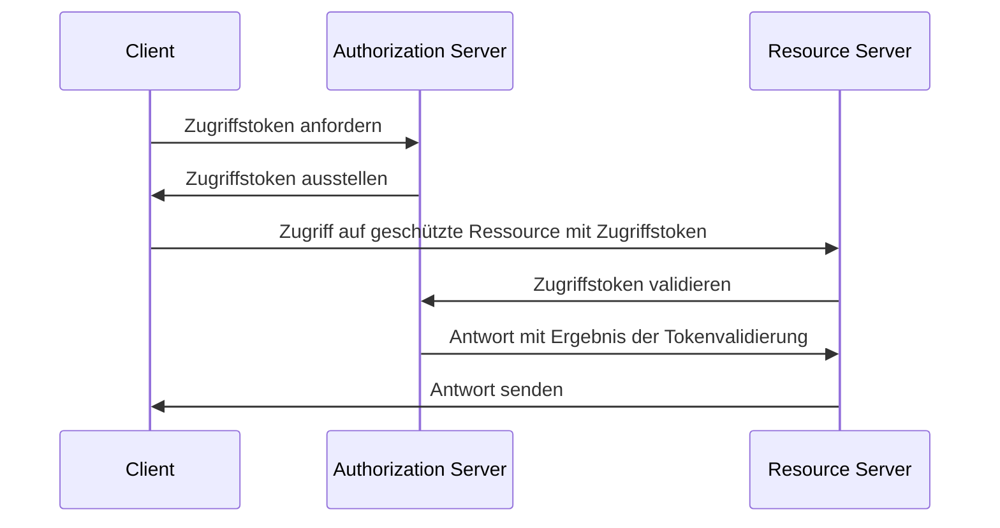
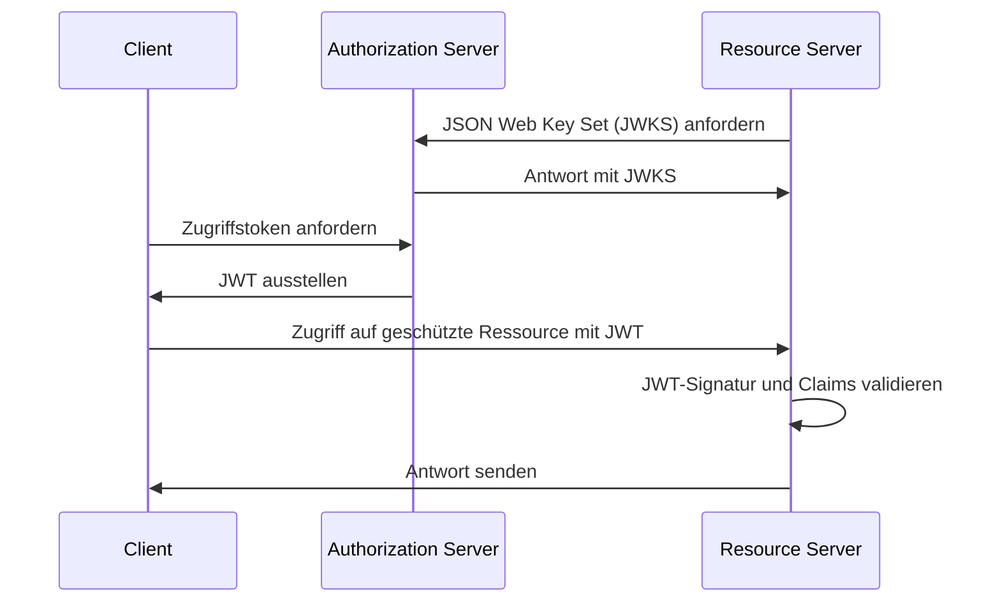
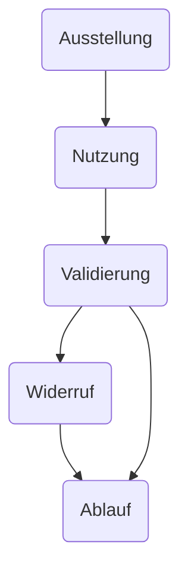

## Was ist ein Zugriffstoken (Access token)?

Ein Zugriffstoken (Access token) ist ein Berechtigungsnachweis, typischerweise eine Zeichenkette, die verwendet wird, um auf geschützte Ressourcen zuzugreifen. Im Kontext von OAuth 2.0 und OpenID Connect (OIDC) können <Ref slug="authorization-server">Autorisierungsserver</Ref> Zugriffstoken (Access tokens) an Clients (Anwendungen) nach erfolgreicher Authentifizierung und Autorisierung ausgeben.

Obwohl die RFCs für OAuth 2.0 und OIDC keine Implementierungsdetails für Zugriffstoken spezifizieren, gibt es zwei gängige Typen von Zugriffstoken, die in der Praxis verwendet werden:

- <Ref slug="opaque-token" />: Eine zufällige Zeichenkette, die für den Client keine Bedeutung ("opaqu") hat. Der Client präsentiert das Token dem Ressourcensserver, der das Token mit dem Authorisierungsserver validiert.
- <Ref slug="jwt" />: Ein selbstausgesprochenes Token, das <Ref slug="claim">Claims</Ref> (z. B. Benutzer-ID, Ablaufzeit) mit einer digitalen Signatur enthält. Der Ressourcensserver kann das Token validieren, ohne eine zusätzliche Anfrage an den Authorisierungsserver zu stellen.

## Wie funktioniert ein Zugriffstoken (Access token)?

Je nach Typ des Zugriffstokens kann der Ablauf bei der Nutzung eines Zugriffstokens variieren.

Hier ist ein vereinfachtes Beispiel für die Verwendung eines opaken Zugriffstokens:

Hier ist ein vereinfachtes Beispiel für die Verwendung eines JWT:

Der Unterschied zwischen den beiden Arten von Zugriffstoken besteht darin, wie der Ressourcensserver das Token validiert:

- Der Ressourcensserver muss eine zusätzliche Anfrage an den Authorisierungsserver stellen, um ein opaques Token zu validieren, jedes Mal, wenn es ein Token erhält.
- Der Ressourcensserver kann ein JWT validieren, ohne eine zusätzliche Anfrage an den Authorisierungsserver zu stellen, da das Token alle notwendigen Informationen enthält und der Ressourcensserver den öffentlichen Schlüssel aus dem JSON Web Key Set (JWKS) des Authorisierungsservers zwischenspeichern kann.

Zugriffstoken sind typischerweise kurzlebig und haben eine Ablaufzeit (z. B. 1 Stunde). Clients müssen ein neues Zugriffstoken anfordern, wenn das aktuelle Token abläuft.

## Welchen Tokentyp sollte ich verwenden?

Die Wahl zwischen einem opaken Token und einem JWT hängt von den Anwendungsfällen und den Sicherheitsanforderungen der Anwendung ab. Hier ist ein Vergleich der beiden Tokentypen:

|                | Opaques Token                  | JWT                                                           |
|----------------|--------------------------------|---------------------------------------------------------------|
| Format         | Zufällige Zeichenkette         | Selbstausgesprochene JSON-Objekte                              |
| Leistung       | Erfordert eine zusätzliche Anfrage | Schnellere Validierung                                        |
| Selbstausgesprochen | Nein                            | Ja                                                            |
| Token-Größe    | Kleiner                        | Größer                                                        |
| Widerruf       | Sofortig                       | Erfordert Ablauf des Tokens oder Interaktion mit dem Authorisierungsserver |
| Erweiterbarkeit| Begrenzt                       | Benutzerdefinierte Claims                                     |
| Zustandslos    | Nein                            | Ja                                                            |
| Sicherheit     | Erfordert Tokenvalidierung     | Erfordert Signaturvalidierung                                 |
| Standard       | Nein                            | Ja (RFC 7519)                                                 |

Für weitere Informationen zur Wahl zwischen den beiden Tokentypen siehe [Opaque token vs JWT](https://blog.logto.io/opaque-token-vs-jwt).

## Die Rollen des Autorisierungsservers und des Ressourcensservers

In den meisten Fällen hat der <Ref slug="authorization-server" /> die folgenden Verantwortlichkeiten:

- Stellt Zugriffstoken an Clients nach erfolgreicher Authentifizierung und Autorisierung aus. Der Authorisierungsserver kann die Gültigkeitsbereiche (Scopes) reduzieren oder die Tokenanforderung basierend auf den Zugriffssteuerungsrichtlinien ablehnen (z. B. Benutzerzustimmung, <Ref slug="rbac" />, <Ref slug="abac" />).
- Prüft, ob das Zugriffstoken vom Authorisierungsserver ausgestellt wurde und nicht abgelaufen oder widerrufen ist (<Ref slug="token-introspection" />).
- Stellt Informationen über das Token (z. B. Gültigkeitsbereiche, Ablaufzeit) über Tokenintrospektion oder <Ref slug="userinfo-endpoint" /> bereit.

Du wirst feststellen, dass der Authorisierungsserver die Bedeutung des Zugriffstokens nicht interpretiert. Zum Beispiel kann das Zugriffstoken einen Scope `read:orders` enthalten, aber der Authorisierungsserver weiß nicht, was der Scope bedeutet. Der Ressourcensserver ist verantwortlich für die Interpretation des Zugriffstokens und die Durchsetzung der <Ref slug="access-control" /> basierend auf den Scopes des Tokens. Das heißt, der <Ref slug="resource-server" /> hat normalerweise die folgenden Verantwortlichkeiten:

- Validiert die <Ref slug="claim">Claims</Ref> im Zugriffstoken (z. B. Ablaufzeit, Ressourcenindikator, Gültigkeitsbereiche).
- Erzwingt die Zugriffssteuerung basierend auf den Claims des Tokens (normalerweise Scopes).
- Stellt die geschützten Ressourcen bereit, wenn das Zugriffstoken gültig ist.

## Lebenszyklus eines Zugriffstokens (Access token)

Der Lebenszyklus eines Zugriffstokens umfasst typischerweise die folgenden Phasen:

<SeeAlso slugs={['opaque-token', 'jwt', 'token-introspection', 'userinfo-endpoint', 'access-control']} />

<Resources
  urls={[
    "https://blog.logto.io/opaque-token-vs-jwt",
    "https://blog.logto.io/oauth2-token-introspection",
    "https://blog.logto.io/understanding-tokens-in-oidc",
    {
      url: "https://datatracker.ietf.org/doc/html/rfc6749#section-1.4",
        result: {
        ogTitle: "OAuth 2.0 Access token",
      },
    },
    "https://datatracker.ietf.org/doc/html/rfc7662",
  ]}
/>
