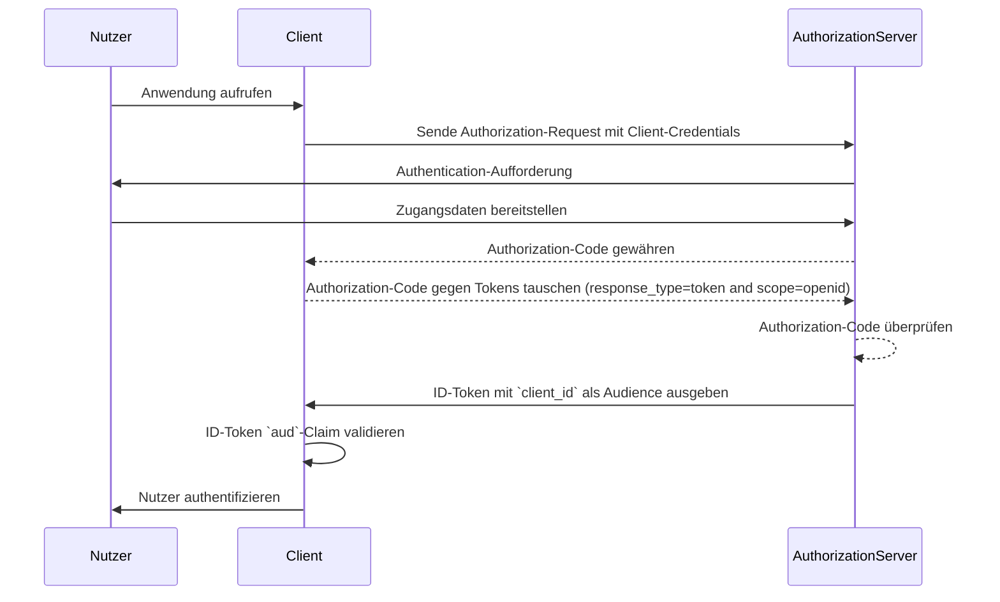
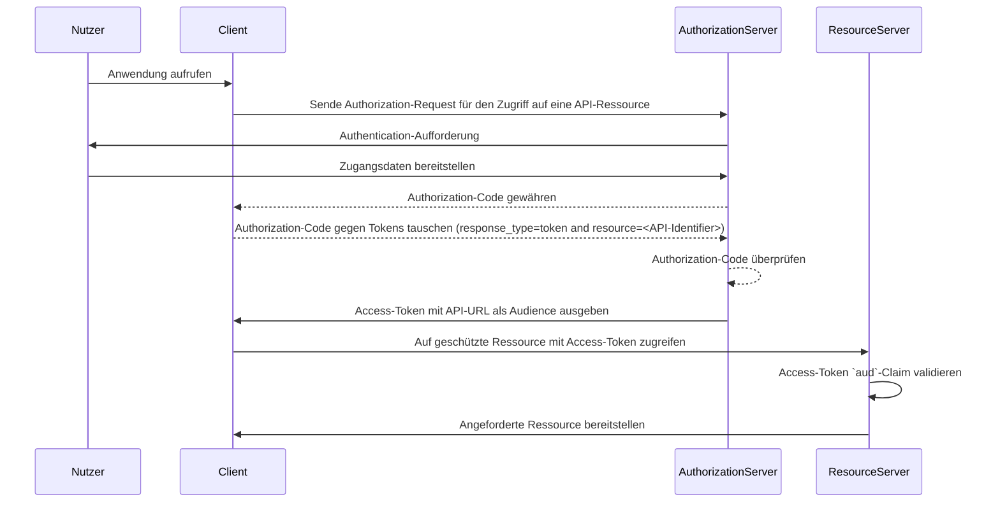

## Was ist die Zielgruppe (Audience)?

Im Kontext von <Ref slug="authentication" /> und <Ref slug="authorization" /> ist die Audience ein Schlüsselelement, das die beabsichtigten Empfänger eines Authorization-Tokens definiert. Bezeichnet als [aud](https://datatracker.ietf.org/doc/html/rfc7519#section-4.1.3) Claim in <Ref slug="jwt" />, stellt dieses Claim sicher, dass das Token nur von dem vorgesehenen Dienst oder der Anwendung akzeptiert wird. Typischerweise enthält das Audience-Claim entweder die client_id der Anwendung, für die das Token bestimmt ist, oder eine URL, die die API oder Ressource repräsentiert, für die das Token autorisiert ist. Durch die Spezifizierung der Audience dient es als Sicherheitskontrolle, um Missbrauch durch unbefugte Dienste oder Benutzer zu verhindern.

## Wie funktioniert die Audience?

Wenn ein Client ein <Ref slug="access-token" /> von einem Authorization-Server anfordert, ist das Audience-Claim in der Token-Antwort enthalten. Dieser Audience-Wert wird dann vom Resource-Server validiert, wenn das Token vorgelegt wird. Der Resource-Server überprüft, ob das Audience-Claim im Token mit seinem eigenen Bezeichner oder dem Bezeichner des Dienstes, den er schützt, übereinstimmt. Wenn dies nicht der Fall ist, wird das Token abgelehnt, was die Sicherheit in verteilten Systemen erhöht, insbesondere in Szenarien, die mehrere Microservices oder APIs umfassen. Durch die Kontrolle des Audience-Claims können Entwickler sicherstellen, dass Tokens im richtigen Kontext verwendet werden, was ihrer Anwendung eine zusätzliche Schutzschicht bei Authentication- und Authorization-Workflows hinzufügt.

- **Anforderer**: Die Client-Anwendung gibt den Audience-Wert an, wenn sie ein Token anfordert.
- **Issuer**: Der Authorization-Server fügt das Audience-Claim in die Token-Antwort ein.
- **Verifier**: Der Empfänger des Tokens überprüft das Audience-Claim mit seinem eigenen Bezeichner. Wenn das Audience-Claim mit dem Bezeichner des Empfängers übereinstimmt, wird das Token als gültig angesehen. Andernfalls wird es abgelehnt.

## Beispiel für die Audience in JWT

### Audience-Claim in einem OpenID Connect (OIDC) ID-Token

```json
{
  "header": {
    "alg": "RS256",
    "typ": "JWT",
    "kid": "abc123"
  },
  "payload": {
    "iss": "https://auth.logto.io",
    "sub": "test_user",
    "aud": "client_id_foo",
    "exp": 1516239022,
    "iat": 1516239022,
    "nonce": "n-0S6_WzA2Mj",
    "primary_email": "foo@logto.io",
    "email_verified": true,
    "username": "foo"
  },
  "signature": "..."
}
```

Ein <Ref slug="id-token" /> in <Ref slug="openid-connect" /> ist ein Sicherheitstoken, das Informationen über den authentifizierten Benutzer enthält und der Client-Anwendung nach einer erfolgreichen Authentifizierung geliefert wird. Anders als Access-Tokens, die zum Erteilen von Berechtigungen zum Zugriff auf Ressourcen verwendet werden, sind ID-Token speziell dafür ausgelegt, Benutzeridentitätsinformationen an die vertrauende Partei (Client) zu übermitteln. Diese Tokens werden typischerweise als JWTs codiert und enthalten Claims wie die Benutzerkennung (sub-Claim), den Issuer (iss-Claim) und die Audience (aud-Claim) unter anderem.

In diesem Fall gibt das `aud`-Claim die beabsichtigte Audience für das ID-Token an, die die Client-Anwendung ist. Der Wert des `aud`-Claims entspricht normalerweise der `client_id` der Anwendung, die das Token angefordert hat. Wenn die Client-Anwendung das ID-Token erhält, kann sie das Audience-Claim überprüfen, um sicherzustellen, dass das Token für ihren Verbrauch ausgegeben wurde. Dieser Validierungsschritt hilft, Token-Missbrauch und unbefugten Zugriff auf Benutzerinformationen zu verhindern, was die Sicherheit des Authentication-Prozesses erhöht.



### Audience-Claim in einem Access-Token

```json
{
  "header": {
    "alg": "RS256",
    "typ": "JWT",
    "kid": "abc123"
  },
  "payload": {
    "iss": "https://auth.logto.io",
    "sub": "test_user",
    "aud": "https://example.logto.app/api/users",
    "exp": 1516239022,
    "iat": 1516239022,
    "scope": "read write",
    "client_id": "client_id_foo"
  },
  "signature": "..."
}
```

Im Gegensatz zu ID-Tokens werden <Ref slug="access-token" /> verwendet, um den Zugriff auf geschützte Ressourcen wie APIs oder Dienste zu autorisieren. Das `aud`-Claim in einem Access-Token gibt den beabsichtigten Empfänger des Tokens an, wobei es sich typischerweise um die API oder den Dienst handelt, auf den das Token autorisiert ist. In der Regel hat der Resource-Server, der die API hostet, eine andere Domain als die Client-Anwendung, die das Token angefordert hat. In diesem Fall enthält das `aud`-Claim anstelle einer `client_id` die URL des API-Endpunkts, für den das Token bestimmt ist. Diese URL ist oft als Resource Indicator oder API-Identifier bekannt, der die Zielressource eindeutig identifiziert.

Wenn der Resource-Server ein Access-Token erhält, validiert er das `aud`-Claim, um sicherzustellen, dass das Token für seinen Gebrauch bestimmt ist. Durch die Überprüfung der Audience kann der Resource-Server unbefugten Zugriff auf seine Ressourcen verhindern und Access Control Policies basierend auf der beabsichtigten Audience des Tokens durchsetzen. Dieser Mechanismus hilft, sensible Daten zu schützen und stellt sicher, dass Access-Tokens im geeigneten Kontext verwendet werden, was die Sicherheit des Gesamtsystems erhöht.



## FAQs

### Warum ist das Audience-Claim bei der Token-Validierung wichtig?

Das Audience-Claim ist entscheidend bei der Token-Validierung, weil es sicherstellt, dass das Token nur vom beabsichtigten Empfänger akzeptiert wird. Indem das Audience-Claim überprüft wird, kann der Empfänger Token-Missbrauch und unbefugten Zugriff auf Ressourcen verhindern. Diese Sicherheitskontrolle ist insbesondere in verteilten Systemen wichtig, in denen mehrere Dienste miteinander interagieren, da sie hilft, Access Control Policies durchzusetzen und sensible Daten zu schützen.

### Kann ein Token mehrere Audiences haben?

Aus Sicherheitsgründen wird empfohlen, dass ein Token eine einzige Audience hat, um Mehrdeutigkeiten zu vermeiden und sicherzustellen, dass das Token im richtigen Kontext verwendet wird. Allerdings können einige Szenarien Tokens mit mehreren Audiences erfordern, wie beispielsweise, wenn ein Token für mehrere Dienste oder APIs innerhalb derselben Domain bestimmt ist. In solchen Fällen sollten Entwickler die Auswirkungen des Einsatzes von Multi-Audience-Tokens sorgfältig abwägen und angemessene Sicherheitsmaßnahmen implementieren, um potenzielle Risiken zu mindern.

### Was sollte ich als meinen API-Identifier im Audience-Claim verwenden?

Bei der Spezifizierung des Audience-Claims in einem Access-Token, das eine API oder einen Dienst repräsentiert, wird empfohlen, eine absolute URI zu verwenden, die die Ressource eindeutig identifiziert. Diese URI kann die Basis-URL des API-Endpunkts oder ein spezifischer Ressourcenpfad sein, auf den das Token autorisiert ist zuzugreifen. Durch die Verwendung einer URI als API-Identifier kann sichergestellt werden, dass das Audience-Claim unmissverständlich ist und den beabsichtigten Empfänger des Tokens genau repräsentiert.