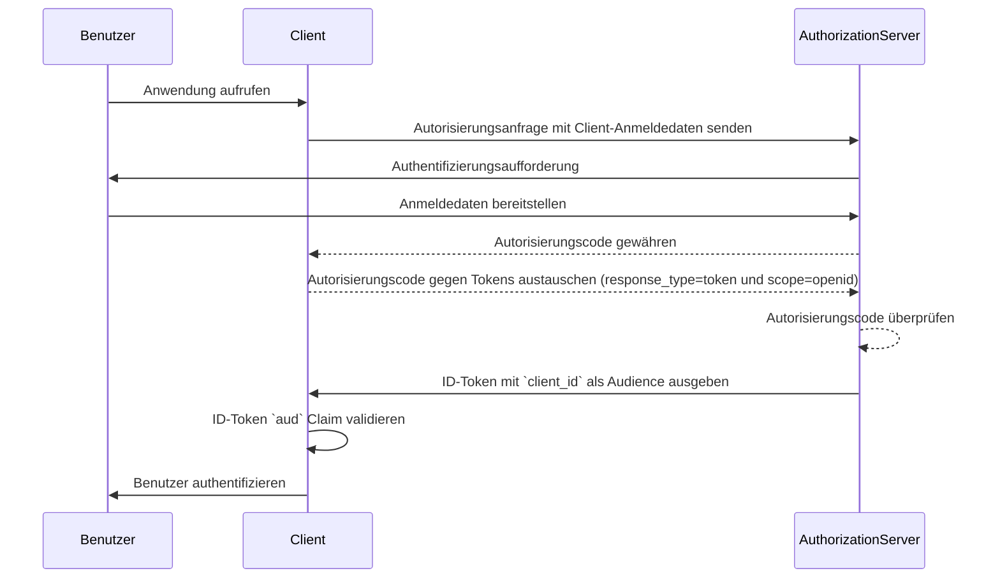
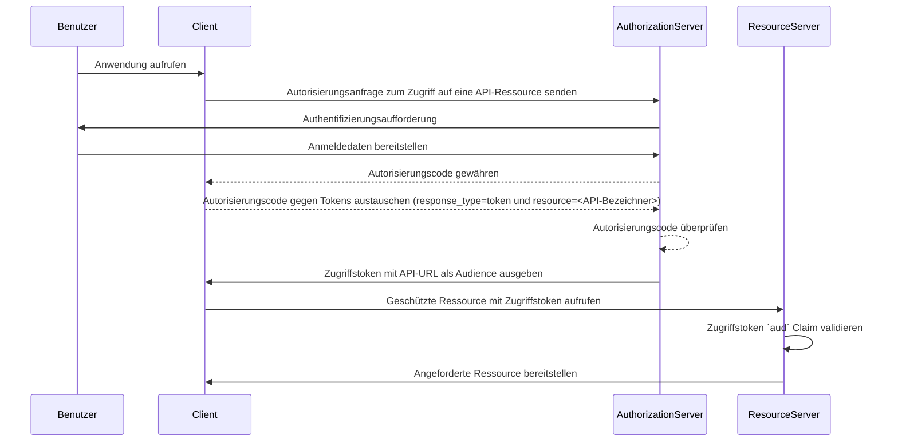

## Was ist eine Zielgruppe (Audience)?

Im Kontext von Authentifizierung und Autorisierung ist die Zielgruppe (Audience) ein Schlüsselelement, das die vorgesehenen Empfänger eines Autorisierungstokens definiert. Bezeichnet als der [aud](https://datatracker.ietf.org/doc/html/rfc7519#section-4.1.3) Claim in <Ref slug="jwt" />, stellt dieser Claim sicher, dass das Token nur von dem dafür vorgesehenen Dienst oder der Anwendung akzeptiert wird. Typischerweise enthält der Audience-Claim entweder die client_id der Anwendung, für die das Token bestimmt ist, oder eine URL, die die API oder Ressource repräsentiert, auf die das Token zuzugreifen berechtigt ist. Durch die Angabe der Audience dient es als Sicherheitskontrolle, um den Missbrauch durch unautorisierte Dienste oder Benutzer zu verhindern.

## Wie funktioniert die Zielgruppe (Audience)?

Wenn ein Client ein Zugriffstoken von einem Authorization Server anfordert, wird der Audience-Claim in die Token-Antwort aufgenommen. Dieser Audience-Wert wird dann vom Resource Server validiert, wenn das Token vorgelegt wird. Der Resource Server überprüft, ob der Audience-Claim im Token mit seinem eigenen Bezeichner oder dem Bezeichner des Dienstes übereinstimmt, den er schützt. Andernfalls wird das Token abgelehnt, wodurch die Sicherheit in verteilten Systemen erhöht wird, insbesondere in Szenarien mit mehreren Mikroservices oder APIs. Durch die Kontrolle des Audience-Claims können Entwickler sicherstellen, dass Tokens im richtigen Kontext verwendet werden, und ihrer Anwendung einen zusätzlichen Schutzschicht in den Authentifizierungs- und Autorisierungsworkflows verleihen.

- **Anfragender**: Die Client-Anwendung gibt den Audience-Wert an, wenn sie ein Token anfordert.
- **Issuer (Herausgeber)**: Der Authorization Server fügt den Audience-Claim in die Token-Antwort ein.
- **Prüfer**: Der Empfänger des Tokens überprüft den Audience-Claim gegen seinen eigenen Bezeichner. Wenn der Audience-Claim mit dem Bezeichner des Empfängers übereinstimmt, wird das Token als gültig betrachtet. Andernfalls wird es abgelehnt.

## Beispiel für eine Zielgruppe (Audience) in einem JWT

### Zielgruppen-Claim (Audience) in einem OpenID Connect (OIDC) ID-Token

```json
{
  "header": {
    "alg": "RS256",
    "typ": "JWT",
    "kid": "abc123"
  },
  "payload": {
    "iss": "https://auth.logto.io",
    "sub": "test_user",
    "aud": "client_id_foo",
    "exp": 1516239022,
    "iat": 1516239022,
    "nonce": "n-0S6_WzA2Mj",
    "primary_email": "foo@logto.io",
    "email_verified": true,
    "username": "foo"
  },
  "signature": "..."
}
```

Ein <Ref slug="id-token" /> in OpenID Connect (OIDC) ist ein Sicherheitstoken, das Informationen über den authentifizierten Benutzer enthält, die der Client-Anwendung nach einer erfolgreichen Authentifizierung geliefert werden. Im Gegensatz zu Zugriffstokens, die verwendet werden, um Berechtigungen für den Zugriff auf Ressourcen zu gewähren, sind ID-Tokens speziell für die Übermittlung von Benutzeridentitätsinformationen an die vertrauende Partei (Client) ausgelegt. Diese Tokens sind typischerweise als JWTs (JSON Web Tokens) kodiert und enthalten Claims wie den Benutzerbezeichner (sub Claim), den Herausgeber (iss Claim) und die Zielgruppe (aud Claim) unter anderem.

In diesem Fall gibt der `aud` Claim die vorgesehene Zielgruppe für das ID-Token an, nämlich die Client-Anwendung. Der Wert des `aud` Claims entspricht üblicherweise der `client_id` der Anwendung, die das Token angefordert hat. Wenn die Client-Anwendung das ID-Token empfängt, kann sie den Audience-Claim überprüfen, um sicherzustellen, dass das Token für ihren Verbrauch ausgegeben wurde. Dieser Validierungsschritt hilft, den Missbrauch von Tokens und unbefugten Zugriff auf Benutzerinformationen zu verhindern und die Sicherheit des Authentifizierungsprozesses zu erhöhen.



### Zielgruppen-Claim (Audience) in einem Zugriffstoken

```json
{
  "header": {
    "alg": "RS256",
    "typ": "JWT",
    "kid": "abc123"
  },
  "payload": {
    "iss": "https://auth.logto.io",
    "sub": "test_user",
    "aud": "https://example.logto.app/api/users",
    "exp": 1516239022,
    "iat": 1516239022,
    "scope": "read write",
    "client_id": "client_id_foo"
  },
  "signature": "..."
}
```

Im Gegensatz zu ID-Tokens werden Zugriffstokens verwendet, um den Zugriff auf geschützte Ressourcen wie APIs oder Dienste zu autorisieren. Der `aud` Claim in einem Zugriffstoken gibt den vorgesehenen Empfänger des Tokens an, der typischerweise die API oder der Dienst ist, auf den das Token zugreifen darf. Typischerweise hat der Resource Server, der die API hostet, eine andere Domain als die Client-Anwendung, die das Token angefordert hat. In diesem Fall enthält der `aud` Claim anstelle einer `client_id` die URL des API-Endpunkts, für den das Token bestimmt ist. Diese URL ist oft als Ressource-Indikator oder API-Identifier bekannt, der die Zielressource eindeutig identifiziert.

Wenn der Resource Server ein Zugriffstoken erhält, validiert er den `aud` Claim, um sicherzustellen, dass das Token für seinen Verbrauch bestimmt ist. Durch Überprüfung des Audiences kann der Resource Server unbefugten Zugriff auf seine Ressourcen verhindern und Zugriffskontrollrichtlinien basierend auf der vorgesehenen Audience des Tokens durchsetzen. Dieser Mechanismus hilft, sensible Daten zu schützen und sicherzustellen, dass Zugriffstokens im richtigen Kontext verwendet werden, was die Sicherheit des gesamten Systems erhöht.



## FAQs

### Warum ist der Zielgruppen-Claim (Audience) wichtig für die Token-Validierung?

Der Audience-Claim ist entscheidend für die Token-Validierung, weil er sicherstellt, dass das Token nur vom vorgesehenen Empfänger akzeptiert wird. Durch die Überprüfung des Audience-Claims kann der Empfänger den Missbrauch des Tokens und unbefugten Zugriff auf Ressourcen verhindern. Diese Sicherheitskontrolle ist besonders wichtig in verteilten Systemen, in denen mehrere Dienste miteinander interagieren, da sie hilft, Zugriffskontrollrichtlinien durchzusetzen und sensible Daten zu schützen.

### Kann ein Token mehrere Zielgruppen haben?

Aus Sicherheitsgründen wird empfohlen, dass ein Token eine einzelne Zielgruppe hat, um Mehrdeutigkeit zu verhindern und sicherzustellen, dass das Token im richtigen Kontext verwendet wird. Einige Szenarien können jedoch Tokens mit mehreren Zielgruppen erfordern, z. B. wenn ein Token für mehrere Dienste oder APIs innerhalb derselben Domain bestimmt ist. In solchen Fällen sollten Entwickler die Auswirkungen der Verwendung von Multi-Audience-Tokens sorgfältig abwägen und geeignete Sicherheitsmaßnahmen implementieren, um potenzielle Risiken zu mindern.

### Was sollte ich als meinen API-Bezeichner im Zielgruppen-Claim (Audience) verwenden?

Wenn Sie den Zielgruppen-Claim in einem Zugriffstoken angeben, das eine API oder einen Dienst repräsentiert, wird empfohlen, eine absolute URI zu verwenden, die die Ressource eindeutig identifiziert. Diese URI kann die Basis-URL des API-Endpunkts oder ein spezifischer Ressourcenpfad sein, auf den das Token zugreifen darf. Durch die Verwendung einer URI als API-Bezeichner können Sie sicherstellen, dass der Audience-Claim eindeutig ist und den vorgesehenen Empfänger des Tokens genau darstellt.