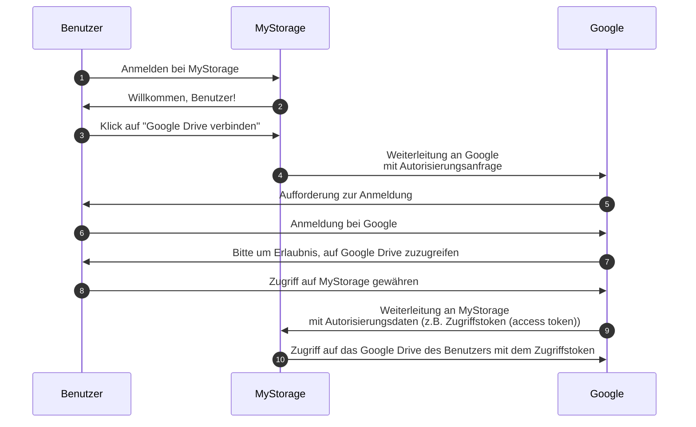

## Auth

Diese Seite ist eine Begriffserklärung für den Begriff "auth". Es wird oft als Abkürzung für verwendet:

- <Ref slug="authentication" />: Der Prozess der Überprüfung der Identitätszugehörigkeit (z.B. eines Benutzers oder Dienstes). Er beantwortet die Frage "Welche Identität besitzt du?"
- <Ref slug="authorization" />: Der Prozess der Bestimmung, welche Aktionen eine Identität auf einer Ressource ausführen kann. Es beantwortet die Frage "Was kannst du tun?"

> [!Note]
> Manchmal werden Authentifizierung (Authentication) und Autorisierung (Authorization) als "AuthN" und "AuthZ" bezeichnet.

Diese beiden Konzepte sind im <Ref slug="iam" /> Bereich unerlässlich, aber sie sind grundlegend unterschiedlich. Schauen wir uns ein Beispiel an: Eine Webanwendung MyStorage hat die Fähigkeit, Dateien hochzuladen und sich mit Google Drive zu verbinden. Ein typischer Benutzerfluss sieht folgendermaßen aus:

In diesem Ablauf führt der Benutzer zwei Authentifizierungsschritte durch: einen bei MyStorage (Schritt 1) und einen anderen bei Google (Schritt 6); und einen Autorisierungsschritt: die Gewährung des Zugriffs auf Google Drive (Schritt 8).

## Was meinst du?

Wenn du den Begriff "auth" siehst, ist es wichtig zu klären, ob er sich auf Authentifizierung (authentication) oder Autorisierung (authorization) bezieht; andernfalls könnte man erwarten, dass beide Prozesse abgedeckt werden (so wie es diese Website tut).

<SeeAlso slugs={["authentication", "authorization", "iam", "oauth-2.0", "openid-connect"]} />