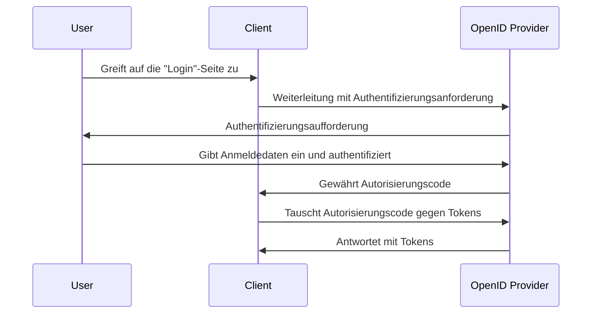

## Was ist eine Authentifizierungsanforderung (Authentication request)?

Während die Bedeutung einer Authentifizierungsanforderung (Authentication request) je nach Kontext variieren kann, konzentrieren wir uns auf die Definition in der OpenID Connect (OIDC)-Spezifikation. In OIDC ist eine Authentifizierungsanforderung (Authentication request) eine <Ref slug="authorization-request" /> an den Authorization Server zur Authentifizierung eines Benutzers.

Die Standarddefinition scheint sehr verwirrend zu sein, da ähnliche Begriffe wie "Autorisierungsanforderung" (Authorization request) verwendet werden. Dies liegt daran, dass OIDC auf OAuth 2.0 aufgebaut ist, das hauptsächlich für die Autorisierung entwickelt wurde, und OIDC übernimmt die OAuth 2.0-Terminologie und erweitert sie, um die Authentifizierung zu unterstützen.

Um Klarheit zu schaffen, fügen wir der Definition etwas Kontext hinzu:

> Eine (OpenID Connect) Authentifizierungsanforderung ist eine (OAuth 2.0-Autorisierungs-)Anforderung an den (OpenID Connect-Autorisierungs-)Server zur Authentifizierung eines Benutzers.

Es wird noch länger! Lassen Sie uns nun alle Klammern entfernen:

> Eine Authentifizierungsanforderung ist eine Anforderung an den Server zur Authentifizierung eines Benutzers.

Nachdem alle Attribute entfernt wurden, wird die Definition recht einfach. Hier sind die Aufschlüsselungen der Begriffe:

- **Authentifizierungsanforderung**: Der Begriff aus der OIDC-Spezifikation.
- <Ref slug="authorization-request" />: Der Begriff aus der OAuth 2.0-Spezifikation. OIDC nutzt die Spezifikation erneut und erweitert sie.
- <Ref slug="authorization-server" />: Der Begriff aus der OAuth 2.0-Spezifikation. OIDC verwendet auch den Begriff <Ref slug="openid-connect" headingId="openid-provider-op" />, um sich auf dasselbe Entität zu beziehen, das in der Lage ist, Benutzer zu authentifizieren.

In den folgenden Abschnitten werden wir "OpenID Provider (OP)" verwenden, um auf den Authorization Server zu verweisen, der OIDC unterstützt.

## Wie funktioniert eine Authentifizierungsanforderung (Authentication request)?

Wenn eine Client-Anwendung einen Benutzer authentifizieren möchte, initiiert sie eine Authentifizierungsanforderung (Authentication request) an den OpenID Provider (OP). Wie bereits erwähnt, ist die Authentifizierungsanforderung (Authentication request) auch eine Autorisierungsanforderung (Authorization request) in OAuth 2.0; daher können bestimmte OAuth 2.0-Grant-Typen (Flows) verwendet werden, um den Authentifizierungsprozess abzuschließen.

OIDC definiert drei Grant-Typen (Flows), um die Authentifizierung zu unterstützen:

1. <Ref slug="authorization-code-flow" />: Der am meisten empfohlene Authentifizierungs-Flow. Er wird normalerweise mit <Ref slug="pkce" /> für bessere Sicherheit verwendet und ist für die meisten Anwendungen geeignet.
2. <Ref slug="implicit-flow" />: Ein vereinfachter Flow, der in <Ref slug="oauth-2.1" /> aufgrund von Sicherheitsbedenken veraltet ist.
3. <Ref slug="hybrid-flow" />: Eine Kombination aus dem Authorization Code Flow und dem Implicit Flow.

Die Authentifizierungsanforderung (Authentication request) ist der erste Schritt im OIDC-Authentifizierungs-Flow. Die tatsächlichen Parameter, die enthalten werden sollen, und die zu befolgenden Schritte hängen vom gewählten Flow ab. Klicken Sie auf die oben genannten Flownamen, um mehr über jeden Flow zu erfahren.

Hier ist ein vereinfachtes Beispiel einer Authentifizierungsanforderung (Authentication request) mit dem Authorization Code Flow:

Sobald der Client die Tokens erhält, kann er diese (z.B. <Ref slug="access-token" />) verwenden, um im Namen des Benutzers auf geschützte Ressourcen (z.B. eine API) zuzugreifen.

### Wichtige Parameter in einer Authentifizierungsanforderung (Authentication request)

Hier sind einige wichtige Parameter in einer Authentifizierungsanforderung (Authentication request):

- **`response_type`**: Der Typ der Antwort, die der Client vom Authorization Server erwartet. Er kann `code` für den Authorization Code Flow, `id_token` für den Implicit Flow oder `code id_token` für den Hybrid Flow sein.
- **`client_id`**: Die vom OpenID Provider (OP) ausgegebene Client-Kennung.
- **`redirect_uri`**: Die URI, zu der der Authorization Server den User-Agent nach der Authentifizierungsanforderung (Authentication request) umleiten wird.
- **`scope`**: Die angeforderten <Ref slug="scope">Scopes</Ref> (Berechtigungen) für das <Ref slug="id-token" /> und das <Ref slug="access-token" />.
- **`resource`**: Der optionale Parameter, der den <Ref slug="resource-indicator" /> für die angeforderten Ressourcen angibt. Der Authorization Server muss [RFC 8707](https://datatracker.ietf.org/doc/html/rfc8707) unterstützen, um diesen Parameter zu verwenden.

Beachten Sie, dass die oben genannten Parameter nicht vollständig sind. Bevor Sie eine Authentifizierungsanforderung (Authentication request) machen, sollten Sie die vollständige Liste der Parameter für den spezifischen Flow, den Sie verwenden, nachschlagen.

<SeeAlso slugs={["openid-connect", "oauth-2.0", "authorization-code-flow", "implicit-flow", "hybrid-flow"]} />

<Resources
  urls={[
    "https://openid.net/specs/openid-connect-core-1_0.html",
  ]}
/>