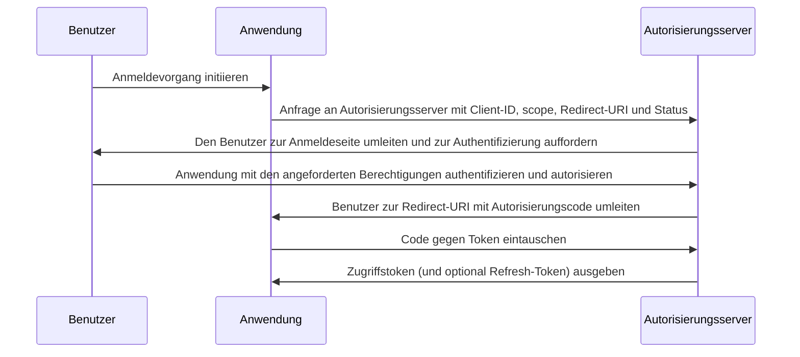

## Was ist der Autorisierungscode-Ablauf (Authorization code flow)?

Der Autorisierungscode-Ablauf (Authorization code flow) (auch bekannt als Autorisierungscode-Gewährung), definiert in [OAuth 2.0 RFC 6749, Abschnitt 4.1](https://datatracker.ietf.org/doc/html/rfc6749#section-4.1), ist ein weit verbreiteter OAuth 2.0-Autorisierungsmechanismus, der es Anwendungen ermöglicht, ein Zugriffstoken im Namen eines Benutzers zu erhalten. Dieser Ablauf ist besonders geeignet für vertrauliche Anwendungen (z. B. traditionelle serverseitige Webanwendungen), bei denen das Client-Geheimnis sicher gespeichert werden kann.

Der Autorisierungscode-Ablauf ist eine robuste und sichere Methode zur Erlangung von Zugriffstoken in OAuth 2.0 und daher eine bevorzugte Wahl für viele Webanwendungen. Das Verständnis dieses Ablaufs ist entscheidend für Entwickler, die mit OAuth 2.0 und API-Integrationen arbeiten.

## Wie funktioniert der Autorisierungscode-Ablauf (Authorization code flow)?

Der Autorisierungscode-Ablauf umfasst die folgenden Schritte:

1. **Ablaufinitiierung**: Der Benutzer initiiert den Ablauf, indem er typischerweise auf einen Link oder Button in der Anwendung klickt, um sich anzumelden. Die Anwendung leitet den Benutzer zum Autorisierungsendpunkt des Autorisierungsservers um und übergibt dabei die Client-ID, den angeforderten scope, eine Redirect-URI und einen Statusparameter. Der Autorisierungsserver validiert die Parameter und fordert den Benutzer auf, sich auf der Anmeldeseite des Autorisierungsservers zu authentifizieren.
2. **Benutzerauthentifizierung und -autorisierung**: Der Benutzer authentifiziert sich beim Autorisierungsserver und gibt der Anwendung die Erlaubnis, auf die angeforderten Ressourcen zuzugreifen.
3. **Codegenerierung und Umleitung**: Der Autorisierungsserver generiert einen Autorisierungscode und leitet den Benutzer zurück zur Anwendung, indem er die zuvor bereitgestellte Redirect-URI verwendet. Der Autorisierungscode ist in der Abfragezeichenfolge der Redirect-URI enthalten.
4. **Code-Austausch**: Die Anwendung extrahiert den Autorisierungscode aus der Abfragezeichenfolge und führt eine POST-Anfrage an den Token-Endpunkt des Autorisierungsservers aus, um den Autorisierungscode gegen ein Zugriffstoken auszutauschen. Die Anwendung muss auch die Client-ID, das Client-Geheimnis, die Redirect-URI und den Autorisierungscode in die Anfrage einbeziehen.
5. **Abruf des Zugriffstokens**: Der Autorisierungsserver validiert den Autorisierungscode und gibt ein Zugriffstoken (und optional ein Refresh-Token) an die Anwendung bei erfolgreicher Validierung aus. Die Anwendung kann dann das Zugriffstoken verwenden, um autorisierte API-Anfragen im Namen des Benutzers auszuführen.

Die Schritte können durch das folgende Sequenzdiagramm veranschaulicht werden:



## Authentifizierungsanfrage (Authentication request)

Anfrageparameter sind wie folgt:

- **client_id**: ERFORDERLICH. Gültiger OAuth 2.0-Client-Identifikator.
- **scope**: ERFORDERLICH. Dieser Wert spezifiziert einen Satz von Ressourcen, die der Benutzer vom Autorisierungsserver anfordert. Z. B., `openid profile email`.
- **response_type**: ERFORDERLICH. Der Wert muss `code` sein, um anzuzeigen, dass die Anwendung einen Autorisierungscode erwartet.
- **redirect_uri**: ERFORDERLICH. Die URI, an die die Authentifizierungsantwort gesendet wird, und sollte genau mit der Redirect-URI übereinstimmen, die der Client beim Autorisierungsserver vorregistriert hat.
- **state**: EMPFOHLEN. Ein undurchsichtiger Wert, der verwendet wird, um den Status zwischen der Anfrage und dem Rückruf zu erhalten. Es wird auch verwendet, um <Ref slug="csrf" />-Angriffe zu verhindern.
- **nonce**: OPTIONAL. Eine Zufallszeichenfolge, die verwendet wird, um eine Clientsitzung mit einem ID-Token zu verknüpfen und Wiederholungsangriffe zu mildern.
- **prompt**: OPTIONAL. Leerzeichengetrennte, groß- und kleinschreibungsempfindliche Liste von Zeichenfolgenwerten, die festlegt, ob der Autorisierungsserver den Endbenutzer zur erneuten Authentifizierung und Zustimmung auffordern soll. Die definierten Werte sind:
  - **none**: Der Autorisierungsserver DARF KEINE Benutzerschnittstellenseiten für Authentifizierung oder Zustimmung anzeigen. Ein Fehler wird zurückgegeben, wenn ein Endbenutzer noch nicht authentifiziert ist oder der Client keine vorkonfigurierte Zustimmung für die angeforderten Claims hat oder andere Bedingungen für die Bearbeitung der Anfrage nicht erfüllt. Der Fehlercode wird typischerweise `login_required`, `interaction_required` sein. Dies kann als Methode verwendet werden, um bestehende Authentifizierungen und/oder Zustimmungen zu prüfen.
  - **login**: Der Autorisierungsserver SOLLTE den Endbenutzer zur erneuten Authentifizierung auffordern. Wenn er den Endbenutzer nicht erneut authentifizieren kann, MUSS er einen Fehler zurückgeben, typischerweise `login_required`.
  - **consent**: Der Autorisierungsserver SOLLTE den Endbenutzer zur Zustimmung auffordern, bevor er Informationen an den Client zurückgibt. Wenn er keine Zustimmung einholen kann, MUSS er einen Fehler zurückgeben, typischerweise `consent_required`.
  - **select_account**: Der Autorisierungsserver SOLLTE den Endbenutzer auffordern, ein Benutzerkonto auszuwählen. Dies ermöglicht es einem Endbenutzer, der mehrere Konten beim Autorisierungsserver hat, zwischen verschiedenen aktuellen Sitzungen auszuwählen. Wenn er keine Auswahlentscheidung des Endbenutzers erhalten kann, MUSS er einen Fehler zurückgeben, typischerweise `account_selection_required`.

[Vollständige Definition der Anfrageparameter](https://openid.net/specs/openid-connect-core-1_0.html#AuthRequest)

### Beispiel für eine Authentifizierungsanfrage (Authentication request)

```bash
curl -X GET "https://authorization-server.com/auth" \
  -d "response_type=code" \
  -d "client_id=YOUR_APPLICATION_ID" \
  -d "redirect_uri=https://yourapp.com/callback" \
  -d "scope=openid profile email" \
  -d "state=RANDOM_STRING_FOR_STATE"
```

Ein typisches erfolgreiches Antwort:

```http
HTTP/1.1 302 Found
Location: https://yourapp.com/callback?
  code=YOUR_AUTHORIZATION_CODE
  &state=RANDOM_STRING_FOR_STATE
```

## Token-Austauschanfrage (Token exchange request)

Sobald die oben genannte Authentifizierungsanfrage erfolgreich beantwortet wurde, wird der Client automatisch zur Rückruf-URI `https://yourapp.com/callback` umgeleitet, wobei der Code als URI-Parameter übergeben wird.

Der Client wird erwartet, den `code` mit einer anschließenden Token-Austauschanfrage zu erhalten und zu verarbeiten, um das Zugriffstoken einzutauschen.

### Beispiel für eine Token-Austauschanfrage (Token exchange request)

```bash
curl -X POST "https://authorization-server.com/token" \
  -H "Content-Type: application/x-www-form-urlencoded" \
  -d "client_id=YOUR_CLIENT_ID" \
  -d "code=YOUR_AUTHORIZATION_CODE" \
  -d "redirect_uri=https://yourapp.com/callback" \
  -d "grant_type=authorization_code" \
```

## Vorteile

- **Erhöhte Sicherheit**: Das Client-Geheimnis wird niemals im Browser des Benutzers offengelegt, was das Risiko von Client-Imitationen verringert.
- **Einmaliger Autorisierungscode**: Der Autorisierungscode hat eine kurze Lebensdauer und kann nur einmal verwendet werden, was das Risiko von Abfang- und Wiederholungsangriffen verringert.
- **Kurzlebige Token**: Zugriffstoken, die in diesem Ablauf ausgegeben werden, sind kurzlebig (typischerweise 1 Stunde), was das Risiko eines unautorisierten Zugriffs verringert, falls das Token kompromittiert wird.
- **Refresh-Token**: Der Autorisierungsserver kann optional ein Refresh-Token ausgeben, sodass die Anwendung ein neues Zugriffstoken erhalten kann, ohne dass eine Nutzerinteraktion erforderlich ist.

## Was ist der Unterschied zwischen dem Autorisierungscode-Ablauf (Authorization code flow) und dem impliziten Ablauf (Implicit flow)?

Der Hauptunterschied zwischen dem Autorisierungscode-Ablauf und dem impliziten Ablauf besteht darin, wie das Zugriffstoken erhalten wird:

- **Autorisierungscode-Ablauf (Authorization code flow)**: Die Client-Anwendung erhält zuerst einen Autorisierungscode vom Autorisierungsendpunkt und tauscht ihn dann in einer nachfolgenden POST-Anfrage an den Token-Endpunkt gegen ein Zugriffstoken ein.
- **Impliziter Ablauf (Implicit flow)**: Die Client-Anwendung erhält das Zugriffstoken direkt vom Autorisierungsendpunkt.

## Was ist der Unterschied zwischen dem Autorisierungscode-Ablauf (Authorization code flow) und dem Client-Anmeldeinformationen-Ablauf (Client credentials flow)?

Der Hauptunterschied zwischen dem Autorisierungscode-Ablauf und dem Client-Anmeldeinformationen-Ablauf besteht im Kontext, in dem der Ablauf verwendet wird:

- **Autorisierungscode-Ablauf (Authorization code flow)**: Wird verwendet, wenn die Client-Anwendung im Namen eines Benutzers auf Ressourcen zugreifen muss. Der Ablauf umfasst die Benutzerauthentifizierung und -autorisierung.
- **Client-Anmeldeinformationen-Ablauf (Client credentials flow)**: Wird verwendet, wenn die Client-Anwendung eigenständig auf Ressourcen zugreifen muss. Der Ablauf umfasst die Client-Authentifizierung, aber nicht die Benutzer-Authentifizierung, und eignet sich am besten für Maschinen-zu-Maschinen-Kommunikation.

## Was sind typische Anwendungsfälle für den Autorisierungscode-Ablauf (Authorization code flow)?

- Traditionelle Webanwendungen, die eine Benutzerauthentifizierung und Zugriff auf APIs erfordern.
- Anwendungen, die sicher auf Benutzerdaten von Drittanbietern zugreifen müssen.

<SeeAlso slugs={['device-flow', 'implicit-flow', 'client-credentials-flow']} />

<Resources urls={['https://datatracker.ietf.org/doc/html/rfc6749']} />