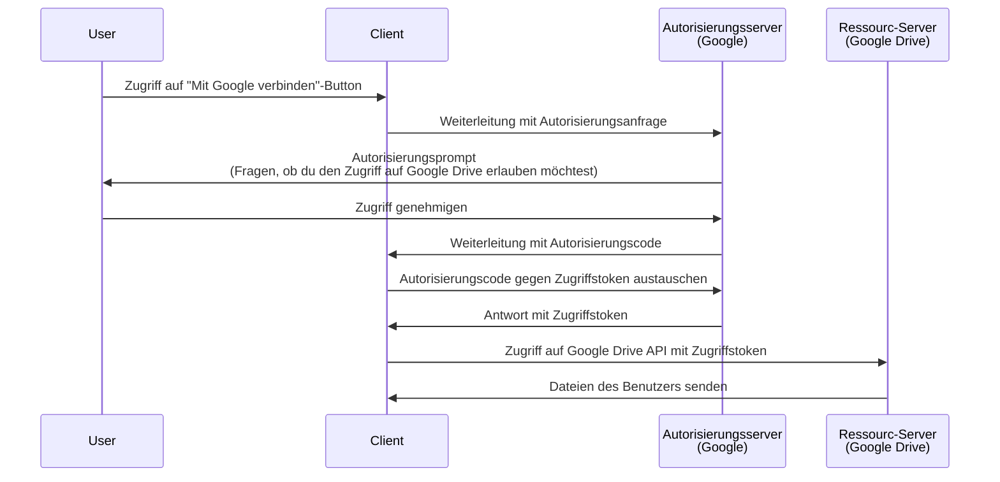

## Was ist eine Autorisierungsanfrage (Authorization request)?

Je nach Kontext kann der Begriff "Autorisierungsanfrage (Authorization request)" unterschiedliche Dinge bedeuten. In diesem Artikel konzentrieren wir uns auf die Definition in der <Ref slug="oauth-2.0" />-Spezifikation.

In OAuth 2.0 gibt es mehrere Typen von Zugriffsgewährungen (Flows), die definieren, wie ein <Ref slug="client" /> die Autorisierung eines Benutzers erhalten kann, um auf geschützte Ressourcen zuzugreifen.

> ![Hinweis]
> "Autorisierungsanfragen (Authorization requests)" werden oft mit "Authentifizierungsanfragen (Authentication Requests)" im Kontext von <Ref slug="openid-connect" /> verwechselt. Siehe <Ref slug="authentication-request" /> für OIDC-spezifische Details.

## Wie funktioniert eine Autorisierungsanfrage (Authorization request)?

Wenn ein Client (Anwendung) im Namen eines Benutzers auf geschützte Ressourcen zugreifen möchte, initiiert er eine Autorisierungsanfrage (Authorization request) an den <Ref slug="authorization-server" />. Der Client sollte den angeforderten Typ der Zugriffsgewährung zusammen mit den notwendigen Parametern in der Anfrage angeben.

Hier sind einige typische Arten von Zugriffsgewährungen (Flows) für die Endbenutzerautorisierung in OAuth 2.0:

- <Ref slug="authorization-code-flow" />: Der am meisten empfohlene Fluss für die Autorisierung von Endbenutzern. Er wird normalerweise mit <Ref slug="pkce" /> für eine bessere Sicherheit verwendet und ist für die meisten Anwendungen geeignet.
- <Ref slug="implicit-flow" />: Ein vereinfachter Fluss, der in <Ref slug="oauth-2.1" /> aufgrund von Sicherheitsbedenken veraltet ist.
- [Ressourceninhaber-Passwort-Zugangsdaten (ROPC) Zugriffsgewährung](https://datatracker.ietf.org/doc/html/rfc6749#section-4.3): Eine Zugriffsgewährung (Flow), bei der die Zugangsdaten des Benutzers direkt gegen ein Zugriffstoken ausgetauscht werden. Dieser Fluss wird aufgrund von Sicherheitsrisiken nicht empfohlen.

Es gibt auch andere Erweiterungen, wie den <Ref slug="device-flow" /> für Geräte mit begrenzten Eingabemöglichkeiten. Jeder Fluss hat seine eigenen Merkmale und Anwendungsfälle. Für die meisten Webanwendungen wird der Authorization Code Flow empfohlen.

> <Ref slug="machine-to-machine" />-Autorisierung erfolgt typischerweise mit dem <Ref slug="client-credentials-flow" />, der keine Benutzerinteraktion erfordert.

Zum Beispiel kann ein Client (Anwendung) die Autorisierung anfordern, um auf die Google Drive-Dateien eines Benutzers zuzugreifen. Hier ist ein vereinfachtes Sequenzdiagramm des Authorization Code Flows:

Sobald das <Ref slug="access-token" /> erhalten wurde, kann der Client es verwenden, um im Namen des Benutzers auf die Google Drive-Dateien zuzugreifen.

### Hauptparameter in einer Autorisierungsanfrage (Authorization request)

Die OAuth 2.0-Autorisierungsanfrage (Authorization request) enthält in der Regel die folgenden Parameter:

- **`response_type`**: Der Typ der Antwort, den der Client erwartet. Häufige Werte sind `code` für den Authorization Code Flow und `token` für den Implicit Flow.
- **`client_id`**: Die vom Autorisierungsserver ausgegebene Client-ID.
- **`redirect_uri`**: Die URI, an die der Autorisierungsserver den Benutzer nach dem Autorisierungsprozess sendet.
- **`scope`**: Die angeforderten <Ref slug="scope">Scopes</Ref> (Berechtigungen) für das Zugriffstoken.
- **`resource`**: Der optionale Parameter, der den <Ref slug="resource-indicator" /> für die angeforderten Ressourcen angibt. Der Autorisierungsserver muss [RFC 8707](https://datatracker.ietf.org/doc/html/rfc8707) unterstützen, um diesen Parameter verwenden zu können.

Die oben genannten Parameter sind nicht erschöpfend. Die tatsächlichen Parameter und deren Werte hängen vom Typ der Zugriffsgewährung und den spezifischen Anforderungen der Anwendung ab.

<SeeAlso slugs={["oauth-2.0", "authentication-request", "authorization-code-flow", "implicit-flow", "device-flow"]} />

<Resources
  urls={[
    { url: "https://datatracker.ietf.org/doc/html/rfc6749#section-4", result: {
      ogTitle: "Erlangen von Autorisierung in OAuth 2.0",
      ogDescription: " Um ein Zugriffstoken anzufordern, erhält der Client die Autorisierung vom Ressourceninhaber."
    } }
  ]}
/>
