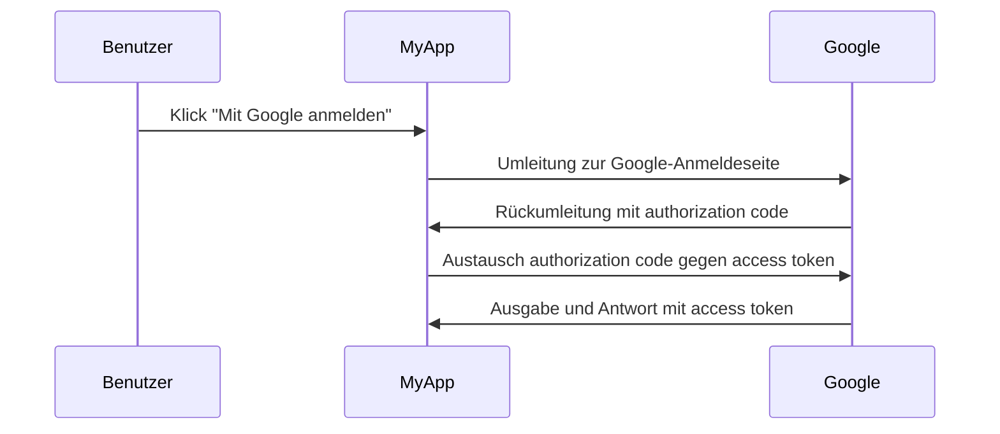

## Was ist ein Autorisierungsserver?

Der Begriff "autorisierungsserver" kann ein allgemeiner Begriff sein, der sich auf jeden Server bezieht, der authorization (Autorisierung) durchführt. Wir werden uns auf die Definition im Kontext der <Ref slug="oauth-2.0" /> und <Ref slug="openid-connect" /> Frameworks konzentrieren.

In OAuth 2.0 ist ein autorisierungsserver eine Komponente, die <Ref slug="access-token">access tokens</Ref> an <Ref slug="client">clients</Ref> ausstellt, nachdem sie erfolgreich authentifiziert und autorisiert wurden. Die access tokens (Zugriffstoken) werden von clients (Klienten) verwendet, um im Namen des Benutzers (resource owner) auf geschützte Ressourcen zuzugreifen.

Zu viele Begriffe? Lassen Sie uns ein Beispiel aus der realen Welt sehen: Ein Benutzer klickt auf "Mit Google anmelden" in einer Anwendung "MyApp", die den <Ref slug="authorization-code-flow" /> für die Google-Anmeldung verwendet.

In diesem Beispiel fungiert Google als **autorisierungsserver**, der ein access token an den **client** (MyApp) ausstellt, nachdem der Benutzer sich erfolgreich angemeldet hat. Der client (Klient) kann dann das **access token** verwenden, um das Benutzerprofil (geschützte Ressource) auf Google abzurufen.

### Autorisierungsserver in OpenID Connect (OIDC)

Da OpenID Connect auf OAuth 2.0 aufbaut, wiederverwendet es einige Begriffe und Konzepte von OAuth 2.0. OIDC fügt die Möglichkeit zur authentication (Authentifizierung) zum OAuth 2.0 autorisierungsserver hinzu, wodurch der autorisierungsserver auch ein <Ref slug="openid-connect" headingId="openid-provider-op" /> wird. Um Mehrdeutigkeiten zu vermeiden, empfehlen wir, immer den Begriff "OpenID Provider" zu verwenden, wenn auf den autorisierungsserver in OIDC verwiesen wird.

Zusätzlich zur Ausgabe von access tokens gibt der OpenID Provider (autorisierungsserver) in OIDC auch <Ref slug="id-token">ID tokens</Ref> an clients (Klienten) aus. Die ID tokens enthalten Benutzerinformationen und werden zur Authentifizierung von Benutzern verwendet.

## Wie funktioniert ein Autorisierungsserver?

Ein autorisierungsserver sollte die <Ref slug="oauth-2.0-grant">OAuth 2.0 grants (flüsse)</Ref> unterstützen, um access tokens an clients auszustellen. Ein Grant-Typ besteht in der Regel aus einer Reihe von Schritten, die der client und der autorisierungsserver befolgen, um ein access token zu erhalten.

- Für die Benutzerautorisierung erfordert die Mehrheit der Grant-Typen, dass der client eine <Ref slug="authorization-request" /> an den autorisierungsserver initiiert. Im obigen Google-Anmeldebeispiel ist der Schritt "Umleitung zur Google-Anmeldeseite" eine authorization request (Autorisierungsanfrage), die vom client initiiert wird.
- Für <Ref slug="machine-to-machine" /> Autorisierung kann der client den <Ref slug="client-credentials-flow" /> verwenden, um direkt eine <Ref slug="token-request" /> an den autorisierungsserver zu senden.

Der autorisierungsserver sollte auch die Anfrage des clients validieren, den client authentifizieren und die Identität des Benutzers überprüfen, bevor er ein access token ausgibt. Es kann auch zusätzliche Sicherheitsmaßnahmen durchsetzen, wie z. B. <Ref slug="pkce" /> für den <Ref slug="authorization-code-flow" />.

## Einsatzmöglichkeiten von Autorisierungsservern

Wie der Name schon sagt, werden autorisierungsserver verwendet, um <Ref slug="authorization" /> zu handhaben. Der autorisierungsserver kann sowohl Erst- als auch Drittparteien einbeziehen:

- Das obige Google-Anmeldungsbeispiel.
- Eine E-Commerce-Website (client), die Zugriff auf die Zahlungsinformationen eines Benutzers (geschützte Ressource) von einer anderen Website anfordert.
- Eine mobile App (client), die Zugriff auf die Standortdaten eines Benutzers (geschützte Ressource) von einem Standortdienstanbieter anfordert.

Oder es kann nur für interne Autorisierungen verwendet werden, wie zum Beispiel:

- Ein Benutzer muss auf seine Bestellungen (geschützte Ressource) auf einer E-Commerce-Website (client) zugreifen.
- Ein Dienst (client) muss in einer Microservices-Architektur auf eine Datenbank (geschützte Ressource) zugreifen.

In modernen Anwendungen kann ein autorisierungsserver auch ein <Ref slug="identity-provider" /> sein, das auch <Ref slug="openid-connect" /> für die Benutzerauthentication (Authentifizierung) unterstützt.

<SeeAlso slugs={["oauth-2.0", "authorization-request", "access-token"]} />

<Resources
  urls={[
    "https://blog.logto.io/ciam-102-authz-and-rbac",
    "https://tools.ietf.org/html/rfc6749",
  ]}
/>
