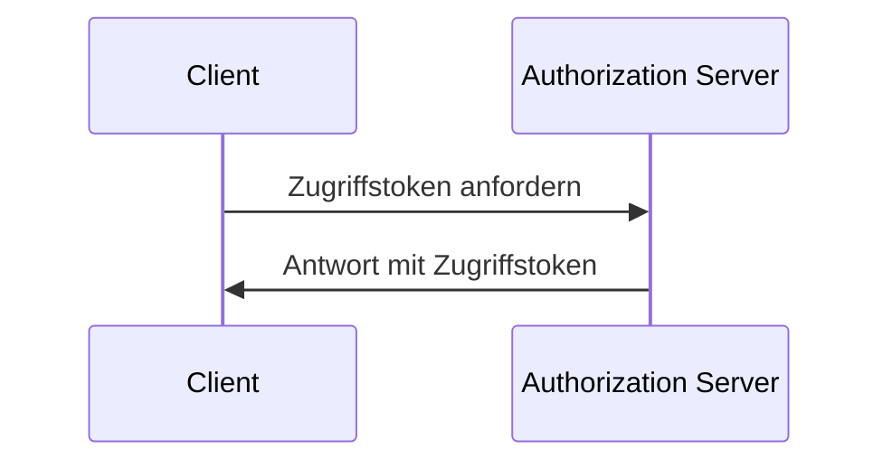
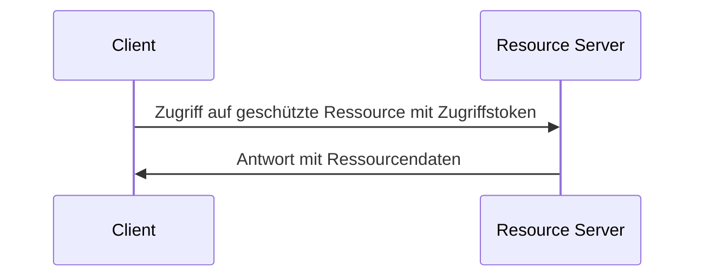

## Was ist der Client-Credentials-Flow?

Der Client-Credentials-Flow (Grant) ist ein <Ref slug="oauth-2.0-grant" />-Typ, der es vertraulichen Clients ermöglicht, <Ref slug="access-token">Zugriffstoken</Ref> zu erhalten, um auf geschützte Ressourcen zuzugreifen. In der Regel wird dieser Flow für <Ref slug="machine-to-machine" /> Kommunikation verwendet, bei der der Client ein Server oder ein Dienst ist.

> [!Hinweis]
> Der Client-Credentials-Flow ist nicht geeignet für die Autorisierung von Endbenutzern. Für die Autorisierung von Endbenutzern solltest du <Ref slug="authentication-request" /> oder <Ref slug="authorization-request" /> verwenden.

## Wie funktioniert der Client-Credentials-Flow?

Der Client-Credentials-Flow ist ein einfacher zweistufiger Prozess:

1. **Tokenanfrage**: Der Client sendet eine <Ref slug="token-request" /> mit seinen Client-Credentials (Client-ID und Client-Secret) und den angeforderten <Ref slug="scope">Scopes</Ref>.
2. **Tokenantwort**: Der <Ref slug="authorization-server" /> validiert die Client-Credentials und stellt ein Zugriffstoken aus, wenn der Client autorisiert ist.

Hier ist ein vereinfachtes Sequenzdiagramm des Client-Credentials-Flows:



Hier ist ein nicht normatives Beispiel einer Tokenanfrage im Client-Credentials-Flow:

```http
POST /token HTTP/1.1
Host: your-authorization-server.com
Content-Type: application/x-www-form-urlencoded

grant_type=client_credentials
  &client_id=YOUR_CLIENT_ID
  &client_secret=YOUR_CLIENT_SECRET
  &scope=read write
```

Der Authorization Server wird die Client-Credentials validieren und ein Zugriffstoken ausstellen, wenn der Client autorisiert ist. Sobald der Client das Zugriffstoken erhält, kann er es verwenden, um auf geschützte Ressourcen (z. B. eine API) in seinem eigenen Namen zuzugreifen. Hier ist ein Beispiel, wie ein Client das Zugriffstoken verwendet, um auf eine API zuzugreifen:



Beachte, dass der <Ref slug="resource-server" /> das Zugriffstoken validieren und die <Ref slug="access-control" />-Richtlinien durchsetzen sollte, um sicherzustellen, dass der Client die notwendigen Berechtigungen hat, um auf die Ressource zuzugreifen.

### Schlüsselkriterien in einer Client-Credentials-Flow-Tokenanfrage

Im Gegensatz zu anderen OAuth 2.0 Flows hat der Client-Credentials-Flow eine einfache <Ref slug="token-request" /> mit den folgenden Schlüsselkriterien:

- **`grant_type`**: Der Grant-Typ sollte auf `client_credentials` gesetzt werden, um den Client-Credentials-Flow anzuzeigen.
- **`client_id`**: Die vom Authorization Server ausgestellte Client-Kennung.
- **`client_secret`**: Das vom Authorization Server ausgestellte Client-Secret.
- **`scope`**: Die angeforderten <Ref slug="scope">Scopes</Ref> (Berechtigungen) für das Zugriffstoken.
- **`resource`**: Der optionale Parameter, der den <Ref slug="resource-indicator" /> für die angeforderten Ressourcen angibt. Der Authorization Server muss [RFC 8707](https://datatracker.ietf.org/doc/html/rfc8707) unterstützen, um diesen Parameter zu verwenden.

## Sicherheitsüberlegungen

### Vertrauliche Clients

Der Client-Credentials-Flow ist geeignet für <Ref slug="client" headingId="confidential-clients" /> (vertrauliche Clients), die das Client-Secret sicher speichern können. Wenn der Client ein öffentlicher Client ist (z. B. eine Single-Page-Anwendung), sollte er den Client-Credentials-Flow nicht verwenden, da das Client-Secret offengelegt werden kann.

### Tokenablauf

Obwohl das im Client-Credentials-Flow erhaltene Zugriffstoken eine lange Ablaufzeit haben kann, wird empfohlen, kurzlebige Zugriffstoken (z. B. 1 Stunde) zu verwenden, um das Risiko unbefugten Zugriffs zu verringern, falls das Token kompromittiert wird.

### Rotation des Client-Secrets

Um die Sicherheit zu erhöhen, wird empfohlen, das Client-Secret regelmäßig zu rotieren. Der Authorization Server sollte die Rotation des Client-Secrets unterstützen, ohne die Fähigkeit des Clients, Zugriffstoken zu erhalten, zu beeinträchtigen. Beispielsweise sollte der Authorization Server mehrere Client-Secrets für die Abwärtskompatibilität während des Rotationsprozesses unterstützen.

<SeeAlso slugs={["machine-to-machine", "token-request", "access-token", "scope", "resource-indicator"]} />

<Resources
  urls={[
    "https://blog.logto.io/programmatic-authentication-methods",
    { 
      url: "https://datatracker.ietf.org/doc/html/rfc6749#section-4.4",
      result: {
        ogTitle: "Client Credentials Grant",
        ogDescription: "The client can request an access token using only its client credentials (or other supported means of authentication) when the client is requesting access to the protected resources under its control, or those of another resource owner that have been previously arranged with the authorization server."
      }
    }
  ]}
/>
