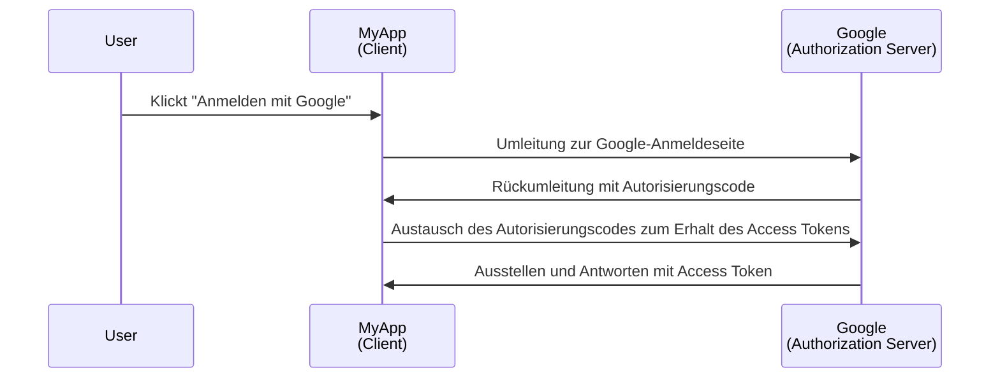
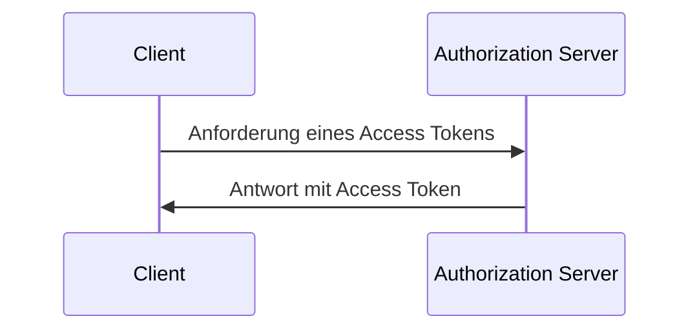

## Was ist ein Client?

Ein Client im Kontext von <Ref slug="oauth-2.0" /> und <Ref slug="openid-connect" /> ist eine Anwendung, die Authentifizierung (Authentication) oder Autorisierung (Authorization) anfordert. Beispielsweise agiert die Anwendung als **Client**, der die Autorisierung bei Google anfordert, wenn ein Benutzer auf einer Anwendung "Anmelden mit Google" klickt.

> "Client" und "Anwendung" werden im Kontext von <Ref slug="iam" /> häufig synonym verwendet.

Es gibt mehrere Kategorisierungen von Clients basierend auf ihren Fähigkeiten und Vertrauensstufen, aber für die Frameworks ist eine signifikante Unterscheidung zwischen öffentlichen und vertraulichen Clients wichtig. Es beeinflusst, wie der Client Tokens erhalten kann und welche Grant-Typen er verwenden kann.

### Öffentliche Clients ||public-clients||

Öffentliche Clients sind Anwendungen, die ihre Anmeldeinformationen nicht vertraulich halten können, was bedeutet, dass der Ressourcenbesitzer (Benutzer) darauf zugreifen kann. Beispiele für öffentliche Clients sind:

- Einzelseiten-Anwendungen (SPAs)
- Mobile Apps
- Desktop-Apps

Du magst argumentieren, dass mobile und Desktop-Apps sichere Speichermöglichkeiten haben, aber die meisten Frameworks betrachten sie als öffentliche Clients, weil sie an Endbenutzer verteilt werden und angenommen wird, dass die Endbenutzer auf die Anmeldeinformationen zugreifen können.

### Vertrauliche Clients ||confidential-clients||

Vertrauliche (private) Clients sind Anwendungen, die sensible Informationen vertraulich speichern können, ohne sie den Ressourcenbesitzern (Endbenutzern) offenzulegen. Beispiele für vertrauliche Clients sind:

- Webserver
- Backend-Dienste

## Wie funktioniert ein Client?

### Benutzer-Authentifizierung (Authentication) und -Autorisierung (Authorization)

Wenn ein Client einen Benutzer authentifizieren möchte, initiiert der Client eine <Ref slug="authorization-request" /> an den <Ref slug="authorization-server" />, um ein <Ref slug="access-token" /> zu erhalten. Der Client sollte notwendige Parameter in die Anfrage einschließen, wie die Client-ID, Umleitungs-URI (redirect URI) und Scopes. Hier ist ein vereinfachtes Sequenzdiagramm des Authorization Code Flow:

In diesem Beispiel agiert Google als der **Authorization Server**, der dem **Client** (MyApp) ein Access Token ausstellt, nachdem sich der Benutzer erfolgreich anmeldet. Der Client kann dann das **Access Token** verwenden, um das Profil des Benutzers (geschützte Ressource) bei Google abzurufen.

Für OpenID Connect (OIDC) Clients muss der Client eine <Ref slug="authentication-request" /> initiieren, um den Benutzer zu authentifizieren (Authentication). Er verwendet denselben Endpunkt wie die Autorisierungsanfrage (authorization request), aber die Parameter und die Antwort sind unterschiedlich.

### Maschinen-zu-Maschinen-Kommunikation

Für <Ref slug="machine-to-machine" /> Kommunikation kann der Client den <Ref slug="client-credentials-flow" /> verwenden, um direkt eine <Ref slug="token-request" /> an den Authorization Server zu senden. Der Client sollte in der Anfrage die Client-ID, das Client-Geheimnis und die Scopes einschließen. Hier ist ein vereinfachtes Sequenzdiagramm des Client Credentials Flow:

Der Authorization Server wird die Anmeldeinformationen des Clients validieren und ein Access Token ausstellen, wenn der Client autorisiert ist. Da der Client das Client-Geheimnis senden muss, ist es wichtig, den Client Credentials Flow nur für vertrauliche Clients zu verwenden.

## Sicherheitsüberlegungen

### Client-Typen

Der Client-Typ (öffentlich oder privat) beeinflusst die Sicherheitsüberlegungen für den Client.

- Öffentliche Clients sollten nicht den Client Credentials Flow verwenden, da sie das Client-Geheimnis nicht sicher speichern können. Stattdessen wird für öffentliche Clients empfohlen, den <Ref slug="authorization-code-flow" /> mit <Ref slug="pkce" /> zu verwenden, um Benutzer zu authentifizieren.
- Vertrauliche Clients können den Client Credentials Flow für die Maschinen-zu-Maschinen-Kommunikation verwenden. Sie sollten das Client-Geheimnis sicher speichern und nur in sicheren Umgebungen verwenden.

### Token-Speicherung

Clients sollten das höchste mögliche Sicherheitsniveau verwenden, um Tokens zu speichern. Beispielsweise werden in Webanwendungen HTTP-Only-Cookies empfohlen, um Access Tokens zu speichern und XSS-Angriffe zu verhindern.

### Token-Ablauf

Access Tokens haben eine begrenzte Lebensdauer, um das Risiko unbefugten Zugriffs zu reduzieren. Clients sollten den Ablauf der Tokens elegant handhaben, indem sie <Ref slug="refresh-token">Refresh Tokens</Ref> verwenden, um neue Access Tokens zu erhalten.

### Token-Widerruf

Clients sollten darauf vorbereitet sein, den Token-Widerruf zu handhaben. Wenn sich der Benutzer abmeldet oder der Authorization Server das Token widerruft, sollte der Client das Token aus dem clientseitigen Speicher löschen.

<SeeAlso slugs={["oauth-2.0", "oauth-2.0-grant", "openid-connect", "authorization-request", "authentication-request"]} />

<Resources
  urls={[
    "https://blog.logto.io/secure-cloud-apps-with-oauth-and-openid-connect",
    "https://datatracker.ietf.org/doc/html/rfc6749",
    "https://openid.net/specs/openid-connect-core-1_0.html"
  ]}
/>
