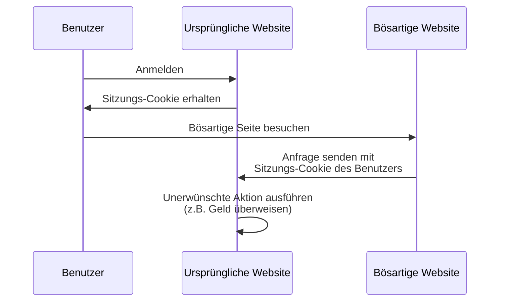

## Was ist Cross-Site-Request-Forgery (CSRF)?

Beim Entwickeln von Webanwendungen ist CSRF ein oft gehörter Begriff, der bei Entwicklern und Sicherheitsfachleuten Angst auslöst. Es handelt sich um eine Art von Angriff, bei dem authentifizierte Benutzer dazu verleitet (oder getäuscht) werden, unerwünschte Aktionen in einer Webanwendung ohne Zustimmung auszuführen.

CSRF ist auch als „One-Click-Attack“ oder „Session Riding“ bekannt, da es sich auf die aktive Sitzung des Benutzers verlässt, um bösartige Aktionen auszuführen.

## Wie funktioniert CSRF?

Der CSRF-Angriff funktioniert, indem er das Vertrauen ausnutzt, das eine Webanwendung in den Browser des Benutzers hat. Hier ist, wie es typischerweise passiert:



Du hast möglicherweise einige Fragen zu dieser Sequenz. Lass uns die Gründe dafür erkunden.

### Warum kann die bösartige Website eine Anfrage an die ursprüngliche Website senden?

Die Same-Origin-Policy (SOP) ist ein Sicherheitsmerkmal in Webbrowsern, das einschränkt, wie ein Dokument oder ein Skript, das von einem Ursprung geladen wurde, mit einer Ressource (z.B. Cookies, DOM) von einem anderen Ursprung interagieren kann. Die SOP verhindert jedoch nicht, dass der Browser Anfragen an einen anderen Ursprung sendet.

Daher kann die bösartige Website zwar nicht direkt das Sitzungs-Cookie lesen oder ändern, sie kann jedoch weiterhin Anfragen an die ursprüngliche Website senden, indem sie die aktive Sitzung des Benutzers verwendet.

Du könntest argumentieren, dass die meisten Webanwendungen auch [CORS](https://developer.mozilla.org/en-US/docs/Web/HTTP/CORS) verwenden, um unautorisierte umgebungsübergreifende Anfragen zu verhindern, aber CSRF hat immer noch einen Weg, es zu umgehen:

1. GET-basierte Angriffe: Die bösartige Website kann den Benutzer dazu verleiten, eine URL zu besuchen, die eine Aktion auf der ursprünglichen Website ausführt:

    - Eine Weiterleitung zu `https://example.com/transfer?amount=1000&to=attacker`.
    - Ein Bild-Tag, das `https://example.com/transfer?amount=1000&to=attacker` lädt.

    Das ist ein wichtiger Grund, warum GET-Anfragen keine Nebenwirkungen haben sollten.

2. Formularbasierte Angriffe: Die bösartige Website kann ein verstecktes Formular erstellen, das Daten an die ursprüngliche Website übermittelt. Zum Beispiel eine POST-Anfrage an `https://example.com/transfer` mit versteckten Formularfeldern.

### Warum hat die bösartige Website das Sitzungs-Cookie des Benutzers?

Der Browser des Benutzers sendet automatisch Cookies an die ursprüngliche Website, wenn er Anfragen stellt. Auf diese Weise weiß die ursprüngliche Website, dass der Benutzer authentifiziert ist und in ihrem Namen Aktionen ausführen kann.

Tatsächlich "hat" die bösartige Website das Sitzungs-Cookie nicht; sie nutzt lediglich das Verhalten des Browsers aus, um das Cookie zusammen mit der Anfrage zu senden.

## Wie kann man CSRF-Angriffe verhindern?

Um CSRF-Angriffe zu verhindern, ist ein mehrschichtiger Ansatz erforderlich, der sowohl den Server als auch den Client betrifft. Hier sind einige gängige Techniken, um CSRF-Sicherheitslücken zu mildern:

### Verwenden von Anti-CSRF-Tokens

Anti-CSRF-Tokens sind zufällige Werte, die vom Server generiert und in die Formulare der Webanwendung eingebettet werden. Wenn das Formular übermittelt wird, validiert der Server das Token, um sicherzustellen, dass die Anfrage legitim ist.

Zum Beispiel ein verstecktes Eingabefeld in einem HTML-Formular:

```html
<form action="/transfer" method="post">
  <input type="hidden" name="csrf_token" value="random_token_here" />
  <!-- Andere Formularfelder -->
  <button type="submit">Überweisen</button>
</form>
```

Mit diesem Ansatz kann die bösartige Website keine Anfrage fälschen, da sie das Anti-CSRF-Token nicht kennt. Der `state` Parameter in <Ref slug="redirect-uri" /> ist ein ähnliches Konzept.

### Verwendung von SameSite-Cookies

Das `SameSite`-Attribut in Cookies kann CSRF-Angriffe verhindern, indem es einschränkt, wann Cookies an den Server gesendet werden:

| `SameSite` Wert  | Beschreibung                                                                         |
|------------------|--------------------------------------------------------------------------------------|
| `Strict`         | Cookies werden nur in einem Erstanbieterkontext gesendet.                             |
| `Lax`            | Cookies werden in einem Erstanbieterkontext und mit GET-Anfragen von externen Seiten gesendet. |
| `None`           | Cookies werden in allen Kontexten gesendet. Erfordert das `Secure`-Attribut.          |

Durch Setzen des `SameSite`-Attributs auf `Strict` oder `Lax` ohne Nebenwirkungen in deinen GET-Anfragen kannst du CSRF-Angriffe verhindern.

Darüber hinaus sollte das `Secure`-Attribut immer gesetzt sein, um sicherzustellen, dass das Cookie nur über HTTPS-Verbindungen gesendet wird.

### Überprüfung der Header

1. **Origin-Header**: Der `Origin`-Header wird vom Browser gesendet, um den Ursprung der Anfrage anzuzeigen. Der Server kann diesen Header überprüfen, um sicherzustellen, dass die Anfrage von einem erwarteten Ursprung kommt.
2. **Referer-Header**: Der `Referer`-Header enthält die URL der vorherigen Seite. Obwohl er gefälscht werden kann, kann er dennoch als zusätzliche Schutzschicht verwendet werden.

<SeeAlso slugs={["authorization-code-flow", "redirect-uri"]} />

<Resources
  urls={[
    'https://blog.logto.io/csrf',
    "https://cheatsheetseries.owasp.org/cheatsheets/Cross-Site_Request_Forgery_Prevention_Cheat_Sheet.html",
  ]}
/>