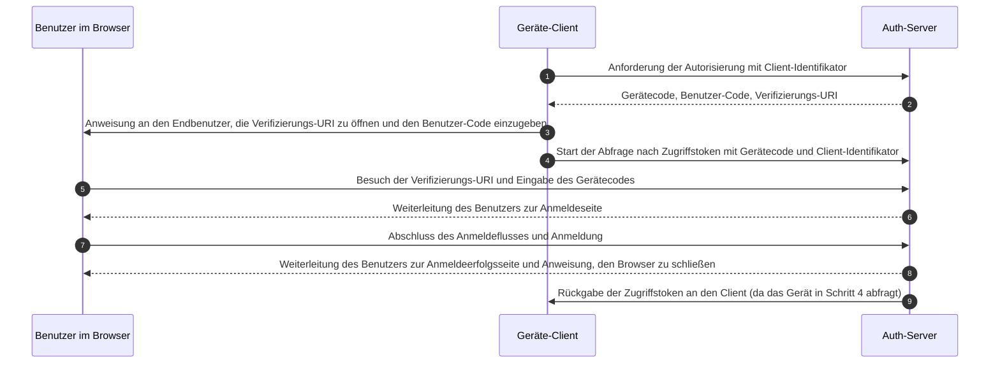

## Was ist der Gerätefluss (Device flow)?

Der [OAuth Geräteautorisierungsfluss](https://www.rfc-editor.org/rfc/rfc8628), auch bekannt als Gerätefluss (Device flow), ist ein <Ref slug="oauth-2.0-grant" />, der für Geräte mit eingeschränkten Eingabemöglichkeiten (z. B. Smart-TVs, IoT-Geräte, Spielkonsolen) oder kopflose Apps (z. B. CLI-Tools) entwickelt wurde. Er ermöglicht es Benutzern, <Ref slug="authorization-request">Autorisierungsanfragen</Ref> auf diesen Geräten zu initiieren und den Prozess dann mit einem Gerät mit besseren Eingabemöglichkeiten wie einem Smartphone oder Laptop abzuschließen.

## Wann sollte der Gerätefluss (Device flow) verwendet werden?

1. **Geräte mit eingeschränkter Eingabe**
    - Anmeldung auf Smart-TVs (z. B. Medien-Apps)
    - Anmeldung auf Spielkonsolen (z. B. Spielsystem oder Medien-Apps)
    - Anmeldung auf Meet-Geräten (z. B. offizielle Apps oder Videomeeting-Apps)
    - Anmeldung auf tragbaren Geräten (z. B. Smartwatches mit eingeschränkter Eingabe)
    - Zugriff auf IoT-Geräte (z. B. Drucker, Video-Encoder oder Lautsprecher)
2. **Kopflose Anwendungen**
    - Anmeldung über die Befehlszeilenschnittstelle (z. B. GitHub CLI oder Stripe CLI)
3. **QR-Code-Anmeldung für Desktop-Anwendungen**
    - Schnelles und sicheres Anmelden bei Desktop-Anwendungen durch Scannen eines QR-Codes mit deinem Smartphone (z. B. Telegram, Steam-Anmeldungen auf dem Desktop). Dieser QR-Code-Anmeldefluss kann als Variante des traditionellen OAuth 2.0 Geräteflusses betrachtet werden.

## Wie sieht der Endbenutzerfluss des Geräteflusses (Device flow) aus?

Wenn wir die QR-Code-Anmeldevariante ignorieren, konzentrieren wir uns auf den Standard-OAuth 2.0 Gerätefluss. Es gibt zwei Arten von Geräten, die beteiligt sind:

### Gerät zur Anzeige des Gerätecodes

Dies ist das Gerät mit eingeschränkter Eingabe oder die kopflose Anwendung, bei der der Benutzer den Zugriff autorisieren muss. Es zeigt den [Gerätecode und die Verifizierungs-URI](#what-does-device-flow-workflow-look-like) an und leitet den Benutzer an, wie er fortfahren soll.

Die grundlegende Benutzeroberfläche ist:


Um die Benutzererfahrung zu verbessern, generieren Dienste oft einen QR-Code für die Verifizierungs-URL:


Für noch mehr Effizienz ersetze die QR-Code-Ressource in der `verification_uri` (z. B. `https://example.com/device`) durch `verification_uri_complete` (z. B. `https://example.com/device?user_code=DSHP-SNCT`), die den Gerätecode in der URL enthält und den Benutzern hilft, den Gerätecode in Felder vorab auszufüllen.

### Autorisierungsgerät

Folgend den Anweisungen auf dem Anmeldezielgerät wird der Benutzer:

1. Ein anderes Gerät mit Browserzugang und Eingabemöglichkeiten verwenden, um die Verifizierungs-URL zu öffnen.
2. Den angezeigten Gerätecode eingeben (der möglicherweise vorab ausgefüllt ist) und fortfahren.
3. Wenn keine bestehenden Sitzungen im Browser vorhanden sind, muss sich der Benutzer zuerst beim Dienst anmelden.
4. Eine Einwilligungsseite wird die Benutzer auffordern, die Geräteanmeldung zu autorisieren.
5. Schließlich wird nach der Autorisierung eine Erfolgsseite angezeigt.


Hier sind einige etablierte Produkte mit Verifizierungs-URLs für den Gerätefluss zu Testzwecken:

- Anmelden bei [YouTube auf Smart-TVs](https://www.youtube.com/watch?v=yTcuazSy5Cs): [youtube.com/activate](https://youtube.com/activate)
- Anmelden bei Disney+ auf Smart-TV: [disneyplus.com/begin](https://disneyplus.com/begin)
- Anmelden bei [Shopify auf Samsung Galaxy Watch](https://www.drmare.com/spotify-music/spotify-on-galaxy-watch.html): [spotify.com/pair](https://spotify.com/pair)
- Anmelden bei [Zoom auf Meeting-Geräten](https://developers.zoom.us/blog/device-authorization/): [zoom.us/oauth_device](https://zoom.us/oauth_device)
- Anmelden bei [GitHub CLI](https://docs.github.com/en/apps/oauth-apps/building-oauth-apps/authorizing-oauth-apps#device-flow): [github.com/login/device](https://github.com/login/device)
- Nutzung des [Google Geräteflusses](https://www.oauth.com/oauth2-servers/device-flow/user-flow/): https://www.google.com/device

## Wie sieht der Workflow des Geräteflusses (Device flow) aus?

Zuerst solltest du die Parameter der Geräteautorisierungsantwort verstehen, die verwendet werden, um die Informationen auf dem Gerätecode-Anzeigegerät zu verarbeiten:

| Parameter                              | Beschreibung                                                                                                                                                                    |
| -------------------------------------- | ------------------------------------------------------------------------------------------------------------------------------------------------------------------------------ |
| `device_code`                          | Der Geräteverifizierungscode.                                                                                                                                                  |
| `user_code`                            | Der Verifizierungscode des Endbenutzers.                                                                                                                                        |
| `verification_uri`                     | Die Verifizierungs-URI des Endbenutzers auf dem Autorisierungsserver. Die URI sollte kurz und leicht zu merken sein, da die Endbenutzer aufgefordert werden, sie manuell in ihren Benutzeragenten einzugeben. |
| `verification_uri_complete` (optional) | Eine Verifizierungs-URI, die den "user_code" (oder andere Informationen mit der gleichen Funktion wie der "user_code") enthält, die für die nicht-textuelle Übertragung entwickelt wurde.             |
| `expires_in`                           | Die Lebensdauer in Sekunden des "device_code" und "user_code".                                                                                                                  |
| `interval`                             | Die minimale Zeit in Sekunden, die der Client zwischen den Abfrageanforderungen an den Token-Endpunkt warten SOLLTE. Wenn kein Wert angegeben ist, MÜSSEN Clients 5 als Standard verwenden. |

```json
{
    "device_code": "GmRhmhcxhwAzkoEqiMEg_DnyEysNkuNhszIySk9eS",
    "user_code": "WDJBMJHT",
    "verification_uri": "https://custom.domain.com/device",
    "verification_uri_complete":
        "https://custom.domain.com/device?user_code=WDJB-MJHT",
    "expires_in": 900,
    "interval": 5
}
```

Wenn ein Benutzer den Gerätefluss für die Authentifizierung verwendet, umfasst er hauptsächlich die folgenden Schritte:



1. Der Geräte-Client fordert die Autorisierung vom Auth-Server mit einem Client-Identifikator an (normalerweise die Client-ID auf der Auth-Server-Plattform).
2. Der Auth-Server antwortet dem Geräte-Client mit Gerätecode, Benutzer-Code und Verifizierungs-URI.
3. Der Geräte-Client zeigt die Verifizierungs-URI und den Benutzer-Code dem Benutzer in Form von Text (oder einem QR-Code usw.) an und weist den Benutzer an, die URI zu besuchen und den Code einzugeben.
4. Gleichzeitig mit Schritt 3 beginnt der Geräte-Client mit der Abfrage nach Zugriffstoken mit Gerätecode und Client-Identifikator vom Auth-Server und wartet darauf, dass der Benutzer die <Ref slug="authorization-request" /> überprüft und die Benutzerautorisierung abschließt.
5. Der Benutzer besucht die vom Auth-Server gehostete Verifizierungs-URI über einen Browser auf einem anderen Gerät und gibt den Benutzer-Code ein.
6. Der Auth-Server leitet den Benutzer zur Anmeldeseite weiter und weist den Benutzer an, die Anmeldung abzuschließen.
7. Der Benutzer hat den Anmeldefluss abgeschlossen und sich erfolgreich angemeldet.
8. Der Auth-Server leitet den Benutzer zur Anmeldeerfolgsseite weiter und weist den Benutzer an, den Browser zu schließen.
9. Gleichzeitig mit Schritt 8 gibt der Auth-Server Zugriffstoken an den Geräte-Client zurück, da der Client seit Schritt 4 abfragt.

Nach diesen Prozessen kann der Geräte-Client das <Ref slug="access-token" /> für nachfolgende Dienste erhalten.

Für weitere Details, lies [RFC 8628 OAuth 2.0 Geräteautorisierungs-Grant](https://datatracker.ietf.org/doc/html/rfc8628#autoid-3).

## Welche Sicherheitsüberlegungen gibt es für den Gerätefluss (Device flow)?

Der Gerätefluss umfasst Interaktionen über zwei Geräte, was ihn potenziellen Sicherheitsrisiken wie der Offenlegung von Gerätecodes, Brute-Force-Angriffen oder Man-in-the-Middle (MitM)-Angriffen aussetzt.

Während das alleinige Erlangen eines Gerätecodes nicht sofortige Autorisierung gewährt (da der Benutzer sich immer noch authentifizieren und autorisieren muss), könnte ein Angreifer versuchen, eine Gerätecode-Anfrage während ihrer Gültigkeitsdauer zu wiederholen. Dies könnte zu unbefugtem wiederholtem Zugriff führen. Um die Sicherheit zu erhöhen, ziehe die folgenden Vorsichtsmaßnahmen in Betracht:

- **Verkürze die `expires_in`-Dauer:** Reduziere das Zeitfenster für Angriffe, indem du die Gültigkeitsdauer des Gerätecodes minimierst.
- **Begrenze fehlgeschlagene Versuche:** Beschränke die Anzahl der falschen Codeeingaben, um Brute-Force-Angriffe zu verhindern.
- **Erzwinge HTTPS:** Stelle sicher, dass alle Kommunikation zwischen dem Gerät und dem Autorisierungsserver mit HTTPS verschlüsselt ist, um Man-in-the-Middle-Angriffe zu verhindern.
- **Begrenze einmalige Verwendung von Gerätecodes:** Beschränke jeden Gerätecode auf **eine einzelne Sitzung**, um seine Wiederverwendung durch unbefugte Parteien zu verhindern.

Beachte, dass die einmalige Verwendung von Gerätecodes keine eingebaute Anforderung des OAuth 2.0 Geräteflusses ist. Es ist eine optionale bewährte Praxis. Einige Entwickler könnten absichtlich für gleichzeitige Geräteautorisierungen mit demselben Code entwerfen (z. B. auf Hunderten von Geräten), aber dieser Ansatz erhöht die Sicherheitsrisiken und sollte sorgfältig bewertet werden.

## Unterstützen OIDC-Anbieter den Gerätefluss (Device flow)?

Während der Gerätefluss traditionell mit OAuth in Verbindung gebracht wird, können <Ref slug="openid-connect" />-Anbieter ihn ebenfalls unterstützen. OIDC bietet zusätzliche Vorteile über den primären Fokus von OAuth auf Autorisierung hinaus. Es erstreckt sich auf Authentifizierung und ermöglicht Anwendungen, sowohl <Ref slug="access-token" /> als auch <Ref slug="id-token" /> in einem einzigen Fluss zu erhalten.

OIDCs robustes einheitliches Identitätsmanagement, einschließlich Token-Validierung und <Ref slug="refresh-token">Aktualisierung</Ref>, macht es gut geeignet für sichere, zuverlässige <Ref slug="authentication" /> und <Ref slug="authorization" /> zwischen Geräten und Anwendungen, insbesondere solchen mit eingeschränkten Eingabemöglichkeiten.

<SeeAlso slugs={['oauth-2.0-grant', 'authorization-code-flow', 'implicit-flow', 'client-credentials-flow']} />

<Resources urls={['https://blog.logto.io/a-brief-introduction-to-oauth2-device-flow', 'https://datatracker.ietf.org/doc/html/rfc8628']} />