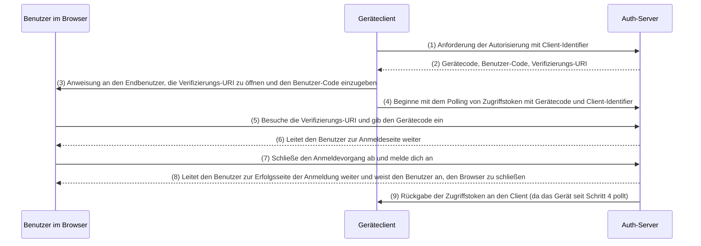

## Was ist der Gerätefluss (Device flow)?

Der [OAuth Geräteautorisierungsfluss (Device Authorization Flow)](https://www.rfc-editor.org/rfc/rfc8628), auch bekannt als Gerätefluss (Device Flow), ist eine [OAuth 2.0](https://oauth.net/2/) Implementierung, die für Geräte mit eingeschränkten Eingabemöglichkeiten (z. B. Smart-TVs, IoT-Geräte, Spielkonsolen) oder kopflose Apps (z. B. CLI-Tools) entwickelt wurde. Es ermöglicht Benutzern, Autorisierungsanfragen auf diesen Geräten zu initiieren und den Prozess dann mit einem Gerät mit besserer Eingabemöglichkeit wie einem Smartphone oder Laptop abzuschließen.

## Wann sollte der Gerätefluss (Device flow) verwendet werden?

1. **Geräte mit eingeschränkter Eingabefähigkeit**
    - Anmeldung auf Smart-TVs (z. B. Medien-Apps)
    - Anmeldung auf Spielkonsolen (z. B. Spielsystem oder Medien-Apps)
    - Anmeldung auf Meet-Geräten (z. B. offizielle Apps oder Video-Meeting-Apps)
    - Anmeldung auf tragbaren Geräten (z. B. Smartwatches mit eingeschränkter Eingabe)
    - Zugriff auf IoT-Geräte (z. B. Drucker, Video-Encoder oder Lautsprecher)
2. **Kopflose Anwendungen**
    - Anmeldung über Befehlszeilenoberfläche (z. B. GitHub CLI oder Stripe CLI)
3. **QR-Code-Anmeldung für Desktop-Anwendungen**
    - Schnelles und sicheres Anmelden bei Desktop-Anwendungen durch Scannen eines QR-Codes mit deinem Smartphone (z. B. Telegram, Steam-Anmeldungen auf dem Desktop). Dieser QR-Code-Anmeldefluss kann als Variante des traditionellen OAuth 2.0 Geräteflusses betrachtet werden.

## Wie sieht der Endbenutzerfluss beim Gerätefluss (Device flow) aus?

Ohne die QR-Code-Anmeldung zu betrachten, konzentrieren wir uns auf den standardmäßigen OAuth 2.0 Gerätefluss. Es gibt zwei Arten von beteiligten Geräten:

### Gerät zur Anzeige des Gerätecodes

Dies ist das Gerät mit eingeschränkter Eingabemöglichkeit oder die kopflose Anwendung, bei der der Benutzer den Zugriff autorisieren muss. Es zeigt den [Gerätecode und die Verifizierungs-URI](#what-does-device-flow-workflow-look-like) an und weist den Benutzer an, wie weiter vorzugehen ist.

Die grundlegende Benutzeroberfläche ist:


Um die Benutzererfahrung zu verbessern, generieren Dienste oft einen QR-Code für die Verifizierungs-URL:


Für noch mehr Effizienz ersetze die QR-Code-Ressource in der `verification_uri` (z. B. `https://example.com/device`) mit `verification_uri_complete` (z. B. `https://example.com/device?user_code=WDJB-MJHT`), die den Gerätecode in die URL einfügt, um den Benutzern zu helfen, den Gerätecode in die Felder vorab auszufüllen.

### Autorisierungsgerät

Anweisungen auf dem Zielgerät zur Anmeldung folgend, wird der Benutzer:

1. Ein anderes Gerät mit Browserzugang und Eingabemöglichkeiten verwenden, um die Verifizierungs-URL zu öffnen.
2. Den angezeigten Gerätecode eingeben (der möglicherweise vorab ausgefüllt ist) und fortfahren.
3. Wenn es keine vorhandenen Sitzungen im Browser gibt, wird der Benutzer zuerst beim Dienst anmelden.
4. Eine Einverständnisseite wird die Benutzer auffordern, die Geräteanmeldung zu autorisieren.
5. Schließlich wird nach der Autorisierung eine Erfolgsseite angezeigt.

Hier sind einige etablierte Produkte mit Verifizierungs-URLs für den Gerätefluss (Device Flow) zum Testen:

- Bei [YouTube auf Smart-TVs anmelden](https://www.youtube.com/watch?v=yTcuazSy5Cs): [youtube.com/activate](https://youtube.com/activate)
- Bei Disney+ auf Smart-TV anmelden: [disneyplus.com/begin](https://disneyplus.com/begin)
- Bei [Shopify auf Samsung Galaxy Watch anmelden](https://www.drmare.com/spotify-music/spotify-on-galaxy-watch.html): [spotify.com/pair](https://spotify.com/pair)
- Bei [Zoom auf Meeting-Geräten anmelden](https://developers.zoom.us/blog/device-authorization/): [zoom.us/oauth_device](https://zoom.us/oauth_device)
- Bei [GitHub CLI anmelden](https://docs.github.com/en/apps/oauth-apps/building-oauth-apps/authorizing-oauth-apps#device-flow): [github.com/login/device](https://github.com/login/device)
- [Google Gerätefluss (Device flow) nutzen](https://www.oauth.com/oauth2-servers/device-flow/user-flow/): https://www.google.com/device

## Wie sieht der Workflow beim Gerätefluss (Device flow) aus?

Zuerst solltest du die Parameter der Geräteautorisierungsantwort verstehen, die zur Verarbeitung der Informationen auf dem Gerät zur Anzeige des Gerätecodes verwendet wird:

| Parameter                              | Beschreibung                                                                                                                                                                    |
| -------------------------------------- | ------------------------------------------------------------------------------------------------------------------------------------------------------------------------------ |
| `device_code`                          | Der Geräteverifizierungscode.                                                                                                                                                   |
| `user_code`                            | Der Endbenutzerverifizierungscode.                                                                                                                                              |
| `verification_uri`                     | Die Endbenutzerverifizierungs-URI auf dem Authorization Server. Die URI sollte kurz und leicht zu merken sein, da Endbenutzer aufgefordert werden, sie manuell in ihr Benutzeragent einzugeben. |
| `verification_uri_complete` (optional) | Eine Verifizierungs-URI, die den "user_code" (oder andere Informationen mit der gleichen Funktion wie der "user_code") enthält, und für nicht-textuelle Übertragung konzipiert ist.             |
| `expires_in`                           | Die Lebensdauer in Sekunden des "device_code" und "user_code".                                                                                                                  |
| `interval`                             | Die Mindestzeit in Sekunden, die der Client zwischen den Polling-Anfragen an den Token-Endpunkt warten SOLLTE. Wenn kein Wert angegeben wird, MÜSSEN Clients 5 als Standard verwenden. |

```json
{
    "device_code": "GmRhmhcxhwAzkoEqiMEg_DnyEysNkuNhszIySk9eS",
    "user_code": "WDJBMJHT",
    "verification_uri": "https://custom.domain.com/device",
    "verification_uri_complete":
        "https://custom.domain.com/device?user_code=WDJB-MJHT",
    "expires_in": 900,
    "interval": 5
}
```

Wenn ein Benutzer den Gerätefluss (Device flow) zur Authentifizierung verwendet, umfasst es hauptsächlich die folgenden Schritte:



1. Der Geräteclient fordert beim Auth-Server mit einem Client-Identifier (normalerweise der Client-Id auf der Auth-Server-Plattform) eine Autorisierung an.
2. Der Auth-Server antwortet dem Geräteclient mit Gerätecode, Benutzer-Code und Verifizierungs-URI.
3. Der Geräteclient zeigt dem Benutzer die Verifizierungs-URI und den Benutzer-Code in Textform (oder als QR-Code etc.) an und weist den Benutzer an, zur URI zu gehen und den Code einzugeben.
4. Gleichzeitig mit Schritt 3 beginnt der Geräteclient mit dem Polling von Zugriffstoken mit Gerätecode und Client-Identifier von dem Auth-Server und beginnt, auf die Überprüfung der Autorisierungsanfrage durch den Benutzer und die abschließende Benutzerautorisierung zu warten.
5. Der Benutzer besucht die vom Auth-Server gehostete Verifizierungs-URI über einen Browser auf einem anderen Gerät und gibt den Benutzer-Code ein.
6. Der Auth-Server leitet den Benutzer zur Anmeldeseite weiter und weist den Benutzer an, die Anmeldung abzuschließen.
7. Der Benutzer hat die Anmeldesequenz abgeschlossen und sich erfolgreich angemeldet.
8. Der Auth-Server leitet den Benutzer zur Erfolgsseite der Anmeldung weiter und weist den Benutzer an, den Browser zu schließen.
9. Gleichzeitig mit Schritt 8 gibt der Auth-Server dem Geräteclient die Zugriffstoken zurück, da der Client seit Schritt 4 pollt.

Nach diesen Prozessen kann der Geräteclient das Zugriffstoken für die nachfolgenden Dienste erhalten!

Für weitere Details, lies [RFC 8628 OAuth 2.0 Device Authorization Grant](https://datatracker.ietf.org/doc/html/rfc8628#autoid-3).

<SeeAlso slugs={['authorization-code-flow', 'implicit-flow', 'client-credentials-flow']} />

<Resources urls={['https://blog.logto.io/a-brief-introduction-to-oauth2-device-flow', 'https://datatracker.ietf.org/doc/html/rfc8628']} />