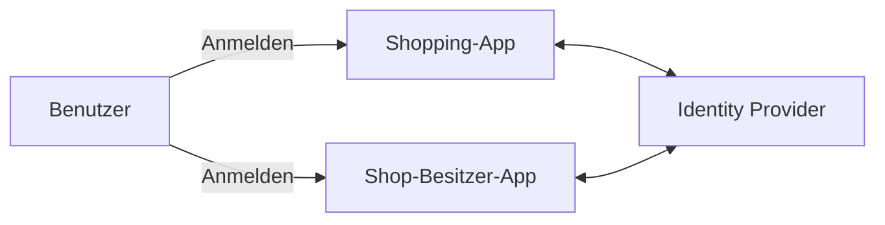
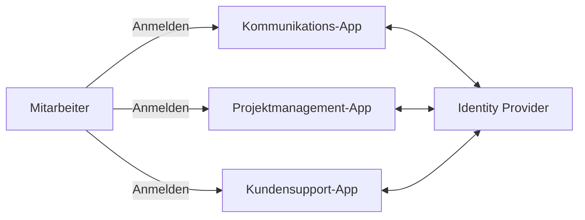
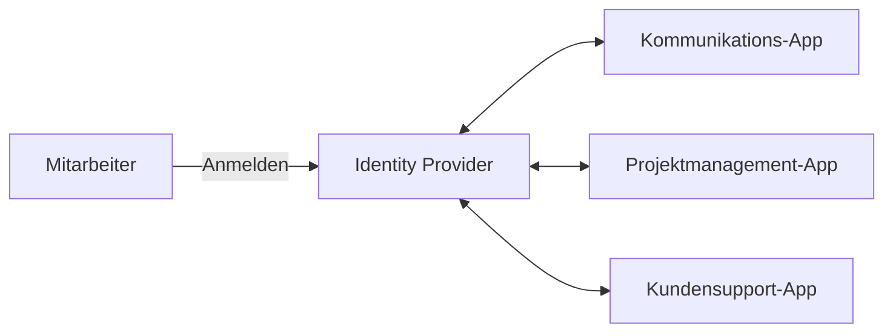
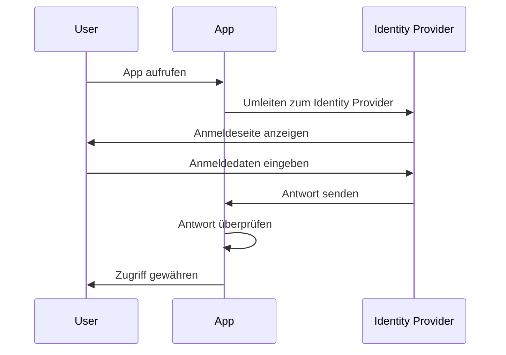
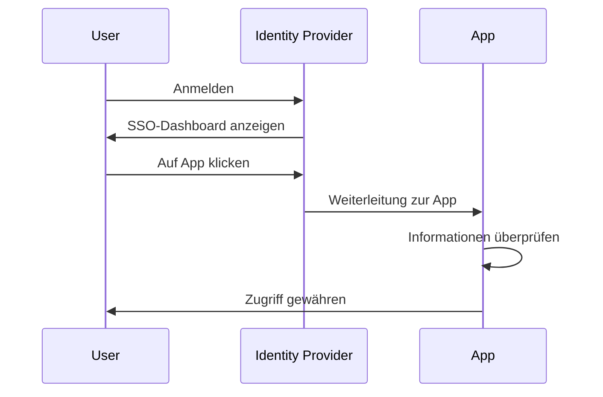
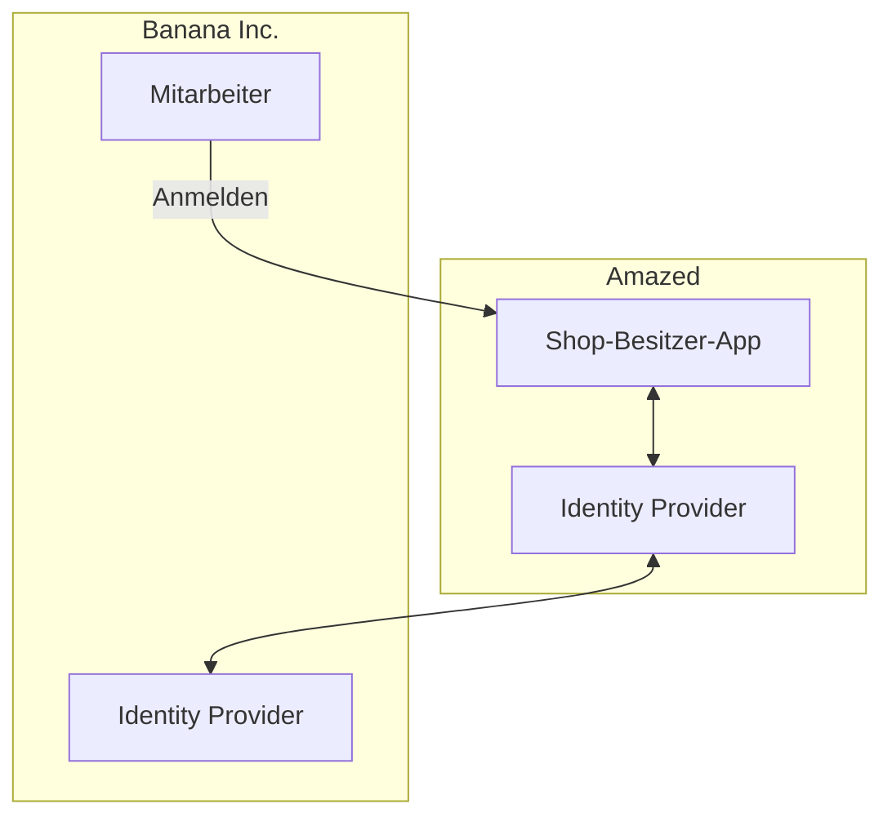

## Was ist Enterprise SSO?

Bevor wir in die Definition eintauchen, ist es wichtig, den Unterschied zwischen SSO und Enterprise SSO zu klären, da dies oft Verwirrung stiften kann.

- <Ref slug="single-sign-on" /> ist ein allgemeiner Begriff, der die Fähigkeit eines Benutzers beschreibt, sich einmal anzumelden und dann auf mehrere Anwendungen oder Ressourcen zuzugreifen, ohne sich erneut anmelden zu müssen.
- Enterprise SSO ist eine spezielle Art von SSO, die für Mitarbeiter innerhalb einer Organisation entwickelt wurde.

Immer noch unsicher? Schauen wir uns ein Beispiel an:

Eine Online-Shopping-Website namens _Amazed_ hat zwei Webanwendungen: eine für Kunden und eine für Shop-Besitzer. Kunden melden sich in der Shopping-App an, um Produkte zu kaufen, während sich Shop-Besitzer in der Shop-Besitzer-App anmelden, um ihre Geschäfte zu verwalten. Beide Anwendungen nutzen denselben Identity Provider für die Authentifizierung. Dadurch müssen sich Benutzer nur einmal anmelden, um auf beide Anwendungen zuzugreifen, was ein Single Sign-On-Erlebnis bietet.

Intern nutzt _Amazed_ mehrere Anwendungen für die Teamkommunikation, das Projektmanagement und den Kundensupport. Um die täglichen Arbeitsabläufe zu optimieren, implementiert _Amazed_ Enterprise SSO für seine Mitarbeiter. Mit Enterprise SSO können Mitarbeiter auf alle internen Anwendungen mit einer einzigen Anmeldung zugreifen.

Typischerweise bieten Enterprise SSO-Lösungen auch ein zentrales Dashboard, über das Mitarbeiter mit einem Klick auf alle Anwendungen zugreifen können. Dieses Dashboard wird oft als SSO-Dashboard bezeichnet.

Kurz gesagt, beide Szenarien sind Beispiele für Single Sign-On. Der Unterschied besteht darin, dass das erste Beispiel ein generisches SSO ist, während das zweite Enterprise SSO ist. Diese sind jeweils typische Anwendungsfälle für Customer IAM (Identity and Access Management) und Workforce IAM.

## Wie funktioniert Enterprise SSO?

Enterprise SSO funktioniert, indem mehrere Anwendungen mit einem zentralen Identity Provider verbunden werden. Die Verbindung kann einseitig (von der Anwendung zum Identity Provider) oder zweiseitig (zwischen der Anwendung und dem Identity Provider) sein. Verschiedene Standards und Protokolle wie SAML, OpenID Connect und OAuth 2.0 werden für diese Verbindungen verwendet.

Unabhängig vom Protokoll ist der grundlegende Ablauf in der Regel ähnlich:

1. Der Benutzer greift auf eine Anwendung zu (z. B. Kommunikations-App), die eine Authentifizierung erfordert.
2. Die Anwendung leitet den Benutzer zur Authentifizierung an den Identity Provider weiter.
3. Der Benutzer meldet sich beim Identity Provider an.
4. Der Identity Provider sendet eine Authentifizierungsantwort an die Anwendung zurück.
5. Die Anwendung überprüft die Antwort und gewährt dem Benutzer Zugriff.

Wenn der Benutzer auf eine andere Anwendung zugreift (z. B. Projektmanagement-App), die mit demselben Identity Provider verbunden ist, wird er automatisch angemeldet, ohne seine Anmeldedaten erneut eingeben zu müssen. In diesem Fall wird Schritt 3 übersprungen und da Schritte 2, 4 und 5 im Hintergrund ablaufen, bemerkt der Benutzer den Authentifizierungsprozess möglicherweise nicht einmal.

Dieser Prozess wird als Service Provider (SP)-initiiertes SSO bezeichnet, bei dem die Anwendung (SP) den Authentifizierungsprozess initiiert.

In einem anderen Szenario stellt der Identity Provider ein zentrales Dashboard bereit, über das Benutzer auf alle verbundenen Anwendungen zugreifen können. Ein vereinfachter Ablauf ist:

1. Der Benutzer meldet sich beim Identity Provider an.
2. Der Identity Provider zeigt eine Liste von Anwendungen an, auf die der Benutzer zugreifen kann.
3. Der Benutzer klickt auf eine Anwendung (z. B. Kundensupport-App), um darauf zuzugreifen.
4. Der Identity Provider leitet den Benutzer mit Authentifizierungsinformationen zur Anwendung weiter.
5. Die Anwendung überprüft die Informationen und gewährt dem Benutzer Zugriff.

Dieser Prozess wird als Identity Provider (IdP)-initiiertes SSO bezeichnet, bei dem der Identity Provider (IdP) den Authentifizierungsprozess initiiert.

## Warum ist Enterprise SSO wichtig?

### Enterprise SSO im Workforce IAM

#### Zentralisiertes Management

Der Hauptvorteil von Enterprise SSO liegt nicht nur in der Benutzerfreundlichkeit für die Mitarbeiter, sondern auch in der erhöhten Sicherheit und Compliance für Organisationen. Anstatt mehrere Anmeldedaten für verschiedene Anwendungen zu verwalten und die Authentifizierung und Autorisierung für jede separat zu konfigurieren, können Organisationen das Management von Benutzeridentitäten, Zugriffskontrollrichtlinien und Protokollen zentralisieren.

Beispielsweise kann die IT-Abteilung, wenn ein Mitarbeiter das Unternehmen verlässt, das Konto des Mitarbeiters im Identity Provider deaktivieren, wodurch sofort der Zugriff auf alle Anwendungen widerrufen wird. Dies ist entscheidend, um unbefugten Zugriff und Datenpannen zu verhindern; ein Prozess, der als Lebenszyklusmanagement bekannt ist.

#### Zugriffskontrolle

Enterprise SSO-Lösungen enthalten oft Zugriffskontrollfunktionen wie Role-Based Access Control (RBAC) und Attribute-Based Access Control (ABAC). Diese Funktionen ermöglichen es Organisationen, detaillierte Zugriffspolitiken basierend auf Benutzerrollen, Attributen und anderen kontextuellen Informationen zu definieren, um sicherzustellen, dass Mitarbeiter das richtige Maß an Zugriff auf die richtigen Ressourcen haben.

Für einen detaillierten Vergleich zwischen RBAC und ABAC schauen Sie sich [RBAC und ABAC: Die Zugangskontrollmodelle, die Sie kennen sollten](https://blog.logto.io/rbac-and-abac) an.

#### Erhöhte Sicherheit

Ein weiterer Vorteil ist die Möglichkeit, starke Authentifizierungsmethoden wie Multi-Faktor-Authentifizierung (MFA), passwortlose Authentifizierung und adaptive Authentifizierung über alle Anwendungen hinweg durchzusetzen. Diese Methoden helfen, sensible Daten zu schützen und branchenspezifische Vorschriften einzuhalten.

Für weitere Informationen zu MFA, siehe [Exploring MFA: Authentifizierung aus einer Produktperspektive betrachten](https://blog.logto.io/elaborate-mfa).

### Enterprise SSO im Customer IAM

Der Begriff "Enterprise SSO" erscheint auch in Customer IAM-Lösungen. Was bedeutet es in diesem Zusammenhang? Lassen Sie uns das Beispiel mit _Amazed_ noch einmal betrachten: Einige Shop-Besitzer sind als Unternehmen integriert. Ein Shop-Besitzer, _Banana Inc._, implementiert Enterprise SSO für seine Mitarbeiter. Im Rahmen der Vereinbarung verlangt _Banana Inc._, dass _Amazed_ Enterprise SSO für alle E-Mail-Adressen von _Banana Inc._ (z. B. `*@banana.com`) durchsetzt, wenn sie auf die Shop-Besitzer-App zugreifen.

In diesem Fall muss _Amazed_ seinen Identity Provider mit dem Identity Provider von _Banana Inc._ integrieren, um Enterprise SSO für die Mitarbeiter von _Banana Inc._ zu ermöglichen. Diese Integration, die oft über Standardprotokolle wie SAML, OpenID Connect oder OAuth erfolgt, wird allgemein als Enterprise SSO-Verbindung, Enterprise SSO-Connector oder SSO-Föderation bezeichnet.

Für eine ausführliche Erklärung zu Customer IAM, schauen Sie sich die CIAM-Serie an:

- [CIAM 101: Authentifizierung, Identität, SSO](https://blog.logto.io/ciam-101-intro-authn-sso)
- [CIAM 102: Autorisierung und rollenbasierte Zugriffskontrolle](https://blog.logto.io/ciam-102-authz-and-rbac)

#### Sei bereit für Unternehmensanforderungen

In B2B (Business-to-Business)-Szenarien ist Enterprise SSO eine unverzichtbare Funktion für SaaS-Anbieter wie _Amazed_, um ihre Unternehmenskunden zu unterstützen. Es geht nicht nur um Bequemlichkeit; es geht um Sicherheit und Compliance für beide Parteien. Enterprise SSO kann durchsetzen, dass alle von den Unternehmenskunden verwalteten Identitäten sich über den Unternehmens-Identity-Provider authentifizieren, um sicherzustellen, dass das Unternehmen die Kontrolle über seine Benutzer, Daten, Zugriffs- und Sicherheitsrichtlinien behält.

Enterprise SSO ist ein Schlüsselfaktor, um _enterprise readiness_ zu erreichen, was bedeutet, dass die Bedürfnisse von Unternehmenskunden erfüllt werden können. Identitäts- und Zugriffsmanagement, insbesondere im Kontext von Unternehmenskunden, ist jedoch komplex und erfordert erhebliche Investitionen in Zeit, Ressourcen und Fachwissen. Moderne SaaS-Anbieter wählen oft IAM-Plattformen, um diese Komplexitäten zu bewältigen.

<SeeAlso slugs={['single-sign-on']} />