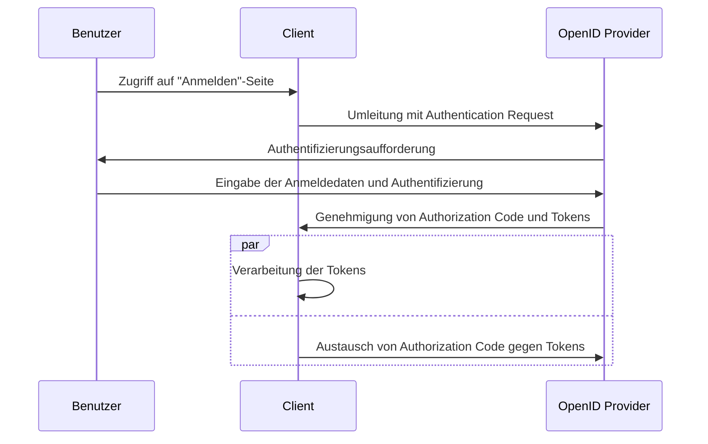

## Was ist der Hybrid Flow?

Der Hybrid Flow ist ein Authentifizierungsprozess, der die Merkmale des <Ref slug="authorization-code-flow" /> und des <Ref slug="implicit-flow" /> kombiniert. Es ist wichtig zu beachten, dass der Hybrid Flow nicht Teil der <Ref slug="oauth-2.0" />-Spezifikation ist, sondern eine Erweiterung darstellt, die durch <Ref slug="openid-connect" /> bereitgestellt wird.

Dieser Flow wurde entwickelt, um ein Gleichgewicht zwischen Sicherheit und Benutzerfreundlichkeit für die Benutzerauthentifizierung (Authentication) zu bieten. Der Hybrid Flow wird jedoch aufgrund der [Sicherheitsüberlegungen](#security-considerations), die mit dem Implicit Flow verbunden sind, für neue Anwendungen nicht empfohlen. Eine beliebte Alternative zum Hybrid Flow ist die Verwendung des Authorization Code Flow mit <Ref slug="pkce" /> für eine bessere Sicherheit.

## Wie funktioniert der Hybrid Flow?

Hier sind die Hauptschritte des Hybrid Flow:

1. Ähnlich wie bei anderen OIDC Flows beginnt der Hybrid Flow, indem der <Ref slug="client" /> eine <Ref slug="authentication-request" /> an den <Ref slug="openid-connect" headingId="openid-provider-op" /> initiiert.

    Hinweis: Der Client sollte den `response_type`-Parameter mit der Kombination von `code` und mindestens einem von `id_token` oder `token` angeben, was bedeutet, dass es drei mögliche Kombinationen gibt:

      - `code id_token`: Der Client erwartet einen Authorization Code und ein ID Token.
      - `code token`: Der Client erwartet einen Authorization Code und ein Access Token.
      - `code id_token token`: Der Client erwartet einen Authorization Code, ein ID Token und ein Access Token.

    Die Anforderung ist selbsterklärend: Der Client erwartet sowohl einen Authorization Code als auch ein oder mehrere Tokens, die dem Authorization Code Flow und dem Implicit Flow entsprechen.
2. Der Benutzer authentifiziert sich beim <Ref slug="openid-connect" headingId="openid-provider-op" />.
3. Der <Ref slug="openid-connect" headingId="openid-provider-op" /> leitet den Benutzer zurück zur Clientanwendung mit dem Authorization Code und den angeforderten Tokens.
4. Die Clientanwendung verarbeitet die Tokens und kann diese verwenden, um im Namen des Benutzers auf geschützte Ressourcen zuzugreifen; sie kann den Authorization Code auch verwenden, um zusätzliche Tokens über die <Ref slug="token-request" /> zu erhalten.

Hier ist ein vereinfachtes Sequenzdiagramm des Hybrid Flow:



Hier ist ein nicht-normatives Beispiel für eine Hybrid Flow Authentication Request:

```http
GET /authorize?response_type=code%20id_token
  &client_id=YOUR_CLIENT_ID
  &redirect_uri=https%3A%2F%2Fclient.example.com%2Fcallback
  &scope=openid%20profile%20email
  &nonce=123456
  &state=abc123 HTTP/1.1
Host: your-openid-provider.com
```

### Wichtige Parameter in einer Hybrid Flow Authentication Request

Die Hybrid Flow Authentication Request umfasst die folgenden wichtigen Parameter:

- **`response_type`**: Der Wert sollte eine Kombination aus `code` und mindestens einem von `id_token` oder `token` sein. Zum Beispiel `code id_token` oder `code token`.
- **`client_id`**: Die Client-Kennung, die vom <Ref slug="openid-connect" headingId="openid-provider-op" /> (Authorization Server) ausgestellt wurde.
- **`redirect_uri`**: Die URI, an die der Authorization Server den Benutzer nach dem Authentifizierungsprozess sendet.
- **`scope`**: Die angeforderten <Ref slug="scope">Scopes</Ref> (Berechtigungen) für die Tokens.
- **`resource`**: Der optionale Parameter, der den <Ref slug="resource-indicator" /> für die angeforderten Ressourcen angibt. Der Authorization Server muss [RFC 8707](https://datatracker.ietf.org/doc/html/rfc8707) unterstützen, um diesen Parameter zu verwenden.

Für die vollständige Liste der Parameter und deren Beschreibungen siehe [Authentication using the Hybrid Flow](https://openid.net/specs/openid-connect-core-1_0.html#HybridFlowAuth).

## Sicherheitsüberlegungen

Der Hybrid Flow umfasst den Implicit Flow, der für seine Sicherheitseinschränkungen bekannt ist. Tokens werden immer noch über den Front-Channel (Browser) übertragen, was sie potenziellen Angriffen aussetzen kann. Der Implicit Flow wird in <Ref slug="oauth-2.1" /> aufgrund dieser Bedenken abgeschafft werden.

<Ref slug="authorization-code-flow" /> mit <Ref slug="pkce" /> ist die empfohlene Alternative zum Hybrid Flow. Es bietet eine sicherere Möglichkeit, Benutzer zu authentifizieren, ohne Tokens im Front-Channel preiszugeben.

<SeeAlso slugs={["openid-connect", "oauth-2.1", "authorization-code-flow", "pkce", "implicit-flow"]} />

<Resources
  urls={[
    "https://blog.logto.io/implicit-flow-is-dead",
    "https://blog.logto.io/oauth-2-1",
    "https://openid.net/specs/openid-connect-core-1_0.html#HybridFlowAuth",
  ]}
/>
