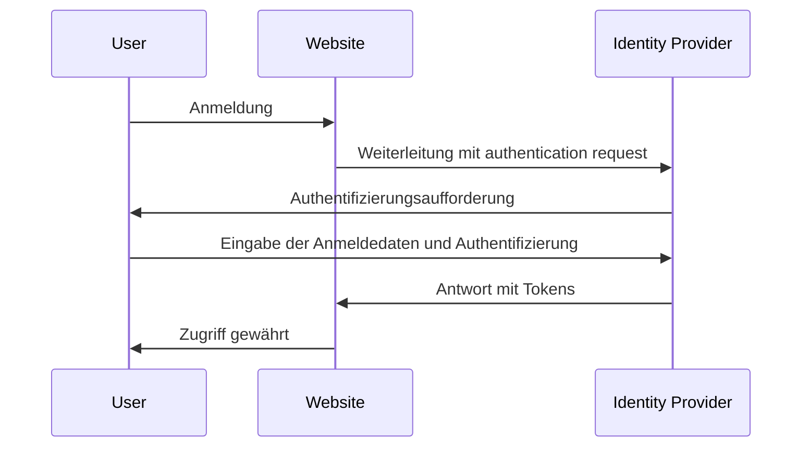

## Was ist Identitäts- und Zugriffsmanagement (IAM)?

Wie die Definition vermuten lässt, ist Identitäts- und Zugriffsmanagement (Identity and Access Management, IAM) ein umfassendes Konzept, das viele Aspekte der Verwaltung digitaler Identitäten und der Durchführung von <Ref slug="access-control" /> umfasst. Lass uns zuerst die Begriffe erklären:

- **Identität**: Eine digitale Darstellung eines Benutzers, Dienstes oder Geräts. Eine Identität kann Attribute wie Bezeichner, Rollen und Berechtigungen umfassen.
- **Zugriff**: Die Fähigkeit, mit Ressourcen zu interagieren, Aktionen durchzuführen oder Dienste zu nutzen. Zusammengefasst geht es beim Zugriff darum, welche Aktionen auf bestimmten Ressourcen ausgeführt werden sollen.

### Identitätsmanagement

Identitätsmanagement ist der Prozess der Verwaltung, Authentifizierung und Sicherung digitaler Identitäten. Es umfasst die folgenden Schlüsselaktivitäten:

- **Identitätsregistrierung**: Erstellung neuer Identitäten für Benutzer, Dienste oder Geräte.
- **Identitätsauthentifizierung**: Verifizierung des Besitzes einer Identität durch verschiedene Mechanismen wie Passwörter, Biometrie oder Multi-Faktor-Authentifizierung.
- **Identitätssicherheit**: Schutz von Identitäten vor unbefugtem Zugriff, Missbrauch oder Offenlegung.

Jedes Thema ist umfangreich und kann weiter in Unterthemen wie Passwortverwaltung, Identitätsföderation und Identitätslebenszyklusmanagement aufgeteilt werden.

### Zugriffsmanagement

Zugriffsmanagement (oder <Ref slug="access-control" />) ist der Prozess der Kontrolle, wer welche Aktionen auf bestimmten Ressourcen ausführen kann. Es umfasst die folgenden Schlüsselaktivitäten:

- **Zugriffsrichtlinien**: Definition von Regeln und Richtlinien, die bestimmen, wer auf welche Ressourcen zugreifen kann und welche Aktionen sie durchführen dürfen.
- **Durchsetzung der Zugriffsrichtlinien**: Umsetzung der Zugriffsrichtlinien durch Mechanismen wie Authentifizierung, Autorisierung und Auditierung.
- **Zugriffsgovernance**: Überwachung und Verwaltung von Zugriffsrechten zur Sicherstellung der Einhaltung von Vorschriften und Sicherheitspraktiken.

Jede Aktivität spielt eine wichtige Rolle in modernen Anwendungen und Systemen, um sicherzustellen, dass nur autorisierte Identitäten (Benutzer, Dienste oder Geräte) auf Ressourcen basierend auf den definierten Richtlinien zugreifen können.

## Was sind die Komponenten von IAM?

In der Anwendung wird IAM durch eine Kombination aus Software, Dienstleistungen und Best Practices implementiert. Zwei wichtige Komponenten von IAM sind:

- **<Ref slug="identity-provider" />**: Ein Dienst, der Benutzeridentitäten und Authentifizierung verwaltet.
- **<Ref slug="service-provider" />**: Ein Dienst, der sich auf einen Identity Provider für Authentifizierung und Autorisierung verlässt. In den meisten Fällen ist es die Anwendung oder der Dienst, den du entwickelst.

Eine klare Trennung zwischen dem Identity Provider und dem Service Provider wird dazu beitragen, IAM von der Anwendungslogik zu entkoppeln, was die Verwaltung und Skalierung erleichtert.

## Identitäts- und Zugriffsmanagement in der Praxis

Sehen wir uns ein Beispiel an, wie IAM funktioniert: Wenn du dich auf einer Website anmeldest, kann der Prozess der Überprüfung, wer du bist, und der Erteilung des Zugriffs auf die Website als Identitäts- und Zugriffsmanagement-Prozess betrachtet werden.

Normalerweise umfasst der IAM-Prozess zwei Hauptschritte: Authentifizierung und Autorisierung:

- <Ref slug="authentication" /> beantwortet die Frage „Welche Identität gehört dir?“
- <Ref slug="authorization" /> beantwortet die Frage „Was kannst du tun?“

> Manchmal wird Authentifizierung als „Wer bist du?“ interpretiert. Bei digitalen Identitäten ist es jedoch genauer, die Authentifizierung durch den „Nachweis des Identitätsbesitzes“ darzustellen.

Darüber hinaus ist das Konzept des Identitäts- und Zugriffsmanagements groß genug, um neue Konzepte wie WIAM (Workforce IAM) und CIAM (Customer IAM) hervorzubringen.

Während WIAM und CIAM die gleiche Grundlage teilen, haben sie unterschiedliche Anwendungsfälle: WIAM wird typischerweise für interne Benutzer verwendet, während CIAM für externe Kunden genutzt wird. Einige Beispiele:

- **WIAM**: Dein Unternehmen hat ein einheitliches Identitätssystem für Mitarbeiter, sodass jeder das gleiche Konto verwenden kann, um auf Unternehmensressourcen wie Software-Abonnements, Cloud-Computing-Dienste usw. zuzugreifen.
- **CIAM**: Dein Online-Buchladen benötigt ein Benutzeridentitätssystem für Kunden und Verkäufer. Die Anmeldungserfahrung ist ein kritischer Teil des Onboardings, da sie sich an der Spitze des Konvertierungstrichters befindet.

Um mehr über das Konzept von CIAM und verwandte Themen zu erfahren, kannst du auf [CIAM 101: Authentication, Identity, SSO](https://blog.logto.io/ciam-101-intro-authn-sso) verweisen.

### Authentifizierung

Hier sind einige gängige Authentifizierungsmethoden, die in IAM verwendet werden:

- **Passwortbasierte Authentifizierung**: Die gebräuchlichste Methode, bei der Benutzer einen Benutzernamen und ein Passwort angeben, um ihre Identität zu bestätigen.
- **<Ref slug="passwordless" /> Authentifizierung**: Eine Methode, die es Benutzern ermöglicht, sich ohne Passwort anzumelden, zum Beispiel durch die Verwendung eines einmaligen Codes, der an ihre E-Mail oder das Telefon gesendet wird. Beachte, dass passwordless authentication auch andere Methoden wie biometrische Authentifizierung umfassen kann.
- **Soziale Anmeldung**: Eine Methode, die es Benutzern ermöglicht, sich mit ihren Social-Media-Konten anzumelden, wie zum Beispiel Google, Facebook oder Twitter.
- **<Ref slug="passkey" /> (WebAuthn)**: Eine Methode, die es Benutzern ermöglicht, sich mit einem Sicherheitsschlüssel anzumelden, wie einem USB-Schlüssel oder einem Smartphone, das WebAuthn unterstützt.
- **Biometrische Authentifizierung**: Eine Methode, die physische Merkmale wie Fingerabdrücke, Gesichtserkennung oder Spracherkennung verwendet, um die Identität eines Benutzers zu überprüfen.
- **<Ref slug="machine-to-machine" /> Authentifizierung**: Eine Methode, die es Diensten oder Geräten ermöglicht, sich gegenseitig ohne menschliches Eingreifen zu authentifizieren, zum Beispiel durch die Verwendung von API-Schlüsseln oder Zertifikaten.

Für eine zusätzliche Sicherheitsebene kann <Ref slug="mfa" /> in Kombination mit diesen Authentifizierungsmethoden verwendet werden. MFA erfordert von den Benutzern, zwei oder mehr Faktoren anzugeben, um ihre Identität zu beweisen, wie etwas, das sie wissen (Passwort), etwas, das sie haben (Sicherheitsschlüssel oder <Ref slug="totp" />), oder etwas, das sie sind (biometrische Daten).

### Autorisierung

Mit der Authentifizierung festgelegt, bestimmt die Autorisierung, welche Aktionen eine Identität ausführen kann. Die Autorisierung kann auf verschiedenen Faktoren basieren, wie der Rolle der Identität, der Gruppenmitgliedschaft, den Berechtigungen, Attributen, Richtlinien usw. Es gibt mehrere gängige Autorisierungsmodelle:

- **<Ref slug="rbac" />**: Ein Modell, das Berechtigungen Rollen zuweist und dann Rollen an Identitäten vergibt. Zum Beispiel könnte eine Mitarbeiterrolle Zugriff auf bestimmte Ressourcen haben, während eine Administratorrolle Zugriff auf alle Ressourcen haben könnte.
- **<Ref slug="abac" />**: Ein Modell, das Attribute (Eigenschaften) der Identität, der Ressource und der Umgebung verwendet, um Entscheidungen über die Zugangskontrolle zu treffen. Zum Beispiel könnte eine Identität mit dem Attribut „Abteilung=Technik“ Zugang zu technischen Ressourcen haben.
- **Richtlinienbasierte Zugangskontrolle (PBAC)**: Ein Modell, das Richtlinien verwendet, um Regeln zur Zugangskontrolle zu definieren. Richtlinien können auf verschiedenen Faktoren basieren, wie der Tageszeit, dem Standort, dem Gerätetyp usw.
- **Feingranulare Zugangskontrolle**: Ein Modell, das eine detailliertere Kontrolle über den Zugang bietet und es erlaubt, Berechtigungen auf der Ebene einzelner Ressourcen oder Aktionen festzulegen.

## Welche offenen Standards werden häufig für IAM verwendet?

Es gibt mehrere offene Standards und Protokolle, die häufig im IAM verwendet werden:

- **<Ref slug="oauth-2.0" />**: Ein Protokoll, das es Anwendungen ermöglicht, im Namen eines Benutzers auf Ressourcen zuzugreifen, ohne die Anmeldedaten des Benutzers zu teilen. OAuth 2.0 wird häufig für Autorisierungen verwendet, wie zum Beispiel einer Drittanbieter-Anwendung den Zugriff auf die Google Drive-Dateien eines Benutzers zu ermöglichen.
- **<Ref slug="openid-connect" />**: Eine Identitätsschicht, die auf OAuth 2.0 aufbaut und es Anwendungen ermöglicht, die Identität eines Benutzers zu verifizieren und grundlegende Profilinformationen über den Benutzer zu erhalten. Single Sign-On (SSO) ist ein häufiger Anwendungsfall für OpenID Connect. Die Kombination von OAuth 2.0 und OpenID Connect ist eine übliche Praxis für modernes IAM.
- **<Ref slug="saml" />**: Ein XML-basierter Standard für den Austausch von Authentifizierungs- und Autorisierungsdaten zwischen Identity Providern und Service Providern. SAML wird häufig für SSO in Unternehmensumgebungen verwendet.
- **SCIM (System for Cross-domain Identity Management)**: Ein Standard zur Automatisierung des Austauschs von Benutzeridentitätsinformationen zwischen Identity Providern und Service Providern. SCIM wird häufig für die Bereitstellung und Deaktivierung von Benutzern in cloudbasierten Anwendungen verwendet.

## Was sind die wichtigsten Designüberlegungen für IAM?

Beim Entwurf eines IAM-Systems gibt es mehrere wichtige Überlegungen, die man beachten sollte:

- **Sicherheit**: Sicherheit hat im IAM oberste Priorität. Stelle sicher, dass Authentifizierungsmethoden Best Practices befolgen, wie starke Passwort-Hashing, Erzwingen von MFA und Schutz gegen häufige Angriffe wie Phishing und Brute-Force.
- **Datenschutz**: Respektiere die Privatsphäre der Benutzer, indem nur die erforderlichen Informationen gesammelt und die Zustimmung der Benutzer eingeholt wird, wenn nötig.
- **Skalierbarkeit**: Mache das IAM-System skalierbar, um eine große Anzahl von Benutzern und Anwendungen zu bewältigen. Erwäge die Nutzung von cloudbasierten Identity Providern für die Skalierbarkeit.
- **Interoperabilität**: Ein Vorteil der Verwendung offener Standards ist, dass sie die Interoperabilität zwischen verschiedenen Systemen ermöglichen. Zum Beispiel unterstützen die meisten beliebten Identity Provider wie Google, Facebook und Microsoft OAuth 2.0 und OpenID Connect.
- **Benutzererfahrung**: Die Benutzererfahrung für Authentifizierung und Autorisierung wirkt sich stark auf die Konvertierung und Bindung der Benutzer aus. Das Gleichgewicht zwischen Sicherheit und Benutzerfreundlichkeit zu finden, ist eine Kunst im IAM.

<SeeAlso slugs={['openid-connect', 'oauth-2.0', 'single-sign-on', 'enterprise-sso']} />

<Resources
  urls={[
    "https://blog.logto.io/ciam-101-intro-authn-sso",
    "https://blog.logto.io/ciam-102-authz-and-rbac"
  ]}
/>
