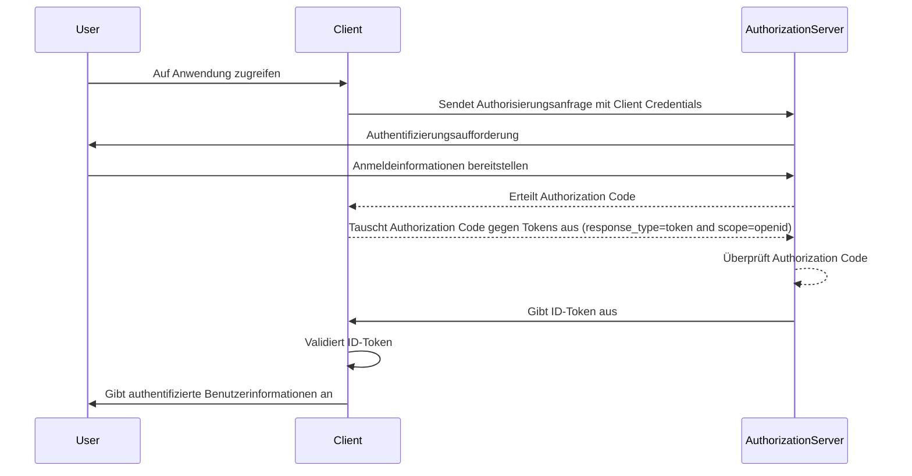

## Was ist ein ID-Token?

Ein ID-Token ist eine spezielle Art von Sicherheitstoken, das Informationen über den authentifizierten Benutzer enthält, die der Client-Anwendung nach einer erfolgreichen Authentifizierung übermittelt werden. Der ID-Token ist das entscheidende Merkmal, das OpenID Connect (OIDC) von OAuth 2.0 unterscheidet. Während OAuth 2.0 sich ausschließlich auf Authorization konzentriert, baut OIDC darauf auf, um die Benutzer-Authentifizierung durch die Einführung des ID-Tokens hinzuzufügen.

Im OIDC-Authentifizierungsprozess initiiert eine Client-Anwendung (Relying Party) die Authentifizierung, indem sie den Benutzer zu einem Authorization Server umleitet. Nach erfolgreicher Authentifizierung antwortet der Server mit einem ID-Token neben anderen Tokens wie dem Access Token. Der ID-Token wird typischerweise als JWT (JSON Web Token) codiert und enthält wichtige Ansprüche (claims) wie die Benutzerkennzeichnung (sub), der Issuer (iss), Audience (aud) und andere benutzerspezifische Informationen.

Die Hauptfunktion des ID-Tokens besteht darin, die Identität des Benutzers zu überprüfen und diese Informationen an die Client-Anwendung zu übermitteln. Dadurch kann die Anwendung den Benutzer authentifizieren, ohne direkt mit Anmeldeinformationen umzugehen. Da der Client den ID-Token erst erhalten hat, nachdem der Benutzer vom Authorization Server authentifiziert wurde, kann der ID-Token als sicherer Weg genutzt werden, um die Identität des Benutzers zu verifizieren.

## Wie funktioniert ein ID-Token?

Die Client-Anwendung initiiert den Authentifizierungsprozess, indem sie den Benutzer zum Authorization Server umleitet. Der Benutzer authentifiziert sich beim Server, der dann einen ID-Token zusammen mit anderen Tokens wie dem Access Token ausstellt. Der ID-Token wird der Client-Anwendung zurückgegeben, die ihn dann verwenden kann, um die Identität des Benutzers zu überprüfen.

Da OIDC ein beliebtes und standardisiertes Protokoll ist, bieten viele Bibliotheken und Frameworks integrierte Unterstützung für die Handhabung von ID-Tokens. Dies macht ID-Tokens leicht in Client-Anwendungen integrierbar und wird häufig in Single Sign-On (SSO) und föderierten Identitätsszenarien verwendet.

## Claims in einem ID-Token

Ein ID-Token ist ein JWT (JSON Web Token), das eine Reihe von Claims über den authentifizierten Benutzer enthält. Diese Claims umfassen sowohl standardmäßige JWT-Claims, die in der [JWT-Spezifikation](https://datatracker.ietf.org/doc/html/rfc7519#section-4) definiert sind, als auch OIDC-spezifische Claims, die zur Übermittlung von Benutzeridentitätsinformationen verwendet werden.

JWT Standard-Token-Claims:

- **iss (Issuer)**: ERFORDERLICH. Der Issuer-Claim identifiziert den Issuer des ID-Tokens. Dies ist typischerweise die URL des Authorization Servers, der das Token ausgestellt hat.
- **sub (Subject)**: ERFORDERLICH. Der Subject-Claim identifiziert den Benutzer, auf den sich der ID-Token bezieht. Dies ist typischerweise eine eindeutige Kennung für den Benutzer.
- **aud (Audience)**: ERFORDERLICH. Der Audience-Claim identifiziert das Publikum für den ID-Token. Dies ist typischerweise die Client-Anwendung, die das Token angefordert hat.
- **exp (Expiration time)**: ERFORDERLICH. Der Expiration Time Claim identifiziert die Zeit, zu der das Token abläuft. Nach dieser Zeit sollte das Token nicht mehr verarbeitet werden.
- **iat (Issued at)**: ERFORDERLICH. Der Issued At Claim identifiziert die Zeit, zu der das Token ausgestellt wurde.
- **auth_time (Authentication time)**: OPTIONAL. Der Authentication Time Claim identifiziert die Zeit, zu der der Benutzer authentifiziert wurde. Dieser Claim ist nur vorhanden, wenn der Benutzer während der aktuellen Sitzung authentifiziert wurde.
- **nonce**: OPTIONAL. Der Nonce-Claim wird verwendet, um eine Client-Sitzung mit einem ID-Token zu verknüpfen. Er wird typischerweise verwendet, um Wiederholungsangriffe zu verhindern.

OIDC Standard Benutzerinformations-Claims:

- **name**: Der vollständige Name des Benutzers.
- **given_name**: Der Vorname des Benutzers.
- **family_name**: Der Nachname des Benutzers.
- **middle_name**: Der zweite Vorname des Benutzers.
- **nickname**: Der Spitzname oder ein anderer kurzer Name des Benutzers.
- **preferred_username**: Der bevorzugte Benutzername des Benutzers.
- **profile**: Eine URL, die auf die Profilseite des Benutzers verweist.
- **picture**: Eine URL, die auf das Profilbild des Benutzers verweist.
- **website**: Eine URL, die auf die Website des Benutzers verweist.
- **email**: Die E-Mail-Adresse des Benutzers.
- **email_verified**: Ein boolescher Wert, der angibt, ob die E-Mail-Adresse des Benutzers verifiziert wurde.
- **gender**: Das Geschlecht des Benutzers.
- **birthdate**: Das Geburtsdatum des Benutzers. Als String im Format JJJJ-MM-TT dargestellt.
- **zoneinfo**: Die Zeitzone des Benutzers. String aus der [IANA Time Zone Database](https://www.iana.org/time-zones).
- **locale**: Die Sprachumgebung des Benutzers. Repräsentiert die bevorzugte Sprache und Region des Benutzers für die Formatierung von Daten, Zeiten und Zahlen.
- **phone_number**: Die Telefonnummer des Benutzers.
- **phone_number_verified**: Ein boolescher Wert, der angibt, ob die Telefonnummer des Benutzers verifiziert wurde.
- **address**: Die Postadresse des Benutzers. Der Wert ist ein JSON-Objekt, das die Adressinformationen des Benutzers enthält.
- **updated_at**: Die Zeit, zu der die Informationen des Benutzers zuletzt aktualisiert wurden.

Diese Claims bieten eine standardisierte Möglichkeit, Benutzeridentitätsinformationen im ID-Token zu übermitteln. Während die Spezifikation nur einen Satz von Standard-Claims definiert, können auch benutzerdefinierte Claims im ID-Token enthalten sein, um zusätzliche benutzerspezifische Informationen nach Bedarf zu übermitteln.

## Validierung des ID-Tokens

Wenn die Client-Anwendung einen ID-Token erhält, muss sie das Token validieren, um dessen Authentizität und Integrität sicherzustellen. Der Validierungsprozess umfasst typischerweise die folgenden Schritte:

1. **Überprüfung der Signatur**: Der Client muss die Signatur des ID-Tokens mit dem öffentlichen Schlüssel des Authorization Servers überprüfen. Dies stellt sicher, dass das Token nicht manipuliert wurde und von der erwarteten Partei ausgestellt wurde.
2. **Überprüfung des Issuers**: Der Client sollte überprüfen, dass der `iss`-Claim im ID-Token mit der URL des Authorization Servers übereinstimmt, der das Token ausgestellt hat. Dies hilft, Token-Substitutionsangriffe zu verhindern.
3. **Überprüfung der Audience**: Der Client sollte überprüfen, dass der `aud`-Claim im ID-Token mit der `client_id` der Client-Anwendung übereinstimmt. Dies stellt sicher, dass das Token für die Client-Anwendung ausgestellt wurde.
4. **Überprüfung der Ablaufzeit**: Der Client sollte überprüfen, dass der `exp`-Claim im ID-Token nicht abgelaufen ist. Wenn das Token abgelaufen ist, sollte es nicht akzeptiert werden. Implementierungen können eine Spielraum bieten, um Uhrensynchronisationsunterschiede auszugleichen.
5. **Überprüfung des Nonce**: Wenn der Client einen `nonce`-Parameter in der Authentifizierungsanfrage enthalten hat, sollte er überprüfen, dass der `nonce`-Claim im ID-Token mit dem Wert des `nonce`-Parameters übereinstimmt. Dies hilft, Wiederholungsangriffe zu verhindern.

## ID-Token vs Access-Token

Obwohl sowohl ID-Tokens als auch Access-Tokens in OIDC weit verbreitet sind, dienen sie unterschiedlichen Zwecken und haben unterschiedliche Merkmale:

|              | ID-Token                                                                                   | Access-Token                                                                                                                        |
| ------------ | ------------------------------------------------------------------------------------------ | ----------------------------------------------------------------------------------------------------------------------------------- |
| **Zweck**    | Verifiziert die Identität des Benutzers und übermittelt Benutzerinformationen an die Client-Anwendung. | Ermöglicht den Zugriff auf geschützte Ressourcen im Namen des Benutzers.                                                            |
| **Format**   | Typischerweise ein JWT, das Benutzeridentitätsansprüche enthält.                           | Kann entweder ein JWT oder ein undurchsichtiges Token (zufälliger String) sein.                                                     |
| **Audience** | Bestimmt für die Client-Anwendung, die das Token angefordert hat.                          | Bestimmt für den Ressourceserver, der die geschützten Ressourcen hostet.                                                            |
| **Lebensdauer** | Kurzlebiges Token, das typischerweise für ein paar Minuten gültig ist. Nur einmalige Nutzung.  | Längerlebiges Token, das für einen längeren Zeitraum (z. B. Stunden) gültig ist. Kann mehrmals innerhalb seiner Gültigkeitsdauer wiederverwendet werden. |
| **Inhalt**   | Enthält Benutzeridentitätsinformationen wie Name, E-Mail und andere benutzerspezifische Daten. | Enthält Informationen über die Berechtigungen (Scopes) des Benutzers zu bestimmten Ressourcen.                                      |

## Best Practices für die Verwendung von ID-Tokens

Beim Arbeiten mit ID-Tokens in OIDC ist es wichtig, Best Practices zu befolgen, um die Sicherheit und Integrität des Authentifizierungsprozesses zu gewährleisten. Einige wichtige Best Practices umfassen:

1. **ID-Tokens validieren**: Validieren Sie immer den ID-Token, den Sie vom Authorization Server erhalten haben, um dessen Authentizität und Integrität sicherzustellen. Dies hilft, Token-Substitutionsangriffe und unbefugten Zugriff zu verhindern.
2. **Verwendung sicherer Kanäle**: Stellen Sie sicher, dass ID-Tokens über sichere Kanäle (z. B. HTTPS) übertragen werden, um Abfangen und Manipulation zu verhindern.
3. **Schutz sensibler Informationen**: Da JWTs typischerweise kodiert, aber nicht verschlüsselt sind, was den Inhalt transparent macht. Vermeiden Sie es, sensible Informationen im ID-Token-Payload zu speichern, um die Exposition sensibler Daten bei Token-Leckagen zu verhindern.
4. **Nicht für Authorization nutzen**: ID-Tokens sind für die Authentifizierung des Benutzers gedacht und sollten nicht für Authorization-Zwecke verwendet werden. Nutzen Sie Access-Tokens für die Authorization zum Zugriff auf geschützte Ressourcen.
5. **Einmalige Nutzung**: ID-Tokens sind im Allgemeinen für die einmalige Nutzung vorgesehen. Sobald eine Client-Anwendung einen ID-Token validiert hat, sollte dieser nicht für nachfolgende Anfragen oder die Sitzungsstatus-Erhaltung wiederverwendet werden. Um den Sitzungsstatus des Benutzers aufrechtzuerhalten, sollten Client-Anwendungen Mechanismen wie Refresh-Tokens und Token-Austauschanfragen verwenden. (Refresh-Tokens sind langlebige undurchsichtige Tokens, die verwendet werden können, um neue Access-Tokens und ID-Tokens zu erhalten, wenn sie ablaufen.)

<SeeAlso slugs={["openid-connect", "jwt", "signing-key", "access-token"]} />