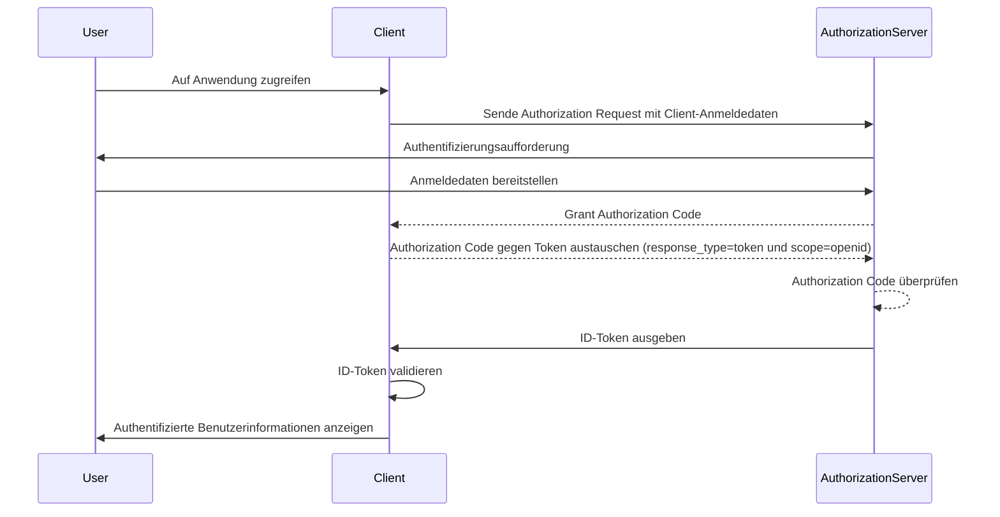

## Was ist ein ID-Token?

Ein ID-Token ist eine spezielle Art von Sicherheitstoken, das Informationen über den authentifizierten Benutzer enthält und nach einer erfolgreichen <Ref slug="authentication" /> an die Client-Anwendung übermittelt wird. Der ID-Token ist das entscheidende Merkmal, das <Ref slug="openid-connect" /> von <Ref slug="oauth-2.0" /> unterscheidet. Während OAuth 2.0 sich ausschließlich auf die Authorization konzentriert, baut OIDC darauf auf und fügt die Authentifizierung des Benutzers durch die Einführung des ID-Tokens hinzu.

Im OIDC-Authentifizierungsprozess initiiert eine Client-Anwendung (Relying Party) die Authentifizierung, indem sie den Benutzer zu einem Authorization Server umleitet. Nach erfolgreicher Authentifizierung antwortet der Server mit einem ID-Token, neben anderen Token wie dem <Ref slug="access-token" />. Der ID-Token wird typischerweise als ein <Ref slug="jwt" /> kodiert und enthält wichtige Claims wie die Benutzerkennung (sub), den Issuer (iss), die Audience (aud) und andere benutzerspezifische Informationen.

Die Hauptfunktion des ID-Tokens besteht darin, die Identität des Benutzers zu überprüfen und diese Informationen an die Client-Anwendung zu übermitteln. Dies ermöglicht der Anwendung, den Benutzer zu authentifizieren, ohne direkt mit Anmeldedaten umzugehen. Da der Client den ID-Token erst erhält, nachdem der Benutzer vom Authorization Server authentifiziert wurde, kann der ID-Token als sichere Möglichkeit zur Überprüfung der Identität des Benutzers dienen.

## Wie funktioniert ein ID-Token?

Die Client-Anwendung initiiert den Authentifizierungsprozess, indem sie den Benutzer zum Authorization Server weiterleitet. Der Benutzer authentifiziert sich am Server, der dann einen ID-Token zusammen mit anderen Token wie dem Access Token ausstellt. Der ID-Token wird an die Client-Anwendung zurückgegeben, die ihn dann verwenden kann, um die Identität des Benutzers zu überprüfen.

Da OIDC ein beliebtes und standardisiertes Protokoll ist, bieten viele Bibliotheken und Frameworks integrierte Unterstützung für die Handhabung von ID-Token. Dies macht ID-Token leicht in Client-Anwendungen integrierbar und wird häufig in <Ref slug="single-sign-on" /> und föderierten Identitätsszenarien verwendet.

## Claims in einem ID-Token

Ein ID-Token ist ein JWT, das eine Reihe von <Ref slug="claim" /> über den authentifizierten Benutzer enthält. Diese Claims umfassen sowohl Standard-JWT-Claims, die in der [JWT-Spezifikation](https://datatracker.ietf.org/doc/html/rfc7519#section-4) definiert sind, als auch OIDC-spezifische Claims, die zur Übermittlung von Benutzeridentitätsinformationen verwendet werden.

JWT-Standard-Token-Claims:

- **iss (Issuer)**: ERFORDERLICH. Der Issuer Claim identifiziert den Aussteller des ID-Tokens. Dies ist typischerweise die URL des Authorization Servers, der den Token ausgestellt hat.
- **sub (Subject)**: ERFORDERLICH. Der Subject Claim identifiziert den Benutzer, auf den sich der ID-Token bezieht. Dies ist typischerweise eine eindeutige Kennung für den Benutzer.
- **aud (Audience)**: ERFORDERLICH. Der Audience Claim identifiziert die <Ref slug="audience" /> für den ID-Token. Dies ist typischerweise die Client-Anwendung, die den Token angefordert hat.
- **exp (Expiration time)**: ERFORDERLICH. Der Expiration Time Claim identifiziert den Zeitpunkt, zu dem der Token abläuft. Nach diesem Zeitpunkt sollte der Token nicht mehr akzeptiert werden.
- **iat (Issued at)**: ERFORDERLICH. Der Issued At Claim identifiziert den Zeitpunkt, zu dem der Token ausgestellt wurde.
- **auth_time (Authentication time)**: OPTIONAL. Der Authentication Time Claim identifiziert den Zeitpunkt, zu dem der Benutzer authentifiziert wurde. Dieser Claim ist nur vorhanden, wenn der Benutzer während der aktuellen Sitzung authentifiziert wurde.
- **nonce**: OPTIONAL. Der Nonce Claim wird verwendet, um eine Client-Sitzung mit einem ID-Token zu verknüpfen. Er wird typischerweise verwendet, um Replay-Angriffe zu verhindern.

OIDC-standardisierte Benutzerinformations-Claims:

- **name**: Der vollständige Name des Benutzers.
- **given_name**: Der Vorname des Benutzers.
- **family_name**: Der Nachname des Benutzers.
- **middle_name**: Der Mittelname des Benutzers.
- **nickname**: Der Spitzname oder andere kurze Name des Benutzers.
- **preferred_username**: Der bevorzugte Benutzername des Benutzers.
- **profile**: Eine URL, die auf die Profilseite des Benutzers zeigt.
- **picture**: Eine URL, die auf das Profilbild des Benutzers zeigt.
- **website**: Eine URL, die auf die Website des Benutzers zeigt.
- **email**: Die E-Mail-Adresse des Benutzers.
- **email_verified**: Ein boolescher Wert, der angibt, ob die E-Mail-Adresse des Benutzers verifiziert wurde.
- **gender**: Das Geschlecht des Benutzers.
- **birthdate**: Das Geburtsdatum des Benutzers. Dargestellt als Zeichenfolge im Format JJJJ-MM-TT.
- **zoneinfo**: Die Zeitzone des Benutzers. Zeichenfolge aus der [IANA Time Zone Database](https://www.iana.org/time-zones).
- **locale**: Die Locale des Benutzers. Repräsentiert die bevorzugte Sprache und Region des Benutzers für die Formatierung von Daten, Zeiten und Zahlen.
- **phone_number**: Die Telefonnummer des Benutzers.
- **phone_number_verified**: Ein boolescher Wert, der angibt, ob die Telefonnummer des Benutzers verifiziert wurde.
- **address**: Die Postanschrift des Benutzers. Der Wert ist ein JSON-Objekt, das die Adressinformationen des Benutzers enthält.
- **updated_at**: Der Zeitpunkt, zu dem die Informationen des Benutzers zuletzt aktualisiert wurden.

Diese Claims bieten eine standardisierte Möglichkeit, Benutzeridentitätsinformationen im ID-Token zu übermitteln. Während die Spezifikation nur einen Satz von Standard-Claims definiert, können auch benutzerdefinierte Claims im ID-Token enthalten sein, um zusätzliche benutzerspezifische Informationen nach Bedarf zu übermitteln.

## ID-Token-Validierung

Wenn die Client-Anwendung einen ID-Token erhält, muss sie den Token validieren, um seine Authentizität und Integrität sicherzustellen. Der Validierungsprozess umfasst typischerweise die folgenden Schritte:

1. **Überprüfung der Signatur**: Der Client muss die Signatur des ID-Tokens mit dem öffentlichen Schlüssel des Authorization Servers überprüfen. Dies stellt sicher, dass der Token nicht manipuliert wurde und von der erwarteten Partei ausgestellt wurde.
2. **Überprüfung des Issuers**: Der Client sollte überprüfen, dass der `iss` Claim im ID-Token mit der URL des Authorization Servers übereinstimmt, der den Token ausgestellt hat. Dies hilft, Token-Substitutionsangriffe zu verhindern.
3. **Überprüfung der Audience**: Der Client sollte überprüfen, dass der `aud` Claim im ID-Token mit der `client_id` der Client-Anwendung übereinstimmt. Dies stellt sicher, dass der Token für die Client-Anwendung ausgestellt wurde.
4. **Überprüfung der Ablaufzeit**: Der Client sollte überprüfen, dass der `exp` Claim im ID-Token nicht abgelaufen ist. Wenn der Token abgelaufen ist, sollte er nicht akzeptiert werden. Implementierungen können eine Toleranz bieten, um Uhrabweichungen zu berücksichtigen.
5. **Überprüfung der Nonce**: Wenn der Client einen `nonce`-Parameter in dem Authentifizierungsantrag enthalten hat, sollte er überprüfen, dass der `nonce` Claim im ID-Token mit dem Wert des `nonce`-Parameters übereinstimmt. Dies hilft, Replay-Angriffe zu verhindern.

## ID-Token vs. Access Token

Obwohl sowohl ID-Token als auch Access Tokens in OIDC weit verbreitet sind, dienen sie unterschiedlichen Zwecken und haben unterschiedliche Eigenschaften:

|              | ID-Token                                                                                   | Access Token                                                                                                               |
| ------------ | ------------------------------------------------------------------------------------------ | -------------------------------------------------------------------------------------------------------------------------- |
| **Zweck**    | Überprüft die Identität des Benutzers und übermittelt Benutzerinformationen an die Client-Anwendung. | Bietet Zugang zu geschützten Ressourcen im Namen des Benutzers.                                                            |
| **Format**   | Typischerweise ein JWT, das Benutzeridentitäts-Claims enthält.                             | Kann entweder ein JWT oder ein <Ref slug="opaque-token" /> sein.                                                           |
| **Audience** | Für die Client-Anwendung bestimmt, die den Token angefordert hat.                          | Für den Resource Server bestimmt, der die geschützten Ressourcen hostet.                                                  |
| **Lebensdauer** | Kurzlebiger Token, der typischerweise für einige Minuten gültig ist. Einmalige Verwendung. | Längerlebiger Token, der für einen längeren Zeitraum gültig ist (z. B. Stunden). Kann innerhalb seiner Gültigkeitsdauer mehrfach verwendet werden. |
| **Inhalt**   | Enthält Benutzeridentitätsinformationen wie Name, E-Mail und andere benutzerspezifische Daten. | Enthält Informationen über die Berechtigungen (Scopes) des Benutzers zu bestimmten Ressourcen.                             |

## Beste Praktiken für die Verwendung von ID-Tokens

Beim Arbeiten mit ID-Tokens in OIDC ist es wichtig, bewährte Verfahren zu befolgen, um die Sicherheit und Integrität des Authentifizierungsprozesses sicherzustellen. Einige wichtige bewährte Verfahren umfassen:

1. **ID-Tokens validieren**: Überprüfe immer den ID-Token, der vom Authorization Server empfangen wurde, um seine Authentizität und Integrität sicherzustellen. Dies hilft, Token-Substitutionsangriffe und unbefugten Zugriff zu verhindern.
2. **Verwendung sicherer Kanäle**: Stelle sicher, dass ID-Tokens über sichere Kanäle (z. B. HTTPS) übertragen werden, um Abfangen und Manipulation zu verhindern.
3. **Schutz sensibler Informationen**: Da JWTs typischerweise kodiert, aber nicht verschlüsselt sind, was den Inhalt transparent macht, vermeide es, sensible Informationen im Payload des ID-Tokens einzuschließen, um die Offenlegung sensibler Daten im Falle eines Token-Lecks zu verhindern.
4. **Nicht zur Authorization**: ID-Tokens sind zur Benutzer-Authentifizierung gedacht und sollten nicht für Authorization-Zwecke verwendet werden. Verwende Access Tokens zur Authorization für den Zugriff auf geschützte Ressourcen.
5. **Einmalige Verwendung**: ID-Tokens sind im Allgemeinen für die einmalige Verwendung vorgesehen. Nachdem eine Client-Anwendung einen ID-Token validiert hat, sollte er nicht für nachfolgende Anfragen oder Sitzungsstatus-Erhaltung wiederverwendet werden. Um den Sitzungsstatus des Benutzers zu erhalten, sollten Client-Anwendungen Mechanismen wie <Ref slug="refresh-token" /> und Token-Austauschanfragen verwenden. (Refresh Tokens sind langlebige undurchsichtige Token, die verwendet werden können, um neue Access Tokens und ID-Tokens zu erhalten, wenn sie ablaufen.)

<SeeAlso slugs={["openid-connect", "jwt", "signing-key", "access-token"]} />