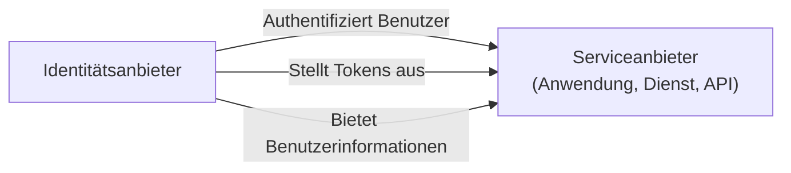
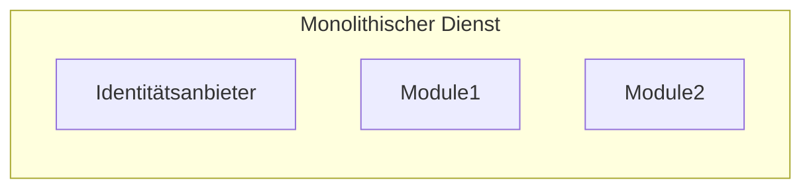
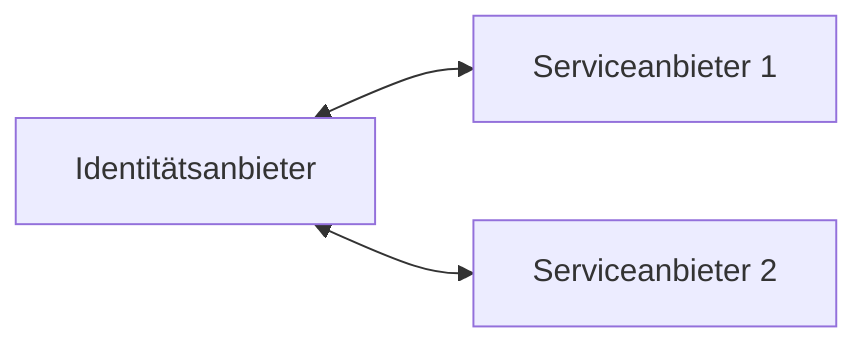

## Was ist ein Identitätsanbieter (IdP)?

Im Bereich des <Ref slug="iam" /> ist ein Identitätsanbieter (IdP) der zentrale Dienst zur Verwaltung von Identitäten. Er ist verantwortlich für die Authentifizierung von Benutzern, die Ausstellung von Identitätstoken und die Bereitstellung von Benutzerinformationen für <Ref slug="service-provider">Serviceanbieter</Ref> (z. B. Anwendungen, Dienste, APIs).

Neben der <Ref slug="authentication" /> sind moderne Identitätsanbieter auch für die <Ref slug="authorization" /> (Durchsetzung von <Ref slug="access-control" />-Richtlinien) verantwortlich und unterstützen fortschrittliche Funktionen wie <Ref slug="single-sign-on" /> und <Ref slug="multi-tenancy" />.

## Standards für Identitätsanbieter

Aufgrund der Natur des Identitätsmanagements und der Notwendigkeit der Interoperabilität wäre es unpraktisch und ineffizient, Identitätsanbieter ohne Standards zu entwickeln. Hier sind einige typische Szenarien:

- Zwei Identitätsanbieter müssen miteinander kommunizieren, um Benutzerinformationen auszutauschen (z. B. Soziale Anmeldung).
- Eine Anwendung muss Benutzer mit mehreren Identitätsanbietern authentifizieren (z. B. föderierte Identität).
- Ein Identitätsanbieter muss verschiedene Arten von Clients unterstützen (z. B. Web, Mobil, IoT).

Um diese Szenarien zu adressieren, hat die Branche mehrere beliebte Standards für Identitätsanbieter entwickelt:

- <Ref slug="oauth-2.0" />: Ein weit verbreitetes Autorisierungs-Framework, das Anwendungen ermöglicht, im Namen von Benutzern oder Diensten Zugriff zu erhalten.
- <Ref slug="openid-connect" />: Eine Identitätsschicht, die auf OAuth 2.0 aufbaut und Authentifizierung und Benutzerinformationen bereitstellt.
- <Ref slug="saml" />: Ein Standard zum Austausch von Authentifizierungs- und Autorisierungsdaten zwischen Sicherheitsdomänen.

Für neue Anwendungen ist OpenID Connect (OIDC) der empfohlene Standard, um entweder einen Identitätsanbieter zu entwickeln oder sich mit bestehenden Identitätsanbietern zu integrieren.

## Architektur von Identitätsanbietern

Der Begriff "Identitätsanbieter" spezifiziert keine bestimmte Architektur oder Implementierung. Ein Identitätsanbieter kann also auch eine monolithische Anwendung, ein Microservice oder ein Cloud-Dienst sein.

Aufgrund der Komplexität und Kritikalität des Identitätsmanagements neigen moderne Anwendungen dazu, spezialisierte Identitätsanbieter zu verwenden, die eigenständige Dienste oder Anbieter-Lösungen sind.

## Funktionen von Identitätsanbietern

Moderne Identitätsanbieter bieten eine breite Palette von Funktionen zur Unterstützung verschiedener Anwendungsfälle und Anforderungen. Hier sind einige gängige Funktionen:

- <Ref slug="authentication" />: Überprüfung der Identität von Benutzern mit verschiedenen Methoden (z. B. Benutzername/Passwort, Soziale Anmeldung, <Ref slug="mfa" />).
- <Ref slug="authorization" />: Durchsetzung von Zugriffskontrollrichtlinien und Verwaltung von Benutzerberechtigungen (z. B. <Ref slug="rbac" />, <Ref slug="abac" />).
- **Benutzerverwaltung**: Erstellen, aktualisieren und löschen von Benutzerkonten und -profilen; Bereitstellung von Benutzerdaten für <Ref slug="service-provider">Serviceanbieter</Ref>.
- **Token-Management**: Ausstellung und Verwaltung von Identitätstokens (z. B. ID-Token, Zugriffstoken, Auffrischungstoken).
- <Ref slug="single-sign-on" />: Ermöglicht es Benutzern, sich einmalig zu authentifizieren und auf mehrere Anwendungen zuzugreifen.
- <Ref slug="multi-tenancy" />: Unterstützung mehrerer Organisationen oder Mandanten mit isolierten Benutzerdaten und Konfigurationen.

<SeeAlso slugs={["service-provider", "iam", "openid-connect", "oauth-2.0"]} />

<Resources
  urls={[
    "https://blog.logto.io/secure-cloud-apps-with-oauth-and-openid-connect",
    "https://blog.logto.io/incorporate-identity-solution",
    "https://blog.logto.io/centralized-identity-system"
  ]}
/>
