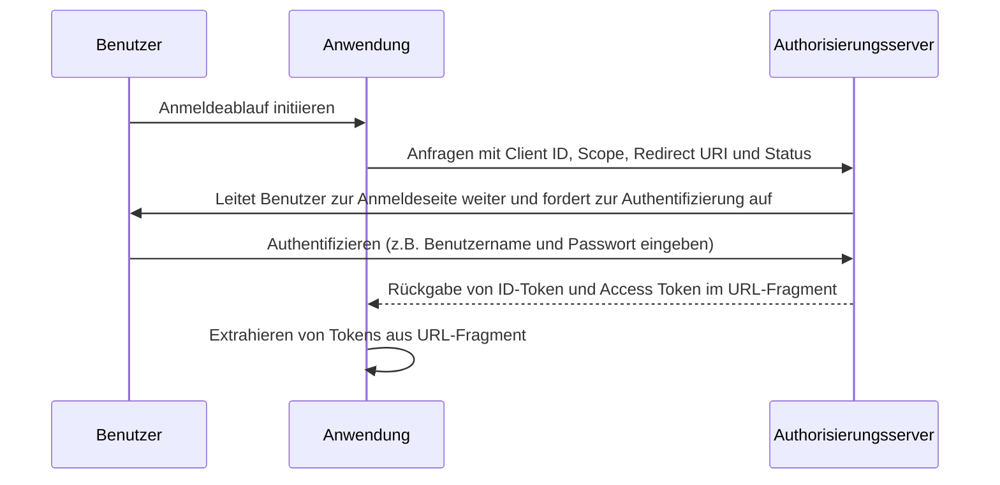

## Was ist der implizite Flow (Implicit flow)

Der OIDC (OpenID Connect) implizite Flow (Implicit flow) ist ein Authentifizierungsprozess, der hauptsächlich von Client-Anwendungen verwendet wird, die in einem Browser mit einer Skriptsprache implementiert sind, z.B. Single-Page-Applications (SPAs). Er ermöglicht es Client-Anwendungen, direkte ID-Tokens und Access Tokens vom Authorization Server (Autorisierungsserver) zu erhalten, ohne eine Client-Authentifizierung durchzuführen.

## Wie funktioniert der implizite Flow (Implicit flow)?

Die Hauptschritte des impliziten Flows (Implicit flow) sind wie folgt:

1. **Senden der Authentication Request (Authentifizierungsanforderung)**: Der Benutzer initiiert den Flow typischerweise, indem er auf einen Link oder Button in der Anwendung klickt, um sich anzumelden. Die Anwendung sendet eine Authentication Request (Authentifizierungsanforderung) an den Authorization Server (Autorisierungsserver) Endpoint. Der Authorization Server (Autorisierungsserver) validiert die Parameter und leitet den Benutzer zur Authentifizierung auf die Anmeldeseite des Authorization Servers (Autorisierungsservers) weiter.
2. **User Authentication (Benutzerauthentifizierung)**: Der Benutzer authentifiziert sich auf dem Authorization Server (Autorisierungsserver) (z.B. durch Eingabe von Benutzername und Passwort).
3. **Antwort des Authorization Servers (Autorisierungsservers)**: Der Authorization Server (Autorisierungsserver) gibt ein ID-Token und, falls angefordert, ein Access Token als URL-Fragment an die Client-Anwendung zurück.
4. **Client verarbeitet Tokens**: Die Client-Anwendung extrahiert die Tokens aus dem URL-Fragment.



### Authentication Request (Authentifizierungsanforderung)

Die Anforderungsparameter sind wie folgt:
- **client_id**: ERFORDERLICH. Gültige OAuth 2.0 Client-Kennung, die in Logto als Anwendungs-ID (oder App-ID) verfügbar ist.
- **scope**: ERFORDERLICH. Dieser Wert spezifiziert eine Reihe von Ressourcen, die der Benutzer vom Authorization Server (Autorisierungsserver) anfordert. Z.B. `openid profile email`
- **response_type**: ERFORDERLICH. Der Wert ist entweder `id_token` oder `id_token token`. Es wird kein Access Token zurückgegeben, wenn der Wert `id_token` ist.
- **redirect_uri**: ERFORDERLICH. Die URI, an die die Authentication Response (Authentifizierungsantwort) gesendet wird und sollte genau mit der Redirect URI übereinstimmen, die der Client beim <Ref slug="openid-connect" headingId="openid-provider-op" /> vorregistriert hat. Z.B. `Sign-in redirect URI` in Logto Admin Console.
- **nonce**: ERFORDERLICH. Ein Zufallsstring, der verwendet wird, um Replay-Angriffe zu verhindern, welcher unverändert von der Authentication Request (Authentifizierungsanforderung) zum ID-Token-Claim übergeben wird.

### Beispiel einer Authentication Request (Authentifizierungsanforderung)

```bash
curl -X GET "https://authorization-server.com/auth" \
  -d "response_type=id_token token" \
  -d "client_id=YOUR_APPLICATION_ID" \
  -d "redirect_uri=https://yourapp.com/callback" \
  -d "scope=openid profile email" \
  -d "nonce=RANDOM_STRING"
```

## Einschränkungen

Der implizite Flow (Implicit flow) wurde in einer Zeit entwickelt, als Browser noch nicht weit verbreitet Cross-Origin Resource Sharing (CORS) unterstützten. Daher ist das Senden von POST-Anfragen an einen Authorization Server (Autorisierungsserver), der auf einer anderen Domain gehostet wird, untersagt.

Aufgrund dieser Einschränkung gibt der Authorization Server (Autorisierungsserver) die Tokens direkt im URL-Fragment zurück, was sie dem Endbenutzer und Anwendungen, die Zugriff auf den User Agent des Endbenutzers haben, aussetzen kann.

Darüber hinaus wird die Client-Authentifizierung im impliziten Flow (Implicit flow) nicht durchgeführt, was bedeutet, dass jede Anwendung vorgeben kann, der Client zu sein, der die Authentifizierung anfordert, da die Client-ID immer in browserbasierten Anwendungen sichtbar ist.

Aufgrund der oben genannten Einschränkungen wird der implizite Flow (Implicit flow) häufig als weniger sicher als der Authorization Code Flow betrachtet.

## Alternativen zum impliziten Flow (Implicit flow)

Angesichts der Sicherheitseinschränkungen des impliziten Flows (Implicit flow) werden häufig andere Flows empfohlen:
- **Authorization Code Flow**: Dieser Flow beinhaltet einen zusätzlichen Schritt, bei dem der Client einen Authorization Code gegen Tokens eintauscht, wodurch eine zusätzliche Sicherheitsebene geboten wird.
- **PKCE (Proof Key for Code Exchange)**: Eine Erweiterung des Authorization Code Flow, die eine zusätzliche Sicherheitsebene durch die Verwendung eines Code-Verifikators und einer Code-Challenge hinzufügt.

<SeeAlso slugs={['device-flow', 'authorization-code-flow', 'client-credentials-flow']} />

<Resources
  urls={[
    "https://blog.logto.io/implicit-flow-is-dead",
    {
      url: "https://tools.ietf.org/html/rfc6749#section-4.2",
      result: {
        ogTitle: "The OAuth 2.0 Authorization Framework: Implicit Grant",
        ogDescription: "The implicit grant type is used to obtain access tokens (it does not support the issuance of refresh tokens) and is optimized for public clients known to operate a particular redirection URI. These clients are typically implemented in a browser using a scripting language such as JavaScript."
      }
    },
    "https://openid.net/specs/openid-connect-core-1_0.html",
  ]}
/>
