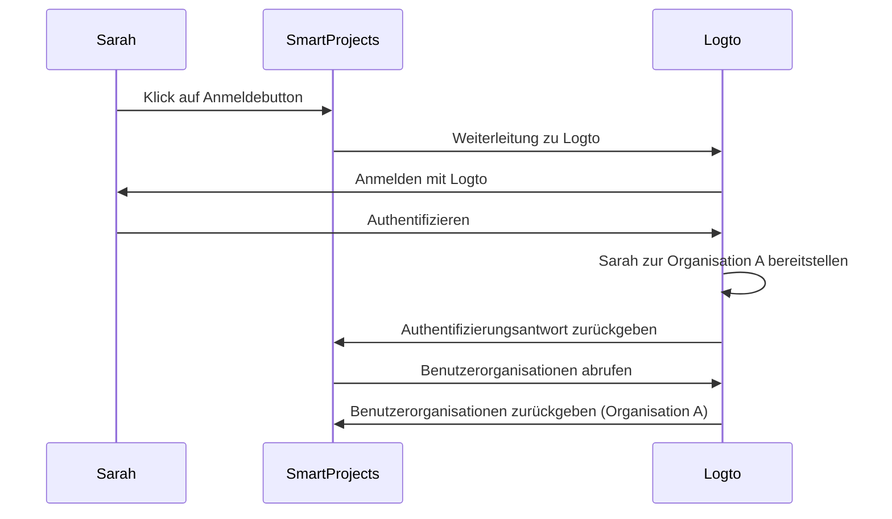
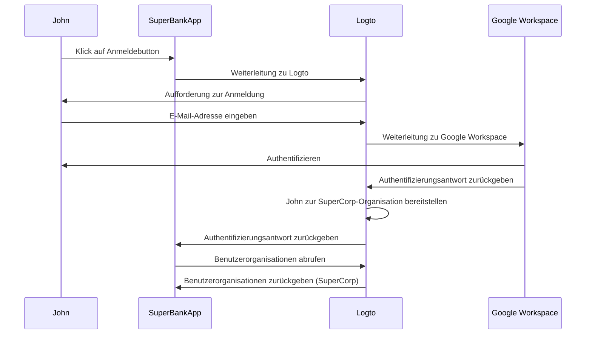

## Was ist Just-in-time Bereitstellung?

Just-in-time (JIT) Bereitstellung ist ein Prozess, der in <Ref slug="iam" /> verwendet wird, bei dem Benutzerkonten basierend auf der Identität des Benutzers und der Konfiguration des Systems dynamisch bereitgestellt werden, wenn der Benutzer sich zum ersten Mal anmeldet.

## Was sind die Anwendungsfälle für Just-in-time Bereitstellung?

Diese Fälle sind häufig beim Erstellen einer B2B-App, die eine Multi-Tenant-Architektur, Enterprise SSO oder Funktionen zur Team-Onboarding erfordert. Hier sind einige Beispielszenarien, denen du oder dein Kunde begegnen könntet.

### Mitarbeiter-Onboarding

Stell dir vor, einer deiner Kunden, *SuperFantasy*, erlebt häufige Einstellungen oder schnelles Wachstum und kann die JIT-Bereitstellung nutzen, um Benutzerkonten für neue Mitarbeiter schnell einzurichten. *SuperFantasy* verwendet Logto für Identity and Access Management und SmartProjects für Projektmanagement. Wenn sich eine neue Mitarbeiterin, Sarah, zum ersten Mal bei SmartProjects anmeldet, wird ihr Konto automatisch basierend auf ihren Logto-Anmeldedaten erstellt und konfiguriert.

Gemäß dem obigen Diagramm wird Sarahs Konto automatisch zur Organisation A in Logto bereitgestellt, wenn sie sich zum ersten Mal bei SmartProjects anmeldet. Dieser Prozess stellt sicher, dass Sarah den erforderlichen Zugriff auf SmartProjects hat, ohne dass ein manuelles Eingreifen des IT-Teams erforderlich ist.

### Onboarding von Unternehmenskunden

Stell dir vor, ein weiterer Kunde, *SuperBank*, ist eine Finanzinstitution, die ihren Kunden Online-Banking-Dienste anbietet. *SuperBank* verwendet Logto für Identity and Access Management und SuperBankApp für Online-Banking. *SuperBank* hat kürzlich einen Vertrag mit einem neuen Unternehmenskunden, *SuperCorp*, unterzeichnet, um dessen Mitarbeitern Online-Banking-Dienste bereitzustellen.

*SuperCorp* verwendet Google Workspace für seine Mitarbeiterkonten. SuperBankApp muss sicherstellen, dass, wenn sich ein Mitarbeiter von *SuperCorp* zum ersten Mal anmeldet, sein Konto automatisch zur *SuperCorp*-Organisation in Logto hinzugefügt wird.

Im obigen Diagramm wird Johns Konto automatisch zur SuperCorp-Organisation in Logto bereitgestellt, wenn er sich zum ersten Mal bei SuperBankApp anmeldet, basierend auf seiner Google Workspace-Identität.

## Ist es spezifisch für SAML und Enterprise SSO?

Just-in-time (JIT) Bereitstellung wird oft mit <Ref slug="enterprise-sso" /> in SAML-Authentifizierung in Verbindung gebracht, ist jedoch nicht exklusiv für <Ref slug="saml" />. JIT-Bereitstellung kann auch mit anderen Authentifizierungsprotokollen wie <Ref slug="oauth-2.0" /> und <Ref slug="openid-connect" /> verwendet werden und erfordert nicht immer eine <Ref slug="enterprise-sso" />-Einrichtung.

Zum Beispiel kann E-Mail-basierte JIT-Bereitstellung verwendet werden, wenn dein <Ref slug="identity-provider" /> diese Funktion unterstützt. In diesem Fall ist die E-Mail-Adresse des Benutzers das einzige erforderliche Attribut für die Bereitstellung, unabhängig vom Authentifizierungsprotokoll oder der SSO-Konfiguration.

## Gilt es für neue oder bestehende Benutzer der App?

Just-in-time (JIT) Bereitstellung bezieht sich im Allgemeinen auf den ersten Versuch, auf eine App zuzugreifen. Verschiedene Produkte nehmen diese Funktionalität jedoch unterschiedlich wahr. Einige verwenden JIT-Bereitstellung nur für Identitäts- und Kontoerstellung, während andere auch Just-in-time-Kontoaktualisierungen, wie Re-Provisioning und Attributsynchronisation, einschließen.

Zum Beispiel ermöglicht SAML JIT Provisioning das Gewähren und Widerrufen von Gruppenmitgliedschaften als Teil der Bereitstellung. Es kann auch bereitgestellte Benutzer aktualisieren, um ihre Attribute im <Ref slug="service-provider" />-Speicher mit den Attributen des <Ref slug="identity-provider" />-Benutzerspeichers synchron zu halten.

Wenn du das Szenario der nachfolgenden Anmeldung bestehender Benutzer in Betracht ziehen möchtest, stelle sicher, dass du ein robustes Bereitstellungssystem zusammen mit deinem JIT-System hast. Zum Beispiel:

- **Konfliktlösung**: Dein System sollte eine Strategie zur Handhabung von Konflikten haben, wenn ein Konto bereits mit anderen Informationen existiert als die, die vom IdP während des JIT-Prozesses bereitgestellt werden. Dies kann eine detaillierte Kontrolle über die Richtlinien deiner Organisation und die IdP-Konfiguration erfordern.
- **Audit-Trails**: Es ist wichtig, Protokolle sowohl über neue Kontoerstellungen als auch über Aktualisierungen bestehender Konten durch JIT-Prozesse aus Sicherheits- und Compliance-Gründen zu führen.
- **Leistung**: Während JIT-Bereitstellung schnell erfolgt, berücksichtige die potenziellen Auswirkungen auf die Anmeldezeiten, insbesondere für bestehende Benutzer, wenn du ihre Informationen bei jeder Anmeldung aktualisierst.
- **Datenkonsistenz**: Stelle sicher, dass dein JIT-Bereitstellungsprozess die Datenkonsistenz aufrechterhält, insbesondere beim Aktualisieren bestehender Benutzerkonten.

## Was ist der Unterschied zwischen JIT und System for Cross-domain Identity Management (SCIM)?

SCIM ist ein offenes Standardprotokoll, das entwickelt wurde, um die Verwaltung von Benutzeridentitäten über verschiedene Systeme und Domänen hinweg zu vereinfachen und zu automatisieren. Es wird häufig in Verzeichnissynchronisationsszenarien verwendet.

Der Hauptunterschied zwischen JIT und SCIM besteht darin, dass JIT sich oft auf den ersten Versuch bezieht, auf eine App zuzugreifen (oder das Onboarding neuer Benutzer), und es ist ein allgemeiner Begriff, der den Prozess der dynamischen Bereitstellung von Benutzerkonten beschreibt; während SCIM ein spezifisches Protokoll zur Verwaltung des Benutzerlebenszyklus über Systeme hinweg ist und nicht auf die erste Anmeldung beschränkt ist.

Darüber hinaus fehlt JIT eine standardisierte Implementierung über Systeme hinweg, während SCIM ein standardisiertes Protokoll ist, das in [RFC 7644](https://datatracker.ietf.org/doc/html/rfc7644) für Identitätsmanagement definiert ist.

Einige größere Organisationen verwenden SCIM für die Kontobereitstellung und integrieren es in ihre eigenen Systeme. Dies kann sehr komplex sein und von Fall zu Fall variieren. Für die meisten Anwendungsfälle ist JIT-Bereitstellung ein einfacherer und direkterer Ansatz.

<Resources urls={['https://blog.logto.io/jit-provisioning', 'https://datatracker.ietf.org/doc/html/rfc7644']} />