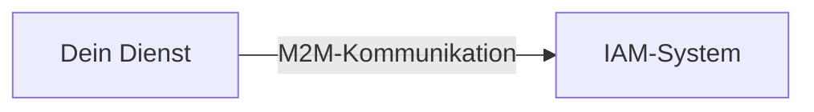
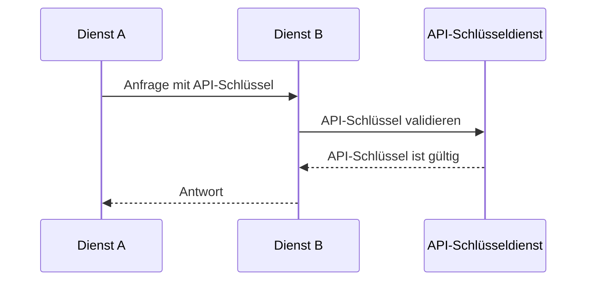
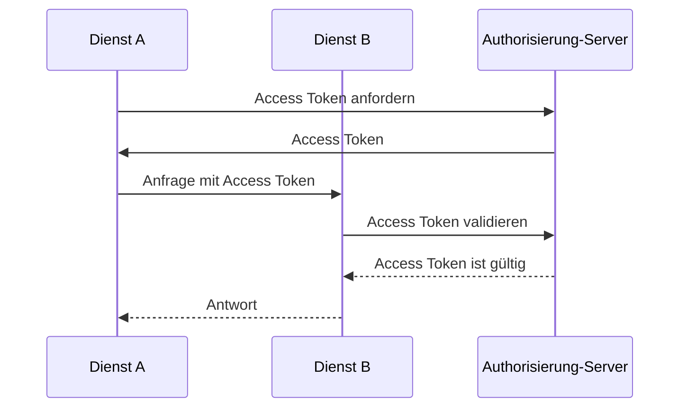
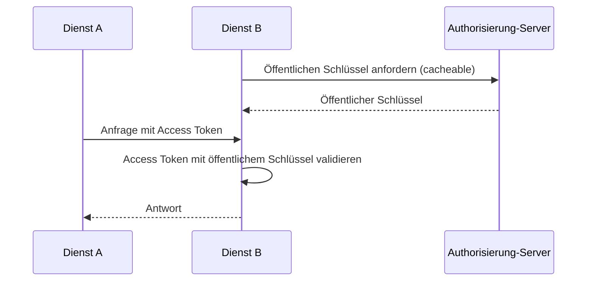

## Was ist Machine-to-Machine (M2M)-Kommunikation?

Machine-to-Machine (M2M)-Kommunikation bezieht sich auf den automatisierten Datenaustausch zwischen Geräten ohne menschliche Intervention. Im Kontext von Authentifizierung (Authentication) und Autorisierung (Authorization) beinhaltet die M2M-Kommunikation oft eine Client-Anwendung, die auf Ressourcen zugreifen muss, wobei die Client-Anwendung entweder eine Maschine (Dienst) ist oder eine Maschine, die im Namen eines Benutzers handelt.

## Warum müssen wir uns mit Machine-to-Machine (M2M)-Kommunikation befassen?

Wenn du nur einen Dienst ohne Abhängigkeiten hast, muss dieser höchstwahrscheinlich nicht mit anderen Diensten kommunizieren. Wenn dein System wächst oder du dich mit einem Identity and Access Management (IAM)-System integrieren möchtest, musst du die M2M-Kommunikation handhaben.

Es sieht jedoch immer noch einfach aus - alles, was du tun musst, ist, den Dienst zu identifizieren und zu authentifizieren. Aber in Wirklichkeit gibt es mehrere Herausforderungen, die du angehen musst:

### 1. Authentifizierung (Authentication)

Wie authentifizierst du den Dienst? Du kannst keinen Benutzernamen und kein Passwort verwenden, da es keinen Menschen gibt, der sie eingibt. Du musst einen anderen Mechanismus verwenden, wie z.B. API-Schlüssel, Client-Zertifikate oder OAuth Client Credentials.

### 2. Autorisierung (Authorization)

Sobald du den Dienst authentifiziert hast, wie bestimmst du, was der Dienst tun kann? Du musst die Berechtigungen und Rollen für den Dienst definieren, ähnlich wie du sie für Benutzer definierst. Das Letzte, was du willst, ist, die Berechtigungen in deinem Code zu fest verdrahten.

### 3. Sicherheit

Wie stellst du sicher, dass die Kommunikation zwischen den Diensten sicher ist? Werden die Anmeldedaten regelmäßig aktualisiert? Wie überwachst und prüfst du die Kommunikation?

### 4. Skalierbarkeit

Wie verwaltest du die Authentifizierung (Authentication) und Autorisierung (Authorization) für jeden Dienst, wenn die Anzahl der Dienste wächst?

## Die gängigen Ansätze zur Machine-to-Machine (M2M)-Kommunikation

Mit den Herausforderungen im Hinterkopf gibt es mehrere gängige Ansätze in der Industrie:

### 1. API-Schlüssel

<Ref slug="api-key">API-Schlüssel</Ref> sind eine einfache Möglichkeit, Dienste zu authentifizieren. Jeder Dienst kann einen oder mehrere API-Schlüssel haben, die zur Authentifizierung (und manchmal zur Autorisierung) verwendet werden. Du könntest sehen, dass einige Dienste dich auffordern, einen API-Schlüssel im Anfrageheader anzugeben, z.B. `X-API-Key: your-api-key`.

Ein nicht-normativer Beispiel, wie API-Schlüssel funktionieren:

Vorteile:

- Einfach zu implementieren und zu verwenden.
- Mit sicherer Zufallsgenerierung und ausreichender Länge sind API-Schlüssel schwer zu erraten.
- Die Validierung ist dynamisch, was bedeutet, dass du einen API-Schlüssel jederzeit widerrufen kannst.

Nachteile:

- Erfordert Netzwerkkommunikation zur Validierung des API-Schlüssels.
- Es ist nicht eigenständig, was bedeutet, dass ein Dienst zur Introspektion erforderlich ist.
- Der andere Dienst hat das gleiche Zugriffslevel wie der Dienst, dem der API-Schlüssel gehört (es könnte teilweise durch die Verwendung von API-Gateway gemildert werden).
- Es ist schwer, eine große Anzahl von API-Schlüsseln über Dienste hinweg zu verwalten.

### 2. OAuth Client Credentials

OAuth (oder OIDC, da OpenID Connect auf OAuth 2.0 basiert) <Ref slug="client-credentials-flow" /> ist eine fortschrittlichere Methode zur Authentifizierung von Diensten. Es basiert auf dem OAuth 2.0-Framework, das weit verbreitet für die Benutzerauthentifizierung und -autorisierung ist. Mit OAuth Client Credentials kann ein Dienst ein Access Token erhalten, indem er seine Client-ID und sein Client-Geheimnis beim Authorisierung-Server präsentiert.

Ein nicht-normativer Beispiel, wie OAuth Client Credentials funktionieren:

In der Regel ist das Access Token ein JSON Web Token (JWT), das Informationen über den Dienst und dessen Berechtigungen enthält. Dann kann der andere Dienst das Access Token validieren, ohne mit dem Authorisierung-Server zu kommunizieren (solange er den öffentlichen Schlüssel hat, um die JWT-Signatur zu überprüfen). Der Arbeitsablauf wird:

Für mehr Informationen über JSON Web Tokens, siehe <Ref slug="jwt" />.

Vorteile (mit JWT):

- Eigenständig, was bedeutet, dass der andere Dienst sofort die notwendigen Informationen wie Berechtigungen ohne zusätzliche Netzwerkkommunikation wissen kann.
- Das Access Token kann kurzlebig sein, was das Missbrauchsrisiko verringert.
- Der andere Dienst muss das Client-Geheimnis nicht kennen, nur den öffentlichen Schlüssel zur Überprüfung der JWT-Signatur.
- Das Access Token kann verwendet werden, um die Aktionen des Dienstes zu prüfen (z.B. welcher Dienst auf welche Ressource zugegriffen hat).
- Es ist einfacher, eine große Anzahl von Diensten zu verwalten, da es eine klare Grenze zwischen Diensten und Berechtigungen zieht.

Nachteile:

- Etwas komplexer zu implementieren und zu verwenden als API-Schlüssel.
- Wenn der andere Dienst nur offline validiert, weiß er möglicherweise nicht, ob das Access Token widerrufen wird.

### 3. Mutual TLS

Mutual TLS (mTLS) ist eine Möglichkeit, Dienste mit Client-Zertifikaten zu authentifizieren. Mit mTLS hält jeder Dienst ein Client-Zertifikat mit einem privaten Schlüssel, und der andere Dienst überprüft das Zertifikat mit dem öffentlichen Schlüssel. Allerdings konzentriert sich mTLS auf die TLS-Ebene, was bedeutet, dass es allein normalerweise nicht für die Anwendungsebene der Authentifizierung (Authentication) und Autorisierung (Authorization) geeignet ist.

Für fortschrittliche Anwendungsfälle kann mTLS mit zertifikatsgebundenen Access Tokens kombiniert werden, um die Kommunikation weiter abzusichern. Siehe [RFC 8705: OAuth 2.0 Mutual-TLS Client Authentication und Certificate-Bound Access Tokens](https://datatracker.ietf.org/doc/html/rfc8705) für mehr Informationen.

Vorteile:

- Starke Authentifizierung (Authentication), da sie auf Public-Key-Kryptographie basiert.
- Die Kommunikation ist verschlüsselt und standardmäßig sicher.
- Das Client-Zertifikat kann verwendet werden, um den Dienst zu identifizieren, ähnlich wie ein JWT funktioniert.

Nachteile:

- Komplexer zu implementieren und zu verwalten als API-Schlüssel und OAuth Client Credentials.
- Das Client-Zertifikat muss regelmäßig aktualisiert werden.
- Mehr technisches Wissen ist erforderlich, um Client-Zertifikate ordnungsgemäß zu verwalten.
- Der andere Dienst unterstützt möglicherweise kein mTLS, was bedeutet, dass du einen Fallback-Mechanismus benötigst.

<SeeAlso slugs={["api-key", "client-credentials-flow", "jwt"]} />