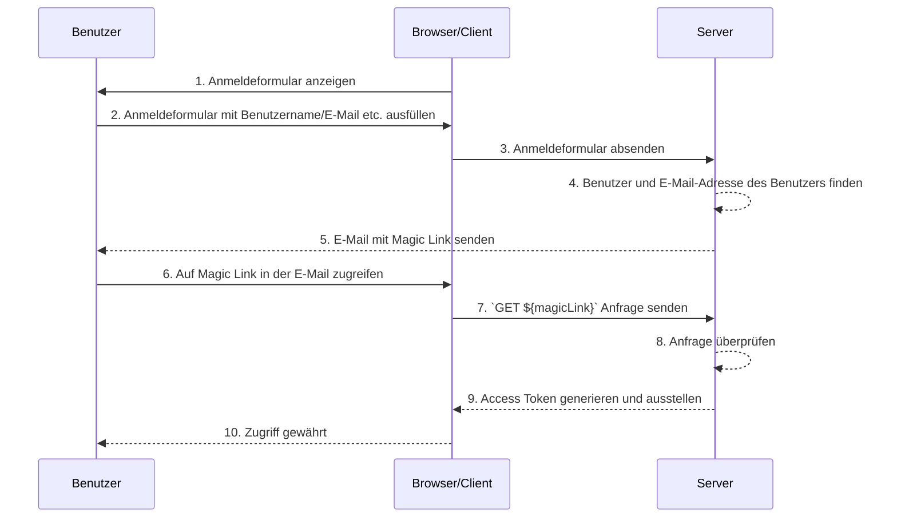

## Was sind Magic Links?

Ein Magic Link ist ein einmal verwendbarer Link, der dem Benutzer während des Authentifizierungsprozesses gesendet wird.

Durch den Zugriff auf diesen Link schließt der Benutzer den erforderlichen Autorisierungsablauf (authorization flow) ab, um auf die gewünschte Ressource zuzugreifen, und erhält den entsprechenden Ressourcen-Zugriff. Danach wird der Magic Link ungültig.

## Was ist der Unterschied zwischen Magic Link und Einmalpasswort (OTP)?

Nehmen wir an, der Benutzer verwendet E-Mail, um einen Magic Link oder ein OTP zu erhalten.

In vielen Fällen nutzen Benutzer eine E-Mail, um ein OTP zu erhalten, um den Login zu verifizieren oder als zusätzlichen Verifizierungsfaktor für MFA (Multi-Faktor-Authentifizierung) zu verwenden. Was ist der Unterschied zwischen der Verwendung eines E-Mail-Magic-Links und eines E-Mail-OTPs?

Bei einem OTP muss der Benutzer seine E-Mail überprüfen, das OTP merken und es dann im Login-/Verifizierungsprozess eingeben. Dies erfordert, dass der Benutzer wiederholt manuell zwischen verschiedenen Apps oder Seiten wechselt.

Bei einem E-Mail-Magic-Link muss der Benutzer lediglich die E-Mail-App öffnen, die den Magic Link enthält, und auf den Link klicken. Dies bietet eine einfachere Benutzererfahrung.

Darüber hinaus ermöglicht die Verwendung eines Magic Links die Einbeziehung von Informationen über ein einmaliges Token hinaus in den Link, wie beispielsweise sitzungsbezogene Informationen für das Einloggen. Dies kann sowohl die Sicherheit als auch die Benutzererfahrung verbessern.

## Wie funktioniert ein Magic Link?

In diesem Sequenzdiagramm zeigen wir, wie sich ein Benutzer anmeldet und mit einem Magic Link auf die entsprechenden Ressourcen zugreift.

In diesem Sequenzdiagramm nehmen wir an, dass der Magic Link per E-Mail versendet wird. Es gibt jedoch auch andere mögliche Methoden, einen Magic Link zu senden, wie zum Beispiel das Versenden per SMS an ein Mobiltelefon. Diese Alternativen werden hier nicht behandelt, da die Abläufe fast identisch sind.

1. **Anmeldeformular anzeigen**  
Der Browser/Client initiiert den Authentifizierungsprozess, indem er dem Benutzer ein Anmeldeformular zeigt.

2. **Benutzer füllt das Anmeldeformular aus**  
Der Benutzer gibt seinen Identifikator, wie Benutzername, E-Mail-Adresse oder Telefonnummer, in das Anmeldeformular ein. Die bereitgestellten Informationen müssen ausreichen, um dem System zu helfen, einen eindeutigen Benutzer zu identifizieren. Zum Beispiel sind in den meisten Systemen die Benutzernamen, die zur Anmeldung verwendet werden, eindeutig. In solchen Systemen müssen Benutzer nur ihren Benutzernamen angeben, um dem System zu helfen, das Konto, bei dem sie sich anmelden möchten, eindeutig zu identifizieren.

3. **Anmeldeformular absenden**  
Der Browser/Client sendet das Formular an den Server, das die in Schritt 2 beschriebenen Informationen des Benutzers enthält.

4. **Benutzer und E-Mail finden**  
Der Server verarbeitet die Anfrage, indem er den eindeutigen Benutzer in der Datenbank findet und die zugehörige E-Mail-Adresse des Benutzers abruft.

5. **E-Mail mit Magic Link senden**  
Der Server sendet eine E-Mail an die E-Mail-Adresse des Benutzers. Diese E-Mail enthält einen Magic Link zur Authentifizierung.

6. **Benutzer greift auf den Magic Link zu**  
Der Benutzer erhält die E-Mail und klickt auf den darin enthaltenen Magic Link.

7. **GET-Anfrage mit Magic Link senden**  
Der Browser/Client sendet eine `GET`-Anfrage an den Server, wobei die URL des Magic Links verwendet wird.

8. **Anfrage überprüfen**  
Der Server überprüft die Anfrage, um sicherzustellen, dass der Magic Link gültig, nicht verwendet und nicht abgelaufen ist.

9. **Access Token generieren und ausstellen**  
Sobald die Anfrage verifiziert ist, generiert der Server ein Access Token und stellt es dem Browser/Client aus.

10. **Zugriff gewähren**  
Der Browser/Client erhält das Access Token und erlaubt dem Benutzer, auf die angeforderte Ressource zuzugreifen.

## Was sind die Vorteile von Magic Links?

Magic Links verbessern die Sicherheitsarchitektur von Authentifizierungssystemen, indem sie ein tokenbasiertes Interaktionsmodell verwenden. Jeder Link ist individuell verschlüsselt und enthält in der Regel einen Ablaufzeitstempel. Aufgrund ihrer vergänglichen Natur, selbst wenn ein Magic Link abgefangen oder geleakt wird, begrenzt sein kurzes Gültigkeitsfenster die Möglichkeit eines böswilligen Missbrauchs.

Darüber hinaus bietet die Verwendung von Magic Links eine durch den Benutzer kontrollierte Empfangsmethode, wie eine vertrauenswürdige E-Mail-Adresse oder Telefonnummer, eine zusätzliche Verifizierungsmethode über Benutzername und Passwort hinaus und bietet zusätzliche Kontosicherheit. Und da Magic Links die Eingabe von Anmeldeinformationen überflüssig machen, wird die Sicherheit der Benutzerkonten besser geschützt und der Prozess wird bequemer.