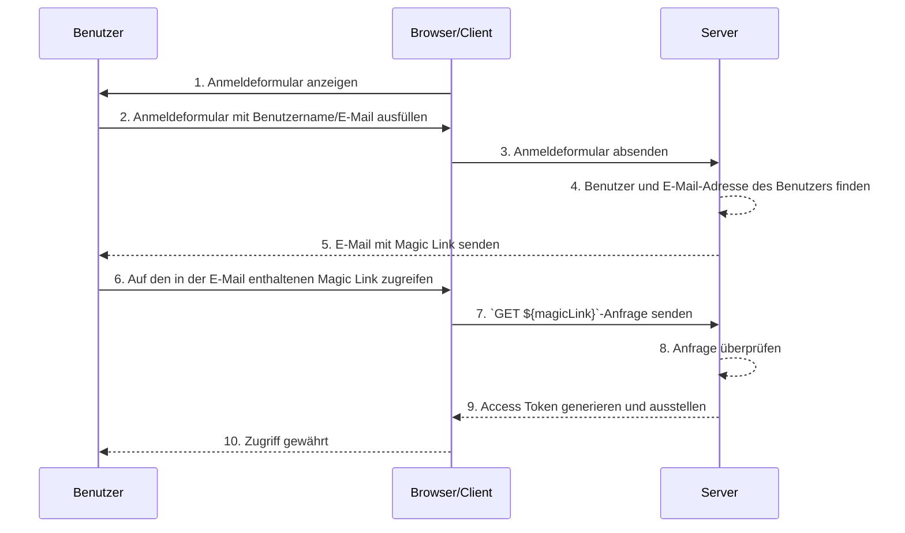

## Was sind Magic Links?

Ein Magic Link ist ein einmalig verwendbarer Link, der dem Benutzer während des Authentifizierungsprozesses gesendet wird.

Durch den Zugriff auf diesen Link schließt der Benutzer den erforderlichen Autorisierungsfluss (authorization flow) ab, um auf die gewünschte Ressource zuzugreifen, und erhält den entsprechenden Zugriff auf die Ressourcen. Danach wird der Magic Link ungültig.

## Was ist der Unterschied zwischen Magic Link und Einmalpasswort (OTP)?

Nehmen wir an, der Benutzer verwendet E-Mail, um einen Magic Link oder <Ref slug='otp' /> zu erhalten.

In vielen Fällen verwenden Benutzer E-Mail, um ein OTP zu erhalten, um sich anzumelden oder als zusätzlichen Verifizierungsfaktor für <Ref slug='mfa' />. Was ist der Unterschied zwischen der Verwendung eines E-Mail-Magic-Links und eines E-Mail-OTPs?

Mit OTP muss der Benutzer seine E-Mail überprüfen, das OTP merken und es dann im Anmelde-/Verifizierungsprozess eingeben. Dies erfordert, dass der Benutzer wiederholt manuell zwischen verschiedenen Apps oder Seiten wechselt.

Bei Verwendung eines E-Mail-Magic-Links muss der Benutzer nur die E-Mail-App öffnen, die den Magic Link enthält, und auf den Link klicken. Dies bietet eine einfachere Benutzererfahrung.

Darüber hinaus ermöglicht die Verwendung eines Magic Links die Einbeziehung von Informationen über ein Einmaltoken hinaus im Link, wie z. B. sitzungsbezogene Informationen für die Anmeldung. Dies kann sowohl die Sicherheit als auch die Benutzererfahrung verbessern.

## Wie funktioniert ein Magic Link?

In diesem Sequenzdiagramm veranschaulichen wir, wie sich ein Benutzer anmeldet und Zugriff auf die entsprechenden Ressourcen erhält, indem er einen Magic Link verwendet.

In diesem Sequenzdiagramm gehen wir davon aus, dass der Magic Link per E-Mail gesendet wird. Es gibt jedoch auch andere mögliche Methoden, um einen Magic Link zu senden, wie z. B. das Senden per SMS an ein Mobiltelefon. Diese Alternativen werden hier nicht behandelt, da die Abläufe fast gleich sind.

1. **Anmeldeformular anzeigen**  
   Der Browser/Client initiiert den Authentifizierungsprozess, indem er dem Benutzer ein Anmeldeformular anzeigt.
2. **Benutzer füllt das Anmeldeformular aus**  
   Der Benutzer gibt seinen Identifikator, wie Benutzername, E-Mail-Adresse oder Telefonnummer, in das Anmeldeformular ein.  
   Die bereitgestellten Informationen müssen ausreichen, um dem System zu helfen, einen eindeutigen Benutzer zu identifizieren. Zum Beispiel sind in den meisten Systemen Benutzernamen, die zur Anmeldung verwendet werden, eindeutig. In solchen Systemen müssen Benutzer nur ihren Benutzernamen angeben, um dem System zu helfen, das Konto, bei dem sie sich anmelden möchten, eindeutig zu identifizieren.
3. **Anmeldeformular absenden**  
   Der Browser/Client sendet das Formular an den Server, das die in Schritt 2 beschriebenen Informationen des Benutzers enthält.
4. **Benutzer und E-Mail finden**  
   Der Server verarbeitet die Anfrage, indem er den eindeutigen Benutzer in der Datenbank lokalisiert und die zugehörige E-Mail-Adresse des Benutzers abruft.
5. **E-Mail mit Magic Link senden**  
   Der Server sendet eine E-Mail an die E-Mail-Adresse des Benutzers. Diese E-Mail enthält einen Magic Link zur Authentifizierung.
6. **Benutzer greift auf den Magic Link zu**  
   Der Benutzer erhält die E-Mail und klickt auf den darin enthaltenen Magic Link.
7. **GET-Anfrage mit Magic Link senden**  
   Der Browser/Client sendet eine `GET`-Anfrage an den Server, indem er die URL des Magic Links verwendet.
8. **Anfrage überprüfen**  
   Der Server überprüft die Anfrage, um sicherzustellen, dass der Magic Link gültig, nicht verwendet und nicht abgelaufen ist.
9. **Access Token generieren und ausstellen**  
   Sobald die Anfrage überprüft ist, generiert der Server ein Access Token und stellt es dem Browser/Client aus.
10. **Zugriff gewähren**  
    Der Browser/Client erhält das Access Token und ermöglicht dem Benutzer den Zugriff auf die angeforderte Ressource.

## Was ist der Vorteil von Magic Links?

Magic Links verbessern die Sicherheitsarchitektur von Authentifizierungssystemen, indem sie ein tokenbasiertes Interaktionsmodell verwenden. Jeder Link ist eindeutig verschlüsselt und enthält typischerweise einen Ablaufzeitstempel. Aufgrund ihrer flüchtigen Natur, selbst wenn ein Magic Link abgefangen oder geleakt wird, begrenzt sein kurzes Gültigkeitsfenster die Möglichkeit für böswillige Ausnutzung.

Darüber hinaus bietet die Verwendung von Magic Links eine zusätzliche Verifizierungsmethode über Benutzername und Passwort hinaus, da eine vom Benutzer kontrollierte Empfangsmethode erforderlich ist, wie z. B. eine vertrauenswürdige E-Mail-Adresse oder Telefonnummer, was zusätzliche Kontosicherheit bietet. Und da Magic Links die Eingabe von Anmeldeinformationen überflüssig machen, wird die Kontosicherheit der Benutzer besser geschützt und der Prozess ist bequemer.