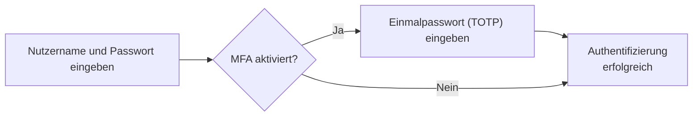

## Was ist Multi-Faktor-Authentifizierung (MFA)?

Multi-Faktor-Authentifizierung (MFA) verbessert die Sicherheit, indem von Benutzern mehrere Formen der Identifikation verlangt werden, um ihre Identität zu überprüfen. Sie fügt dem <Ref slug="authentication" />-Prozess eine zusätzliche Sicherheitsschicht hinzu, die es Angreifern erschwert, unbefugten Zugriff zu erlangen.

Hier ist ein Beispiel für MFA:

### Die Definition von "Faktor"

Im obigen Beispiel gibt es zwei Faktoren:

1. Nutzername und Passwort
2. <Ref slug="totp" /> von einer mobilen App

Jeder Faktor stellt eine andere Kategorie von Anmeldeinformationen dar, die zur Authentifizierung eines Benutzers verwendet werden können (nachweisen, dass du bist, wer du vorgibst zu sein). In der Praxis können Faktoren in drei Haupttypen kategorisiert werden:

|            | Was es bedeutet   | Verifizierungsfaktoren                                                                  |
| ---------- | ----------------- | --------------------------------------------------------------------------------------- |
| Wissen     | Etwas, das du weißt | Passwort, E-Mail-Bestätigungscode, Backup-Code                                         |
| Besitz     | Etwas, das du hast | SMS-Bestätigungscode, Authenticator App OTP, Hardware-OTP (Sicherheitsschlüssel), Smartcard |
| Inhärenz   | Etwas, das du bist | Biometrie wie Fingerabdrücke, Gesichts-ID                                              |

Ein häufiges MFA-Setup kombiniert zwei Faktoren aus verschiedenen Kategorien, wie ein Passwort (Wissen) und ein <Ref slug="totp" /> von einer Authenticator-App (Besitz).

### Warum ist MFA wichtig?

> Perfekte Sicherheit gibt es nicht, nur verschiedene Grade der Unsicherheit. —Salman Rushdie

Die Bedeutung von MFA spiegelt sich in den Zahlen wider: MFA reduziert das Risiko eines Kompromittierens um 99,22 % in der gesamten Bevölkerung und um 98,56 % in Fällen von durchgesickerten Anmeldedaten[^1]. Mit der Hilfe von MFA können kritischere Maßnahmen mit Vertrauen ergriffen werden, wie der Zugriff auf sensible Daten und das Durchführen von Finanztransaktionen. Es ist eine einfache, aber effektive Möglichkeit, ein viel höheres Maß an Sicherheit zu bieten als nur ein Passwort oder eine Einzelfaktor-Authentifizierung.

## MFA in modernen Anwendungen

Wie der Name schon sagt, kann MFA mehr als zwei Faktoren umfassen. Mit der Anzahl der Faktoren erhöht sich das Sicherheitsniveau und die Komplexität des Authentifizierungsprozesses, was weniger benutzerfreundlich sein kann. Während <Ref slug="totp" /> in den letzten Jahren eine beliebte Wahl war, tauchen neue Technologien wie <Ref slug="passkey" /> auf, um eine noch sicherere und benutzerfreundlichere MFA-Erfahrung zu bieten.

Moderne Anwendungen können beispielsweise die <Ref slug="webauthn" /> API nutzen, um MFA mit Passwörtern zu implementieren, welche phishing-resistente Anmeldeinformationen sind, die durch öffentliche Schlüsselverschlüsselung gesichert sind. Firmen wie Apple haben Passwörter mit biometrischer Authentifizierung (Touch ID, Face ID) integriert, um den Inhärenz-Faktor nativ in den MFA-Prozess einzubeziehen und so die Sicherheit und Benutzerfreundlichkeit zu erhöhen.

Lass uns einen schnellen Vergleich für ein besseres Verständnis machen. Angenommen, wir haben einen Benutzer, der:

1. Eine Authenticator-App auf seinem Telefon installiert hat, um TOTP-Codes zu generieren.
2. Ein Passwort integriert mit der biometrischen Authentifizierung seines Geräts hat.

Wenn sie sich bei einer Website mit aktivierter MFA auf ihrem Laptop anmelden, würden die beiden Prozesse so aussehen:

```mermaid
graph TD
  subgraph TOTP
    A[Nutzername und Passwort eingeben]
    A -->|MFA aktiviert| B[Aufforderung zur Eingabe des TOTP-Codes]
    B --> C[Authenticator-App öffnen]
    C --> D[Das TOTP für die Website finden]
    D --> E[Den TOTP-Code eingeben]
    E --> F[Authentifizierung<br/>erfolgreich]
  end

  subgraph WebAuthn
    G[Nutzername und Passwort eingeben]
    G -->|MFA aktiviert| H[Aufforderung zur biometrischen Authentifizierung]
    H --> I["Mit Biometrie authentifizieren (z.B. Touch ID)"]
    I --> J[Authentifizierung<br/>erfolgreich]
  end
```

Es ist klar, dass der WebAuthn-Prozess weniger Schritte und viel weniger Zeit für Benutzer benötigt. Außerdem unterstützen Firmen wie Apple die Synchronisation von Passwörtern über Geräte hinweg (z.B. iPhone, iPad, Mac), um den MFA-Prozess reibungsloser zu gestalten und gleichzeitig ein hohes Maß an Sicherheit zu gewährleisten.

## Sicherheitsüberlegungen

Bei der Implementierung von MFA sollten einige Sicherheitsüberlegungen berücksichtigt werden:

- Verwende eine Kombination aus Faktoren aus verschiedenen Kategorien, um ein höheres Sicherheitsniveau zu gewährleisten. Zum Beispiel die Kombination eines Passworts (Wissen) mit einem TOTP-Code (Besitz).
- Vermeide es, SMS als MFA-Faktor zu verwenden, da sie anfällig für SIM-Swap-Angriffe sind.
- Wiederherstellungsoptionen sollten MFA nicht umgehen. Zum Beispiel, wenn ein Benutzer seine Authenticator-App verliert, sollte er aufgefordert werden, einen Backup-Code oder einen anderen MFA-Faktor zu verwenden, um den Zugang wiederzuerlangen.
- Erzwinge Wartezeiten zwischen fehlgeschlagenen MFA-Versuchen, um Brute-Force-Angriffe zu verhindern.

[^1]: [Wie effektiv ist Multi-Faktor-Authentifizierung bei der Abwehr von Cyberangriffen?](https://query.prod.cms.rt.microsoft.com/cms/api/am/binary/RW166lD)

<SeeAlso slugs={["totp", "webauthn", "passkey"]} />

<Resources
  urls={[
    "https://blog.logto.io/elaborate-mfa",
    "https://blog.logto.io/web-authn-and-passkey-101",
    "https://blog.logto.io/webauthn-base-knowledge",
  ]}
/>
