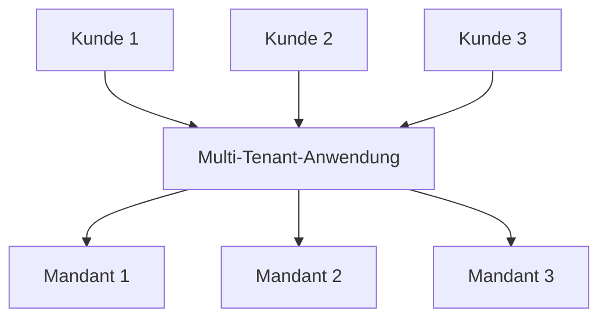
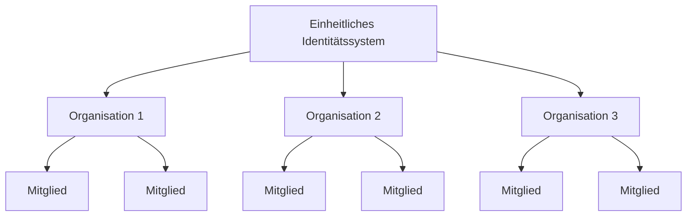

## Was ist Multi-Tenancy (Multi-Tenancy)?

Software-Multi-Tenancy ist eine Software, bei der eine einzelne Instanz der Software auf einem Server läuft und mehreren Mandanten dient. Systeme, die auf diese Weise entworfen sind, sind "geteilt" (anstatt "dediziert" oder "isoliert").

Ein Mandant ist eine Gruppe von Benutzern, die gemeinsamen Zugang mit spezifischen Privilegien zur Softwareinstanz teilen.

Zum Beispiel verwenden CRM-Systeme (Customer Relationship Management) oft eine Multi-Tenant-Architektur, um allen Kunden denselben Service bereitzustellen.

Ein Schlüsselprinzip von Multi-Tenancy (Multi-Tenancy) ist "Teilen". Dies bedeutet nicht, dass **jeder** Teil der Lösung geteilt wird; es bedeutet, dass zumindest **einige** Komponenten über mehrere Mandanten hinweg wiederverwendet werden. Das Verständnis dieses breiteren Konzepts kann dir helfen, die Bedürfnisse deiner Kunden besser zu adressieren.

## Was sind die Anwendungsfälle für Multi-Tenant-Produkte?

Multi-Tenant-Apps werden häufig in Software-as-a-Service (SaaS)-Produkten wie Produktivitätstools, Kollaborationssoftware usw. verwendet. In diesem Setup repräsentiert jeder "Mandant" normalerweise einen Geschäftskunden mit mehreren Benutzern (typischerweise Mitarbeiter). In verschiedenen Produkten kann es je nach Kontext als Mandant, Arbeitsbereich oder Projekt bezeichnet werden. Ein einzelnes Unternehmen könnte auch mehrere Mandanten haben, um verschiedene Abteilungen oder Organisationen darzustellen.

In komplexeren Fällen, wie B2B-Anwendungen jenseits von SaaS, bieten Multi-Tenant-Apps eine gemeinsame Plattform für verschiedene Teams, Geschäftskunden und Partnerunternehmen, um auf deine Dienste zuzugreifen.

## Warum solltest du Multi-Tenancy (Multi-Tenancy) in einem SaaS-Produkt einsetzen?

### Skalierung mit Multi-Tenancy (Multi-Tenancy)

Für Unternehmensgeschäfte ist Multi-Tenancy (Multi-Tenancy) der Schlüssel, um ihre Anforderungen an Verfügbarkeit, Ressourcenmanagement, Kostenmanagement und Datensicherheit effektiv zu erfüllen. Auf technischer Ebene vereinfacht die Einführung eines Multi-Tenant-Ansatzes deine Entwicklungsprozesse, minimiert technische Herausforderungen und fördert eine nahtlose Expansion.

### Schaffung eines einheitlichen Erlebnisses

Wenn man die Wurzeln von SaaS-Produkten untersucht, ist es vergleichbar mit einem Gebäude, das verschiedene Wohnungen beherbergt. Alle Mieter teilen sich gemeinsame Versorgungsleistungen wie Wasser, Strom und Gas, behalten jedoch die unabhängige Kontrolle über die Verwaltung ihres eigenen Raums und ihrer Ressourcen. Dieser Ansatz vereinfacht das Immobilienmanagement.

### Sicherstellung der Sicherheit durch Mandantenisolation

In einer Multi-Tenancy-Architektur wird der Begriff "Mandant" eingeführt, um Grenzen zu schaffen, die die Ressourcen und Daten verschiedener Mandanten innerhalb einer gemeinsamen Instanz trennen und sichern. Dies stellt sicher, dass die Daten und Operationen jedes Mandanten getrennt und sicher bleiben, auch wenn sie dieselben zugrunde liegenden Ressourcen nutzen.

## Wie erreicht man Mandantenisolation in einer Multi-Tenancy-Architektur?

Wenn man über Multi-Tenant-Anwendungen spricht, ist es immer notwendig, **Mandantenisolation** zu erreichen. Dies bedeutet, die Daten und Ressourcen verschiedener Mandanten innerhalb eines gemeinsamen Systems (zum Beispiel einer Cloud-Infrastruktur oder einer Multi-Tenant-Anwendung) getrennt und sicher zu halten. Dies verhindert unbefugte Versuche, auf die Ressourcen eines anderen Mandanten zuzugreifen.

### Mandantenisolation stimmt mit dem "geteilten" Konzept von Multi-Tenancy (Multi-Tenancy) überein

Das liegt daran, dass Mandantenisolation nicht unbedingt eine Infrastrukturressourcenebene ist. Im Bereich von Multi-Tenancy (Multi-Tenancy) und Isolation sehen einige Isolation als strikte Trennung zwischen tatsächlichen Infrastrukturressourcen. Dies führt normalerweise zu einem Modell, bei dem jeder Mandant separate Datenbanken, Recheninstanzen, Konten oder private Clouds hat. In Szenarien mit geteilten Ressourcen, wie Multi-Tenant-Apps, kann der Weg zur Erreichung von Isolation eine logische Konstruktion sein.

### Authentifizierung und Autorisierung sind nicht gleichbedeutend mit "Isolation"

Die Verwendung von Authentifizierung und Autorisierung zur Steuerung des Zugriffs auf deine SaaS-Umgebung ist wichtig, garantiert jedoch keine "Isolation". Isolation bedeutet, verschiedene Benutzer oder Datensätze getrennt zu halten, sodass die Daten oder Aktionen eines Benutzers nicht die eines anderen beeinträchtigen oder darauf zugegriffen werden können.

Zum Beispiel, selbst wenn du Authentifizierung und Autorisierung eingerichtet hast, bei denen sich Benutzer anmelden und ein Token erhalten, das ihre Berechtigungen definiert, verbessert dies die Sicherheit, stellt jedoch nicht sicher, dass Benutzer vollständig voneinander isoliert sind. Ein weiterer Kontext sollte eingeführt werden, um "Isolation" zu erreichen.

### Verwende "Organisation" als Kontext, um den SaaS-Produktmandanten darzustellen, um Mandantenisolation zu erreichen

Authentifizierung und Autorisierung allein verhindern nicht, dass ein Benutzer mit der richtigen Rolle auf die Ressourcen eines anderen Mandanten zugreift. Um den Zugriff zu begrenzen, müssen wir einen "Mandanten"-Kontext hinzufügen, wie eine Mandanten-ID, Organisations-ID oder Arbeitsbereichs-ID. Diese Kennungen wirken wie Wände, Türen und Schlösser, die Mandanten trennen.

Der Begriff "Organisation" wird häufig für Mandantenisolation verwendet. Viele <Ref slug="identity-provider" /> enthalten eine "Organisations"-Funktion, um Mandanten zu isolieren und gleichzeitig ein einheitliches Identitätssystem beizubehalten. Der Benutzer innerhalb der Organisation wird als "Mitglied" bezeichnet.

## Wie werden Identitäten in Multi-Tenant-Apps verwaltet?

Die erste wichtige Frage ist, ob Teile deines Geschäfts oder Produkts separate Identitätssysteme erfordern. Dies wird dein Systemdesign leiten. Hier sind zwei Beispiele:

1. Ein Identitätssystem: Eine einzelne Person kann zwei Identitäten innerhalb desselben Identitätssystems haben. Zum Beispiel könnte Sarah eine persönliche E-Mail registriert haben und auch eine Unternehmens-E-Mail verwenden, die über <Ref slug="enterprise-sso" /> verbunden ist.
2. Mehrere Identitätssysteme: Benutzer können auch zwei unterschiedliche Identitäten über separate Identitätssysteme für völlig unabhängige Produkte haben.

In den meisten Multi-Tenant-Apps werden Identitäten normalerweise in einem einzigen Pool verwaltet, während die Ressourcen jedes Mandanten getrennt gehalten werden.

## Überlegungen zur Planung und Erstellung von Multi-Tenant-Apps

1. Konzentriere dich auf dein Modell: B2B oder B2C.
2. Wer wird die Aufgaben des Identitätsmanagements übernehmen: Entwickler, der Administrator deines Kunden oder Endkunden?
3. Müssen deine B2B-Kunden die Identitäten ihrer Organisation verwalten?
4. Identifiziere, welche Berechtigungen (<Ref slug="scope" />) und <Ref slug="role" /> für die Organisation definiert werden müssen und welche nicht.
5. Benötigt dein Kunde <Ref slug="enterprise-sso" />?
6. Erwäge das Hinzufügen von Kollaborationsfunktionen, wie Einladungen.

<Resources
  urls={[
    "https://blog.logto.io/implement-multi-tenancy",
    "https://blog.logto.io/multi-tenant-ultimate-guide",
    "https://blog.logto.io/case-study-multi-tenancy",
    "https://blog.logto.io/multi-tenancy-explained",
    "https://blog.logto.io/are-multi-tenant-apps-equal-saas",
    "https://blog.logto.io/tenancy-models",
    "https://blog.logto.io/do-you-need-multiple-tenants-identity-model",
  ]}
/>