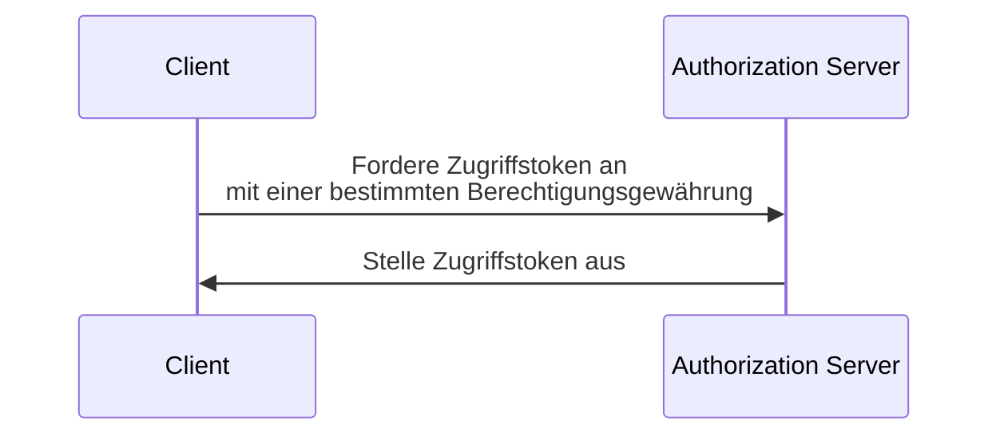

## Was ist eine OAuth 2.0-Berechtigungsgewährung (OAuth 2.0 grant)?

Eine OAuth 2.0-Berechtigungsgewährung (OAuth 2.0 grant) ist ein Autorisierungsprozess, der es einem <Ref slug="client" /> ermöglicht, ein <Ref slug="access-token" /> von einem <Ref slug="authorization-server" /> anzufordern. Es gibt auch andere Begriffe rund um dieses Konzept, daher klären wir sie, bevor wir tiefer eintauchen:

- **OAuth 2.0-Berechtigungsgewährung (OAuth 2.0 grant)**: Auch bekannt als "OAuth 2.0 grant type", "OAuth 2.0 flow" oder "OAuth 2.0 authorization grant". In den meisten Kontexten beziehen sich diese Begriffe auf dasselbe Konzept.
- <Ref slug="authorization-server" />: Der Server, der Zugriffstoken (access tokens) an den Client ausgibt. In OpenID Connect (OIDC) ist der Autorisierungsserver derselbe wie der <Ref slug="openid-connect" headingId="openid-provider-op" />.
- <Ref slug="authorization-request" />: Die Anfrage, die der Client an den Autorisierungsserver stellt, um ein Zugriffstoken zu erhalten. In OpenID Connect (OIDC) wird sie auch als <Ref slug="authentication-request" /> bezeichnet.

Aus Gründen der Klarheit werden wir in diesem Artikel durchgehend die oben aufgeführten Begriffe verwenden.

Der Prozess einer OAuth 2.0-Berechtigungsgewährung (OAuth 2.0 grant) auf hoher Ebene ist recht einfach:

Nachdem der Client das Zugriffstoken erhalten hat, kann er es verwenden, um geschützte Ressourcen (z. B. APIs) im Namen eines Benutzers oder im eigenen Namen zu nutzen.

Es ist zu beachten, dass der Client und der Autorisierungsserver je nach spezifischer Berechtigungsgewährung zusätzliche Informationen austauschen und weitere Schritte in den Prozess einbinden können. Zum Beispiel umfasst die <Ref slug="authorization-code-flow">Genehmigungsgewährung mit Autorisierungscode (authorization code grant)</Ref> die Benutzer-Authentifizierung und -Autorisierung, die Generierung eines Codes und den Token-Austausch.

## Verschiedene OAuth 2.0-Berechtigungsgewährungen (grants)

Die grundlegende OAuth 2.0-Spezifikation definiert vier Berechtigungen, die Clients verwenden können, um Zugriffstoken zu erhalten:

1. <Ref slug="authorization-code-flow">Genehmigungsgewährung mit Autorisierungscode (authorization code grant)</Ref>: Die sicherste und empfohlene Berechtigung für die meisten Anwendungen. Der Einsatz von <Ref slug="pkce" /> ist für alle Clients in <Ref slug="oauth-2.1" /> verpflichtend.
2. <Ref slug="implicit-flow">Implizite Berechtigung (implicit grant)</Ref>: Eine vereinfachte Berechtigung, die in OAuth 2.1 aufgrund von Sicherheitsbedenken veraltet ist.
3. [Berechtigung für Ressourceninhaber-Passwortanmeldeinformationen (ROPC)](https://datatracker.ietf.org/doc/html/rfc6749#section-4.3): Eine Berechtigung, bei der die Anmeldeinformationen des Benutzers direkt gegen ein Zugriffstoken ausgetauscht werden. Aus Sicherheitsgründen wird sie für die meisten Anwendungen nicht empfohlen.
4. <Ref slug="client-credentials-flow">Client-Anmeldeinformationen-Berechtigung (client credentials grant)</Ref>: Eine Berechtigung, die von <Ref slug="client" headingId="confidential-clients" /> verwendet wird, um ein Zugriffstoken ohne Benutzereinbeziehung zu erhalten.

Mit der Weiterentwicklung der Branche werden implizite und ROPC-Berechtigungen [zugunsten von sichereren und standardisierten Abläufen veraltet](https://blog.logto.io/oauth-2-1). Für neue Anwendungen sind die Entscheidungen einfach:

- Für die Benutzer-Authentifizierung und -Autorisierung die Genehmigungsgewährung mit Autorisierungscode (authorization code grant) mit PKCE verwenden.
- Für <Ref slug="machine-to-machine" />-Kommunikation die Client-Anmeldeinformationen-Berechtigung (client credentials grant) verwenden.

### Andere OAuth 2.0-Berechtigungsgewährungen (grants)

Zusätzlich zu den vier grundlegenden Berechtigungen gibt es andere Erweiterungen, die neue Berechtigungen für spezifische Anwendungsfälle definieren. Zum Beispiel:

- <Ref slug="device-flow">Geräteautorisierungsberechtigung (device authorization grant)</Ref> ist eine Berechtigung, die für Geräte mit eingeschränkten Eingabemöglichkeiten, wie Smart-TVs und IoT-Geräte, entwickelt wurde.
- <Ref slug="hybrid-flow">Hybrid-Flow</Ref> ist eine OpenID Connect-Berechtigung, die die Genehmigungsgewährung mit Autorisierungscode (authorization code grant) mit der impliziten Berechtigung (implicit grant) kombiniert.

## Berechtigungsgewährungen (grants) in OpenID Connect (OIDC)

In <Ref slug="openid-connect" /> wird das Konzept der Berechtigungsgewährungen erweitert, um <Ref slug="id-token">ID-Tokens</Ref> einzubeziehen, die neben Zugriffstokens Identitätsinformationen des Benutzers darstellen. OIDC erweitert zwei OAuth 2.0-Berechtigungen (Autorisierungscode und implizit), um ID-Tokens zu beinhalten, und führt eine neue Berechtigung namens <Ref slug="hybrid-flow">Hybrid-Flow</Ref> ein, die beides kombiniert.

> Wie bei OAuth 2.0 wird nur empfohlen, die Genehmigungsgewährung mit Autorisierungscode (authorization code grant) mit PKCE in OIDC für die Benutzer-Authentifizierung und -Autorisierung zu verwenden.

Da OIDC auf OAuth 2.0 aufbaut, können derweil auch andere Berechtigungen, wie die Client-Anmeldeinformationen-Berechtigung, auf demselben Autorisierungsserver verwendet werden, sofern der Server diese unterstützt.

<SeeAlso slugs={["pkce", "oauth-2.1", "authorization-code-flow", "implicit-flow", "client-credentials-flow", "device-flow"]} />

<Resources
  urls={[
    "https://blog.logto.io/implicit-flow-is-dead",
    "https://datatracker.ietf.org/doc/html/rfc6749",
    "https://openid.net/specs/openid-connect-core-1_0.html"
  ]}
/>
