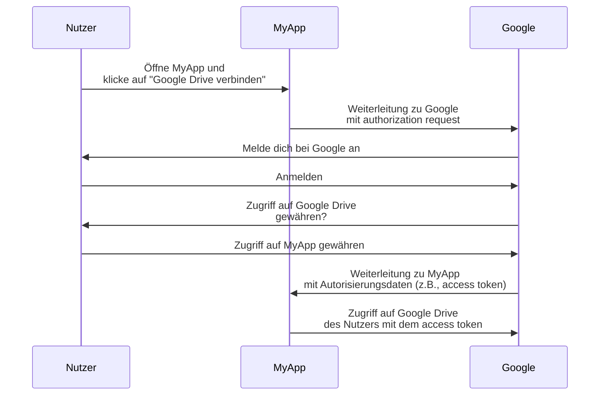
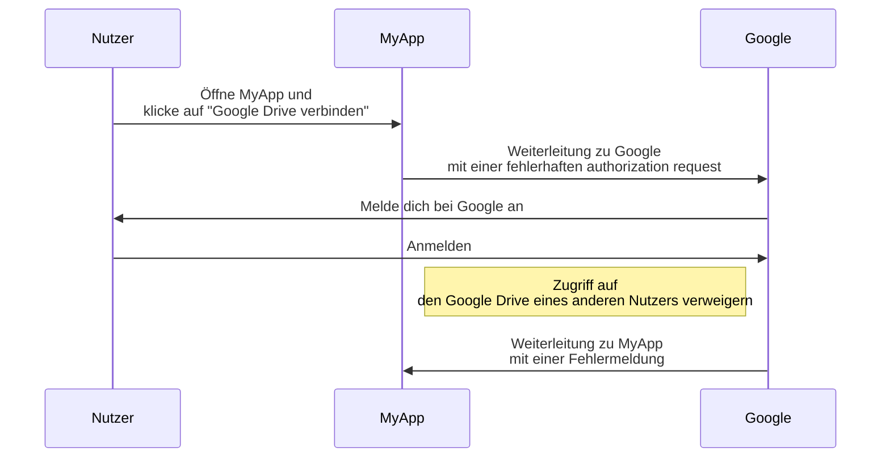
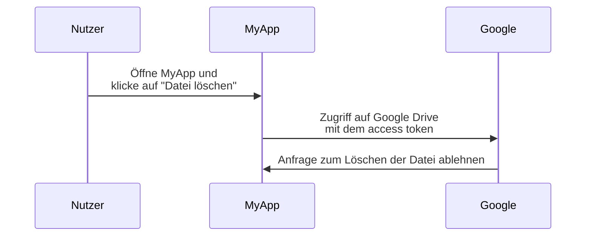

## Was ist OAuth 2.0?

OAuth 2.0 ist der De-facto-Standard für die Autorisierung und wird im gesamten Web häufig verwendet. Es ermöglicht einer Anwendung, sicher einen begrenzten Zugriff auf geschützte Ressourcen einer anderen Anwendung zu erhalten, wie zum Beispiel das Profil oder die Daten eines Benutzers, ohne Anmeldedaten wie Passwörter preiszugeben.

Lassen Sie uns ein praxisnahes Beispiel sehen, um es besser zu verstehen. Du hast eine Webanwendung MyApp, die auf den Google Drive des Benutzers zugreifen möchte. Anstatt den Benutzer zu bitten, seine Google Drive-Anmeldedaten zu teilen, kann MyApp OAuth 2.0 verwenden, um den Zugriff auf Google Drive im Namen des Benutzers anzufordern. Hier ist ein vereinfachter Ablauf:

In diesem Ablauf sieht MyApp niemals die Anmeldedaten des Benutzers für Google Drive. Stattdessen erhält es einen <Ref slug="access-token" /> von Google, der es ermöglicht, im Namen des Benutzers auf Google Drive zuzugreifen.

### Schlüsselkomponenten von OAuth 2.0

Für das obige Beispiel ist MyApp der <Ref slug="client" />, Google ist sowohl der <Ref slug="authorization-server" /> als auch der <Ref slug="resource-server" />, und der Nutzer ist der <Ref slug="resource-owner" />. Der Ablauf umfasst alle Schlüsselkomponenten von OAuth 2.0:

- **Client**: Die Anwendung, die auf die geschützten Ressourcen zugreifen möchte. "Client" und "Anwendung" werden oft synonym verwendet.
- **Resource owner**: Der Benutzer, dem die geschützten Ressourcen gehören. Der resource owner kann dem Client den Zugriff gewähren (authorisieren) oder verweigern.
- **Authorization server**: Der Server, der die Autorisierung durchführt (meist mit Authentifizierung) und dem Client access tokens ausstellt.
- **Resource server**: Der Server, der die geschützten Ressourcen hostet. Er überprüft das access token und gibt die geschützten Ressourcen an den Client weiter.

## OAuth 2.0 grants (Abläufe)

<Ref slug="oauth-2.0-grant">Grant</Ref> bildet die Grundlage von OAuth 2.0 und definiert, wie der client ein access token vom authorization server erhalten kann. Die grundlegende OAuth 2.0-Spezifikation definiert vier grants:

- <Ref slug="authorization-code-flow">Authorization code grant</Ref>
- <Ref slug="implicit-flow">Implicit grant</Ref>
- [Resource owner password credentials (ROPC) grant](https://datatracker.ietf.org/doc/html/rfc6749#section-4.3)
- <Ref slug="client-credentials-flow">Client credentials grant</Ref>

Ohne auf die Details jedes grants einzugehen, können wir diese grants in zwei Kategorien einteilen:

- **Authorization grants**: Werden verwendet, wenn der Client Ressourcen im Namen eines Benutzers zugreifen muss, d.h., eine Benutzerautorisierung erforderlich ist.
- **Client credentials grant**: Wird verwendet, wenn der Client Ressourcen in seinem eigenen Namen zugreifen muss. Dieser grant ist geeignet für <Ref slug="machine-to-machine" />-Kommunikation.

### Authorization grants

Unabhängig vom grant-Typ haben Authorization grants die folgenden gemeinsamen Schritte:

1. Der Client initiiert einen <Ref slug="authorization-request" /> an den authorization server.
2. Der authorization server authentifiziert den Benutzer (resource owner) und fragt nach der Erlaubnis, auf die Ressourcen zuzugreifen.
3. Der Benutzer gewährt dem Client die Erlaubnis.
4. Der authorization server stellt dem Client ein access token aus.
5. Der Client verwendet das access token, um auf die geschützten Ressourcen auf dem <Ref slug="resource-server" /> zuzugreifen.

Beachte, dass die genauen Schritte und Parameter je nach grant-Typ variieren können. Zum Beispiel beinhaltet der <Ref slug="authorization-code-flow">authorization code grant</Ref> mehr Schritte wie Codeerstellung und -austausch.

### Client credentials grant

Der <Ref slug="client-credentials-flow">client credentials grant</Ref> ist viel einfacher und beinhaltet keine Benutzerautorisierung. Hier ist ein vereinfachter Ablauf:

1. Der Client sendet eine <Ref slug="token-request" /> an den authorization server.
2. Der authorization server authentifiziert den Client und stellt ein access token aus.
3. Der Client verwendet das access token, um auf die geschützten Ressourcen auf dem <Ref slug="resource-server" /> zuzugreifen.

---

Für detaillierte Diskussionen zu OAuth 2.0 grants, siehe <Ref slug="oauth-2.0-grant" /> und die spezifischen grant-Artikel.

## Zugriffskontrolle (Access control) mit OAuth 2.0

OAuth 2.0 definiert den <Ref slug="scope" />-Parameter, um die Berechtigungen anzugeben, die der Client anfordert. Der authorization server kann die angeforderten scopes vollständig oder teilweise ignorieren und den Zugriff basierend auf seinen eigenen access control-Richtlinien gewähren.

Allerdings lässt OAuth 2.0 dem authorization server die Freiheit, wie er die <Ref slug="access-control" /> umsetzen möchte. Das bedeutet, dass der authorization server entscheiden kann, auf welche Ressourcen das Subjekt (Benutzer oder client) zugreifen kann und welche Aktionen auf diesen Ressourcen durchgeführt werden können.

Nehmen wir weiterhin das Google Drive-Beispiel. Möglicherweise initiiert MyApp versehentlich eine authorization request, um auf den Google Drive eines anderen Benutzers zuzugreifen. In diesem Fall sollte der authorization server von Google die Anfrage ablehnen, da der Benutzer nicht die erforderlichen Berechtigungen hat, auf den Google Drive eines anderen Benutzers zuzugreifen.

Ein weiterer Fall ist, wenn MyApp ein access token von Google erhält, das ihm erlaubt, Dateien im Google Drive des Nutzers zu lesen. MyApp versucht jedoch, eine Datei zu löschen, anstatt sie zu lesen. Der resource server (Google) sollte die Anfrage ablehnen.

Beide Fälle zeigen, warum <Ref slug="access-control" /> erforderlich ist, wenn OAuth 2.0 implementiert wird. Der <Ref slug="authorization-server" /> und der <Ref slug="resource-server" /> sollten zusammenarbeiten, um access control-Richtlinien umzusetzen und die Ressourcen zu schützen.

### Access control-Modelle

Um die Zugriffskontrolle ordnungsgemäß zu handhaben, wird empfohlen, die standardmäßigen access control-Modelle wie <Ref slug="rbac" /> und <Ref slug="abac" /> zu verwenden. Diese Modelle haben sich in der Branche bewährt und bieten die Skalierbarkeit für zukünftige Anforderungen.

## OAuth 2.1

<Ref slug="oauth-2.1" /> ist ein vorgeschlagenes Update der OAuth 2.0-Spezifikation, das darauf abzielt, die Sicherheit und Benutzerfreundlichkeit auf Basis der in der Branche gesammelten Erfahrungen zu verbessern. Obwohl OAuth 2.1 noch nicht endgültig ist, können wir dennoch über die vorgeschlagenen Änderungen lernen und verstehen, wie sie die aktuellen OAuth 2.0-Implementierungen beeinflussen könnten. OAuth 2.1 kann als Formalisierung der bewährten Praktiken und Sicherheitsempfehlungen betrachtet werden, die in der Branche weithin übernommen wurden.

## OAuth 2.0 und OpenID Connect (OIDC)

OAuth 2.0 definiert nur den Autorisierungsprozess und deckt nicht die Benutzer-Authentifizierung oder Identität ab. Aus diesem Grund wurde <Ref slug="openid-connect" /> als Identitätsschicht auf OAuth 2.0 hinzugefügt. OIDC erweitert OAuth 2.0, um Benutzer-Authentifizierung und Identitätsinformationen in Form von <Ref slug="id-token" /> bereitzustellen.

OpenID Connect erweitert zwei OAuth 2.0 grants (authorization code und implicit), um ID tokens einzubeziehen, und führt einen neuen grant ein, der <Ref slug="hybrid-flow">hybrid flow</Ref>, der beides kombiniert.

Das bedeutet, dass all dein Wissen und deine Praktiken zu OAuth 2.0 direkt auf OIDC angewendet werden können; alle OAuth 2.0-Erweiterungen wie <Ref slug="pkce" /> und <Ref slug="resource-indicator" /> können auch in OIDC verwendet werden.

<SeeAlso slugs={["oauth-2.0-grant", "oauth-2.1", "openid-connect"]} />

<Resources
  urls={[
    "https://blog.logto.io/secure-cloud-apps-with-oauth-and-openid-connect",
    "https://blog.logto.io/oauth-2-1",
    "https://datatracker.ietf.org/doc/html/rfc6749",
    "https://datatracker.ietf.org/doc/draft-ietf-oauth-v2-1/",
  ]}
/>
