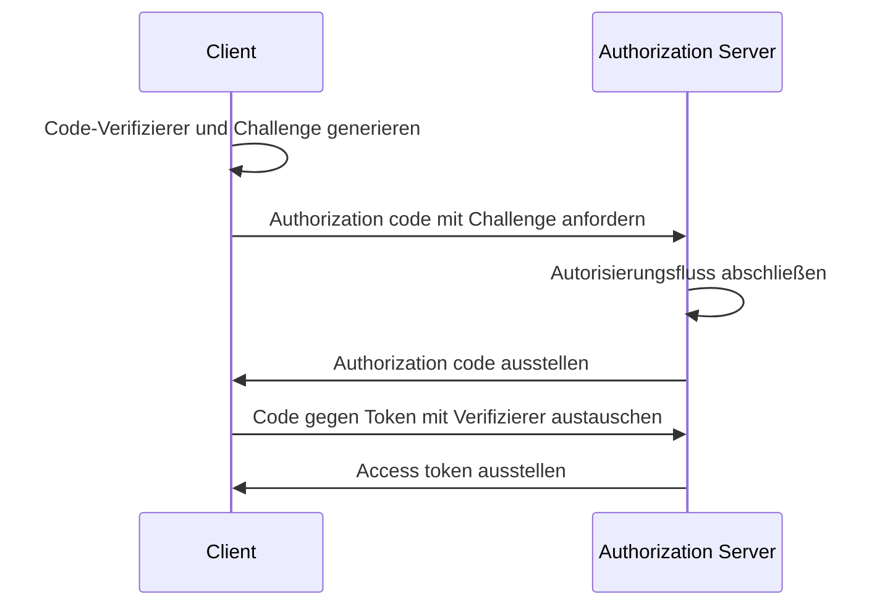

## Was ist OAuth 2.1?

OAuth 2.1 ist ein vorgeschlagenes Update des <Ref slug="oauth-2.0" /> Autorisierungs-Frameworks. Es umfasst eine Reihe von Änderungen und Empfehlungen zur bestehenden OAuth 2.0 Spezifikation, die die besten Praktiken und Sicherheitsverbesserungen konsolidiert, die im Laufe der Jahre in der Branche weit verbreitet angenommen wurden.

Die Hauptupdates von OAuth 2.1 sind:

1. Abschaffung der <Ref slug="implicit-flow">implicit grant</Ref> und der [Ressourcenbesitzer Passwort-Anmeldeinformationen (ROPC) grant](https://datatracker.ietf.org/doc/html/rfc6749#section-4.3) aufgrund von Sicherheitsbedenken.
2. Erzwingung der Verwendung von <Ref slug="pkce" /> für alle Clients, einschließlich <Ref slug="client" headingId="confidential-clients">vertraulichen (privaten) Clients</Ref>.
3. Exakte Übereinstimmung der <Ref slug="redirect-uri">Redirect URIs</Ref>.
4. Klare Definition der <Ref slug="client">Client</Ref>-Typen (öffentliche und vertrauliche Clients).
5. Sicherheitsanforderungen für <Ref slug="refresh-token">Refresh Tokens</Ref>.

## Abschaffung von implicit grant

Der implicit grant wurde für Single-Page-Anwendungen (SPAs) und browserbasierte Anwendungen entwickelt, die Client-Geheimnisse nicht sicher speichern können. Allerdings haben seine Sicherheitsrisiken zu seiner Abschaffung geführt: Der Grant liefert das access token im Front-Channel (URL-Fragment), was durch den Browser-Verlauf und Referrer-Headern Angreifern offenbart werden kann.

OAuth 2.1 empfiehlt die Verwendung des <Ref slug="authorization-code-flow">authorization code grant</Ref> mit <Ref slug="pkce" /> für browserbasierte Anwendungen.

## Abschaffung von ROPC grant

Der ROPC grant erlaubt es dem Client, die Anmeldeinformationen des Benutzers direkt gegen ein access token auszutauschen. Es wurde für Legacy-Anwendungen entwickelt, die den authorization code flow nicht unterstützen können. Allerdings birgt der Grant Sicherheitsrisiken, indem er:

- Die Anmeldeinformationen des Benutzers an den Client weitergibt.
- Den Autorisierungsbildschirm des <Ref slug="authorization-server">authorization server</Ref> umgeht.
- Die Fähigkeit des authorization server einschränkt, andere Sicherheitsmaßnahmen wie <Ref slug="mfa" /> zu erzwingen.

OAuth 2.1 empfiehlt die Nutzung des <Ref slug="authorization-code-flow">authorization code grant</Ref> mit <Ref slug="pkce" /> zur Benutzer-Authentifizierung und -Autorisierung.

## Erzwingung von PKCE für alle Clients

<Ref slug="pkce" /> ist eine Sicherheitsverlängerung des authorization code flow, die das Risiko von Autorisierungscode-Abfangangriffen mindert. Es beinhaltet, dass der Client einen Code-Verifizierer und eine Code-Challenge generiert und der authorization server die Challenge während des Token-Austausches überprüft.

Hier ist ein vereinfachtes Sequenzdiagramm des authorization code flow mit PKCE:

Zunächst wurde empfohlen, dass <Ref slug="client" headingId="public-clients">öffentliche Clients</Ref> PKCE verwenden. OAuth 2.1 erweitert diese Empfehlung jedoch zu einer obligatorischen Anforderung für alle Clients, einschließlich <Ref slug="client" headingId="confidential-clients">vertrauliche (private) Clients</Ref>.

## Exakte Übereinstimmung der Redirect URIs

<Ref slug="redirect-uri">Redirect URIs</Ref> werden vom Client verwendet, um Autorisierungsantworten vom authorization server zu erhalten. OAuth 2.1 führt eine neue Anforderung ein, dass die in der authorization request verwendete Redirect URI genau mit der vom Client beim <Ref slug="authorization-server">authorization server</Ref> registrierten übereinstimmen muss, einschließlich Schema, Host und Pfad.

In einigen OAuth 2.0 Implementierungen war die Übereinstimmung der Redirect URI nachgiebig, wobei Teilübereinstimmungen oder Platzhalterzeichen erlaubt waren. Diese Flexibilität kann jedoch Sicherheitsrisiken wie Open-Redirect-Schwachstellen einführen.

## Klare Definition der Client-Typen

OAuth 2.0 definiert Client-Typen nicht explizit. In der Branche können Sie verschiedene Kategorisierungen sehen, z. B. nach Zugriffslevel (öffentlich vs. vertraulich) oder Anwendungstyp (Web-App vs. Mobile-App). Für das OAuth-Framework spielt es keine Rolle, wie der Client implementiert ist (da es mehr um die geschäftlichen Attribute des Clients geht), aber das Zugriffslevel macht einen Unterschied in den Sicherheitsanforderungen.

Daher führt OAuth 2.1 eine klare Definition der Client-Typen ein:

- <Ref slug="client" headingId="public-clients" />: Clients, die die Vertraulichkeit ihrer Anmeldeinformationen NICHT aufrechterhalten können (z. B. SPAs, Mobile-Apps).
- <Ref slug="client" headingId="confidential-clients" />: Clients, die die Vertraulichkeit ihrer Anmeldeinformationen aufrechterhalten können (z. B. serverseitige Web-Apps, native Desktop-Apps).

## Sicherheitsanforderungen für Refresh Tokens

<Ref slug="refresh-token">Refresh Tokens</Ref> sind langlebige Tokens, die vom Client verwendet werden, um neue access tokens ohne Benutzerinteraktion zu erhalten. Während ihrer Lebensdauer sind sie jedoch auch attraktive Ziele für Angreifer. Da öffentliche Clients Anmeldeinformationen nicht sicher speichern können, spezifiziert OAuth 2.1, dass der <Ref slug="authorization-server">authorization server</Ref> eine der folgenden Methoden verwenden sollte, um Refresh Tokens zu sichern:

- <Ref slug="refresh-token" headingId="sender-constrained-refresh-tokens">Sender-gebundene Refresh Tokens</Ref> ausstellen.
- <Ref slug="refresh-token" headingId="refresh-token-rotation">Refresh Token Rotation</Ref> verwenden, um die Nutzbarkeit und Lebensdauer von Refresh Tokens zu begrenzen.

## OAuth 2.1 und OpenID Connect (OIDC)

Da <Ref slug="openid-connect" /> auf OAuth 2.0 aufbaut, gelten die in OAuth 2.1 eingeführten Änderungen auch für OIDC. Zum Beispiel sollten alle OIDC Clients authorization code flow mit PKCE zur Benutzer-Authentifizierung und -Autorisierung verwenden.

<SeeAlso slugs={["oauth-2.0", "authorization-code-flow", "pkce", "implicit-flow", "openid-connect"]} />

<Resources
  urls={[
    "https://datatracker.ietf.org/doc/draft-ietf-oauth-v2-1/",
    "https://blog.logto.io/oauth-2-1",
  ]}
/>
